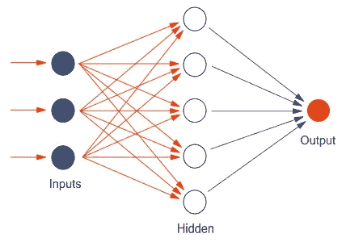
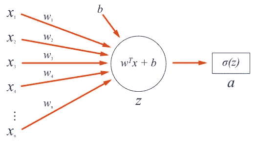
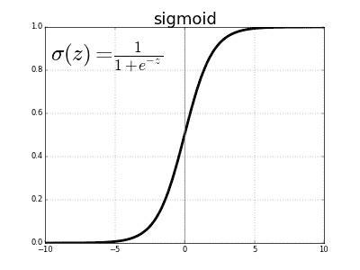
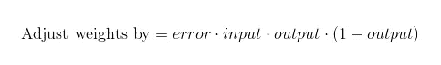
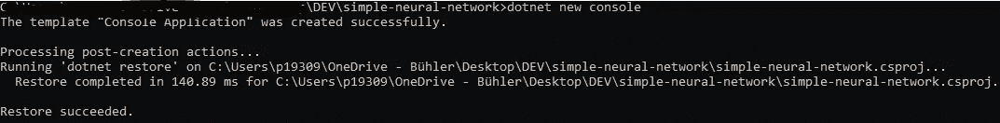
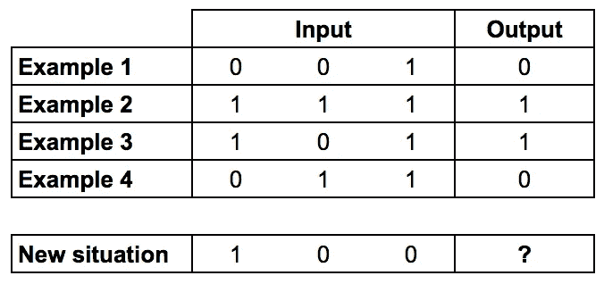
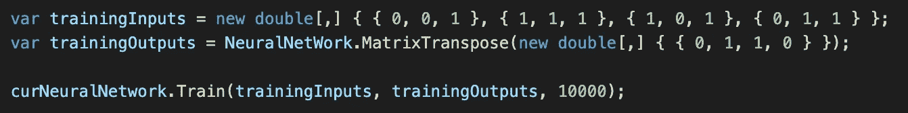
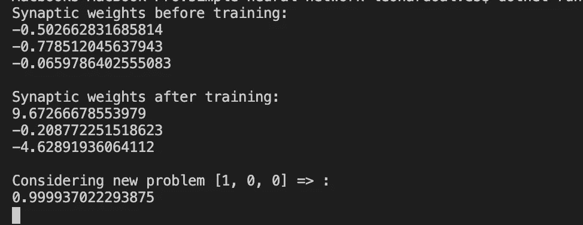

# 用 C#构建一个简单的神经网络

> 原文：<https://medium.com/analytics-vidhya/building-a-simple-neural-network-in-c-7e917e9fc2cc?source=collection_archive---------2----------------------->

在没有 AI 库支持的情况下，用 C#搭建一个简单的神经网络有多难？让我们来看看…

那我为什么要这么做呢？

我是一个. NET 人，对这种语言的背景可以追溯到 2012 年。但是我从来没有真正尝试过用 C#来构建一个人工智能代理，我最接近的一次尝试是在我实现一个 GLPK 解算器的时候，一个线性优化问题，这是我过去的工作之一，我们可以稍后再谈。

另外，我在大学的一个教授要求我这么做，所以我来了…

首先，我想通过文章[如何用 9 行 Python 代码](/technology-invention-and-more/how-to-build-a-simple-neural-network-in-9-lines-of-python-code-cc8f23647ca1)构建一个简单的神经网络来感谢[米洛·斯潘塞-哈珀](https://medium.com/u/dbe41548e496?source=post_page-----7e917e9fc2cc--------------------------------)。在这个探索过程中，我用这篇文章作为指南，我真的建议你在开始这篇文章之前先阅读这篇文章。

# 神经网络的一点概述

这种人工智能方法试图模仿自然大脑处理信息以产生行动的方式。所以人工神经网络试图复制大脑神经元和突触。

人工神经网络中的神经元被组织成加权图，其中每个节点是一个神经元，加权分支代表突触。

人工神经网络由多层神经元组成，可以是输入层、隐含层和输出层。



[https://www . innoarchitech . com/blog/人工智能-深度学习-神经网络-解释](https://www.innoarchitech.com/blog/artificial-intelligence-deep-learning-neural-networks-explained)

输入层是智能体的传感器，它们感知环境。一个人工神经网络代理只有一个输入层，但是可以创建互连的代理，将一个代理的输出连接到另一个代理的输入。

隐藏层将处理输入层发送的数据，一个代理可以根据需要有多个隐藏层。

输出层将生成我们的结果。

## 神经元

为了更好地理解人工神经网络是如何工作的，我们需要更深入地了解神经元的功能。



[https://www . innoarchitech . com/blog/artificial-intelligence-deep-learning-neural-networks-explained](https://www.innoarchitech.com/blog/artificial-intelligence-deep-learning-neural-networks-explained)

所有的神经元都使用上图的概念。

1.  每一个突触(用 X1…Xn 表示)都有一个权重(用 W1…Wn 表示)。
2.  神经元会将所有突触的权重乘以输入值，然后将它们相加。
3.  偏置值(由 b 表示)用于延迟神经元的激活。这是触发阈值的最小值。
4.  突触的和值+偏差(由 Z 表示)将用于激活函数。
5.  激活函数用于将求和结果归一化为简单的 1 和 0 结果，1 =激活 0 =非激活
6.  激活函数的结果将决定神经元是否激活。
7.  如果神经元变得活跃，另一个神经元可以接收另一个突触，或者如果这是输出层，我们就有了结果。

## 激活功能

大多数神经网络算法的例子将使用 sigmoid 作为激活函数。

但是为什么呢？

> 我们之所以用 sigmoid 函数，主要是因为它存在于 **(0 到 1)之间。**因此，它特别用于我们必须**预测概率**作为输出的模型。由于任何事情的概率只存在于 **0 和 1 之间，** sigmoid 是正确的选择。

我从 SAGAR SHARMA 写的这篇伟大的文章中摘录了这段文字，你可以在这里找到完整的文章[。](https://towardsdatascience.com/activation-functions-neural-networks-1cbd9f8d91d6)



## 培训步骤

1.  在训练开始之前，程序需要知道给定一组输入后的预期输出。
2.  每一个突触都有重量。一开始，这个权重通常是一个随机数。
3.  当程序开始分析算法给出的输出时，它将与预期输出的期望值进行比较。
4.  训练函数将对权重执行很小的调整，以补偿输出的误差。
5.  重复很多次，然后你的神经网络就训练好了。

这里委托的事情是，训练的知识仅仅停留在突触的重量上。

## 但是算法怎么知道需要调整多少权重呢？

嗯……当然我们有一个公式，它有一个名字,**误差加权导数公式**

如果你研究一下这个，你会发现一些非常可怕的东西，真的…


但是我想保持简单……所以我对米洛·斯潘塞-哈珀的文章中的信息做了一个总结。

最终公式由下式给出:



1.  调整权重是需要添加到突触的实际权重的值。
2.  误差由预期结果和实际结果之差给出，因此*误差=目标输出-实际输出*
3.  输入是实际的输入值。它可能是 1 或 0。如果输入为 0，那么所有的公式将自动取消，如果输入为 1，那么公式可以计算并生成调整。
4.  最后一部分是 sigmoid 曲线的梯度，由下式给出

*(1 减去输出的当前值)乘以输出的当前值。*

# 让我们开始编码吧…

这将是一个简单的编码，我们不需要一个花哨的界面。因此，我们将使用以下命令创建一个. net 核心控制台应用程序。

```
*dotnet new console*
```



我创建了一个 git 存储库来保存代码，你可以通过这个[链接](https://github.com/lschmittalves/simple-neural-network)来访问

这是我们用 C#编写的一个简单神经网络的最终代码，你可以从 GitHub 克隆这个库，并在克隆的文件夹中运行 follow 命令。

```
*dotnet run*
```

[](https://github.com/lschmittalves/simple-neural-network/blob/master/Program.cs) [## lschmittalves/简单神经网络

### 此时您不能执行该操作。您已使用另一个标签页或窗口登录。您已在另一个选项卡中注销，或者…

github.com](https://github.com/lschmittalves/simple-neural-network/blob/master/Program.cs) 

# **结果**

为了测试，我使用了米洛·斯潘塞-哈珀在他的文章中使用的同一组数据。

桌子上惨叫一声。您可以注意到，当第一个输入列的值为 1 时，输出也是 1。

所以我们知道最后一行的答案是 1。



如果我们用这个表训练我们的算法，然后要求最后一行的答案，该值应该是 1 或非常接近 1 的值。



我们做到了，经过很多努力，在没有 numpy 支持的情况下，用 C#编写了代码，我们真的做到了。



# 最后的想法

不使用任何辅助库是一种令人迷惑的事情，用所有的矩阵相乘和转置矩阵。

在这里使用 python 和 numpy 库至少可以节省我们一半的精力。

> 有可能在没有库支持的情况下实现一个神经网络吗？

是的，它是。但是值得努力吗？嗯……我会说不。我需要 4 倍多的代码来实现 python 在米洛·斯潘塞-哈珀的文章中所做的事情。这还不算评论…

最后一件事，当你做计算的时候，注意圆括号。我花了一天时间想明白为什么算法的结果会错得这么离谱，然后我发现我忘了 sigmoid 函数上的一对括号。