# 使用机器学习构建简单的栈溢出搜索引擎来预测与给定查询帖子相关的语义相似的帖子

> 原文：<https://medium.com/analytics-vidhya/building-a-simple-stack-overflow-search-engine-to-predict-posts-related-to-given-query-post-56b3e508520c?source=collection_archive---------5----------------------->


Stack Overflow——对于许多日常使用它的开发人员来说，这是一个显而易见的救命稻草。这是一个面向专业和爱好者程序员的问答网站。它的特点是在计算机编程的广泛主题上的问题和答案，而且现在它不仅仅局限于计算机编程，而是在广泛的范围内回答问题。


典型的 stackoverflow 问答页面

*这是在深入项目之前对什么是 stackoverflow 的一个快速介绍*

# ***关于项目***

Stack overflow 网站在他们所有的问答页面中也有这个特别的部分。

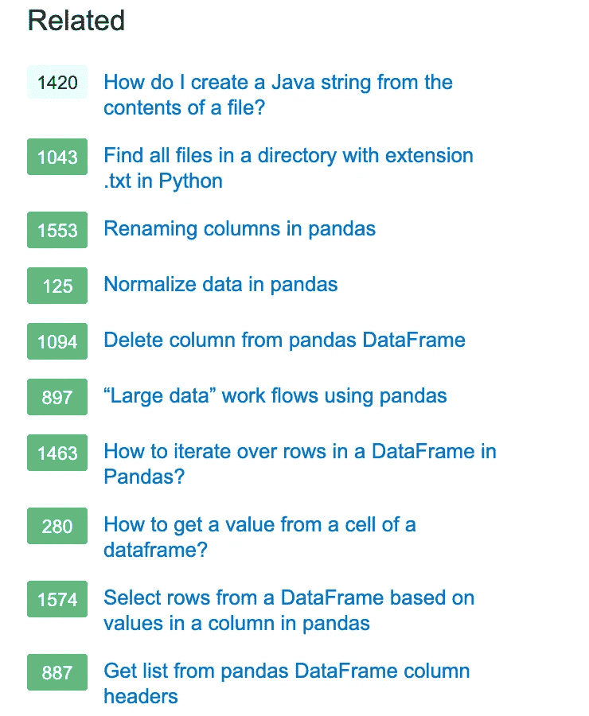

与当前页面中的帖子非常相关的帖子

它列出了与当前问题相关的所有问题，如果当前页面不能满足用户的需求，这可以帮助用户浏览当前页面以找到合适的问题页面。该项目旨在预测给定查询帖子的相关帖子，如问题的图像:从熊猫加载数据 txt，它预测类似的帖子，如上图所示。

由于除了预测帖子相对于查询帖子的语义相关性之外，我们还将它构建为搜索引擎，因此还需要满足其他约束条件

1.  低延迟-预测时间应该更短
2.  可扩展性—即使在我们要搜索的数据量急剧增加时也必须有效

整个问题是建立一个基于 StackOverflow 问题的搜索引擎，搜索结果应该包括语义，具有可扩展的架构，在很短的时间内返回结果。

# 方法

## **1。数据收集**

数据链接:[https://meta . stack exchange . com/questions/138356/how-do-I-download-stack-overflow-data](https://meta.stackexchange.com/questions/138356/how-do-i-download-stack-overflows-data)

上面的链接包含各种主题中的所有堆栈溢出数据，其中只有这些帖子文件被下载。

```
[cs.meta.stackexchange.com.7z](https://archive.org/download/stackexchange/cs.meta.stackexchange.com.7z)
[cs.stackexchange.com.7z](https://archive.org/download/stackexchange/cs.stackexchange.com.7z)
[datascience.meta.stackexchange.com.7z](https://archive.org/download/stackexchange/datascience.meta.stackexchange.com.7z)
[datascience.stackexchange.com.7z](https://archive.org/download/stackexchange/datascience.stackexchange.com.7z)
[ai.meta.stackexchange.com.7z](https://archive.org/download/stackexchange/ai.meta.stackexchange.com.7z)
[ai.stackexchange.com.7z](https://archive.org/download/stackexchange/ai.stackexchange.com.7z)
[computergraphics.meta.stackexchange.com.7z](https://archive.org/download/stackexchange/computergraphics.meta.stackexchange.com.7z)
[computergraphics.stackexchange.com.7z](https://archive.org/download/stackexchange/computergraphics.stackexchange.com.7z)
```

下载的 zip 文件有关于四个主要主题的问题和答案——计算机科学、数据科学、人工智能和计算机图形学。当解压缩时，上述文件给出了许多文件，其中仅获得每个未压缩目录中的 posts.xml 文件，因为仅该特定文件包含帖子文本。

每个 post.xml 文件根据它们的主题命名，并存储在 xml 文件目录中

```
XML Files
  -> DataScienceMeta_Posts.xml
  -> ComputerGraphicsMeta_Posts.xml
  -> AI_Posts.xml
  -> CSMeta_Posts.xml
  -> AIMeta_Posts.xml
  -> CS_Posts.xml
  -> ComputerGraphics_Posts.xml
  -> DataScience_Posts.xml
```

## 2.**数据预处理**

获得的 9 个 xml 文件除了 xml 格式的文本数据之外，还包含更多的数据，如 postId、评论、upvotes 等。因此，有必要解析 xml 文件，只获取文件中每个 xml 元素的 post 文本属性

```
# specifying the fields for csv file 
fields = ['Id', 'Text', 'Topic']def parseXML(xmlfile, start_count): 
    #create element tree object 
    print("File", xmlfile)
    tree = ET.parse(xmlfile) 
    topic = xmlfile.split("/")[1].split("_")[0]
    # get root element 
    root = tree.getroot() 
    # create empty list for news items 
    newsitems = [] 
    count = start_count
    # iterate news items 
    for each_row in root.iter("row"):
        news = {}
        news["Id"] = count
        news["Text"] = each_row.attrib["Body"]
        news["Topic"] = topic 
        count=count+1
        newsitems.append(news)
    # return news items list 
    print("len", len(newsitems))
    return newsitems
```

解析每个 xml 文件以获得文章的文本和对应的主题，该主题是 xml 文件的文件名，并与生成的 id 字段一起存储

```
def savetoCSV(newsitems, filename): 
    # writing to csv file 
    with open(filename, 'w') as csvfile: 
        # creating a csv dict writer object 
        writer = csv.DictWriter(csvfile, fieldnames = fields) 
        # writing headers (field names) 
        writer.writeheader() 
        # writing data rows 
        writer.writerows(newsitems)
```

获得的结果以与 CSV 文件相同的名称存储在名为 CSV Files 的目录中

```
# specifying the fields for csv file 
fields = ['Id', 'Text', 'Topic']  
start_count = 0
for each_file in postfiles:
    print(each_file)
    # parse xml file 
    newsitems = parseXML("XML Files/"+each_file, start_count) 
    csv_filename = each_file.split('.')[0] + ".csv"
    print("csv_filename", csv_filename)
    # store news items in a csv file 
    savetoCSV(newsitems, "CSV Files/" + csv_filename)
    start_count = len(newsitems) + start_count
```

CSV 文件目录如下所示

```
CSV Files
  -> DataScienceMeta_Posts.csv
  -> ComputerGraphicsMeta_Posts.csv
  -> AI_Posts.csv
  -> CSMeta_Posts.csv
  -> AIMeta_Posts.csv
  -> CS_Posts.csv
  -> ComputerGraphics_Posts.csv
  -> DataScience_Posts.csv
```

CSV 文件中的所有文件都被解析为数据帧，然后合并在一起并保存在 pickle 文件中，这是我们将用于进一步处理的最终数据文件。我们最终的 pickle 文件的结构是

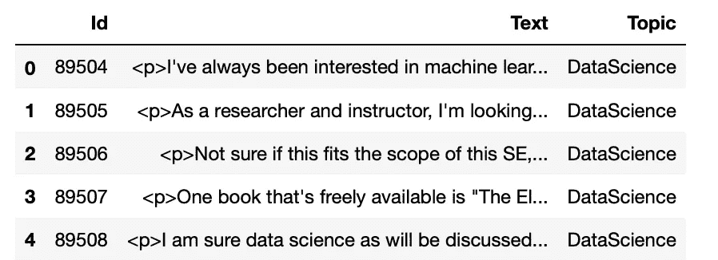

## 3.数据清理

由于获得的文本来自网站，它通常倾向于具有大量的 html 实体，因此必须经过大量的数据预处理步骤

所做的各种数据预处理有:

1.  移除 HTML 标签
2.  移除 URL
3.  删除标点符号(#、&、*)和停用词等

另一个关键的和不同的数据预处理步骤是:

4)删除编程代码

for(I = 0；一

Since this is a majorly computer science programming question and answer portal most of the questions and answer posts tend to have programming code which has a lot of punctuation and unique structure which would lose meaning once subjected to data preprocessing.

Hence programming code should be removed and then feature engineered separately to obtain a good prediction.

## 3\. **特色工程**

特征工程是解决任何数据科学问题的最重要和最关键的步骤之一。一个好的特征工程可以在预测中对模型有很大帮助。在这里，我提出了三个新的特点。

1.  主题
2.  编程代码
3.  引用了相同的链接吗

## **3a)话题**

每个帖子的主题被用作特征之一，因为具有相似主题的帖子倾向于比其他帖子更相似。主题特征是热编码的，因为它是分类特征。

## 3b)编程代码

虽然每个帖子中的编程代码都被删除了，但它提供了非常重要的信息，绝不能丢失。因此，编程代码是单独进行特性工程设计的，这样我们可以从中提取更多的信息。这是通过从每个帖子中分别移除代码部分并对其进行矢量化，以及通过 k 均值聚类对代码向量进行聚类来实现的。通过这种方式，我们可以获得关于编程代码的美妙见解，如下图所示

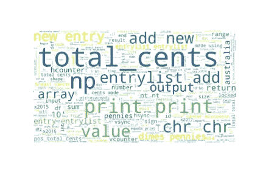

数据库代码簇

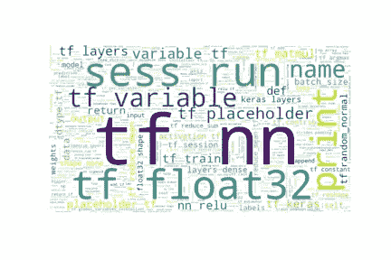

张量流代码簇

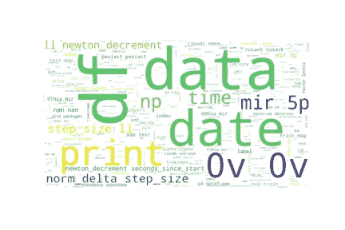

python 数据帧代码集群

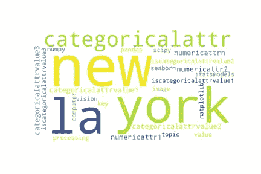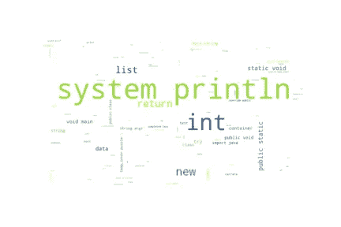

java 代码集群

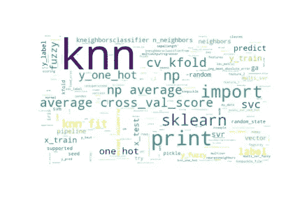

Knn 码簇

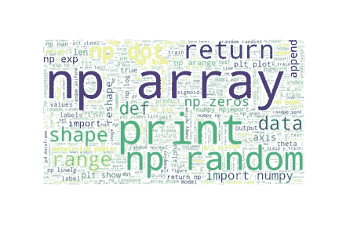

numpy 函数代码集群

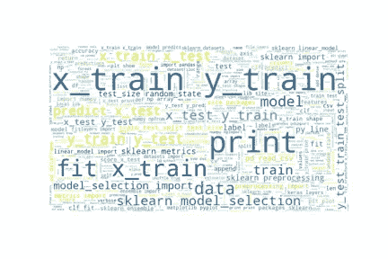

sklearn 模型训练和测试代码集群

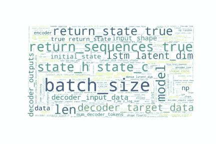

LSTM 码簇


深度学习 keras 代码集群


浮点数据代码簇

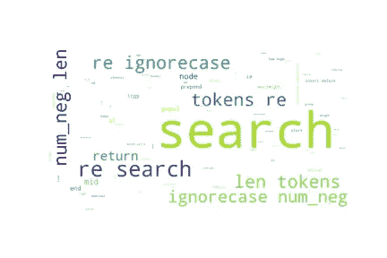

正则表达式代码簇

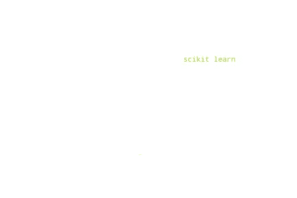

c++输入输出代码簇


python 类代码集群

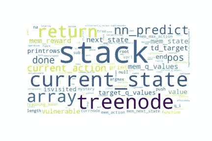

数据结构代码簇


双数据类型代码簇

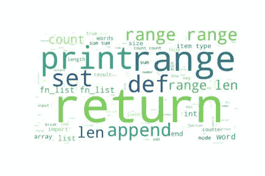

python 数据结构集群

正如我们所看到的，代码被聚集成相关的类型。总共获得 24 个簇，并且没有代码的帖子被放入单独的第 25 个簇中。因此，代码聚类现在是类似后预测的分类特征，这也是一种热编码

## 3c)Does _ site _ same _ URL

与编程代码类似，URL 也是一个需要特殊特性化的特性。由于 URL 也有特殊的结构，常规的数据处理会使其失去意义。可以通过查找两个帖子是否引用了相同的 url 来单独设计 URL 的功能，如果是这样，则可能两个帖子都引用了类似的东西。

经过分析，我们可以发现，近 31%的网址被引用是重复的。因此，引用将被重复概率下降，且可用于找到类似的帖子

## 3d)文档嵌入

对于预处理后的文本数据的矢量化，使用五种类型的嵌入

1.  手套向量嵌入
2.  TF-IDF 加权手套向量嵌入

除此之外，一种叫做“另一个关键词提取器”的新技术被用来从文章文本中提取关键词，然后将其矢量化。

YAKE——另一个关键词提取器是从文本中提取关键词的好方法之一。已经证明，在不同大小、语言或领域的多个集合下，它优于许多非监督方法和监督方法。

要了解更多关于 YAKE 的信息，请进入这个页面:[https://github.com/LIAAD/yake](https://github.com/LIAAD/yake)

因此，它首先用于提取每个帖子文本中的关键词，然后对其应用嵌入

3)基于 YAKE 的关键词提取+手套向量嵌入

4)基于 YAKE 的关键词提取+ TF-IDF 加权手套向量嵌入

```
def tokenization(keywords_text):
    tokenizer = RegexpTokenizer(r'\w+')
    return tokenizer.tokenize(keywords_text)#Converting each posts text into corresponding keyword sets
simple_kwextractor = yake.KeywordExtractor()
questions_keywords_text = []
for i in range(preprocessed_text.shape[0]):
    if i%10 == 0:
        print(i,"vectors finished")
    keyword_simple = simple_kwextractor.extract_keywords(preprocessed_text[i])
    keyword_text = ""
    for each_kw in keyword_simple:
        keyword_text += each_kw[0] + " "
    questions_keywords_text.append(set(tokenization(keyword_text)))
questions_keywords_sets = np.array(questions_keywords_text)
```

5) BERT 嵌入

BERT 模型代表由 google 发布的 Transformer 的双向编码器表示，是当前用于完成 NLP 相关任务的最先进的模型。BERT 是一个 LSTM 模型，它基于注意力的概念工作，试图根据它遇到的一系列先前的标记来预测下一个标记。基于 BERT 的嵌入可能对这个项目有用，可以从帖子文本中提取更有意义的信息。

```
def avg_of_token_embedding(result):
  document_embeddings = np.zeros(768)
  count = 0
  for i in range(len(result)):
    for j in range(len(result[i][1])):
       document_embeddings = document_embeddings + result[i][1][j]
            count = count + 1
  return (document_embeddings/count)from bert_embedding import BertEmbedding
bert_document_embeddings = []
for i in range(preprocesses_text.shape[0]):
    sentences = bert_abstract.split(' ')
    bert_embedding = BertEmbedding()
    token_embedding = bert_embedding(preprocesses_text[i],'sum')
    bert_embedding_vector = avg_of_token_embedding(token_embedding)
    bert_document_embeddings.append(bert_embedding_vector)
bert_document_embeddings = np.array(bert_document_embeddings)
```

## 4.构建一个简单的搜索引擎

这是解决方案中最关键的部分，因为搜索引擎应该是可扩展的，并且具有更少的延迟。两个帖子文本之间的相似度按以下方式计算:

```
**Post Similarity(i,j) = 
cosine_similarity(post_vector(i),post_vector(j)) + similarity(topic_vector(i), topic_vectorr(j)) + similarity(code_cluster(i), code_cluster(j)) + 
number of common urls**
```

基于上述公式，计算两个帖子之间的相似度。余弦相似度用于后文本，因为欧几里德距离对于高维容易出现维数灾难问题。对于主题向量和代码聚类向量，相似性被计算为欧几里德距离的倒数

```
 ***similarity = 1/ euclidean distance***
```

为了构建一个搜索引擎，实现了一个高效的 **map-reduce like** 解决方案，其中产生 8 个进程独立运行。

对于给定的查询帖子，每个进程处理全部帖子数据的 1/8，返回一个长度为 10 的列表，该列表列出了它所计算的全部帖子中相似度最高的前 10 个帖子。然后，将所有进程返回的所有 10 个长度列表组合在一起并排序，以获得总的前 10 个相似性。一个简单的 map reduce like 技术能够将延迟控制在 20 秒以内。

搜索引擎的代码:

```
import multiprocessing
alpha = 0.001**//returns topic wise similarity of two posts**
def get_topic_similarity(ind1, ind2):
    dist = euclidean_distances(topics[ind1], topics[ind2])[0][0]
    if dist == 0:
        return 1/(dist+alpha)
    else:
        return dist**//returns code wise similarity of two posts**
def get_code_similarity(ind1, ind2):
    dist = euclidean_distances(code_cluster_list[ind1].reshape(-1,1), 
                   code_cluster_list[ind2].reshape(-1, 1))[0][0]
    if dist == 0:
        return 1/(dist+alpha)
    return dist def insert_into_top_k_similar_docs(top_k_similar_docs,
vec_similarity, doc_id):
    doc_dict = dict()
    doc_dict["doc_id"] = doc_id
    doc_dict["similarity"] = vec_similarity
    should_insert = False
    for i in range(11):
        if i == 10:
            return
        if vec_similarity > top_k_similar_docs[i]['similarity']:
            should_insert = True
            break

    if should_insert:
        docs_place = i
        temp_list = []
        for i in range(docs_place, k-1):
            #print("it 2", i)
            temp_list.append(top_k_similar_docs[i])
        ind = 0
        for i in range(docs_place+1 , k):
            top_k_similar_docs[i] = temp_list[ind]
            ind = ind + 1
        top_k_similar_docs[docs_place] = doc_dict**// Finds the top 10 similar posts for a given query post from the 
// posts in the start and end range   **    
def find_vector_similarity(preprocessed_text_vector, test_query_point, start, end, topic_weight=1, code_weight=1,
                          cites_weight=1):
    top_k_similar_docs = []
    for i in range(10):
        doc_dict = dict()
        doc_dict['doc_id'] = 0
        doc_dict['similarity'] = -1
        top_k_similar_docs.append(doc_dict)

    for i in range(start, end):
        if i >= preprocessed_text_vector.shape[0]:
            return
        vec_similarity = cosine_similarity(preprocessed_text_vector[i].reshape(1,-1), 
                                    preprocessed_text_vector[test_query_point].reshape(1,-1))[0][0]
        topicwise_similarity = get_topic_similarity(i, test_query_point)* topic_weight
        codewise_similarity = get_code_similarity(i, test_query_point) * code_weight
        cites_similarity = get_cites_similarity(i, test_query_point)
        if cites_similarity:
            cites_similarity = cites_similarity * cites_weight
            vec_similarity = vec_similarity + topicwise_similarity + codewise_similarity + cites_similarity
        else:
            vec_similarity = vec_similarity + topicwise_similarity + codewise_similarity
        vec_sim_list.append(vec_similarity)
        insert_into_top_k_similar_docs(top_k_similar_docs, vec_similarity, i)  
    return top_k_similar_docsdef simple_search_engine(preprocessed_text_vector, test_sample, topic_weight=1, code_weight=1, cites_weight=1):
    count = 0
    posts_text = pd.read_pickle('Preprocessed_questions_text.pkl')['Text'].values
    for each_test_point in test_sample:
        list_of_top_k_docs = [] 
        start_time = datetime.now()
        #print(each_test_point)
        #print("top_k_similar_docs", top_k_similar_docs)
        vec_sim_list = []
        test_query_point = preprocessed_text_vector[each_test_point]
        print("Query posts",each_test_point, ":" , posts_text[each_test_point])
        print("#"*100)
        start = 0
        step = preprocessed_text_vector.shape[0]/8
        input_list = []
        while start < preprocessed_text_vector.shape[0]:      
            input_list.append([preprocessed_text_vector, each_test_point, start, start+step, 
                               topic_weight, code_weight, cites_weight ])
            start = start+step
        pool = multiprocessing.Pool(processes=4)
        tasks=[]
        for each in input_list:
            tasks.append(pool.apply_async(find_vector_similarity,each))
        pool.close()
        pool.join()
        for each in tasks:
            each.wait()
            result = each.get()
            list_of_top_k_docs.extend(result)
        quickSort(list_of_top_k_docs, 0, len(list_of_top_k_docs))
        list_of_top_k_docs = list_of_top_k_docs[0:10]
        total_time = (datetime.now() - start_time).total_seconds()
        print("Total time taken:", humanize_seconds(total_time))
        print("The Most similar ",k,"posts are:")
        for each in list_of_top_k_docs:
            print(posts_text[each['doc_id']])
            print("#"*100)
        print("*"*200)
```

## 5.五种嵌入技术的性能比较

我们没有明确的性能指标来评估我们所做预测的质量，我们必须通过手动读取模型预测的 10 个帖子来评估所做的预测。基于此，我们使用的五嵌入的性能是:

1.  在使用手套向量和 TF-IDF 加权手套向量的类似帖子预测中，第一个帖子是关于称为哈密顿圈的 NP 完全问题。我们可以在使用 glove 和 TF-IDF 加权 glove 向量上观察到，它预测了与计算理论、时间复杂性和一些 NP 完全性等相关的帖子。

通过简单的手套向量进行预测的例子:

```
**Query Posts:** Hint: Hamiltonian Cycle is $NP$-Complete.**Sample predicted posts:**1) <p>Hint: This is just the well-known NP-complete problem PARTITION.</p>2) <p>Is there a notion of a context-free complete language (in the analogous sense to a <span class="math-container">$NP$</span>-complete language)?</p>3) <p>For example;</p>
<p>Is {0,1,{a,b,c},d,e} a valid alphabet to form a language over and is it usable in any context?</p>4) <p>How Decision procedure and Decidable problem are different from each other?
Both are having solutions in yes and no form. Is any else solution for both?  </p>
```

TF-IDF 加权手套向量预测示例:

```
**Query Posts:** Hint: Hamiltonian Cycle is $NP$-Complete.**Sample predicted posts:**1) <p>Hint: This is just the well-known NP-complete problem PARTITION.</p>2) <p>Is there a notion of a context-free complete language (in the analogous sense to a <span class="math-container">$NP$</span>-complete language)?</p>3) <p>Can an ambiguous context-free grammar be converted into Chomsky normal form? I think the answer is yes.</p>4) <p>Time complexity, like any other nontrivial property of programs, is undecidable: there can be no algorithm to compute it, in Python or anything else.</p>
```

2)基于关键字提取的手套向量的预测似乎比使用手套向量完成的预测更精确一点。

通过关键词提取的手套向量的示例预测:

```
**Query Posts:** Hint: Hamiltonian Cycle is $NP$-Complete.**Sample predicted posts:**1) <p>Is there a notion of a context-free complete language (in the analogous sense to a <span class="math-container">$NP$</span>-complete language)?</p>2) <p>Does it exist an algorithm to find a median of table with a complexity nlog(n) Thank</p>3) <p>2^n=O(3^n) : This is true or it is false if n>=0 or if n>=1
since 2^n may or not be element of O(3^n)
I need a hint to figure the problem</p>4) <p>Yes and yes. Look at this graph:</p>

<ul>
<li>$V=\{1,2,3,4\}$</li>
<li>$E=\{\{1,2\},\{2,3\},\{3,4\},\{4,1\}\}$</li>
</ul>

<p>There is neither articulation point nor bridge. But if you delete any node/edge...</p>
```

通过关键词提取的 TF-IDF 手套向量的示例预测:

```
**Query Posts:** Hint: Hamiltonian Cycle is $NP$-Complete.**Sample predicted posts:**1) <p>Is there a notion of a context-free complete language (in the analogous sense to a <span class="math-container">$NP$</span>-complete language)?</p>

2) <p>Does it exist an algorithm to find a median of table with a complexity nlog(n) 
Thank</p>

3) <p>2^n=O(3^n) : This is true or it is false if n>=0 or if n>=1
since 2^n may or not be element of O(3^n)
I need a hint to figure the problem</p>

4) <p>Yes and yes. Look at this graph:</p>

<ul>
<li>$V=\{1,2,3,4\}$</li>
<li>$E=\{\{1,2\},\{2,3\},\{3,4\},\{4,1\}\}$</li>
</ul>

<p>There is neither articulation point nor bridge. But if you delete any node/edge...</p>
```

3)基于 BERT 嵌入的预测似乎比关键字提取的手套和关键字提取的 tf-idf 加权手套向量更精确，因为帖子是关于 NP 完全问题的，所以关于 NP 完全问题的帖子比任何其他帖子都被预测。同样，对于第二个 svm 帖子，它预测关于 SVM 的帖子比任何其他主题都多

伯特嵌入预测的一个例子:

```
**Query Posts:** Hint: Hamiltonian Cycle is $NP$-Complete.**Sample predicted posts:**1) <p>Yes, this is decidable, because you can do an exhaustive search of all possible paths. There is no need to look at any paths that repeat a vertex, since the "detour" could be skipped. But the length of any non-repetitive path is bounded by the size of the graph, which is finite, and so there are only finitely many such paths, which can be checked one by one.</p>

<p>What is not decidable is the following: given an infinite graph $G$ and two vertices $a$ and $b$, decide whether there is a path from $a$ to $b$. This is not decidable if the graph is given as an oracle and is also not decidable if the graph is given via a program that computes it. </p>2) <blockquote>
  <p>What is the time complexity of finding the diameter of a graph
  $G=(V,E)$?</p>

  <ul>
  <li>${O}(|V|^2)$</li>
  <li>${O}(|V|^2+|V| \cdot |E|)$</li>
  <li>${O}(|V|^2\cdot |E|)$</li>
  <li>${O}(|V|\cdot |E|^2)$</li>
  </ul>
</blockquote>

<p>The diameter of a graph $G$ is the maximum of the set of shortest path distances between all pairs of vertices in a graph.</p>

<p>I have no idea what to do about it, I need a complete analysis on how to solve a problem like this.</p>3) <p>When searching graphs, there are two easy algorithms: <strong>breadth-first</strong> and <strong>depth-first</strong> (Usually done by adding all adjactent graph nodes to a queue (breadth-first) or stack (depth-first)).</p>

<p>Now, are there any advantages of one over another?</p>

<p>The ones I could think of:</p>

<ul>
<li>If you expect your data to be pretty far down inside the graph, <em>depth-first</em> might find it earlier, as you are going down into the deeper parts of the graph very fast.</li>
<li>Conversely, if you expect your data to be pretty far up in the graph, <em>breadth-first</em> might give the result earlier.</li>
</ul>

<p>Is there anything I have missed or does it mostly come down to personal preference?</p>4) <p>Breadth-first and depth-first certainly have the same worst-case behaviour (the desired node is the last one found). I suspect this is also true for averave-case if you don't have information about your graphs.</p>

<p>One nice bonus of breadth-first search is that it finds shortest paths (in the sense of fewest edges) which may or may not be of interest.</p>

<p>If your average node rank (number of neighbours) is high relative to the number of nodes (i.e. the graph is dense), breadth-first will have huge queues while depth-first will have small stacks. In sparse graphs, the situation is reversed. Therefore, if memory is a limiting factor the shape of the graph at hand may have to inform your choice of search strategy.</p>
```

4)因此，基于 BERT 嵌入的预测似乎比基于关键词提取的文本嵌入的预测更精确，这又比正常的手套向量嵌入执行得更好。我们还可以观察到 TF-IDF 加权手套向量在预测方面做了几乎相同的工作。因此，TF-IDF 值不会对提高预测性能产生任何影响

## 5.参考

1.  雅克——又一个关键词提取器[https://github.com/LIAAD/yake](https://github.com/LIAAD/yake)
2.  伯特嵌入—【https://github.com/imgarylai/bert-embedding 

要查看整个作品，请访问我的 git hub 链接:【https://github.com/gayathriabhi/StackOverflow-Search-Engine 

我的 LinkedIn 个人资料:[https://www.linkedin.com/in/gayathri-s-a90322126/](https://www.linkedin.com/in/gayathri-s-a90322126/)