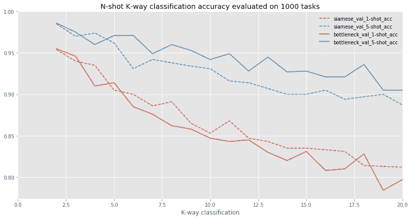

# 利用深度学习从零开始构建说话人识别系统

> 原文：<https://medium.com/analytics-vidhya/building-a-speaker-identification-system-from-scratch-with-deep-learning-f4c4aa558a56?source=collection_archive---------0----------------------->

资料来源:freepik.com

在许多分类问题中，神经网络是最先进的，特别是在图像、视频和音频等感知数据上。一个这样的分类问题是从说话者声音的音频样本中确定说话者的身份。一个能很好地实现这一点的模型有着广泛的应用，从生物认证到增强带有说话者身份的文本到语音字幕。*在这篇文章中，我将概述我如何使用在公共源原始音频数据上训练的卷积神经网络来制作概念验证的说话人识别系统。*

这篇博文分为以下几个部分:

*   引言:我提出了少量多次学习的问题以及为什么它对说话人识别系统是必要的，并介绍了暹罗网络，一种设计用于少量多次学习的架构。
*   方法:关于数据集的细节，训练制度和一些调整实验。
*   结果:最终模型的性能和它所学习的嵌入空间的可视化。

# 介绍

传统观点认为，神经网络需要大量训练数据才能达到高性能。事实上，当从零开始训练网络时，最先进的图像识别模型通常在 [ImageNet](http://image-net.org/) 上训练，这是一个由 120 万张图像组成的数据集，被精心标记为 1000 个类别。如果在数据收集上花费足够的努力，为许多常见的对象训练一个图像分类器肯定是可能的，但是为对象的每一个可能的变化获得 1000 个图像显然是不可能的。说话人识别系统也存在同样的问题——我们无法从世界上的每个人那里收集大量带标签的音频。

与神经网络不同，人类显然能够从很少的例子中快速学习。看过一次新动物后，你能再次认出它吗？与新同事交谈几分钟后，第二天你能辨别出他们的声音吗？与人类相比，神经网络的采样效率较低，即它们需要大量数据来实现良好的性能。开发提高学习算法的样本效率的方法是一个活跃的研究领域，已经有一些有前途的方法，包括[迁移学习](http://cs231n.github.io/transfer-learning/)和[元学习](/huggingface/from-zero-to-research-an-introduction-to-meta-learning-8e16e677f78a) 等等。

这些方法基于直觉，即一旦我们已经学会执行许多先前的任务/分类问题，学习新的任务/分类问题应该更容易，因为我们可以利用先前的知识。事实上，只有未经训练的神经网络具有如此荒谬的低采样效率，因为需要大量数据才能将未经训练的神经网络(它只是充满随机数的数组的集合)塑造成有用的东西。

在训练过程中，图像分类器学习有用特征的层次结构:首先是边缘和颜色检测器，然后是更复杂的形状和纹理。最后，网络深处的神经元可能与相当高级的视觉概念有对应关系(有大量的工作在探索这一点，包括[这本](https://distill.pub/2017/feature-visualization/)出色的出版物)。由于已经训练过的神经网络已经能够生成有用的、有区别的特征，因此有理由认为人们应该能够利用这一点来快速适应以前看不见的类别。

## 暹罗网络

这个项目依赖于连体神经网络的使用。与最常见的神经网络架构不同，这些网络采用两个独立的样本作为输入，而不是一个样本。这两个样本中的每一个都通过编码器网络从高维输入空间映射到低维空间。“暹罗”命名法来自于两个编码器网络是“双胞胎”的事实，因为它们共享相同的权重并学习相同的功能。

暹罗网络示意图。样本从高维空间映射到低维空间，即 n >> d，然后计算它们之间的距离度量。

然后，这两个网络在顶部通过计算嵌入空间中两个样本之间的距离度量(例如欧几里德距离)的层连接。训练网络，使相似样本的距离小，不相似样本的距离大。我在这里对相似和不相似的定义保持开放，但通常这是基于样本是否来自标记数据集中的同一类。

因此，当我们训练暹罗网络时，它正在学习将样本从输入空间(在这种情况下是原始音频)映射到更容易处理的低维嵌入空间。通过包括这个距离层，我们试图直接优化嵌入的属性，而不是优化分类精度。

Siamese 网络于 1994 年由 Bromley 等人(包括 LeCun)引入，用于验证手写签名之间的匹配。然而，它们在 2015 年被 [Koch 等人](https://www.cs.cmu.edu/~rsalakhu/papers/oneshot1.pdf)重新用于一次性学习，正是这篇论文启发了我的工作。

## n 次学习

快速归纳到以前未见过的类的能力通常被框定为执行 **n 次学习**的能力，即在只看过 *n 次*(其中 *n* 较小)示例后识别以前未见过的类的能力。使用 *n* -shot、 *k* -way 分类任务来测量模型在少镜头学习中的性能，这些任务运行如下:

1.  给一个模型一个属于一个新的、看不见的类的查询样本
2.  还给出了由来自不同的不可见类的 n 个例子组成的支持集
3.  然后，模型必须识别支持中的哪个(些)样本属于查询样本的类别

我个人认为，将这称为一个 *n* 镜头分类任务有些误导，因为与分类不同，该模型不必区分所有新的和以前学习过的类别。相反，这更像是一个以前看不见的类的匹配问题。

Omniglot 数据集上的 20 路 1 次分类。这 20 个符号中的每一个都是模型看到的该类的第一个实例。转载自[科赫等人](https://www.cs.cmu.edu/~rsalakhu/papers/oneshot1.pdf)

## n-shot 学习的连体网络

我希望在您的脑海中形成一个想法，即如何使用嵌入空间和连体网络的成对相似性度量来执行一次性分类。该过程是通过将查询样本和所有支持集样本作为输入馈送到 siamese 网络来计算它们之间的成对相似性度量。然后选择具有最大相似性的支持集样本——简单！

1-镜头分类。模型的预测是与查询样本的距离( **d** _1、 **d** _2、 **d** _3)最小的样本的类别。

将此扩展到*n*shot 任务的一种方式是将查询样本和所有支持集样本转换成它们在嵌入空间中的表示，然后执行最近邻分类。我选择了稍微不同的方法(遵循 [Snell 等人](https://arxiv.org/pdf/1703.05175.pdf))，首先计算属于每个类的嵌入的平均位置，然后将最接近查询样本嵌入的平均嵌入作为最佳类。

*n*-*n*= 4 的镜头分类。模型的预测是其均值嵌入到查询样本的距离最小( **d** _1， **d** _2， **d** _3)的类。

n-shot 学习的另一种方法是使用传统分类器的倒数第二个“瓶颈”层作为嵌入空间。然而，假设是暹罗网络更适合推广到以前看不见的类。这是因为编码器子网络被训练来最小化相同类别的样本之间的距离，并且最大化嵌入空间中不同类别的样本之间的距离。

其思想是，当我们明确地学习区分不同的、任意的类的样本，而不是识别特定的类时，学习的嵌入函数将比典型分类器的瓶颈层更好地分离先前未见过的类。稍后我会检验这个假设。

# 履行

## 资料组

我使用 [LibriSpeech](http://www.openslr.org/12/) 有声读物数据语料库来训练和评估模型。我使用`train-clean-100`和`train-clean-360`子集(~460 小时，> 1000 名演讲者)进行培训，使用`dev-clean`子集(~10 小时，40 名演讲者)进行验证。此数据包含来自受控环境的音频，没有外部噪声，只有麦克风嗡嗡声等录音假象。LibriSpeech 语料库是免费提供的。

在所有实验中，我将音频从 16 KHz 下采样到 4 KHz，以加快实验速度并减少计算量。

## 模型

在整个工作中，我使用了一个简单的 4 层卷积编码器网络。架构如下

*   用大(尺寸 32)过滤器进行 1D 卷积，然后用尺寸 4 和步幅 4 进行批量标准化和最大汇集
*   大小为 3 的 3 倍 1D 卷积，随后进行批量标准化和大小为 2、步幅为 2 的最大汇集
*   全局最大池和产生嵌入的密集层
*   暹罗网络是上述网络中的两个(权重共享)通过欧氏距离图层连接在一起
*   最后一层是具有 s 形活化的致密层

除了最后一层，我在任何地方都使用 ReLu 激活。我选择在第一层执行相当激进的最大池，因为样本的初始大小相当大。

## 培养

在每个实验中，我在 50 个“时期”(每个时期是 1000 个批次)中，在 32 个相似和 32 个不相似对的批次上训练一个连体网络。每对标签对于相似的对是 0，对于不相似的对是 1，即来自相同和不同说话者的对。

我使用 Adam 优化器，学习率为 0.001。对之前未见过的说话者的持续验证集的单次分类准确度被用于确定学习率时间表——当该度量稳定了 10 个时期时，学习率下降了 10 倍。

**音频片段长度调谐**

一个关键参数是作为模型输入的音频长度。直觉上，随着输入数据越来越丰富，人们期望模型的准确性会提高，但是代价是训练时间和内存需求的增加。

音频片段长度与验证集指标

可以看出，验证单次准确性和验证准确性都随着音频片段长度而不断增加。我选择了 3 秒的长度，因为在这一点之后，回报似乎在减少。

**超参数网格搜索**

我对以下超参数空间进行了网格搜索:卷积滤波器的初始数量(16，32，64，128)，嵌入维数(32，64，128，256，512)和丢弃分数(0，0.1)。使用 128 个滤波器，嵌入维数为 64 并且没有丢失，获得了最好的结果。

# 结果

以下是最佳连体网络对 *2 ≤ k ≤ 20* 的 1 发、k 路和 5 发、k 路分类任务的结果。我还在同一数据集上训练了一个分类器网络，使用与单个编码器“双胞胎”相同的架构和超参数，并在瓶颈层和分类交叉熵损失之后添加了 1172 路 softmax。

有两个结果需要注意:

1.  暹罗网络确实(稍微)超过了期望的一次分类中的分类器瓶颈嵌入
2.  出乎意料地，分类器瓶颈嵌入在 5 次分类中比具有相同超参数的暹罗网络执行得更好

注意，对于更高的 *k* ，分类器瓶颈嵌入和连体网络嵌入之间的 5 次分类性能差距更大。潜在地，这可能是因为分类器学习了更好的嵌入，用于根据它在训练时使用的标签的性质来区分许多类别。考虑当使用独热分类标签时，正确说话人的 softmax 分数被上推，而所有其他说话人的 softmax 分数被下推。

将这与验证任务进行比较，在验证任务中，训练将不同说话人的样本之间的嵌入距离推开，但是仅针对该批中存在的不同说话人。特别是，我预计暹罗网络将很快学会区分男性和女性的声音，而喂养异性对在以后的时代几乎不会提供任何学习，因为它们“太容易了”。解决这个问题的一种方法是执行硬负挖掘，以创建更困难的验证任务。

## 嵌入空间可视化

圆形=男性，三角形=女性。每种颜色对应不同的说话人身份。

上面显示的是暹罗网络学习的嵌入空间的可视化。我从训练集中随机选择了 20 个说话者，并为每个人随机选择了 10 个音频样本。然后，我使用 [tSNE](http://www.jmlr.org/papers/volume9/vandermaaten08a/vandermaaten08a.pdf) 将代表音频样本的 64 维点嵌入到一个 2 维空间中进行绘制。请注意，说话者身份有很好的聚类(用颜色表示)，男性和女性说话者通常是分开的(用圆形或三角形标记表示)。

# 结束注释

在这篇文章中，我展示了利用少量学习的最新进展，建立一个概念验证的说话人识别模型是可能的。我还发现，在 Librispeech 数据集上的少量说话人识别中，暹罗网络并不普遍优于常规分类器。虽然我还没有达到一流的性能指标(验证集上 92%的验证准确率)，但最好的模型仍然足以在低安全性应用程序中使用。在以后的文章中，我打算研究性能的改进，最终目标是生成一个可安装 pip 的纯 python 的说话人识别包。

*我的 Github 上有代码*

【https://github.com/oscarknagg/voicemap 