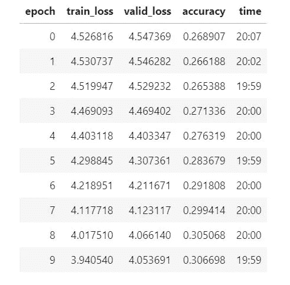
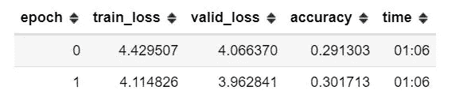
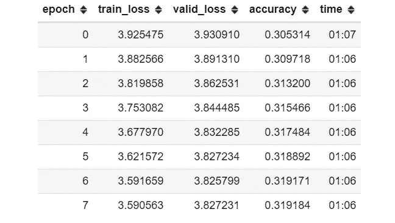
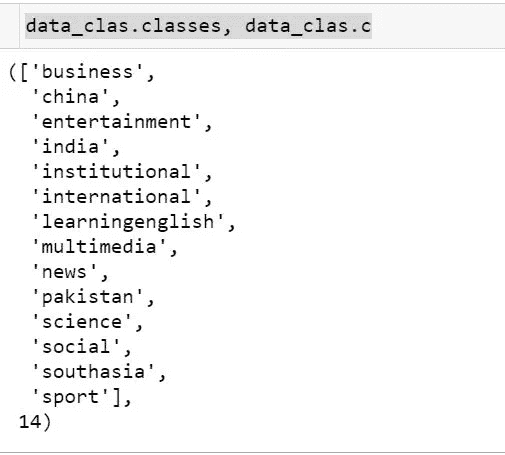
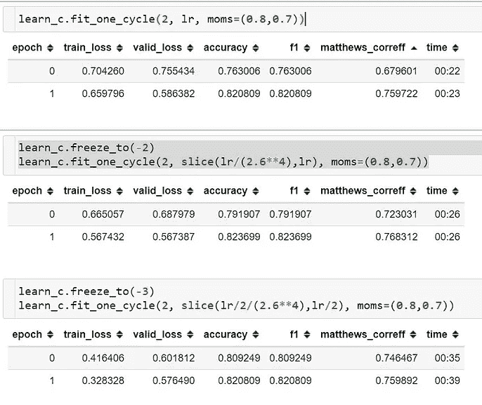
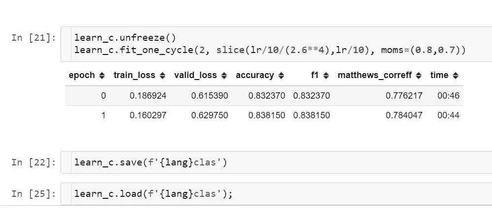

# 为你想要的任何语言建立一个最先进的文本分类器！

> 原文：<https://medium.com/analytics-vidhya/building-a-state-of-the-art-text-classifier-for-any-language-you-want-fe3ebbdab5c9?source=collection_archive---------13----------------------->

## 文本分类是自然语言处理领域一个众所周知的问题。然而，近年来“NLP 进化”的出现使得处理这样的问题变得容易，而不需要该领域的专业知识。最近的进展帮助我们认识到，如果模型首先理解语言(语言建模)，它们可以充当更好的分类器。我们将使用 fastai 图书馆和 ULMFiT 进行这项工作。


[自然语言处理中的迁移学习](https://towardsdatascience.com/understanding-ulmfit-and-elmo-the-shift-towards-transfer-learning-in-nlp-b5d8e2e3f664)

# 概观

这个想法是首先在维基百科数据集上训练(或使用预先训练的模型，如果可用的话)该语言的语言模型，该模型可以在给定一组单词的情况下准确预测下一个单词(有点像我们手机上的键盘在建议单词时所做的)。然后，我们使用这个模型对评论、推文、文章等进行分类，令人惊讶的是，经过一些调整，我们可以用这种语言建立一个最先进的文本分类模型。出于本文的目的，我将为[印地语](https://en.wikipedia.org/wiki/Hindi)建立语言模型，并使用它对评论/文章进行分类。

建立这个模型所用的方法是 [ULMFiT](https://arxiv.org/abs/1801.06146) (文本分类通用语言模型微调)。ULMFit 背后的基本概念错综复杂，在另一篇文章中解释它的细节会更好。然而， [fastaiv1](https://www.fast.ai/) 库使得语言建模和文本分类的任务变得非常简单明了(只需要不到 20 行代码！！).

杰瑞米·霍华德在他的 mooc 中也描述了 ULMFiT，可以在[这些](https://course.fast.ai/videos/?lesson=8) [链接](https://course19.fast.ai/videos/?lesson=12)中找到。下面提到的所有代码都可以在我的 [github](https://github.com/prats0599/hindi-nlp) 上找到。

# **维基百科数据集**

我们从下载和清理用印地语写的维基百科文章开始。

```
%reload_ext autoreload
%autoreload 2
%matplotlib inline# importing the required libraries
from fastai import *
from fastai.text import *torch.cuda.set_device(0)# Initializing variables
# each lang has its code which is defined here(under the colunmn
# 'wiki': [https://meta.wikimedia.org/wiki/List_of_Wikipedias](https://meta.wikimedia.org/wiki/List_of_Wikipedias)data_path = Config.data_path()
lang = 'hi'
name = f'{lang}wiki'
path = data_path/name
path.mkdir(exist_ok=True, parents=True) # create directory
lm_fns = [f'{lang}_wt', f'{lang}_wt_vocab']
```

现在让我们从维基百科下载文章。Wikipedia 包含一个 Wikipedia 列表，其中包含关于以特定语言出现的文章数量、编辑数量和深度的信息。“深度”栏(定义为[编辑/文章] × [非文章/文章]×[1-存根比率])是维基百科质量的粗略指标，显示其文章更新的频率。深度越高，文章的质量就越高。

```
def get_wiki(path,lang):
    name = f'{lang}wiki'
    if (path/name).exists():
        print(f"{path/name} already exists; not downloading")
        returnxml_fn = f"{lang}wiki-latest-pages-articles.xml"
    zip_fn = f"{xml_fn}.bz2"if not (path/xml_fn).exists():
        print("downloading...")
        download_url(f'[https://dumps.wikimedia.org/{name}/latest/{zip_fn}'](https://dumps.wikimedia.org/{name}/latest/{zip_fn}'), path/zip_fn)
        print("unzipping...")
        bunzip(path/zip_fn)with working_directory(path):
        print("extracting...")
        os.system("python -m wikiextractor.WikiExtractor --processes 4 --no_templates " +
            f"--min_text_length 1800 --filter_disambig_pages --log_file log -b 100G -q {xml_fn}")
    shutil.move(str(path/'text/AA/wiki_00'), str(path/name))
    shutil.rmtree(path/'text')def split_wiki(path,lang):
    dest = path/'docs'
    name = f'{lang}wiki'
    if dest.exists():
        print(f"{dest} already exists; not splitting")
        return dest dest.mkdir(exist_ok=True, parents=True)
    title_re = re.compile(rf'<doc id="\d+" url="[https://{lang}.wikipedia.org/wiki\?curid=\d+](/analytics-vidhya/{lang}.wikipedia.org/wiki/?curid=%5Cd+)" title="([^"]+)">')
    lines = (path/name).open()
    f=None for i,l in enumerate(lines):
        if i%100000 == 0: print(i)
        if l.startswith('<doc id="'):
# Since "/" is a directory seperator, we replace those with _ when  # saving the file names. 
            title = title_re.findall(l)[0].replace('/','_') 
            if len(title)>150: continue # if title_length>150 skip  # article.
            if f: f.close()
            f = (dest/f'{title}.txt').open('w')
        else: f.write(l)
    f.close()
    return dest
```

`get_wiki`函数下载所有文章的 xml 版本作为 zip 文件。然后我们使用 bunzip 提取内容，并运行 [Wikiextractor](https://github.com/attardi/wikiextractor) (记住先运行`!pip install wikiextractor`来清理我们提取的文件。我们清理它是因为 xml 文件包含一些 xml 和元数据，这对语言模型来说不是很好，因为我们不希望模型预测 xml 文件中的下一个标记，而是预测标准文本文件中的标记。我们只选择最小文本长度为 1800 的文章。
然后我们调用`split_wiki` ,它将单个维基百科文件分割成每篇文章一个单独的文件。每篇文章都用

```
<doc id=”14" url=”https://hi.wikipedia.org/wiki?curid=14" title=”दैनिक पूजा”>`
```

所以我们只需要编译一个正则表达式来搜索它们。运行此命令后，路径应该包含以下文件(-models):

```
[PosixPath('/home/jupyter/.fastai/data/hiwiki/hiwiki'),
 PosixPath('/home/jupyter/.fastai/data/hiwiki/log'),
 PosixPath('/home/jupyter/.fastai/data/hiwiki/docs'),
 PosixPath('/home/jupyter/.fastai/data/hiwiki/models'),
 PosixPath('/home/jupyter/.fastai/data/hiwiki/hiwiki-latest-pages-articles.xml'),
 PosixPath('/home/jupyter/.fastai/data/hiwiki/hiwiki-latest-pages-articles.xml.bz2')]
```

我们现在准备加载数据并训练我们的语言模型。

# **创建并训练语言模型**

我们将数据加载到 fastai 数据集中，并创建我们的模型。

```
data = (TextList.from_folder(dest)
       .split_by_rand_pct(0.1, seed=42)#10% data used for validation
       .label_for_lm()
       .databunch(bs=bs, num_workers=1))
data.save(f'{lang}_databunch') # save databunch.
len(data.vocab.itos), len(data.train_ds)learn = language_model_learner(data, AWD_LSTM, drop_mult=0.5, pretrained=False).to_fp16()
```

我们使用来自 fastai 的`language_model_learner`类，并使用一个 AWD-LSTM，所有辍学乘以`0.5`。我们还使用混合精度`to_fp16()`来快速训练我们的模型。更多关于那个[的细节在这里](https://docs.fast.ai/callback.fp16)。

现在，我们设置学习率(通常 0.01 是好的，但它随 batch_size 而变化)，并为 20 个时期训练我们的语言模型。你也可以使用`learn.lr_find`然后`learn.recorder.plot()`来找到最佳学习率。

```
lr = 1e-2
lr *= bs/48 # scale LR by batchsize.
learn.unfreeze()
learn.fit_one_cycle(20, lr, moms=(0.8, 0.7))
```



然后，我们在训练完成后保存我们的模型。对于任何语言模型来说，达到 40%的准确率是相当容易的。由于维基百科上可用的印地语文章数量较少，该模型发现更难概括(就上下文而言，英语文章的数量大约是印地语文章的 10 倍)。

```
mdl_path = path/'models'
mdl_path.mkdir(exist_ok=True)
learn.to_fp32().save(mdl_path/lm_fns[0], with_opt=False)
learn.data.vocab.save(mdl_path/(lm_fns[1] + '.pkl'))
```

现在我们到了情感分析部分。我们有 3 个可用的印地语分类数据集来检查我们的立场:BBC 文章，IITP 电影评论和 IITP 产品评论。我将只使用 BBC 的数据集来进行情感分析。你可以看看[回购](https://github.com/prats0599/hindi-nlp)，在那里我对上述其他数据集的模型进行了评估。

# **微调语言模型**

我们使用熊猫加载训练集、有效集和测试集。我们现在做的是使用这个新的数据集来进一步微调语言模型。*为什么这是重要的一步？*嗯，分类数据集中可能有一些词在评论/文章中出现得很多，但在维基百科文章中出现得不多(例如:大片名称、男演员、女演员等)。为了充分利用这一点，我们使用 train、valid 和 **test** 数据集来微调语言模型。这个**并不构成欺骗，因为我们只使用了数据集的评论栏，它们被用于预测下一个单词的模型，而不是一个评论是正面、负面还是中性的。这种训练被称为半监督学习。我们可以使用这里所有未标记的数据。**

```
train_df = pd.read_csv('data/bbc-articles-hi/hi-train.csv', header=None)
test_df = pd.read_csv('data/bbc-articles-hi/hi-test.csv', header=None)
df = pd.concat([train_df,test_df], sort=False)
```

我们将训练和测试数据帧结合起来，作为一个 fastai 数据束加载到模型中。

```
data_lm = (TextList.from_df(df, path, cols=1) # the article col.
    .split_by_rand_pct(0.1, seed=42)
    .label_for_lm()           
    .databunch(bs=bs, num_workers=1))
```

然后，我们定义语言模型学习器，加载先前保存的学习器，并训练它几个时期。`language_model_learner`类有一个参数 pretrained_fnames，我们在这里传递模型及其 vocab。

```
learn_lm = language_model_learner(data_lm, AWD_LSTM, pretrained_fnames=lm_fns, drop_mult=1.0)
lr = 1e-3
lr *= bs/48
# finetuning the language model
learn_lm.fit_one_cycle(2, lr*10, moms=(0.8,0.7))
```



```
learn_lm.unfreeze()
learn_lm.fit_one_cycle(8, lr, moms=(0.8,0.7))
# saving the model and the encoder.
learn_lm.save(f'{lang}fine_tuned')
learn_lm.save_encoder(f'{lang}fine_tuned_enc')
```



我们现在准备将数据输入编码器并对商品进行分类。

```
NOTE: If your instance runs out of memory, try reducing the batch_size or restarting the kernel. You could also make use of garbage collector in python by assigning variables you longer need to None and then calling gc.collect().
```

# 训练分类器

```
data_clas = (TextList.from_df(train_df, path, vocab=data_lm.vocab, cols=1)
    .split_by_rand_pct(0.1, seed=42)
    .label_from_df(cols=0)
    .databunch(bs=bs, num_workers=1))# saving the databunch so you could just load it up again when re-  # running the notebook.
data_clas.save(f'{lang}_textlist_class')
data_clas = load_data(path, f'{lang}_textlist_class', bs=bs, num_workers=1)
```

我们可以看到我们的数据集有 14 个类，它们是:



也可以拨打`data_clas.show_batch()`查看自己的数据。我在笔记本中使用了 3 个指标，即准确性、f1 分数和 Mathews 相关性(mcc)。F1 得分和 mcc 都有其优点和缺点，所以在阅读了这篇[文章](https://towardsdatascience.com/the-best-classification-metric-youve-never-heard-of-the-matthews-correlation-coefficient-3bf50a2f3e9a)后，我尝试使用两者。默认情况下，f1 分数的平均参数设置为“二进制”，由于这是一个多类分类，我们将其设置为“微”。

我们现在加载分类器，并将其设置为`fp16()`，因为它有助于快速训练(混合精度)。

```
from sklearn.metrics import f1_score[@np_func](http://twitter.com/np_func)
def f1(inp,targ): return f1_score(targ, np.argmax(inp, axis=-1), average='micro')mcc = MatthewsCorreff()learn_c = text_classifier_learner(data_clas, AWD_LSTM, drop_mult=0.5, metrics=[accuracy,f1, mcc]).to_fp16()
learn_c.load_encoder(f'{lang}fine_tuned_enc')
learn_c.freeze()
lr=2e-2
lr *= bs/48
learn_c.fit_one_cycle(2, lr, moms=(0.8,0.7))
learn_c.fit_one_cycle(2, lr, moms=(0.8,0.7))
```



```
Note: Where does the magic number 2.6^4 comes from?
When setting discriminative learning rates, 2.6 is the number that you need to divide the learning rate by, when going from one layer to the other.(for NLP RNNs). More about that [here](https://forums.fast.ai/t/deep-learning-lesson-4-notes/30983).
```

经过一段时间的训练后，我们最终在训练集和测试集上的马修斯相关系数分别为 78.4%和 72.6%。训练集和测试集的准确率分别为 83.8%和 79.8%。这真的很好。我们现在有最后一个调整来进一步改进我们的模型，只增加一个参数。这个想法是，给定一组单词，我们预测前面的单词，而不是语言模型预测下一个单词。要做到这一点，只需复制您的笔记本，并在定义数据分组时将`backwards=True`传递给`.databunch()`。对所有的数据分组(甚至是为分类器定义的数据分组)都这样做，训练完成后，我们只需将两个模型集成，瞧！性能得到了提高。

```
NOTE: IF you're loading the databunches after saving them, don't forget to pass backwards=True there too.
```

在建立了第二语言模型并将其与第一语言模型集成后，我们得到了 84.39%的准确率和 79.13%的马修斯相关系数！如果您需要为另一种语言构建一个，只需用相应的代码替换`lang='hi'`。

总之，我们已经为印地语的语言建模和文本分类建立了一个最先进的模型。