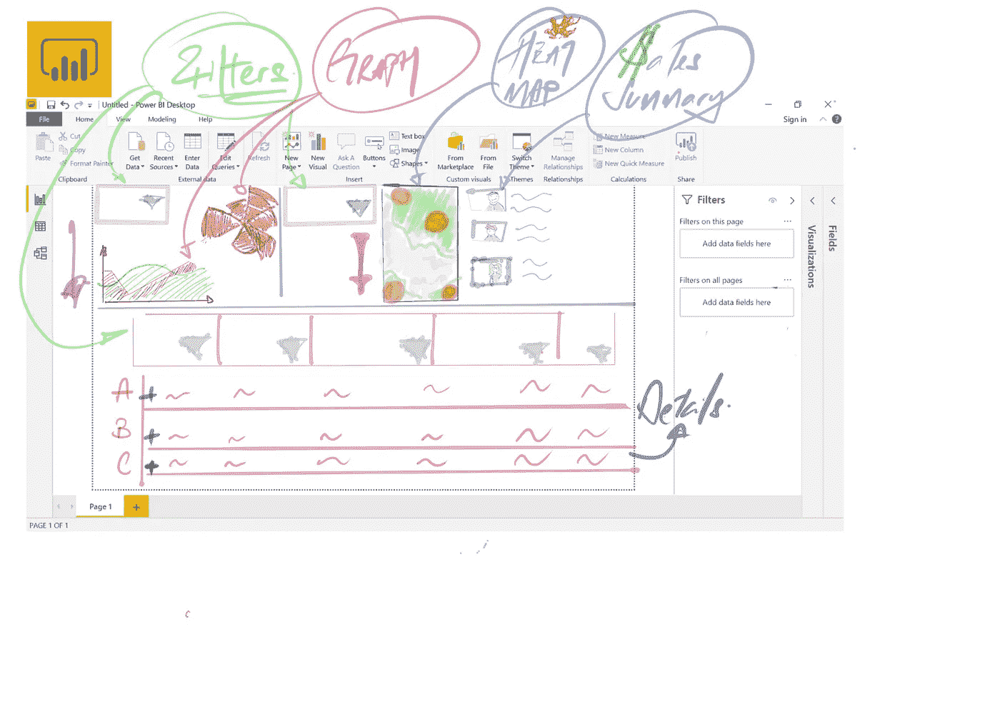
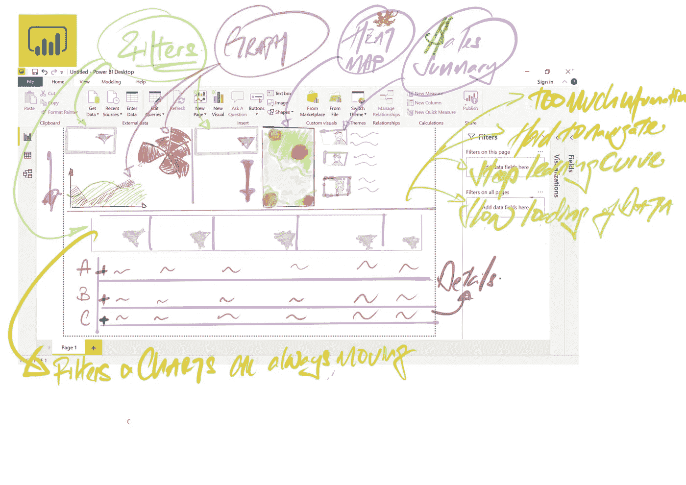
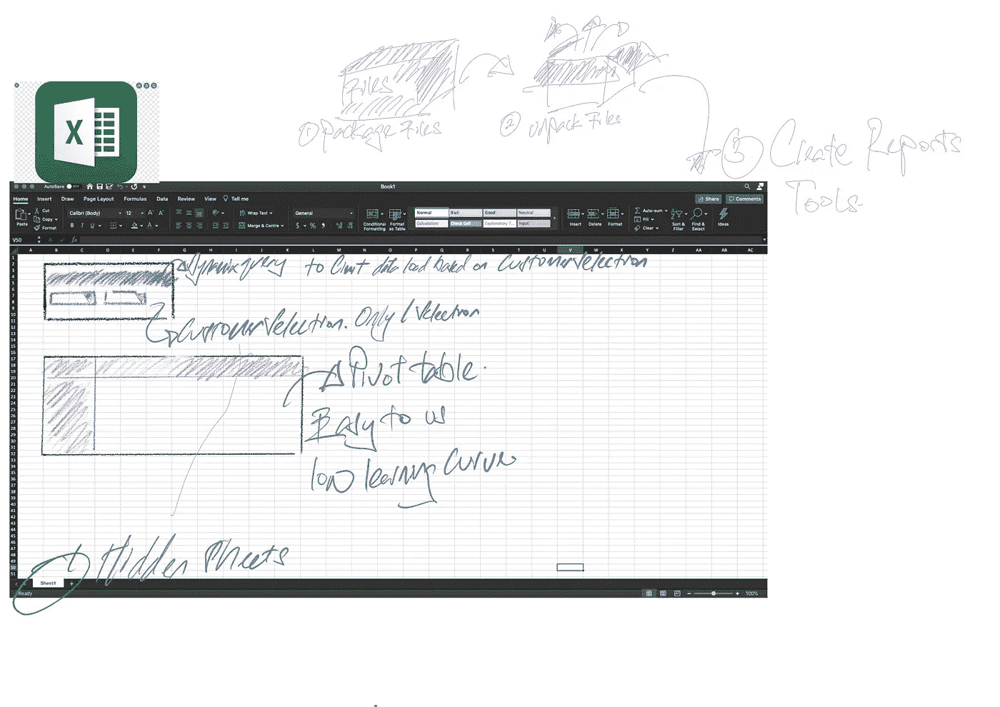

# 用 Excel 构建成功的数据工具

> 原文：<https://medium.com/analytics-vidhya/building-a-successful-data-tool-with-excel-357a313138e6?source=collection_archive---------18----------------------->

除了数据分析，我工作的一个方面是确保组织内的数据治理。如果没有足够的预算，我们通常无法构建一个让所有人都满意的数据产品，来确保最终用户的数据治理和可用性。相反，我们依赖于自由软件，但这往往伴随着巨大的限制
我将分享我如何创造性地使用 Excel、PowerQuery 创建数据产品，了解最终用户如何与最终产品交互，并在此基础上应用业务领域知识

照片由[卢卡斯](https://www.pexels.com/@goumbik?utm_content=attributionCopyText&utm_medium=referral&utm_source=pexels)从[佩克斯](https://www.pexels.com/photo/person-writing-on-notebook-669615/?utm_content=attributionCopyText&utm_medium=referral&utm_source=pexels)拍摄

> 我需要构建一个满足以下标准的产品:

1.  自由的
2.  最终用户的易用性
3.  确保符合数据治理要求
4.  易于维护和更新
5.  最终用户更改视图的灵活性
6.  大数据的存储
7.  性能不打折扣
8.  精益学习曲线

有趣的是，PowerBI desktop 符合我的所有标准，但不符合最终用户的标准。由于某些限制，我无法将数据加载到 PowerBI 报表服务器上。最初的构建是在 PowerBI Desktop 上完成的，最终用户在使用它之前必须下载 PowerBI desktop，这带来了一些问题:

最初的 PowerBI 构建非常粗略的布局

1.  陡峭的学习曲线
2.  下载到他们的桌面时出现问题
3.  在过滤器中导航或选择有困难
4.  最终用户想要简单明了的 Excel，而不是带有花哨仪表盘的 PowerBI 等

用户反馈的粗略记录

我与最终用户进行了几轮讨论，并收集了他们的反馈和最重要的功能， ***，即在 EXCEL 中为他们的客户快速、简化地显示数据。***

我将构建转移到 Excel 的主要挑战是
1。Excel
2 上 1.6m 行数据的限制。数据治理
3。月度数据更新
4。Excel 文件的性能

简单介绍如何在 Excel 中完成并克服挑战

# 我如何解决这些问题

**Excel 上 160 万行数据的限制**
我们有一个数据集，其中包含每笔交易的 2 年销售历史，很容易就超过 100 万行数据。
由于我们的销售人员一次只与一个客户互动，因此我通过查询设置了一个限制，一次显示一个客户的历史交易，这解决了 Excel 中 1.6m 行的限制

**数据治理** 一次只能加载一个客户数据的能力，所有数据集都隐藏在 PowerQuery 中。这种设计是有意为之的，目的是使加载所有数据变得困难和繁琐。
由于销售人员更感兴趣的是追逐数字，而不是学习新的技术技能，目前这将是提供数据治理同时提高笔记本电脑 Excel 性能的最佳方式

**每月数据更新** 这很容易，因为所有文件都是通过 PowerQuery 创建的。有人只需要把一个相同文件结构的新文件放到每个文件夹中，然后刷新。这部分我只需要在全国培养一个人来打理就可以了:)

**Excel 文件的性能** 这也是一个棘手的问题，因为我以前曾在最终用户上使用过 PowerBI Desktop。
除了在 M-Code 和 DAX 中进行优化之外，我还发现最好的方法是将整个源数据加载到最终用户的本地驱动器上。
这是通过隐藏文件、隐藏标签和在 Excel 中编写动态文件路径来实现的[ ***从 Ken Puls*** ]处学习这一技巧(我的灵感来自 zip。我下载游戏时 90 年代的文件:)

> 反射

构建一个数据产品并不意味着用最好的和最新的技术拥有花哨的或/和交互式的图表。
重要的是了解最终用户如何与产品互动，设身处地地为他们着想，如果需要的话，跟踪他们看看他们是如何工作的。
然后，尝试从最终用户的角度对产品/分析进行逆向工程，并在两者之间满足成品的可用技术或分析。
***制造一个能充分发挥其潜力的产品会更有成就感***

如果有人感兴趣，我可以用样本数据创建一个版本，并通过 powerquery 链接数据:)共享是关怀