# 构建一个具有中等评分预测的文本分析 Web 应用程序

> 原文：<https://medium.com/analytics-vidhya/building-a-text-analysis-web-app-with-medium-claps-prediction-2ce2d59153ef?source=collection_archive---------5----------------------->

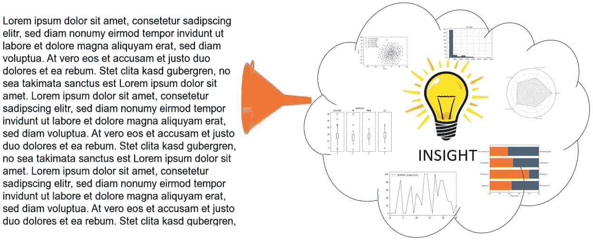

*数据，数据，到处都是但没有一滴信息在眼前！*

*(…向柯勒律治道歉)*

**与数字数据不同，你通常可以将数字数据归结为一些汇总统计数据，从中提取一些真知灼见，而文本数据则有点难以快速处理。**

为了看看数据科学/ ML 技术是否能帮助我提高写作水平，我构建了一个简单的基于 Python Flask 的 web 应用程序，它可以快速分析网页，以获得基于高级文本分析指标的快速见解。

**该应用程序会返回统计数据，如字数、句子数等，还会返回自然语言处理功能，如情感分析得分和可读性得分。利用其他人建立的预先训练好的模型，我还加入了预测作者性格类型的代码。该应用还具有“鼓掌预测器”功能，通过两种方法来估计预期的鼓掌次数——简单的线性回归预测模型(警告，准确性相当差)和使用文档嵌入矢量化的分类器(Doc2Vec)**

**我已经在网上发布了代码，所以请随时给我留下一些反馈或复制我的回购并改进它(例如，构建您自己的自定义数据集并重新训练模型等)**

**App 演示网站:**[http://34.126.106.75:5000](http://34.126.106.75:5000/)

*2022 年 9 月更新:自从我写这篇文章以来，已经有大约 2 年了，我已经决定关闭应用程序演示网站，因为低流量不值得在谷歌云上托管它的每月成本——如果我在下面得到足够多的评论，我可能会重新考虑；)*

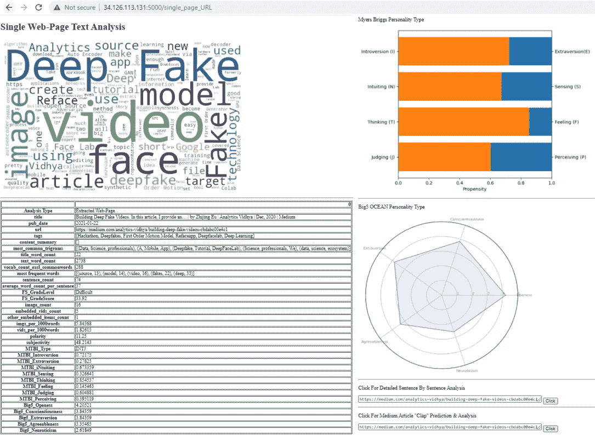

网络应用位于:[http://34.126.113.131:5000](http://34.126.113.131:5000/)

你为什么要做这个？

几个月来，我一直在 Medium.com 上撰写与数据科学相关的主题，并努力思考如何最好地改进我的文章，提高我的鼓掌数/浏览量。所以我开始考虑是否可以使用 ML 或数据科学技术来帮助我写得更好。

有人工智能驱动的解决方案，如语法上的(人工智能驱动的写作助手)。然而，我想我会从一个更小的目标开始，制作一个简单的 web 应用程序，它可以处理文本并返回一些关键指标。

这篇文章介绍了我采取的步骤以及我的一些主要收获。我在下面放了一些代码片段，但完整的脚本可以在这里找到:

[](https://github.com/ZhijingEu/Text_Analyzer_FlaskWebApp) [## ZhijingEu/Text _ Analyzer _ FlaskWebApp

### 在 GitHub 上创建一个帐号，为 ZhijingEu/Text _ Analyzer _ FlaskWebApp 开发做贡献。

github.com](https://github.com/ZhijingEu/Text_Analyzer_FlaskWebApp) 

# **概要**

[**1。提取&清理原始数据**](#b711)

[2**。处理 HTML/文本数据以提取关键指标**](#a0c7)

[**3。建立预测模型**](#3b2b)

[**3.1 .性格分析预测—迈尔斯·布里格斯类型指标**](#abf1)

[**3.2 .性格分析预测—大五特质**](#20fd)

[**3.3 .鼓掌计数估算器**](#e48a)

[**3.3.1 探索性数据分析**](#67f1)

[**3.3.2“简单”线性回归估计量**](#2268)

[**3.3.3 文档嵌入基础分类器**](#aff8)

[**4。将代码转换成一个简单的 Flask App**](#8679)

[**5。**结论](#4855)

## 1.提取和清理数据


来源:[阿拉米](https://www.alamy.com/stock-photo/paint-scraper.html)

这相当简单，因为我使用 Python 的 [Requests](https://requests.readthedocs.io/en/master) 库进行大部分的网络抓取

```
from bs4 import BeautifulSoup
import urllib.request
from urllib.request import Request, urlopenclass ArticleExtract():def __init__(self,url,text_input=False):
        self.url = url
        self.text_input= text_input # To allow for text input too#Set get_html and cleaned_text as properties as these get re-used by other functions[@property](http://twitter.com/property)
def get_html(self):
        user_agent_list = ['Mozilla/5.0 (Macintosh; Intel Mac OS X 10_15_5) AppleWebKit/605.1.15 (KHTML, like Gecko) Version/13.1.1 Safari/605.1.15','Mozilla/5.0 (Windows NT 10.0; Win64; x64; rv:77.0) Gecko/20100101 Firefox/77.0','Mozilla/5.0 (Macintosh; Intel Mac OS X 10_15_5) AppleWebKit/537.36 (KHTML, like Gecko) Chrome/83.0.4103.97 Safari/537.36','Mozilla/5.0 (Macintosh; Intel Mac OS X 10.15; rv:77.0) Gecko/20100101 Firefox/77.0','Mozilla/5.0 (Windows NT 10.0; Win64;x64) AppleWebKit/537.36 (KHTML, like Gecko) Chrome/83.0.4103.97 Safari/537.36',] if self.text_input==False:
            for i in range(1,4):
                #Pick a random user agent
                user_agent = random.choice(user_agent_list)
                #Set the headers 
                headers = {'User-Agent': user_agent} req = Request(self.url, headers=headers) self._get_html = urlopen(req).read() if self.text_input==True:
                self._get_html = self.url

          return self._get_html
...
```

我首先创建了一个类，它接受文本或 URL 作为输入，并有一整套方法来处理数据和存储输出。(然而这个类对象最终变得臃肿，所以我不得不将其重构为 Flask 应用程序中的一组函数——稍后会详细介绍)

原始 HTML 中有各种各样的 HTML 标签。有很多方法可以移除这些标签，但是我用了漂亮的汤，它有一个有用的 get_text 函数和一个解析器，可以识别和去除标签

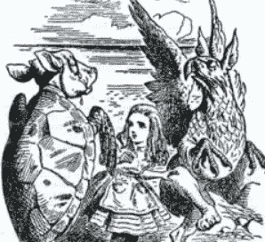

图片来源:约翰·坦尼尔——在《爱丽丝梦游仙境》中，素甲鱼向爱丽丝讲述他美丽的汤的场景。

```
class ArticleExtract():...def cleaned_text(htmlinput):
    cleaned_text=BeautifulSoup(htmlinput, "html.parser").get_text("  ").replace("\r", " ").replace("\t", " ").replace("\n", " ").replace(u'\xa0', u' ')
    return cleaned_text...
```

## **2。处理数据**

我尝试从这两个商业网站复制功能，并以此为指导选择生成哪些文本分析指标

[https://readable.com](https://readable.com/)

https://seoscout.com/tools/keyword-analyzer

然而，我也包括一些网页元数据，如出版日期，图像和嵌入式视频计数等

繁重的工作由 [NLTK 库](https://www.nltk.org/)完成，它是我用于基本标记化步骤的主要工具，为许多其他后续函数提供信息。

[](https://www.guru99.com/tokenize-words-sentences-nltk.html) [## 用 NLTK 标记单词和句子

### 什么是标记化？标记化是将大量文本分割成较小部分的过程，称为…

www.guru99.com](https://www.guru99.com/tokenize-words-sentences-nltk.html) 

标记化是将文本分割成更小的块，如句子或单词，以满足许多其他文本指标。

```
class ArticleExtract():... [@property](http://twitter.com/property)
def tokens_alpha(self):
        raw = BeautifulSoup(self.get_html, 'html.parser').get_text(strip=True)
        words = nltk.word_tokenize(raw)
        self._tokens_alpha= [word for word in words if word.isalpha()] # or use option of := if word.isalnum()
        return self._tokens_alpha
...
```

值得一提的还有我用于情感分析的 TextBlob 库。

[](https://towardsdatascience.com/my-absolute-go-to-for-sentiment-analysis-textblob-3ac3a11d524) [## 我对情感分析的绝对依赖——text blob。

### 使用文本块的情感分析。

towardsdatascience.com](https://towardsdatascience.com/my-absolute-go-to-for-sentiment-analysis-textblob-3ac3a11d524) 

情感分析使用关键词分析来确定极性(陈述的消极或积极程度)和主观性(相对于基于中性事实的陈述，例如我认为…，你应该…，等等)。极性得分是一个浮动值，对于消极陈述在-100%范围内，对于积极陈述在+100%范围内。主观性评分有一个范围，0.0%非常客观，100%非常主观。

```
class ArticleExtract():...
def sentiment(self):
        blob = TextBlob(self.cleaned_text)
        split_text=blob.sentences

        df=pd.DataFrame((''.join(split_text[i]) for i in   
        range(len(split_text))),columns=['Sentences'])

        df[["TextBlob_Polarity","TextBlob_Subjectivity"]]=
        pd.DataFrame((split_text[i].sentiment for i in 
        range(len(split_text)))) df=df[df['Sentences'].map(len) > 15] #Remove all short 
        sentences
        #Avoid counting any sentences with Polarity 0 or    
        Subjectivity 0 

        TextBlob_Overall_Polarity=df[df["TextBlob_Polarity"] != 0]
        ['TextBlob_Polarity'].median()

        TextBlob_Overall_Subjectivity=df[df["TextBlob_Subjectivity"] 
        != 0]['TextBlob_Subjectivity'].median()

        return 
             TextBlob_Overall_Polarity,TextBlob_Overall_Subjectivity
...
```

对于可读性分析，有一系列令人眼花缭乱的不同方法，要么将文本与现有的“硬”单词列表进行比较，要么计算音节/句子/单词的长度。

[](https://en.wikipedia.org/wiki/Readability) [## 可读性

### 可读性是指读者理解书面文本的难易程度。在自然语言中，文本的可读性…

en.wikipedia.org](https://en.wikipedia.org/wiki/Readability) 

为了简单起见，我最终选定了一个叫做[Flesch Reading easy Score](https://readable.com/blog/the-flesch-reading-ease-and-flesch-kincaid-grade-level)的单一指标，我使用一个叫做 [Textstat](https://pypi.org/project/textstat) 的库来估算这个指标

它是使用一个公式计算的，该公式考虑了平均句子长度和每个单词的平均音节数，分数越高，文本越容易阅读(例如，> 90 =非常容易，< 30 =非常混乱)

```
class ArticleExtract():...
def FS_ReadingEaseScore(self):

       FS_GradeScore=textstat.flesch_reading_ease(self.cleaned_text)
        return FS_GradeScore
...
```

在最初的两个步骤中，我遇到的一个问题是我得到的数据的准确性。我最终创建了一个函数来逐句查看结果，我发现我的原始数据没有被适当地“清洗”

***第一课:*** ***做*** ***不要低估适当清理 html 文本的重要性*** 。比如我最初用 BeautifulSoup.get_text()清理 HTML 标签[而不是。get _ text(" "](https://stackoverflow.com/questions/16767405/beautifulsoup-concatenating-words))。因此我得到了这样的废话:—

```
BeautifulSoup('<span>this is a</span>cat').text
Output : u'this is acat
```

这意味着我总是无意中把单词连接在一起，之后所有依赖于“清理文本”的东西都是错误的——例如，它增加了句子长度，使可读性分数更差，混淆了情感分析等。其他区域是像含有“-”或“-”字符的句子或表格/列表，这取决于它们在 html 中的设置，可能会以乱码结束，并增加句子数量。

## 3.构建预测模型

## 人格分析


[来源:123RF 库存照片](https://www.123rf.com/stock-photo/personality.html?sti=n77f19hiwbf8wti7ho|)

虽然严格来说，性格分析本身并不是文本分析的一部分，但我认为这将是该应用程序的一个有趣的补充。我最初想开发自己的模型，但这比我预期的要多一点，所以我从一些作者发布在网上的作品改编而来。

## **3.1 Myers Briggs 型指示器**

Myers-Briggs Type Indicator(MBTI)试图解释人们如何感知世界和做出决定，并将人们分为四类:内向或外向、感知或直觉、思考或感觉、判断或感知。从每个类别中抽取一个字母，产生一个四个字母的测试结果，如“INFJ”或“ENFP”。

我对下面文章中的代码进行了逆向工程，并将他们预先训练好的模型(这是一个逻辑回归模型)加载到我的应用程序中。

[](https://towardsdatascience.com/text-analytics-what-does-your-linkedin-profile-summary-say-about-your-personality-f80df46875d1) [## 文本分析:关于你的个性，你的 LinkedIn 个人资料摘要说明了什么？

### 使用自然语言处理技术来预测你的性格。

towardsdatascience.com](https://towardsdatascience.com/text-analytics-what-does-your-linkedin-profile-summary-say-about-your-personality-f80df46875d1) 

这篇文章本身值得一读，因为他们的整个项目用几个主要咨询公司的网络搜索 LinkedIn 个人资料来测试模型，以检查在那里工作的人是否有模式。

## 3.2 大五人格分析

同样，另一种流行的性格分析方法是[五大特质](https://en.wikipedia.org/wiki/Big_Five_personality_traits)模型(有时也称为 O.C.E.A.N 模型)，它是五种主要性格特征的组合:

*   对经验持开放态度(创新/好奇与一致/谨慎)
*   责任心(高效/有条理与奢侈/粗心)
*   外向性(外向/精力充沛对孤独/保守)
*   宜人性(友好/富有同情心与挑战性/冷酷无情)
*   神经质(敏感/紧张与坚韧/自信)

我使用了来自该项目资源库的预训练模型(它是随机森林回归器和随机森林分类器的组合):

[](https://github.com/jcl132/personality-prediction-from-text) [## JCL 132/从文本预测个性

### 该项目旨在使用各种机器学习模型从文本样本中预测大 5 人格特征。一个…

github.com](https://github.com/jcl132/personality-prediction-from-text) 

在我的应用程序中，我只使用他们预先训练好的模型进行预测。然而，整个项目的范围令人印象深刻，因为它集成了 Python、Django 和 Node JS，后者可以抓取你的 FB 数据，将其存储在数据库实例(可以是你自己的私有实例)上，并在定制的 web 应用程序上显示所有结果，该应用程序可以将你朋友的所有个性特征与你自己的进行比较。

因此，对于这一部分，我的主要收获是:-

***第二课:在适当的情况下，利用他人的作品*** *(假设它是公开的，并且你给了原作者应有的荣誉；-)* 我在之前的一篇文章中已经谈到了这个主题[，但它值得重复——如果您可以定义您需要什么，并意识到价格与性能/支持级别/文档之间的潜在权衡——很可能已经有一个服务或一些开源项目已经有了解决方案。](/analytics-vidhya/building-an-amateur-machine-learning-web-app-what-i-learnt-d6a89bddb025#0e41)

## **3.3。鼓掌预测**

对于 clap 预测，我可以采取类似的“复制并适应”方法，因为有相当多的关于这个主题的好文章[【1】](/analytics-vidhya/how-to-maximize-claps-on-your-medium-articles-ce427cf327ff)[【2】](https://www.kaggle.com/c/how-good-is-your-medium-article)[【3】](/dataseries/building-a-data-science-model-to-predict-a-successful-medium-article-f2458c30a14f)和[【4】](/free-code-camp/how-to-predict-likes-and-shares-based-on-your-articles-title-using-machine-learning-47f98f0612ea)。然而，这个挑战非常有趣，我想亲自尝试一下。


[来源:Dreamstime 股票照片](https://www.dreamstime.com/illustration/clap-hands-cartoon.html)

## 探索性数据分析

为了跟进，在 repo 中使用[exploratorydataanalysis . ipynb](https://github.com/ZhijingEu/Text_Analyzer_FlaskWebApp/blob/master/02_Exploratory_Data_Analysis.ipynb)文件。

我使用在步骤 2 中构建的脚本从[的首页获取了大约 200 篇文章，分别是《走向数据科学](https://towardsdatascience.com)和[分析 Vidhya](https://medium.com/analytics-vidhya) 。这篇文章的 URL-s 和 Clap 计数是使用 [Parsehub](https://www.parsehub.com) (我在以前的文章中介绍过的一个漂亮的工具[)(*我知道我本来可以在 Python 中完成这项工作，但是在花了几个小时摆弄 Beautiful Soup 之后，我放弃了*](/analytics-vidhya/building-an-amateur-machine-learning-web-app-what-i-learnt-d6a89bddb025#dede)[*Selenium*](https://selenium-python.readthedocs.io/)*库——分页很难，好吗？*)

我知道 200 作为一个数据集是很小的，但我想从一个小的“精选”数据集开始，这样我可以对模型的行为有更好的感觉。不幸的是，我后来发现大多数头版特色文章都是最近发表的(结果鼓掌次数通常只有三位数，因为文章还没有时间“成熟”)，所以我实际上最终得到了一个有点不平衡的数据集。我还偷偷看了一些“精选”的 2018/ 2019 年末文章，以了解年龄和鼓掌数量的变化。(不过，请注意，这种过度呈现新文章的问题将会回来，并在@ss 中咬我一口，稍后您将会看到)

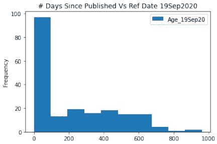

大多数文章都属于鼓掌次数少的类别，只有少数文章(大部分是老文章)鼓掌次数多。

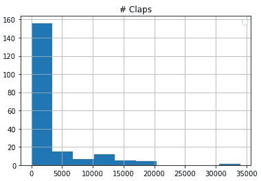

在 200 篇文章中，超过 3/4 的文章的点击率低于 5000 次…

鉴于鼓掌数量中的这种“幂律”类型行为，我创建了一个 Log 鼓掌计数指标，因为我认为这是一个更好的衡量标准。我最初运行了一个简单的 Pearson 相关来理解各种指标，并查看是否有一个模式或与 Log Clap 计数的任何强相关。结果是不确定的，因为显示强相关性的唯一指标是:-

*   年龄(从发表日期开始)——这确实有道理，因为旧文章往往有更多的观点，但这是一个不完整的画面，因为显然肯定有其他因素在起作用，如果不是所有的旧文章都有高掌声

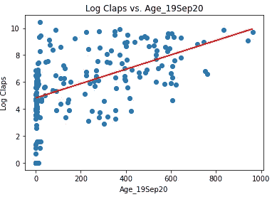

相关性:0.534

*   句子数量和单词数量——这是反直觉的，因为它似乎表明句子越多，文章越长，掌声就越多？

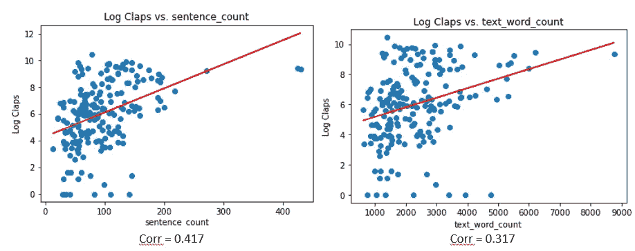

我就不说其他图表了，但令我惊讶的是，像极性或主观性、可读性分数和大多数个性分数的绝对值都小于 0.20。

为了帮助我以不同的方式查看数据，并更好地可视化一些可能扭曲相关性的异常值，我还为 Hi-Med-Lo clap 计数制作了并排的盒图(有些随意地选择为 H : > 5k (37 篇文章)，M : 5k-0.5k (58 篇文章)，L : < 0.5k Claps (105 Articles) ) against the total 200 articles

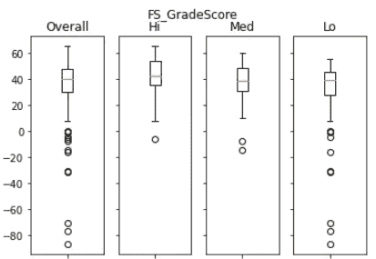

Using this box-plot type view, there does seem to be a weak relationship where Hi Clap articles tend to have a slightly higher FS Grade Score . This makes sense as a lower score means the text is harder to read. (Either that or my data or data processing was bad)

While there was no discernable pattern between the Hi/Mid/Lo Clap articles by predicted MBTI personality types, it was interesting to see that the logistic regression model used for the MTBI classifier seems to think most of the total 200 articles were written by #-#-T-J type authors.

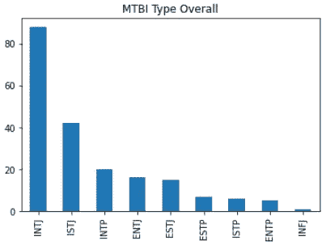

INTJ-s make up ~40% of all articles

There is more detail in the IPYNB notebook on the Github repo if you are interested but nothing of note.

At this point, if I were doing this seriously , I would have probably stopped and went back to re-examine the accuracy of the data processing steps and/or expand the size of the data-set. However since the “clap prediction" was ultimately only an add on feature to my main goal of building a simple text analysis app, I just went ahead with what I had.

## 3.3.2 Clap Prediction Via A Linear Regression Model

I used a very plain vanilla approach that in hindsight probably does not capture the actual relationships very well but I ran a number of linear regression approaches out of the SciKit learn toolkit with a hand-crafted set of features where I more or less just dropped the entire MTBI and Big5 Personality metrics (as most of these had low correlations anyway)

```
df = pd.read_excel('Dataset.xlsx')
df['log_claps']=np.log(df.claps)#Regression Variables were "hand-picked" to exclude non numerical and both MTBI and Big5 OCEAN characteristicscolumn_for_regression=["Age_19Sep20","sentence_count","title_word_count","average_word_count_per_sentence","text_word_count","vocab_count_excl_commonwords","imgs_per_1000words","FS_GradeScore","vids_per_1000words","polarity","subjectivity"]X=df.loc[:, df.columns.intersection(column_for_regression)]
y = df['log_claps']
X_train, X_test, y_train, y_test = train_test_split(X, y, test_size=0.2, random_state=42)lasso_alphas = 10**np.linspace(-5,0,1000)
lasso_cv = LassoCV(alphas = lasso_alphas, cv=5)
lasso_cv.fit(X_train, y_train)
lasso_cv.alpha_
lasso = Lasso(alpha=lasso_cv.alpha_)
lasso.fit(X_train, y_train)
predicted_claps_lasso = lasso.predict(X_test)
lasso_mse = mean_squared_error(y_test, predicted_claps_lasso)
r_sq = lasso.score(X_test, y_test)print("Lasso Regression")
print("")
print('coefficient of determination:', round(r_sq,3))
print("")
print('intercept:', lasso.intercept_)
print("")
print('slope:', lasso.coef_)
print("")
print('Mean Sq Error in Log Claps',lasso_mse)
print("")
print('Mean Sq Error in Claps',np.exp(lasso_mse))
```

Lasso Regression seemed to do better than the Ridge Regression and the basic un-regularised Linear Regression.

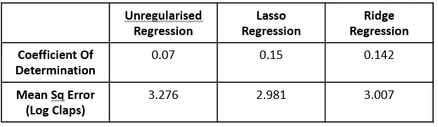

So how well does it perform ? As you may expect — Not so great… :(

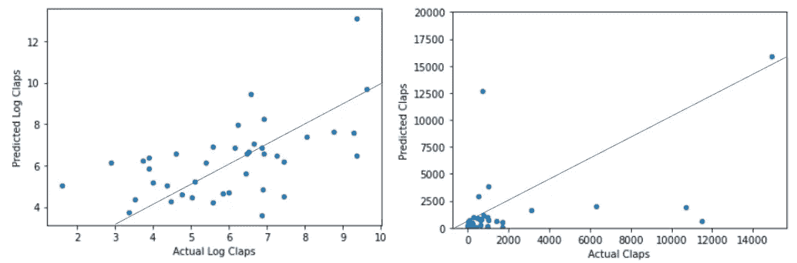

The straight-line is if Predicted = Actual (Note the scales are a bit misleading) so the further the dot is from the straight line, the worse the error

The errors are “blown up” because the regression is against Log Claps. The model seems to work okay for articles that were in actual fact less than 2,000 Claps but anything beyond that seems to fall over.

Therefore my advice would be to apply this clap prediction for new-ish articles (6–9 mths old from publish date) — which coincidentally matches up with the majority of the training data-set anyway. (*几率是多少？！*讥讽** )

## 3.3.2 通过“分类”模型进行的 Clap 预测

在另一种方法中，我忽略了所有的文本度量，只关注(清理过的)文本的内容。要跟进使用 repo 中的[Training _ A _ doc 2 vec _ model . ipynb](https://github.com/ZhijingEu/Text_Analyzer_FlaskWebApp/blob/master/03_Training_A_Doc2Vec_Model.ipynb)文件。

有一种在自然语言处理中经常使用的技术叫做单词嵌入，其中你“矢量化”一个单词。我的解释可能过于简单，但它是通过一种算法来猜测给定周围单词(即上下文)的单词，并将该信息编码成多维向量来实现的。

这样做，您可以将同一语料库中分析的任何单词用数字表示为一个等长向量，然后找到该单词与任何其他单词之间的“距离”。因此，你可以做一些非常酷的事情，比如添加国王和女人的向量，并得出一个与王后的向量非常匹配的向量。

[](https://towardsdatascience.com/introduction-to-word-embedding-and-word2vec-652d0c2060fa) [## 单词嵌入和 Word2Vec 简介

### 单词嵌入是最流行的文档词汇表示之一。它能够捕捉…的上下文

towardsdatascience.com](https://towardsdatascience.com/introduction-to-word-embedding-and-word2vec-652d0c2060fa) 

有一个等价的文档级嵌入过程，称为 Doc2Vec，它扩展了这一思想，可以将整个文档转换为一个向量。

[](/@ermolushka/text-clusterization-using-python-and-doc2vec-8c499668fa61) [## 使用 Python 和 Doc2vec 的文本集群化

### 假设您有一堆来自用户的文本文档，您想从中获得一些见解。对于…

medium.com](/@ermolushka/text-clusterization-using-python-and-doc2vec-8c499668fa61) 

因此，我在这里的一般方法是使用 200 篇文章的文本来训练 Doc2Vec 模型，然后找到从高到低鼓掌计数文章的“平均”向量。隐含的假设是，语义内容中有一些东西可以区分 hi-med-lo clap 文章。

使用这些类别的平均代表向量，我可以将每一篇文章与这些类别进行比较，通过距离度量来“预测”它属于哪个类别(即文章与平均类别向量的相似程度)

方法如下，使用 [gensim](https://github.com/RaRe-Technologies/gensim/#documentation) 库

```
import pandas as pdimport numpy as np
from numpy import save
from numpy import loadfrom scipy import spatialimport gensim
from nltk.corpus import stopwords
from collections import namedtuple
from gensim.models import doc2vec
from gensim.models.doc2vec import Doc2Vec
from gensim.models.doc2vec import Doc2Vec, TaggedDocument
from nltk.tokenize import word_tokenizedata_source = pd.read_excel('Dataset.xlsx')
data_source.drop(data_source.columns.difference(['ID','title','popularity_level','raw_text']), 1, inplace=True)data = data_source["raw_text"]
tagged_data = [TaggedDocument(words=word_tokenize(_d.lower()), tags=[str(i)]) for i, _d in enumerate(data)]#Code adapted from [https://medium.com/@mishra.thedeepak/doc2vec-simple-implementation-example-df2afbbfbad5](/@mishra.thedeepak/doc2vec-simple-implementation-example-df2afbbfbad5)max_epochs = 100
vec_size = 300
alpha = 0.025Doc2VecModel = Doc2Vec(vector_size=vec_size,
                alpha=alpha, 
                min_alpha=0.00025,
                min_count=1,
                dm =1)

Doc2VecModel.build_vocab(tagged_data)for epoch in range(max_epochs):
    print('iteration {0}'.format(epoch))
    Doc2VecModel.train(tagged_data,
                total_examples=Doc2VecModel.corpus_count,
                epochs=Doc2VecModel.iter)
    # decrease the learning rate
    Doc2VecModel.alpha -= 0.0002
    # fix the learning rate, no decay
    Doc2VecModel.min_alpha = model.alpha

Doc2VecModel.save("Doc2Vec.model")
```

使用 Doc2Vec 中可以找到模型中最相似文章的相似性函数，它产生了一个非常准确的匹配——我不确定它是否挑出了一种独特的写作风格，但当我给它输入我的一篇文章时，它从其他 199 篇文章中挑出了我写的所有文章。

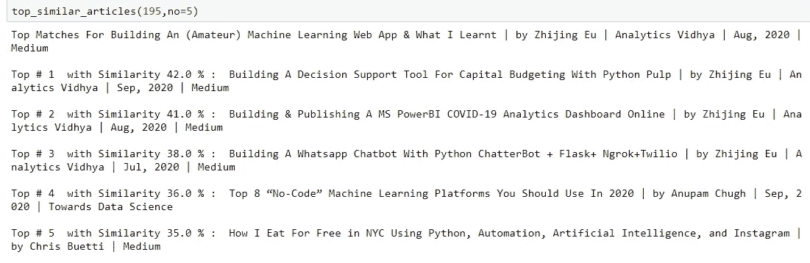

与之前线性回归方法中的 H M L 不同，我对 VH 到 VL 进行了更精细的分类，具体如下 VH，> 10000 次鼓掌(21 篇文章)；h，5000–10000 次鼓掌(15 篇文章)；m，1000–5000 次鼓掌(29 篇文章)；100-1000 次鼓掌(82 篇文章)；VL，< 100 拍手(53 篇文章)。

由于文档向量有 300 维长，你无法直观地看到它，所以使用 TSNE(一种降维方法)处理数据时，我绘制了所有文章，并通过鼓掌计数类对它们进行了颜色编码。

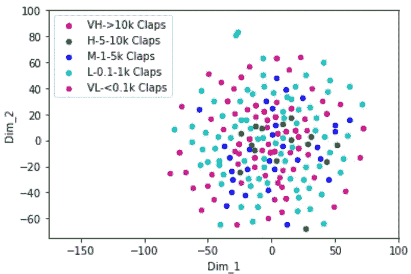

TSNE 的 200 篇文献向量

基于 TSNE 图，确实出现了一种模式，其中低 clap 文章远离“中心”(参考浅蓝色和紫色点)。这么说可能有点夸张，但绿色和深蓝色确实更接近中间。同样，问题是分类不平衡(低点击量的文章比高点击量的文章多)

无论如何，布丁的好坏取决于吃的东西，那么分类器的效果如何呢？令人惊讶的是……80%的准确率相当不错！

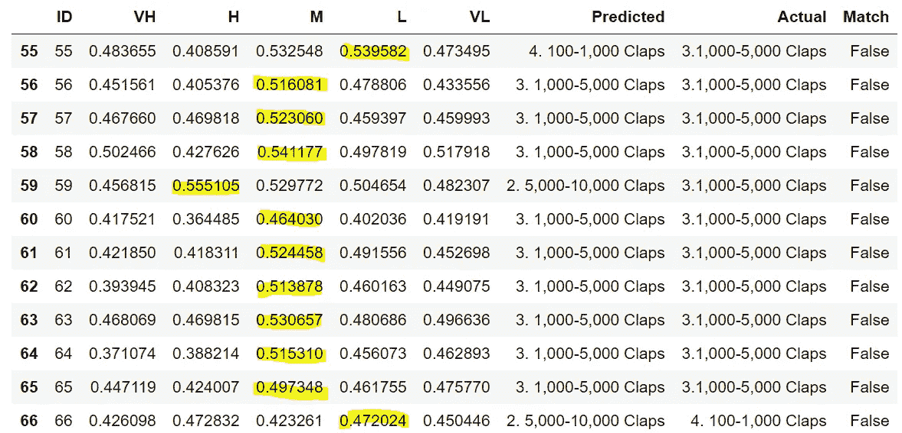

结果示例—预测基于文章与哪个类别最相似…

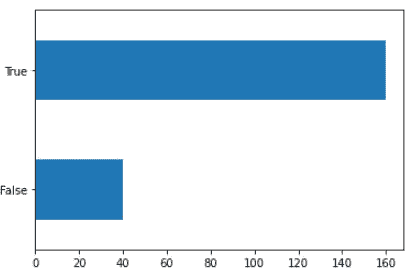

160/200 篇文章被准确预测！

**第三课:ML 技术(模型选择、超参数调整等)只是成功的模型应用的一部分——最终更重要的是训练数据的质量。**这包括关于完整性(它是否代表您试图预测/理解的内容——请注意，我在文章年龄和鼓掌计数方面存在类别不平衡问题)、一致性/正确性(在我的情况下，我怀疑预处理步骤可能仍然有问题)和上下文的所有内容——即理解如何应用 ML 模型来提供关于可接受的错误级别的一些指导。

# **4。将代码转换成一个简单的 Flask App**

我最初期望将我的代码翻译成 Flask 应用程序会相对简单，因为我有意识地决定不包括通常的 web 应用程序功能(例如，没有视图计数器，没有登录管理，没有反馈/评论部分)。我很快发现不是:(

我的根本问题是我最初的代码是如何编写的。我创建了这些庞大的类，它们充满了方法，存储了大量数据。我这样做是为了方便抓取网页和构建参考数据集。即 ArticleExtract 类的设置方式，我只给了它一个 URL，它就完成了所有其他的工作。

这很有效，因为我在 web 抓取期间没有优化速度，并且仍然处于数据分析的探索阶段，在用特定的 URL 实例化一个类对象之后，我有选择地使用其他方法来调用特定的度量或绘图图表或其他东西。(也就是说，我没有一次运行所有的方法，我的网络抓取(我让它运行了一整夜)只针对高级页面级别的指标——而不是详细的逐句分析或 clap 预测)

然而，将所有这些代码剪切粘贴到 Flask 应用程序中会使事情变得极其缓慢。Flask 的工作方式是为每个页面创建视图，这些视图根据各个页面发送的 HTTP 请求工作——本质上是使每个视图成为一个独立的功能。由于默认情况下 Flask **不允许你跨视图**[【1】](https://stackoverflow.com/questions/27611216/how-to-pass-a-variable-between-flask-pages)共享数据，这也意味着对于每个页面，我必须为相同的 URL 创建一个全新的“本地”版本的 ArticleExtract 对象，并且每次都重新运行。


呃…你今天想要那份分析报告吗？[来源:123RF 库存照片](https://www.123rf.com/stock-photo/tortoise_slow.html?sti=oc6ksj7zt3wp1ehnpq|)

Flask 有一个会话特性，但是可以存储“cookies ”,但是这仅限于 400kb，而且大多数文档都建议使用数据库解决方案来跨不同页面“持久化”数据。

我最终将 ArticleExtract 对象分解成独立的函数，并创建了一个“container”类来存储不同页面视图共享的关键数据，以加快处理速度。

**第 4 课:当开发需要部署的代码时——提前计划，从处理时间和内存效率的角度考虑代码的性能**。为了使故障排除更容易，将代码“模块化”成可管理的块，而不是编写紧密耦合的整体代码块，这也是一个很好的实践(也就是说，代码流中包含的依赖项/引用越多，进行任何编辑时整个代码失败的可能性就越大)

# 5.结论

我希望这对希望构建类似应用程序的任何人或者开始使用 Python 进行文本分析的任何人都有用。

总而言之，作为一名数据科学爱好者和 n00b 开发人员，我的主要收获是:

*   **在进行任何文本辩论时，不要低估对原始 html 数据进行适当清洗的重要性！**
*   **在适当的情况下，利用他人的工作**
*   **ML 技术只是成功模型应用的一部分——最终关键是训练数据质量**
*   **提前计划——考虑运行代码所需的内存和处理时间的效率**

我仍然致力于在线部署该应用程序，因此这可能是未来帖子的主题，但现在，欢迎您克隆我的回购并亲自尝试。