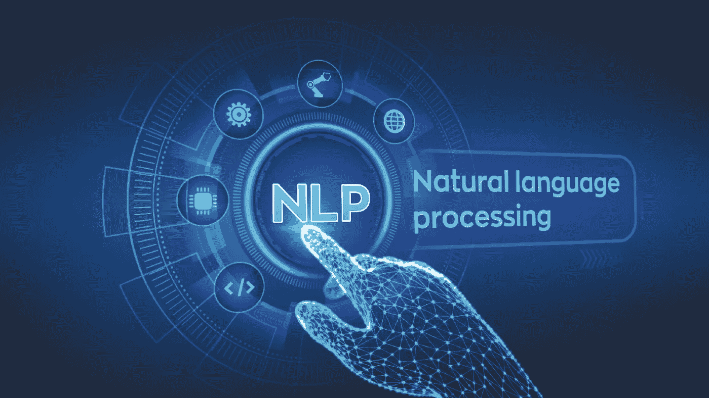

# 使用 BiLSTM 构建文本分类模型

> 原文：<https://medium.com/analytics-vidhya/building-a-text-classification-model-using-bilstm-c0548ace26f2?source=collection_archive---------3----------------------->

学分:[企业对话](https://enterprisetalk.com/featured/ibm-integrates-watson-platform-in-project-debater-nlp-technology-2/)

文本分类是自然语言处理的基本任务之一。几乎每个 NLP 系统都在后端的某个地方使用文本分类。例如，聊天机器人的意图分类器、命名实体识别、自动标记等。

从统计机器学习模型(Logistic、Naive Bays、SVM 等)中有许多解决这个问题的方法。)到高端深度学习模型……