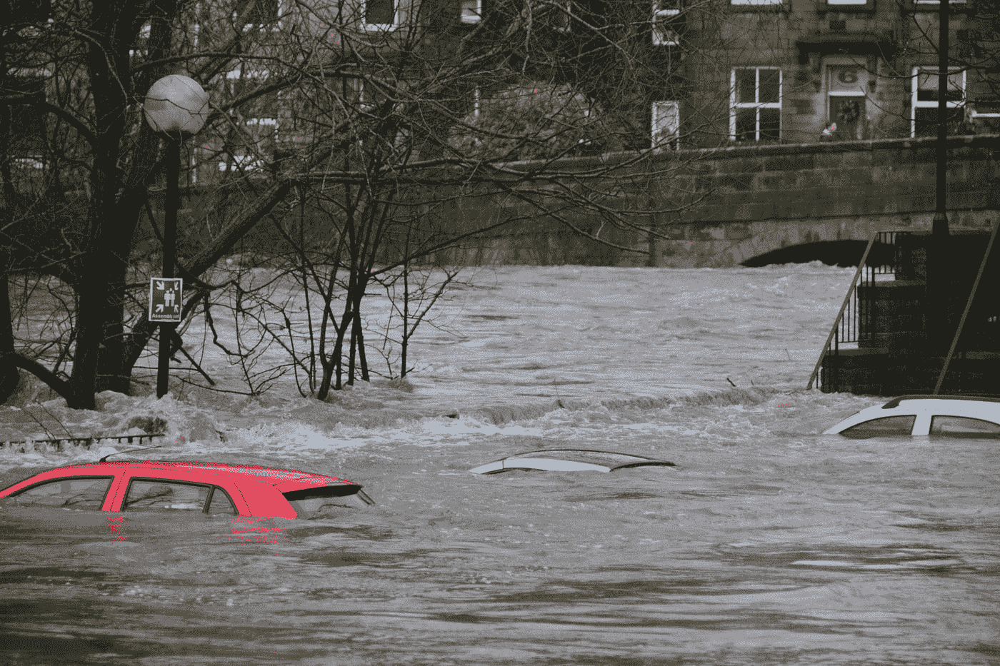

# 为灾难响应构建文本分类器

> 原文：<https://medium.com/analytics-vidhya/building-a-text-classifier-for-disaster-response-caf83137e08d?source=collection_archive---------13----------------------->

克里斯·加拉格尔在 [Unsplash](https://unsplash.com?utm_source=medium&utm_medium=referral) 上的照片

# 背景

> 灾难发生后，通常你会直接或通过社交媒体收到数百万条信息，而此时灾难应对组织最没有能力过滤和提取最重要的信息。通常只有千分之一的邮件可能与灾难有关…