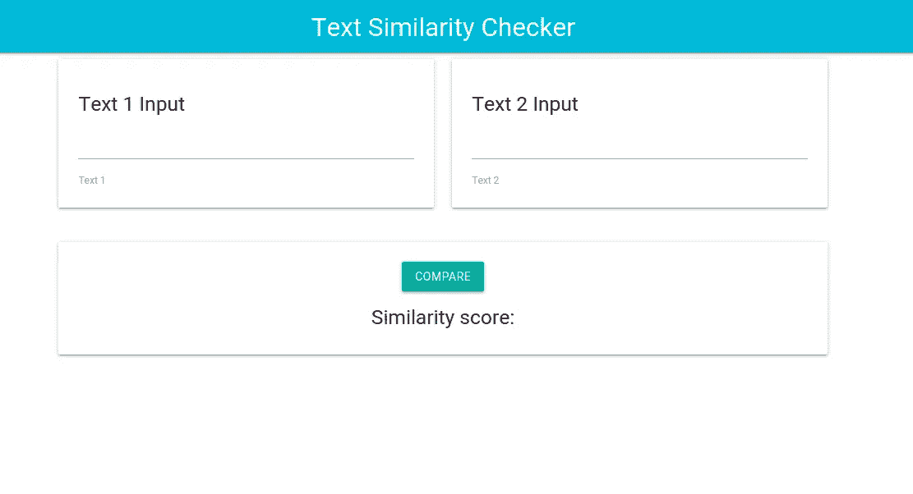
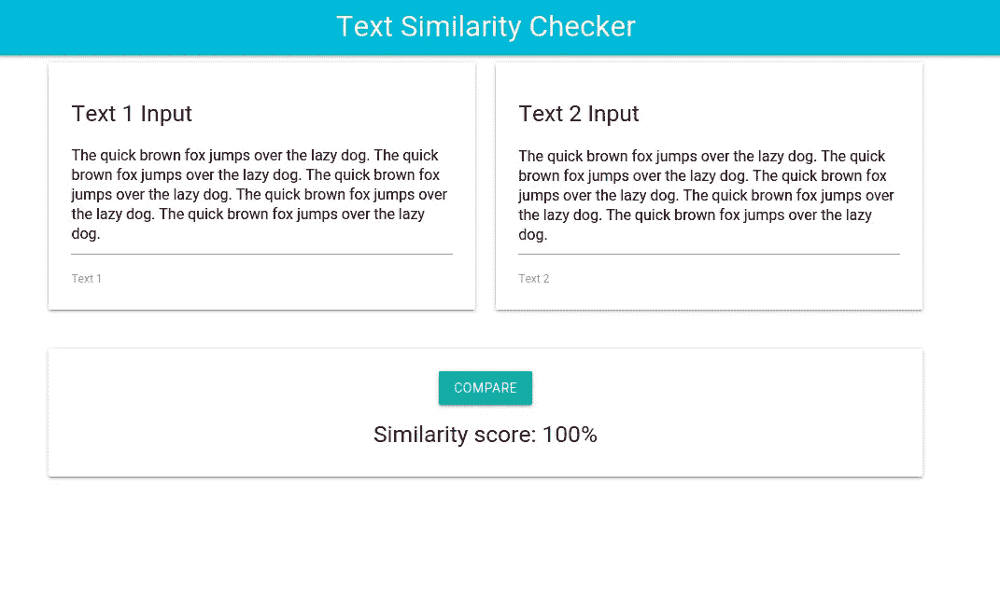

# 使用 JavaScript 和 HTML 中的余弦相似性构建文本相似性检查器

> 原文：<https://medium.com/analytics-vidhya/building-a-text-similarity-checker-using-cosine-similarity-in-javascript-and-html-75722d485703?source=collection_archive---------4----------------------->

在本文中，我们将使用 JavaScript 和 HTML 中的余弦相似性来构建一个文本相似性检查器。

# 余弦相似度是什么？

余弦相似性度量两个向量的相似性。它测量在多维空间中投影的两个向量之间的角度的余弦。我们可以使用这个度量来确定两个文档的相似程度，而不考虑它们的大小。

```
cos(a,b) = a . b / ||a|| ||b||
```

两个文本之间的余弦相似性可以通过在每个文本的字数的向量表示上使用上述公式来找到。然后我们可以确定这两篇文章在字数上有多相似。

# 履行

我们将用 JavaScript 编写我们需要的所有函数，我们还将使用 HTML 和一些样式表单来制作一个令人愉快的 UI。

我们需要做的第一件事是，将文本中的单词映射到它们的频率计数。要做到这一点，我们只需将文本拆分成单词，循环遍历每个单词，并计算该单词在文本中出现的次数。

这就是上面的函数所做的，最后它返回一个单词和它的频率之间有映射的对象。

接下来，我们需要为两个文本中出现的所有单词创建一个字典，以检查相似性。然后，我们将使用我们的字典来制作单词计数的向量表示。为了简化字典制作过程，我们添加了一个函数来从我们的词频映射中提取单词，并将其添加到我们的字典中。

现在，我们可以使用字典将字数统计图转换为矢量。向量的维数取决于字典中的单词数。

现在我们有了将文本串转换成向量的函数，我们可以开始计算它们的余弦相似度了。正如你以前回忆过的，余弦相似度是两个向量的点积除以它们的大小的乘积。我们增加了三个函数来计算余弦相似度。

现在我们已经拥有了我们需要的一切，但是让我们通过添加一个接受两个字符串而不是向量的函数来使我们的生活变得更加简单。

好，让我们添加一个简单的用户界面。我们将使用 HTML，并使用 MaterializeCSS 对其进行样式化。看起来是这样的:



相似性检查器用户界面

我们只需要再添加两个函数来显示网页的相似性结果:

getSimilarityScore 函数只是为了四舍五入结果，并将其转换成百分比，使其更容易理解。当点击**比较**按钮时，最后一个函数被调用，它使用 jQuery 操作 DOM 来显示结果。

最后试验



试验

现在你有了它，一个简单的使用余弦相似性度量的文本相似性检查器…你可以在这里找到这个项目的源代码