# 利用 LDA 和迁移学习建立图像主题模型

> 原文：<https://medium.com/analytics-vidhya/building-a-topic-modelling-for-images-using-lda-and-transfer-learning-e55fcde024c6?source=collection_archive---------5----------------------->

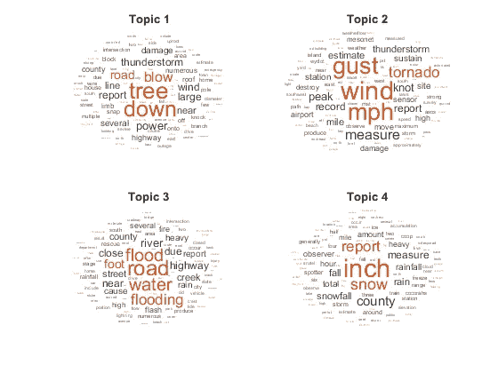

**摘要:**

**主题建模**是一种用于从大量文本中提取隐藏主题的技术。有几种算法用于主题建模，如潜在狄利克雷分配(LDA)，潜在语义分析(LSA)，非负矩阵分解(NMF)等。然而，挑战在于从图像中提取主题。这涉及到文本和图像处理，以提取高质量的主题。大多数博客都专注于从文本信息中发现话题。为了改变，我想扩展和探索图像的主题建模。本文解释了结合这两种处理技术来揭示图像主题的步骤。

**简介:**

**图像的自动主题建模**在计算机视觉和自然语言处理中提出了一个特殊的挑战，因为它需要从视觉和文本这两种完全不同的信息形式中进行解释。

在本文中，我们将了解如何利用图像标题数据集来构建图像主题检测模型。我们将使用**‘Flickr 8k’**数据集来保持它的简单和易于训练。

我们将使用**潜在狄利克雷分配(LDA)** 从字幕数据的词汇中提取主题，并使用预训练的 **VGGNet16** 模型从图像中提取模式，然后训练模型来预测给定图像的主题。

让我们开始吧！

**导入包:**

本文使用的核心包是 **Gensim、NLTK、Spacy、**和 **Keras** 。除此之外，我们还使用 **Pandas、Numpy、Sklearn、**和 **Matplotlib** 进行数据处理和可视化。

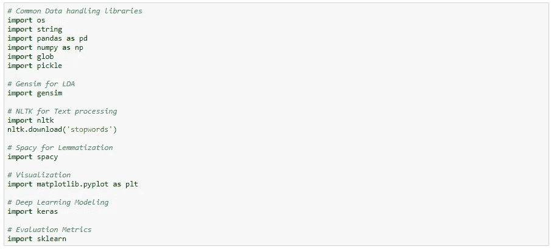

**数据加载:**

你可以从[这里](https://machinelearningmastery.com/develop-a-deep-learning-caption-generation-model-in-python/)下载‘Flickr 8k’数据集。

从下载的数据集中提取 zip 文件后，您会发现下面的文件夹。

*   **Flickr8k_Dataset:** 总共包含了 8092 张 JPEG 格式的不同形状和大小的图片。其中 6000 个用于训练，1000 个用于验证，1000 个用于测试数据集。
*   **Flickr8k_text:** 包含描述 train_set、test_set 和 dev_set 的文本文件。 **Flickr8k.token.txt** 包含每幅图像的 5 个标题，即总共 40460 个标题。

现在，您从 Flickr8k.token.txt 文件中加载图像 id 和标题，并准备一个数据集。然后根据图片 id 对标题进行分组，使其成为每张图片的一个单独的句子。

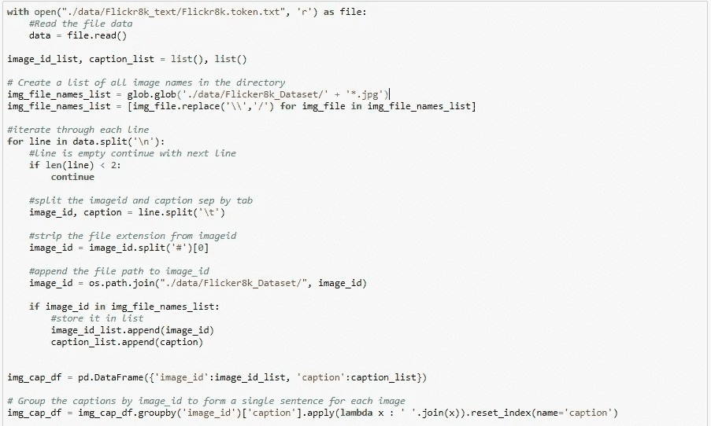

让我们先来看一下数据集。

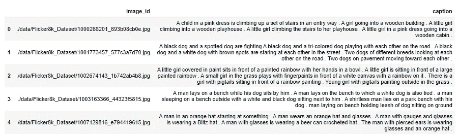

**数据清理:**

数据预处理和清洗是整个建模过程的重要组成部分。它包括以下步骤。

*   **使用分割字符串函数对标题进行标记化**
*   将所有记号的大小写规范化为**小写**
*   从令牌中删除所有的标点符号
*   移除所有包含**数字**数据的令牌
*   使用 NLTK 语料库包删除所有**停用词**

下面定义了 *clean_text()* 函数，该函数将清除加载的字幕数据。

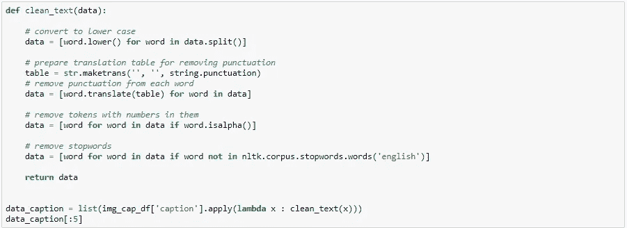

**数据术语化:**

现在，我们**使用 Spacy 将**单词词条化为其词根形式，并过滤仅包含特定词性标签的单词，如**名词、ADJ、动词、**和 **ADV** 。这将提高话题检测过程的准确性。

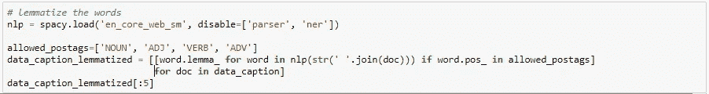

**了解潜在狄利克雷分配(LDA):**

LDA 算法不仅仅执行文本摘要，它还可以发现文档集合中重复出现的主题。

LDA 算法从集合中的每个文本文档中提取一组关键字。然后将文档聚集在一起，以学习文档组中重复出现的关键词。这些重复出现的关键字集被认为是集合中几个文档的共同主题。

更多详情，请参考 [LDA 进行文本摘要和主题检测](https://dzone.com/articles/lda-for-text-summarization-and-topic-detection)。

**创建词典和语料库:**

LDA 主题模型的两个主要输入是词典和语料库。我们可以使用 **Gensim** 中的工具为字幕数据准备字典和语料库。

第一步是将字幕数据加载到训练数据集中，以创建包含单词标识符映射的字典。

接下来，我们遍历标题数据，准备包含术语文档频率表的语料库。

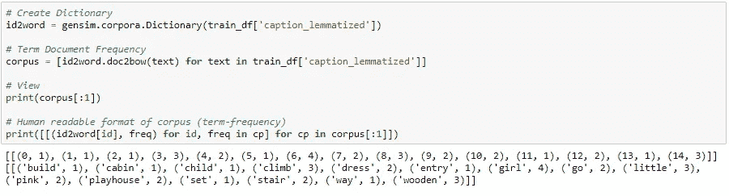

**为 LDA 寻找最佳主题数量:**

为了构建 LDA 模型，我们需要找到从字幕数据集中提取的主题的最佳数量。我们可以使用 LDA 模型的一致性分数来确定主题的最佳数量。

我们可以遍历几个主题的列表，并使用 Gensim 的 *LDAMulticore* 类为每个数量的主题构建 LDA 模型。然后将模型对象加载到*coherence model*类以获得一致性分数。可以保存 LDA 模型及其相应的一致性分数，以便在课程的后面找到主题的最佳数量。最后，我们可以绘制所有主题的结果及其连贯性分数，以便更好地理解。

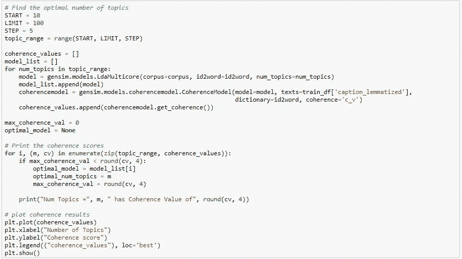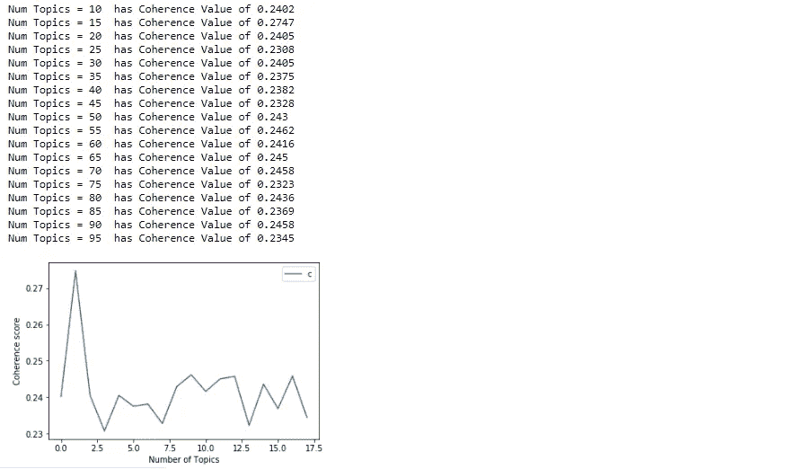

一旦我们获得了最佳模型，我们就可以打印主题摘要，其中包含对每个主题贡献最大的前 10 个单词。

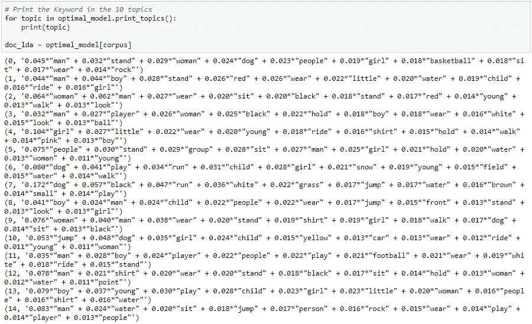

现在我们检查最优模型的**困惑度**和**一致性分数**。理想的 LDA 模型应该具有低复杂度和高一致性分数。

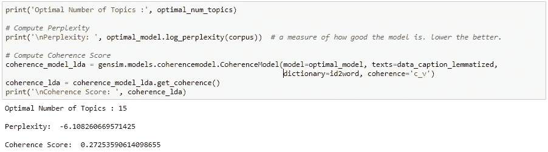

**预测字幕数据的主题:**

既然我们已经找到了最佳 LDA 模型，我们就可以预测数据集中每个字幕数据的主题。首先，我们将训练、验证和测试数据集的语料库加载到 LDA 模型，并获得结果数据集，该结果数据集具有数据集中每个图像的主导主题、贡献百分比和主题的前 10 个关键词。

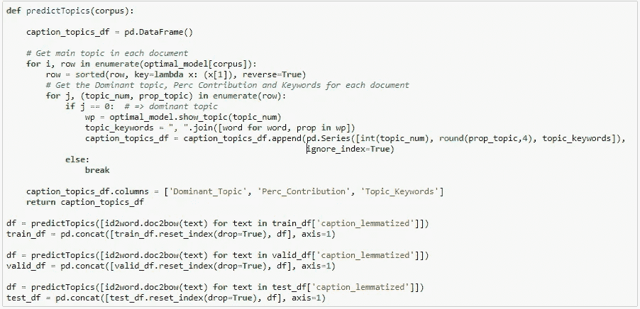

到目前为止，我们已经使用数据集中可用的标题数据预测了每个图像的主题。接下来，我们将看到如何处理图像，并用预测的主题训练深度学习模型。

**迁移学习:**

迁移学习是一种机器学习方法，其中为一项任务开发的模型被重新用作第二项任务模型的起点。

这是深度学习中的一种流行方法，其中预先训练的模型被用作计算机视觉和自然语言处理任务的起点，因为开发关于这些问题的神经网络模型需要大量的计算和时间资源，并且它们在相关问题上提供的技能有巨大的飞跃。

更多详情，请参考[深度学习的迁移学习](https://machinelearningmastery.com/transfer-learning-for-deep-learning/)。

**模型构建:**

我们将使用预训练的 **VGGNet16** 模型进行图像处理，该模型是在 Keras 中提供的 Imagenet 数据集上训练的。Imagenet 是用于分类的标准数据集。它在数据集中包含超过 1400 万幅图像，组或类略多于 21000 个。

我们可以修改 VGGNet16 模型来满足我们的需求。我们可以删除 softmax 层，并附上下面的层。

*   具有 2056 个单位和“tanh”激活的密集层
*   0.5%的辍学层
*   具有 1024 个单元的密集层，具有“tanh”激活
*   0.5%的辍学层
*   具有最佳主题数量单元的 Softmax 层

包含层、单元和激活功能的选择受制于领域经验或通过经验发展的直觉。您可以尝试各种组合来获得更好的模型。

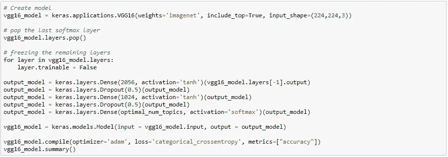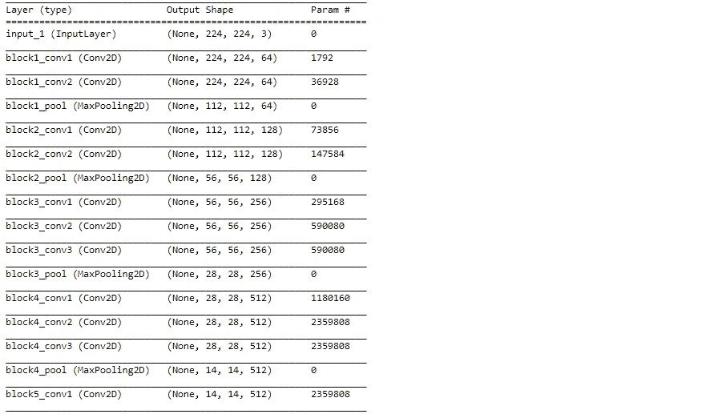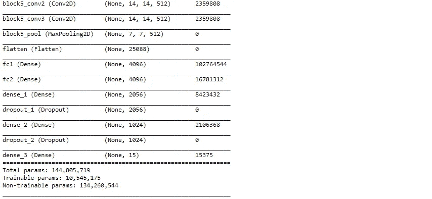

**图像预处理:**

我们可以使用下面的自定义生成器类来加载图像和主题，并将样本作为一个单独的批处理返回。我们使用 Keras 预处理模块的 *load_img* 函数加载目标尺寸为(224，224，3)的图像。然后使用 *img_to_array* 函数将加载的图像像素转换为 Numpy 数组格式。然后使用 Keras Vgg16 的 *preprocess_input* 函数，对图像进行处理和准备，将其加载到预先训练好的 VGGNet16 模型中。

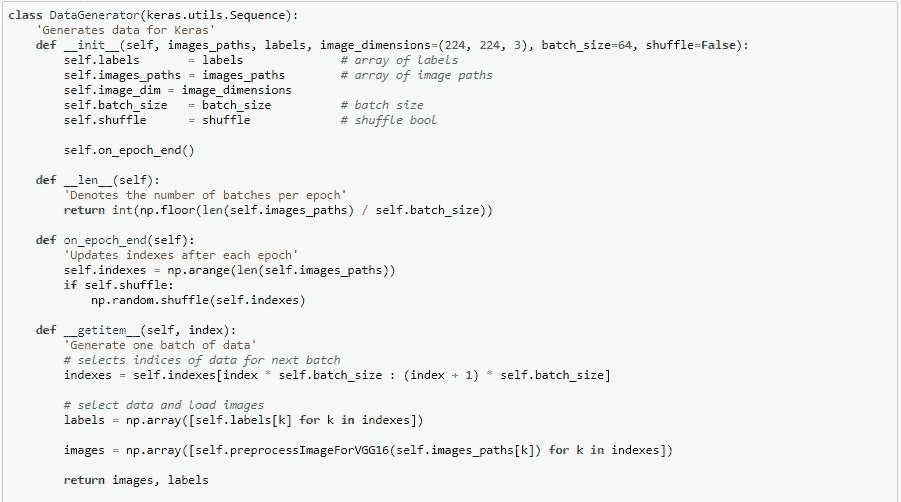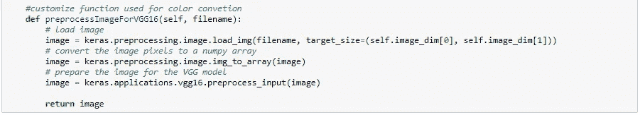

**模特培训:**

现在，让我们使用批大小为 50 的 20 个时期的训练和验证数据集来训练模型。最后，我们绘制了每个时期模型的损失和准确性的结果。

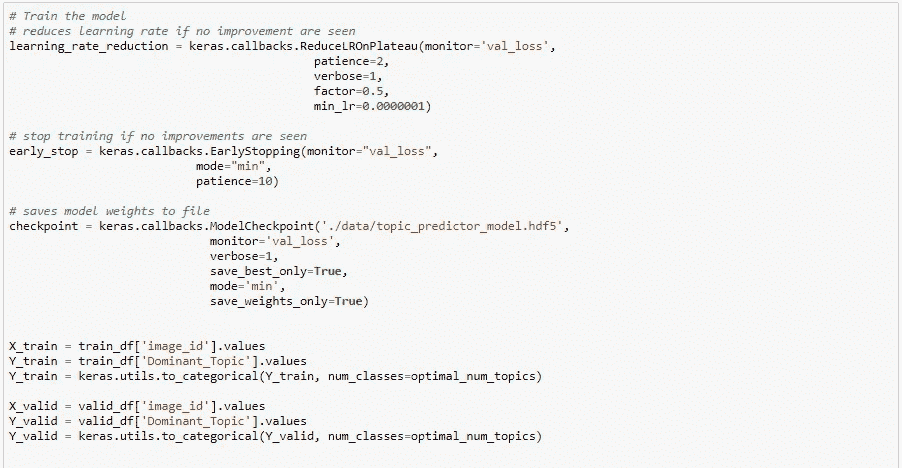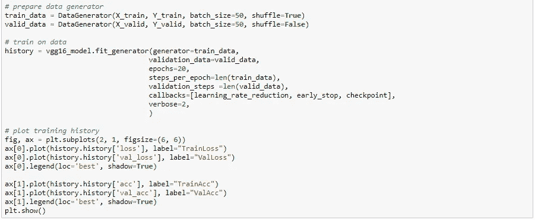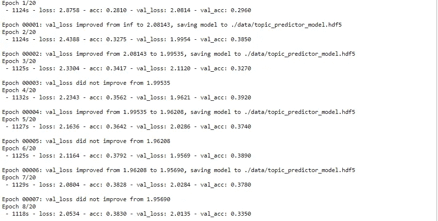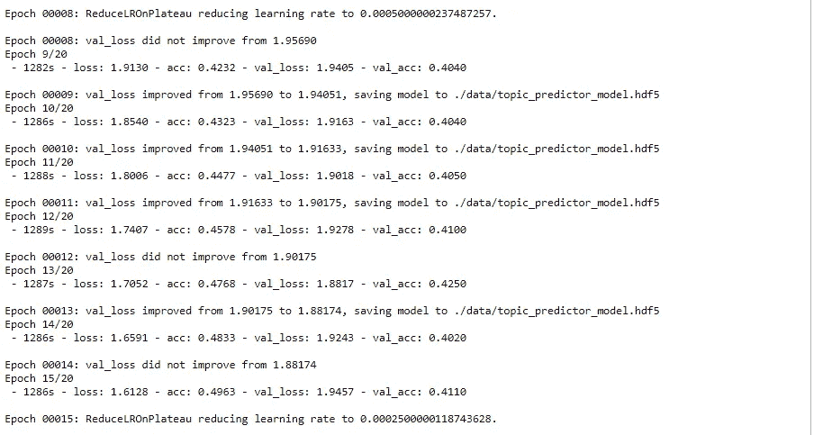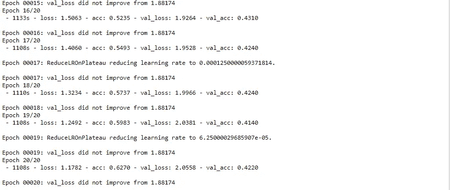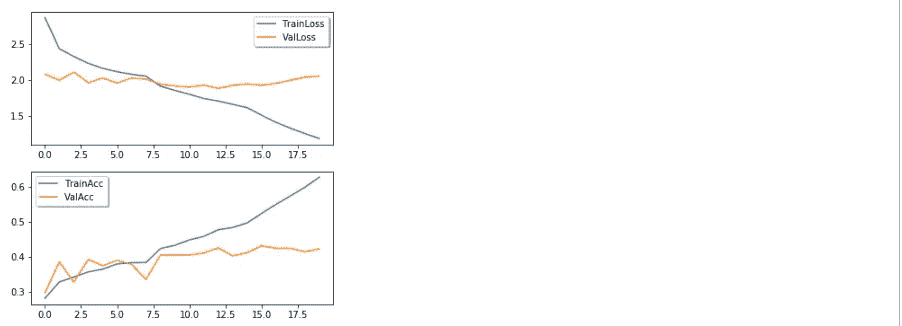

**检测测试图像数据集的主题:**

接下来，我们加载在上述步骤中训练的最佳 VGGNet16 模型的权重。然后将测试数据集加载到 VGGNet16 模型的 *predict_generator* 函数中，检测每张图片的主题概率。现在，我们考虑具有最高概率的主题，并产生具有检测到的图像 id 及其相应主题的结果数据帧。

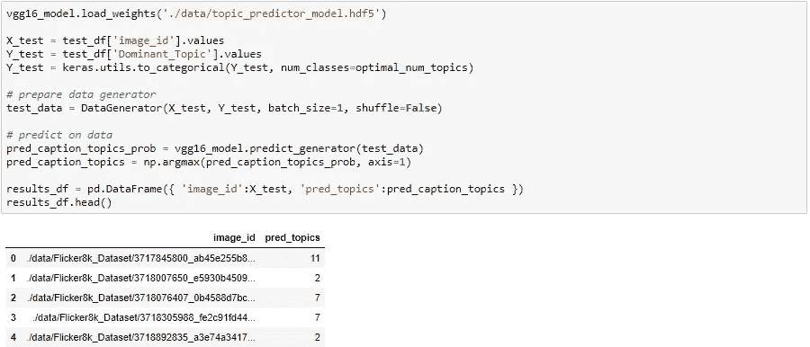

**模型评估:**

让我们通过将真实话题和预测话题加载到 Sklearn metrics 包的 *log_loss* (交叉熵损失) *accuracy_score* 和 *Confusion_matrix* 函数来评估模型。

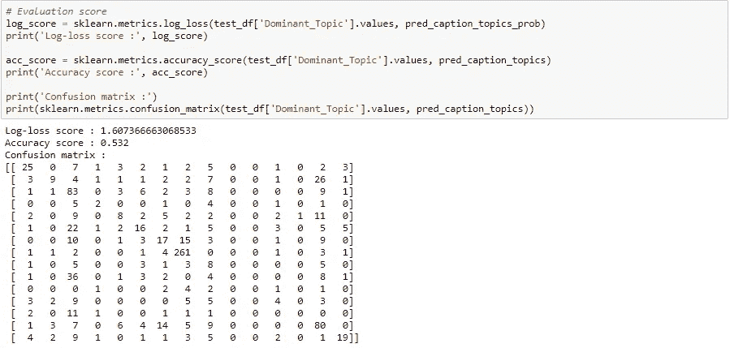

具有**低测井损失值**和**高精度分数**的模型将提供更好的预测结果。从上面的结果可以看出，我们达到了 **53.2%** 的准确率。

**未来范围:**

*   调整模型的超参数将有助于产生更好的结果。
*   可以用 **Flickr30k** 或 **MS-COCO** 数据集对模型进行训练，以获得更好的结果。
*   尝试其他话题检测算法，如 **LSA** 、 **NMF** 等。并比较结果。
*   使用预先训练好的模型，如 **VGGNet19** 、 **Google 的 Inception** 、**微软的 ResNet** 等。为了获得更好的准确性

**概要:**

在本文中，我们发现了图像的主题建模，以及如何使用图像标题数据集来构建主题检测模型。具体来说，我们使用 Gensim 的 LDA 构建了主题模型。然后，我们看到了如何使用一致性分数找到最佳的主题数量，并选择最佳的 LDA 模型。然后，我们定制预训练的 VGGNet16 模型，并训练该模型来检测给定图像的主题。最后，我们看到了如何使用 Sklearn 中的指标生成结果和评估模型性能。

这就把我们带到了本文的结尾。

如需完整代码，您可以从[这里](https://github.com/jsaikmr/Building-a-Topic-Modeling-for-Images-using-LDA-and-Transfer-Learning)下载 ipython 笔记本。

**参考文献:**

*   [https://www . machine learning plus . com/NLP/topic-modeling-gensim-python/](https://www.machinelearningplus.com/nlp/topic-modeling-gensim-python/)
*   [https://machine learning mastery . com/transfer-learning-for-deep-learning/](https://machinelearningmastery.com/transfer-learning-for-deep-learning/)
*   [https://machine learning mastery . com/prepare-photo-caption-dataset-training-deep-learning-model/](https://machinelearningmastery.com/prepare-photo-caption-dataset-training-deep-learning-model/)
*   [https://dzone . com/articles/LDA-用于文本摘要和主题检测](https://dzone.com/articles/lda-for-text-summarization-and-topic-detection)
*   [https://nlpforhackers.io/topic-modeling/](https://nlpforhackers.io/topic-modeling/)
*   [https://arxiv.org/pdf/1807.03514.pdf](https://arxiv.org/pdf/1807.03514.pdf)