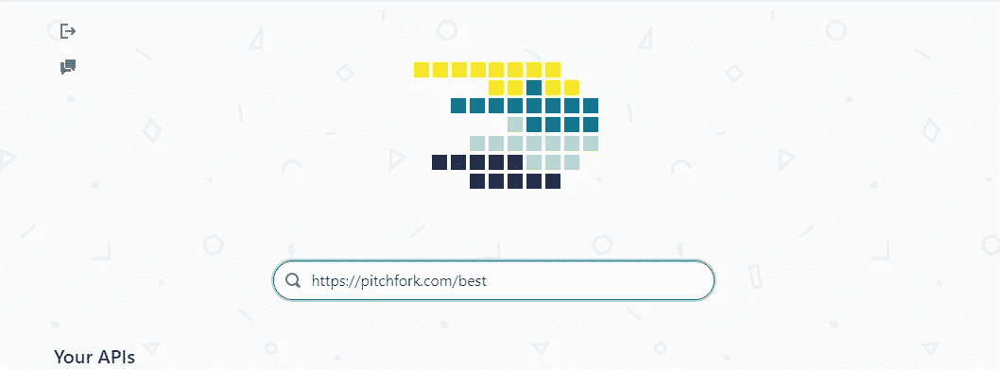
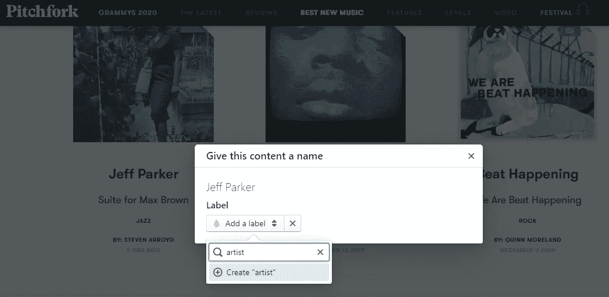
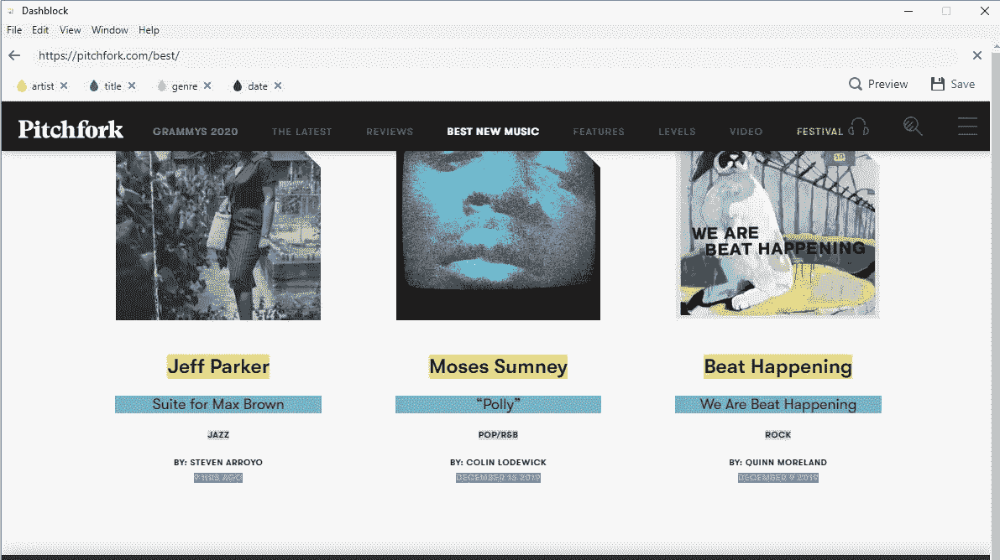
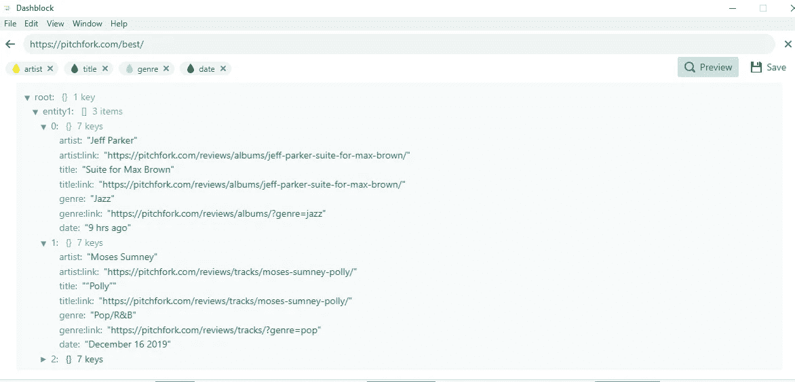
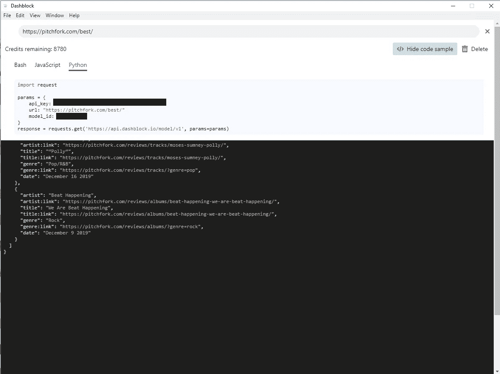

# 使用 DashBlock 和 Tweepy 构建一个包含任何数据的 Twitter 机器人

> 原文：<https://medium.com/analytics-vidhya/building-a-twitter-bot-with-any-data-using-dashblock-and-tweepy-fd2b9f7ff5fc?source=collection_archive---------13----------------------->


萨拉·库菲在 [Unsplash](https://unsplash.com?utm_source=medium&utm_medium=referral) 上拍摄的照片

有成千上万的推特机器人**，在这篇文章中，我们将专注于构建有用/有趣/有趣的机器人，而不是宣传机器/巨魔农场。**

> **Twitter bot 只是一个自动化的 Twitter 帐户，通常在预定义的时间或作为对特定外部触发的反应来发布推文。**

**例如，在本文中，您将学习如何构建一个机器人来跟踪并发布由 [Pitchfork、](http://pitchfork.com/best)发布的“最佳新音乐”，例如:**

**要做到这一点，首先要获得所需的信息——在这种情况下，要**搜索** Pitchfork 的网站(因为他们没有开放的 API)并检索最佳的新音乐。**

**[**dash block**](http://dashblock.com)**是最近推出的一款工具，它正好可以做到这一点。他们网站上的一行程序— *将任何网站转换成 API —* 很好地总结了*的全部内容。*****

> ****有了 Dashblock，你基本上可以点击网页的任何元素，并创建一个 API，一旦查询就会返回它的内容。****

****现在，让我们一步一步地为我们的 Pitchfork 示例介绍如何做到这一点。****

****(1)首先我们在 Dashblock 的软件中输入想要抓取的 URL。****

********

****仪表板的启动画面****

****(2)我们选择(右键单击)我们感兴趣的元素，并给它们分配一个标签。****

********

****从网站中选择和标记 UI 元素。****

****(3)我们可以为不同的元素创建多个标签。Dashblock 将尝试并自动标记相似的元素，但如果这不起作用，您仍然可以选择缺少的元素并添加所需的标签。最终，页面看起来会像这样，每种颜色对应一个不同的标签。****

********

****突出显示的 UI 元素是添加到 API 中的元素。****

****(4)要预览您选择并标记的数据的结构，您可以单击右上角的预览。这将向您展示一个类似于 *json* 的结构，由您选择的数据构建而成。****

********

****API 将返回的数据结构的预览。****

****(5)最后，如果一切正常，您可以按 save 并创建 API。这将显示下面的页面，其中提供了示例 curl/Javascript/Python 代码来查询新创建的 api，以及 API 键和模型 id。****

********

****新创建的 API 以及查询它的示例代码。****

# ****搞定了。****

****我们成功地检索了我们需要的所有数据，现在我们有一个 API 来跟踪 Pitchfork 的最佳新音乐公告。****

****本文的第二部分将指导您创建自己的 Twitter 机器人。为此，我们将使用 [Tweepy 库](http://tweepy.org)，这使得整个过程更加顺畅。****

****但是首先，你需要[申请并获得一个开发者账户](https://developer.twitter.com/en/apply-for-access)来使用 Twitter APIs。获得访问权限后，您将能够创建一个应用程序，并获得使用 Tweepy 进行身份验证所需的凭据:****

```
**auth = tweepy.OAuthHandler(consumer_key, consumer_secret)
auth.set_access_token(key, secret)**
```

****有关认证过程的更多细节，请访问 [Tweepy 文档](https://tweepy.readthedocs.io/en/latest/auth_tutorial.html)。****

****一旦通过身份验证，我们可以首先检查是否有新的公告要发布，如果有，就编写并发送推文。****

****我们可以通过使用您喜欢的任何方法(例如通过 Python 上的[请求](https://2.python-requests.org/en/master/))查询我们之前创建的 API 来轻松完成第一部分。****

****一旦我们从 API 中检索到 JSON 格式的数据，我们就可以通过调用:****

```
**api = tweepy.API(auth)
api.update_status(f"{t['title']} by {t['artist']} is {t['tag'].upper()} on [@Pitchfork](http://twitter.com/Pitchfork). {t['title:link']} #{t['artist'].replace(' ','')} #pitchfork #bestnewmusic")**
```

****这将从认证帐户发出一条类似于本文开头所示的 [tweet](https://twitter.com/BotPitchfork/status/1220685410390679552)****

# ****(差不多)就这样了！****

> ****你现在有了一个可以工作的 Twitter 机器人，你可以连接到任何你能想到的数据，只要它在:D 的互联网上****

****对于这篇文章中没有包括的所有细节，请随意浏览相应的存储库[这里，](https://github.com/rob-med/BotPitchfork)包括一个 Flask 应用程序，它在 [Heroku](http://heroku.com) 上运行 cron 作业，以完全自动化监控和推文过程。****

> ****快乐的推特！****

****如果这个指南激励你去创造一些很酷的❤，请在评论中告诉我****

******TL；DR:这篇文章向您展示了如何使用 Dashblock 通过 API 从任何网站检索数据，并创建一个 Tweepy 连接到这样的 API 的 Twitter bot。******

****有用的链接:****

*   ****Github 库(源代码):[https://github.com/rob-med/BotPitchfork](https://github.com/rob-med/BotPitchfork)****
*   ****微博直播机器人: [@isharenewmusi](https://twitter.com/isharenewmusic) c****
*   ****反馈？[在 Twitter 上找到我](https://twitter.com/rob_medico)****