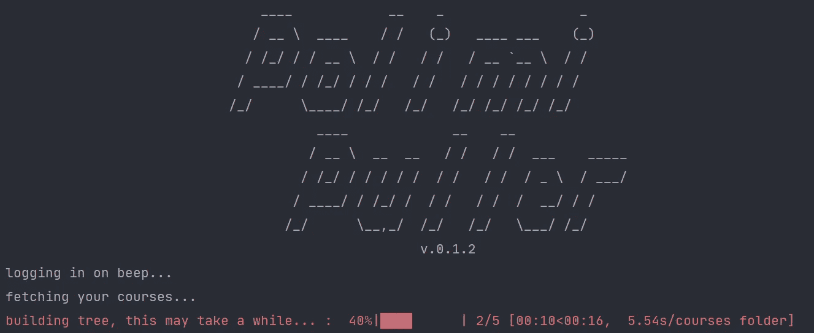

# 用 Selenium 和 BeautifulSoup4 构建 web 刮刀。

> 原文：<https://medium.com/analytics-vidhya/building-a-web-scraper-with-selenium-and-beautifulsoup4-part-1-2-7dfc22b26f2f?source=collection_archive---------12----------------------->

## 如何用 Python 自动化烦人的任务🤖

我最近开始对网络抓取感兴趣，我认为尝试和构建一些东西来学习一些有用的工具会很有趣。

我需要一个项目来启动，我想到了我在大学第一年遇到的一个问题:课程资料下载。