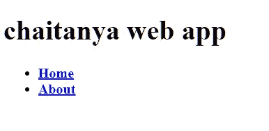

# 用 python Flask 构建网站

> 原文：<https://medium.com/analytics-vidhya/building-a-website-with-python-flask-196e8982f386?source=collection_archive---------13----------------------->

Python 很简洁，所以只需要几行代码就可以构建网站页面。让我们开始吧。

马库斯·斯皮斯克在 [Unsplash](https://unsplash.com?utm_source=medium&utm_medium=referral) 上的照片

____________________ 您的第一个烧瓶网站 _____________________

在一个空文本文件中插入以下几行 python 代码，并将该文件命名为类似于 **webapp.py**

> from Flask import Flask
> app = Flask(_ _ name _ _)
> @ app . route('/')
> def home():
> 返回“hey there！”
> 
> if _ _ name _ _ = = " _ _ main _ _ ":
> app . run(debug = True)

**根据上面代码中的 python 保留缩进。**

如你所见，我们在第一行导入了 flask 库，如果你没有安装这个库，你会得到一个错误。为了避免这个错误，首先简单地把这个库放入 cmd->**pip install flask。**

一旦你确定安装了 flask，只需运行脚本。一旦运行了这个脚本，网站现在应该已经在本地机器上启动并运行了，可以通过在浏览器中访问 localhost:5000 来查看它。

让我们继续前进！

_ _ _ _ _ _ _ _ _ _ _ _ 使用 PYTHON 制作网站的工作原理 _ _ _ _ _ _ _ _ _ _ _ _

在制作更有吸引力的东西而不仅仅是纯文本的网页之前，让我们首先确保你理解如何用 Python 来生成网站。

想象一下用户在他们的浏览器中输入你的网址。

当用户在浏览器中输入 URL 时，他们是在向 web 服务器发出请求。

作为开发人员，您必须编写一些 Python 代码来处理请求和 CGI，CGI 是 Python 和其他 web 开发编程语言用来动态创建网页的标准环境。而且你必须为你构建的每一个网络应用一遍又一遍地编写相同的代码。

现在，因为这是一个重复的任务，有人把所有的代码放在一起，创建了一堆 Python 文件。这一堆文件被称为*烧瓶*。因此， *flask* 是一个框架，当载入 Python 时，它会自动执行例行代码，让您专注于网站的特定部分。当我们在命令行中键入 *pip install flask* 时，我们正在从其在线存储库中下载 flask 框架，当我们*导入 flask* 时，我们正在我们当前的脚本中使用该框架，我们可以在那里轻松地使用它的特性。

_____________________ _ _ _ _ FLASK APP 如何工作 _ _ _ _ _ _ _ _ _ _ _ _ _ _ _ _ _ _ _ _ _

这里展示了 flask web 应用程序的工作原理。到目前为止，我们拥有的代码是构建一个简单网站的典型 flask 脚本。所以，我们将逐行解释这段代码的作用。

> 从 flask 导入 Flask
> app = Flask(_ _ name _ _)
> @ app . route('/')
> def home():
> 返回“嘿，你好！”
> 
> if _ _ name _ _ = = ' _ _ main _ _ ':
> app . run(debug = True)

在第 1 行中，flask 是这里的框架，而 Flask 是 python 类的数据类型。换句话说，Flask 是用来创建 web 应用程序或 web 应用程序实例的原型，如果你想说得简单一点的话。

因此，一旦我们导入 Flask，我们需要为我们的 web 应用程序创建 Flask 类的一个实例。这由第 3 行完成。__name__ 是一个特殊的变量，当您执行脚本时，它获取字符串“__main__”的值。我们一会儿将回到这个问题。

在**第 5–7 行**中，我们定义了一个返回字符串“嘿，你好！”。该函数被映射到 home `‘/’` URL。这意味着当用户导航到`localhost:5000`时，*主页*功能将运行，并在网页上返回其输出。如果 route 方法的输入是别的东西，比如说`‘/about/’`，当用户访问`localhost:5000/about/`时，函数输出就会显示出来。这有多实际？在**第 5–7 行**中，我们定义了一个返回字符串“嘿，你好！”。该函数被映射到主页`‘/’`的 URL。这意味着当用户导航到`localhost:5000`时，将运行 *home* 功能，并在网页上返回其输出。如果 route 方法的输入是别的东西，比如说`‘/about/’`，那么当用户访问`localhost:5000/about/`时，函数输出就会显示出来。这有多实际？

然后我们就有了神秘的**9 号线和 10 号线**。您应该知道的是，Python 在执行脚本时会给脚本分配名称`"__main__"`。如果该脚本是从另一个脚本导入的，该脚本将保留其给定的名称(例如 hello.py)。在我们的例子中，我们正在执行脚本。因此，`__name__`将等于`"__main__"`。这意味着 if 条件语句得到满足，将执行 *app.run()* 方法。这种技术允许程序员控制脚本的行为。

还要注意，我们将`debug` 参数设置为`true`。这将在网页上打印出可能的 Python 错误，帮助我们跟踪错误。然而，在生产环境中，您可能希望将它设置为`False` 以避免任何安全问题。

到目前为止，一切顺利！

我们有一个正在运行的网站，其中有些内容是由 python 函数返回的。可以想象，从一个函数中返回普通的字符串并不能让我们走得更远。

如果你想做一些更严肃、更有视觉吸引力的东西，你可能想在你的 python 文件中加入 HTML 文件，让你的 python 代码返回 HTML 页面，而不是普通的字符串。

___________________ 烧瓶中的 HTML 模板 _____________________

使用 flask render_template 方法通过 python 脚本返回 HTML 页面。如你所见，我们不再有纯文本，而是各种格式的文本。这是通过返回 HTML 模板而不是普通的 python 字符串实现的。

创建一个空文件，将其命名为类似 home.html 的名字，并将 HTML 代码放入其中。

> < html >
> <正文>
> < h1 >我的个人网站< /h1 >
> < P >嗨，这是我的个人网站。

> </正文>
> < /html >

众所周知，html 是一种用于呈现网页的标记语言。

flask 框架的编写方式使得它可以在名为 templates 的文件夹中查找 HTML 模板文件。所以，你应该创建这样一个空文件夹，然后把所有的 HTML 模板放在那里。以下是 web 应用程序目录树此时的样子:

python 脚本位于模板文件夹之外。

编辑 python 代码，使其读取 HTML 模板并将其返回到网页。

> **从 flask 导入 Flask，render _ template**
> app = Flask(_ _ name _ _)
> @ app . route('/')
> def home():
> **返回 render _ template(' home . html ')**
> 
> if _ _ name _ _ = = ' _ _ main _ _ ':
> app . run(debug = True)

粗体行是已经更新的行。我们所做的是从 flask 框架中导入 render_template 方法，然后向该方法传递一个 HTML 文件。该方法将从 HTML 中生成一个 jinja2 模板对象，并在用户访问相关 URL 时将其返回给浏览器。

所以，现在转到 localhost:5000 应该会显示本课开始时截图中显示的网页。

_______________ _ _ _ 向网站添加更多页面 _ _ _ _ _ _ _ _ _ _ _ _ _ _ _

我们如何为您的 flask 网站添加更多页面。让我们添加一个关于页面。

为此，您需要在模板文件夹中创建一个 about.html 文件。HTML 代码如下所示:

> **<html>
> <body>
> <h1>**关于我**</h1>
> 
**这是一个关于任何可以放入作品集的作品集网站。**

> </body>
> </html>**

其次，您需要通过向 webapp.py python 脚本添加第二个函数来用 python 呈现 HTML。

> **从 flask 导入 Flask，render _ template**
> app = Flask(_ _ name _ _)
> @ app . route('/')
> def home():
> **返回 render _ template(' home . html ')**
> 
> @ app . route('/about/')
> def about():
> return render _ template(' about . html ')
> 
> if _ _ name _ _ = = ' _ _ main _ _ ':
> app . run(debug = True)

运行 python 脚本并转到 localhost:5000/about，您将看到新页面。就是这样！你可以添加更多的页面，在你的脚本中添加更多的 python 函数。

在我们结束本课之前，我们可以改进的最后一件事是将标题和段落标记放在 dic 标记中。这将在 HTML 文档的 sane 部分中保持分组，以便我们稍后可以对该部分应用 CSS 样式。这是更新后的 about.html 的样子:

> **<html>
> <body>
> <div**class**=**“关于” **>
> < h1 >** 关于我**</h1>
> 
**这是一个关于任何可以放入作品集的作品集网站。**

> 

> </body>
> </html>**

请对 home.html 文档也这样做。

> **<html>
> <body>
> <div**class**=**" home】**>
> <h1>**关于我**</h1>
> 
**这个网站是通过 Flask 框架用 Python 构建的**

> 

> </body>
> </html>**

当打开两个 URL 时，运行 python 脚本应该会输出与之前相同的结果。

_ _ _ _ _ _ _ _ _ _ _ _ _ _ 向网站添加导航菜单 _ _ _ _ _ _ _ _ _ _ _ _ _ _ _ _

此时，我们有两个 HTML 页面和一个 python 脚本，该脚本将这些 HTML 页面呈现到两个不同的 URL——home 和 about URL。

现在我们需要添加一个菜单，这样用户只需点击链接就可以轻松浏览网页。

如果你仔细看，你会发现上面的网页占据了相同的区域，包括标题和导航菜单..

为了在每个页面中创建这个区域，我们可以在每个 HTML 文件中添加生成这个标题的 HTML 代码。然而，更明智的做法是创建一个父 HTML 模板，我们的两个子模板可以从该模板继承代码。然后我们可以简单地从每个 HTML 页面链接到父布局来继承它的代码。

我们需要创建一个新的 HTML 页面，并将其命名为类似于**layout.html**

> **<html>
> <正文>
> <页眉>
> < div** 类 **=** 【容器】**>
> 
> h1**类**=**【logo】**柴坦尼亚 web app **< /h1 >
> }}" **>** 首页**</a></李>
> <a**href**=**" { { URL _ for(' About ')} "**>**关于**</a></李>******

**如果你现在认为你必须在我们的 python 函数中渲染 layout.html 页面，那你就错了。**

**我们保持 python 代码不变，并修改了 home.html、about.html 和 layout.html 文件。这个想法是将 about.html 和 home.html 与 layout.html 连接起来。这可以通过在这些文件中添加几行代码来完成，如下所示。**

**layout.html**

> ****<html>
> <正文>
> <页眉>
> < div** 类 **=** 【容器】 **>
> < h1** 类**=**【logo】**>**Ardit 的 web app **}}" **>** 首页**</a></李>
> <李>a**href**=**" { { URL _ for(' About ')} "**>**关于**</a>T172******

**从上面频繁添加的代码中可以看出，我们在 layout.html 文件中添加了新的 div 部分。根据用户正在浏览的 URL，带有花括号的两行将根据需要被替换为 home.html 或 about.html 代码。为了实现这一点，您还需要编辑这两个页面，以便它们可以连接到 layout.html 页面。下面是更新后的 home.html 代码:**

> **{ % extends " layout . html " % }
> { % block content % }
> **<div**class**=**" home "**>
> <h1>**一款 Python 产品**</h1>
> 
**这个网站是通过 Flask 框架用 Python 搭建的。**

> 
** { % endblock % }**

**about.html 也是如此**

> **{ % extends " layout . html " % }
> { % block content % }
> **<div**class**=**“关于” **>
> < h1 >** 关于我**</h1>
> 
**这是一个关于任何可以放入作品集的作品集网站。**

> 
** { % end block % }**

**您的网站现在应该看起来像下面的截图，您应该能够通过点击相应的菜单项来加载网页:**

**__________ _ _ _ _ _ _ _ _ 向您的网站添加 CSS 样式 _ _ _ _ _ _ _ _ _ _**

**到目前为止，我们的网站由 python 脚本和三个 HTML 文档组成。Python 脚本处理 web 服务器和 web 客户端(即浏览器)之间的通信，而 HTML 文档负责页面内容的结构。**

**现在我们需要使用 CSS 向 HTML 结构添加一些样式格式。这是通过创建一个 CSS 文件并将其连接到我们的 HTML 文件来完成的。CSS 是一种风格化的语言，同样 HTML 也很容易学习。**

**请记住，HTML 模板文件 HTML 放在 templates 文件夹中。CSS 样式表被认为是静态文件。与他们的代码没有交互，就像 HTML 模板一样。因此，flask 保留了一个单独的文件夹，您应该在其中放置静态文件，如 CSS、Javascript、图像或其他文件。该文件夹应该由您创建，并命名为 static。在 static 中创建另一个文件夹并将其命名为 css 也是一个不错的做法。**

**现在，在 css 中创建一个空文件，并将其命名为 main.css。**

> ****正文** {
> 边距:0；
> 填充:0；
> font-family:“Helvetica 新”，Helvetica，Arial，无衬线；
> 颜色:# 444；
> }
> /*
> *格式化标题区域
> */**
> 
> ****页眉** {
> 背景色:# DFB887
> 身高:35px
> 宽度:100%；
> 不透明度:. 9；
> 边距-底部:10px
> }
> **表头 h1.logo** {
> 边距:0；
> 字号:1.7em
> 颜色:# fff**
> 
> **文本转换:大写；
> 浮动:左；
> }
> **表头 h1 . logo:hover**{
> color:# fff；
> text-decoration:无；**
> 
> **}**
> 
> **/***
> 
> ***将正文内容居中**
> 
> ***/
> **。集装箱** {
> 宽度:1200px
> 边距:0 自动；
> }
> div . home{
> padding:10px 0 30px 0；
> 背景色:# E6E6FA
> -WebKit-border-radius:6px；
> -moz-border-radius:6px；
> 边框-半径:6px
> }
> div . about{
> padding:10px 0 30px 0；
> 背景色:# E6E6FA
> -WebKit-border-radius:6px；
> -moz-border-radius:6px；
> 边框-半径:6px
> }
> **H2**{
> font-size:3em；
> 边距-顶部:40px
> 文本对齐:居中；
> 字母间距:-2px；
> }
> H3{
> font-size:1.7 em；
> 字体粗细:100；
> margin-top:30px；
> 文本对齐:居中；
> 字母间距:-1px；
> 颜色:# 999；
> }
> **。菜单** {
> 浮动:右；
> margin-top:8px；
> }
> **。菜单李** {
> 显示:内嵌；
> }
> **。菜单 li + li** {
> 左边距:35px
> }
> **。菜单阿利**{
> color:# 444；
> text-decoration:无；
> }**

**我假设 CSS 文件是不言自明的。代码主要做的是引用 HTML 标签和 div 类名，并对这些 HTML 元素应用字体、颜色、文本大小、填充、边距和背景色。**

**好的，我们有一个 CSS 文件，但是我们的 HTML 文档仍然不知道如何链接到它。想法是我们应该将每个页面链接到 CSS，但是因为我们的`layout.html`代码在每个页面，我们可以插入链接代码。因此，打开您的`layout.html`页面并添加一个 *head* 部分，使代码看起来像这样:**

> ****<html>
> <head>
> <title>**Flask app**</title>
> <link**rel**=**“样式表”href**=**“{ { URL _ for(' static '， 文件名**=**' CSS/main . CSS ')} } "**>
> </head>
> <body>
> <header>
> <div**class**=**" container "**>
> <h1**class**=**" logo " **} } ">**首页**</a></李>
> <a**href**=**" { { URL _ for(' About ')} "**>**关于**</a></李>****

**如你所见，我们在*头*标签内添加了一个*标题*和*链接*标签。在 link 标签中，我们声明我们与一个*样式表*文档相关，然后我们指定了该样式表的路径。**

**现在导航到`localhost:5000`应该会显示你在上面截图中看到的网站。**

**现在你可以添加更多的内容，如果你想在你的网页中添加更多的部分，你可以通过添加更多的 div 来调整 HTML 文件。**

**但是，如果一个网站生长在你的本地主机上，它有什么用呢？**

**如果没人看到，完全没用。**

**不过不用担心，我们会通过在 Heroku cloud 中部署网站来立即解决这个问题，这样任何人都可以通过公共 URL 访问它。**