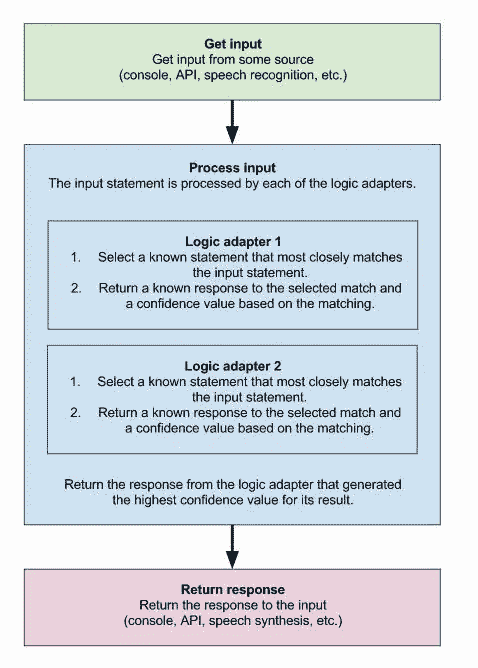
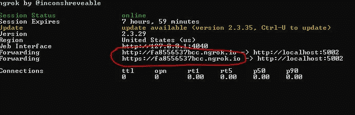
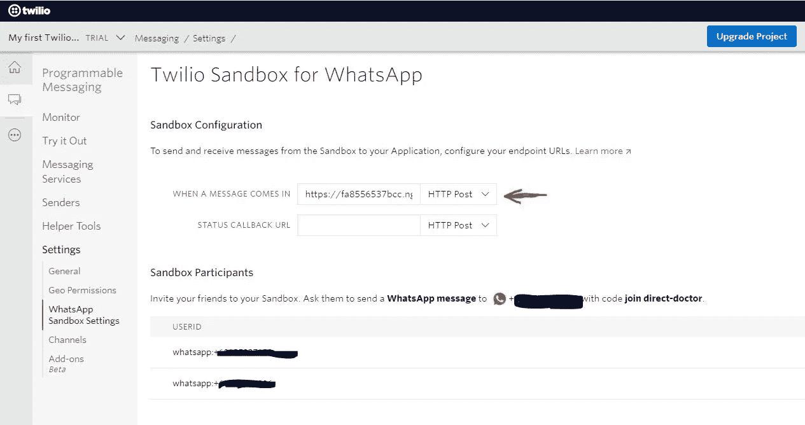
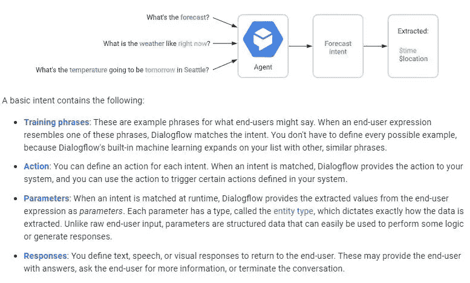

# 用 Python chatter bot+Flask+Ngrok+Twilio 构建 Whatsapp 聊天机器人

> 原文：<https://medium.com/analytics-vidhya/building-a-whatsapp-chatbot-with-python-chatterbot-flask-ngrok-twilio-877e29e7511f?source=collection_archive---------2----------------------->

图片来源:shutterstock.com 409765726

在下面的录音中，我在我的 Google Dialogflow 聊天机器人和我创建的另一个新机器人之间建立了一个对话。超现实的欢乐接踵而至…

# 走一遍…

# 说话机器人计算机程序

## 聊天机器人

我在互联网上做了一些快速浏览，有很多基于神经网络的技术来创建聊天机器人。

然而，我想从小处着手，因为我的目标是学习如何创建一个“简单”的机器人，可以快速部署到 Whatsapp 的外部，所以我不想浪费超参数设置和等待时间来训练神经网络模型。

 [## 冈瑟考克斯/聊天机器人

### ChatterBot 是一个基于机器学习的对话引擎，用 Python 编写，可以生成…

github.com](https://github.com/gunthercox/ChatterBot) 

进入聊天机器人。这是一个 Python 库，一旦你向它提供查询-响应训练数据，“*通过搜索与输入最匹配的已知语句来选择最匹配的响应，然后根据机器人与*通信的人发出每个响应的频率，返回最可能的响应

【https://chatterbot.readthedocs.io/en/stable/index.html 

而不是使用一些[提供的预设训练语料库](https://github.com/gunthercox/chatterbot-corpus/tree/master/chatterbot_corpus/data)(语料库？corpii？)，我用自己的历史 whatsapp 聊天记录做了实验。

然而，回想起来，我的训练数据质量并不是很好，因为许多对话都是长时间的交流，非常具体，所以机器人经常会回一些无意义的跑题回复。(如果你还没有看视频，你会明白我的意思)。我告诉自己，因为另一种选择是我天生语无伦次(我希望> _

## **烧瓶**

然后，我使用 POST 方法(*和一些额外的行，以允许它处理从 Twilio 到&的信息，我将在下面进一步解释*)将这个机器人包装在一个简单的 Flask webapp 中。Flask 是一个简单的微型 web 框架，允许你使用 Python 创建 web 应用程序。

 [## 欢迎使用 Flask - Flask 文档(1.1.x)

### 欢迎阅读 Flask 的文档。开始安装，然后了解快速入门概述。有…

flask.palletsprojects.com](https://flask.palletsprojects.com/en/1.1.x/) 

基本上，如果您查看下面 github 链接中的 python 文件，您会看到我刚刚设置了一个函数，它通过 POST 方法监听传入的消息，并从经过训练的 Chatterbot 对象返回一个回复

## **Ngrok**

之后，我使用 Ngrok 将 web 应用程序在我的本地 PC 上运行的适当端口暴露给互联网

 [## ngrok -保护到本地主机的内部隧道

### 到本地主机 webhook 开发工具和调试工具的 ngrok 安全自省隧道

ngrok.com](https://ngrok.com/) 

TLDR，Ngrok 创建一个连接你的网络应用和外部网络的 url。

## **Twilio**

Twilio 是一项服务，允许你以编程方式(即通过代码)设置你的应用程序如何与普通电话线、短信甚至 Whatsapp 等通信渠道合作。

https://www.twilio.com

一旦你在 Twilio 中建立了一个可编程的信息项目，它就会注册一个号码，你可以在 Whatsapp 中与之交换信息。然后使用 Ngrok 中的 URL 连接到 Twilio Whatsapp 控制台，并将其键入如下所示的配置页面。

之后，一旦你使用初始化代码向 Whatsapp 帐户注册了你的手机号码，无论何时你向 Whatsapp 帐户发送任何进一步的消息，Twilio 都会将该消息传递给 Python Flask WebApp，并接收和显示任何返回的响应。

我把代码贴在了下面的 Github 上:

 [## 志津古/兹查特博特

### 这是一个使用聊天机器人库的简单聊天机器人。GitHub 是超过 5000 万开发者的家园，他们一起工作…

github.com](https://github.com/ZhijingEu/ZChatterbot) 

注意:

1.  你需要注册自己的 Twilio 账户(他们有免费试用版)
2.  鉴于这是我的一堆 whatsapp 聊天记录，我故意省略了我使用的训练数据，所以 github 只有一个名为“data.txt”的虚拟文件，你必须自己填写。
3.  这种方法对于一个“有趣”的演示来说很好，因为我使用了 Flask 的内置开发服务器，根据[文档本身](https://flask.palletsprojects.com/en/1.1.x/tutorial/deploy/#:~:text=When%20running%20publicly%20rather%20than,efficient%2C%20stable%2C%20or%20secure.)的说法，这些服务器并没有被设计成特别高效、稳定或安全的 。然而，如果你真的想为产品开发一个机器人，你可能需要探索一个“合适的”Python HTTP 服务器，比如 Gnuicorn

# 对话流

那些在 LinkedIn 上关注我的人可能已经看到了我通过谷歌的 Dialogflow 服务首次涉足聊天机器人。

 [## 对话流|谷歌云

### 发送反馈创建跨设备和平台的对话体验。查看该产品的文档…

cloud.google.com](https://cloud.google.com/dialogflow) 

Dialogflow 是一个托管服务，提供了一个自然语言理解模块，您可以在其中指定“意图”,帮助机器人识别正在讨论的主题。

根据你输入给 Dialogflow 的“训练短语”，它会根据你提供给它的预设回复给出回复。Dialogflow 甚至允许采取行动(例如创建购买请求或预约)

[https://cloud.google.com/dialogflow/docs/basics](https://cloud.google.com/dialogflow/docs/basics)

毫无疑问，Dialogflow 的强大之处在于，它使用自然语言理解来正确解析传入的消息，以识别含义模糊的单词的正确上下文，并处理不同的时态或句子语法。

此外，由于它是一项托管服务，谷歌已经准备了一系列现成的集成，所以你甚至可以与机器人交谈。我构建了与视频中相同的 Web 演示页面

我没有在视频中介绍它，但 Dialogflow 有许多其他功能，如[自动链接到数据库以创建医生预约、食品订单，仅根据用户的聊天输入设置交付日期](https://cloud.google.com/dialogflow/docs/quick/fulfillment)。

# 最后

希望你也玩得开心，并且可以看到，只需一点点工作，几乎任何人都可以设置自己的聊天机器人来做各种各样的事情，特别是使用 Dialogflow 这样的服务，这非常容易。

PS:我[已经在 Linkedin 上发布了这个例子，作为‘游戏化’的一个很好的例子](https://www.linkedin.com/feed/update/urn:li:activity:6692385229543489536/)，但它值得重复:我强烈推荐你去看看 Twilio 的互动训练游戏 TwilioQuest。这真的是值得一看的，因为他们制作了一个基于 16 位复古 1980 年代冒险游戏的教程游戏。

 [## TwilioQuest -发现您用代码改变世界的力量。

### 什么是 TwilioQuest？TwilioQuest 是一款教育视频游戏，旨在教导新一代开发人员如何…

www.twilio.com](https://www.twilio.com/quest)