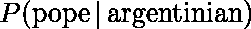
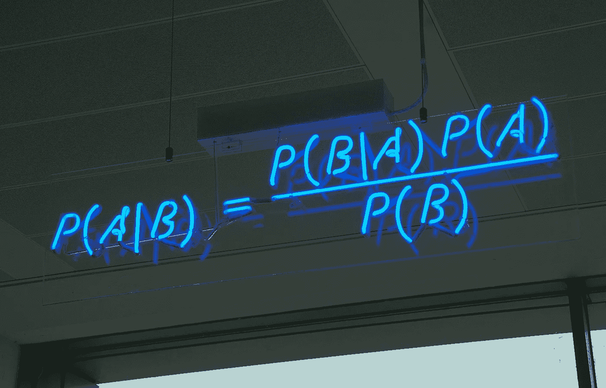
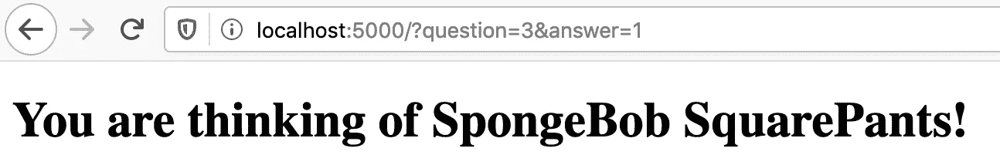

# 利用贝叶斯定理用 Python 构建导航器

> 原文：<https://medium.com/analytics-vidhya/building-akinator-with-python-using-bayes-theorem-216253c98daa?source=collection_archive---------1----------------------->

最近我开始研究概率规划，它的基础是贝叶斯定理。人们总是告诉你，你需要有一个“贝叶斯思维”的心态来掌握概率编程，其中的一部分是学习在新的证据下更新你的信念。

这让我想起了这个游戏 [Akinator](https://akinator.com) ，在这个游戏中，你想一个角色，任何一个角色，它都会问你问题，以精确地找出你在想什么。当 Akinator 出现的时候，互联网还很年轻，那时候它就像魔术一样神奇！现在我意识到它完全符合贝叶斯理论:它对你可能想到的角色有一些信念，然后它不断问你问题，以收集更多证据来证明它可能是哪个角色。

在本教程中，我们将使用 Python 实现一个简单版本的 Akinator。

让我们从一个简单的 flask web 服务器和一个用于提问的基本 HTML 开始:

server.py

模板/索引. html

现在，如果您使用`python server.py`启动 web 服务器，您将会看到:

那么这将如何工作呢？首先让我们记住一些理论，想象我在想教皇，教皇是阿根廷人的可能性有多大？

这是这个符号的意思:假设(用|)我有教皇，我得到一个阿根廷人*的*概率*(用 P 表示)是多少？百分之百，因为只有一个教皇，而且他是阿根廷人。这被称为*向前概率*。*

但我们更感兴趣的是反过来的问题:

如果我知道某人是阿根廷人，那么他成为教皇的可能性有多大？你可以看到这是一个完全不同的问题，而且更难，在这种情况下，它是 4500 万分之一，因为这是阿根廷的人口，只有一个教皇出来。这被称为*逆概率*，这正是我们想要 Akinator 做的。

在 18 世纪，托马斯·贝叶斯牧师给了我们一种计算逆概率的方法。如果你还不知道它，你可以稍后检查它背后的故事，现在只要相信数学。这是公式，在酷氖:

在我们的例子中，A 是一个**字符**作者试图猜测，B 是你给他的问题的**答案**。所以用英语来说就是:给定**答案** ( *逆概率*，你在思考这个**人物**的概率等于给定你在思考那个**人物** ( *可能性*)时你给出这个**答案的概率，乘以选择那个**人物** ( *先于*)的独立概率，除以选择的独立概率**

唯一的事情是，对于我们的问题，我们必须扩展这个公式一点，因为 Akinator 不仅有一个证据要考虑，而是几个证据，通过向玩家提问获得。

例如，如果我想到荷马·辛普森，我已经告诉过你我的角色是黄色的男性:

关于为什么这个公式会以多种证据的方式扩展的更多细节，我推荐你看看这篇论文，它解释得很好:[http://cs.wellesley.edu/~anderson/writing/naive-bayes.pdf](http://cs.wellesley.edu/~anderson/writing/naive-bayes.pdf)

就这样，这绝对是我们需要的所有理论，让我们来看代码！

首先，为了简单起见，我不使用数据库，只使用那些数据结构:

我添加了 4 个问题和 3 个角色:荷马·辛普森，海绵宝宝，除了最后一个问题外，它真的很像荷马，珊迪·奇克斯，它与海绵宝宝完全相反。选择这些的想法是为了测试我们的命名者在有明显差异和非常小的差异时的表现。

问题字典上的每个键都是它的 id，然后在字符列表上我们有一个这些问题的答案图。请注意，桑迪遗漏了一个答案，这没什么，因为 Akinator 不会一直为所有角色提供答案，尤其是新角色。

现在让我们替换我们的`index`函数来添加我们游戏的主要逻辑:

希望代码应该简单易懂。我们创建两个变量来保存目前游戏的状态:`questions_so_far`和`answers_so_far`，然后我们检查用户是否提交了 HTML 表单，并将他们的问题和答案添加到这些变量中。`question`参数是用户正在回答的问题 id，而`answer`参数是一个介于 0 和 1 之间的浮点数，表示用户对答案为“是”的信心。

接下来，我们使用游戏的当前状态来计算所有角色的概率，这是我们接下来将看到的贝叶斯计算(我还添加了一个`print`语句来跟踪每个答案后的变化)。然后我们检查是否还有问题，如果有，我们随机选择下一个问题问用户，如果没有，我们得到最大概率的角色并完成游戏，让玩家惊讶“Akinator 怎么能读取我的想法？”

我们的`calculate_probabilities`函数基本上只是一个为每个字符计算概率的循环:

`calculate_character_probability`功能是 Akinator 的大脑真正生活的地方:

对于前面的`P_character`，我们简单地用 1 除以字符数。也就是说，在完全不知道任何事情或者没有问你任何问题的情况下，你想到海绵宝宝的概率是 33%。

然后计算`P_answers_given_character`和`P_answers_given_not_character`就比较复杂了。如果你回头看看上面的公式，你会发现我们需要乘以每个 *P(答案|字符)*，所以我们从 1 开始，循环每对问题和答案。

假设我回答了问题“你的角色是黄色的吗？”我在检查全垒打的概率，所以 *P(yellow = 1|homer)* 。为了计算，我们使用辅助函数`character_answer`来看看荷马是黄色的概率是多少，是 1，如果我们没有关于它的信息，我们将使用 0.5，作为每个人的默认答案。

现在，如果玩家对这个问题也回答了 1，那就是匹配，我们为 *P(黄色= 1 |荷马)*返回 1，如果用户回答了 0，那么我们需要为 *P(黄色= 0 |荷马)*返回 0。这就是小公式*1-ABS(answer-character _ answer)*为我们做的事情。最后，我们使用`max`来避免乘法中出现 0，因为 0 会使所有的概率无效，并且即使用户选择了一个错误的答案，也不会给字符选择概率的机会。

接下来对于`P_answer_not_character`我们做的基本相同，但是对于所有其他字符，取一个平均值。

最后，我们可以将变量相乘，根据公式得到`P_answers`和`P_character_given_answers`。

如果我们[计算正确的话](https://www.xkcd.com/2059/)我们的游戏应该会成功，而且 Akinator 会正确的预测我在想海绵宝宝

就是这样，我们可以用不到 100 行代码实现 Akinator！

# 下一步是什么？

你可能已经注意到游戏中仍然缺少一些东西，我建议你试着把它们作为练习来实现:

*   如果提问者真的对答案有把握，尽早停止提问
*   如果命名者弄错了，允许用户添加新字符，并保存他们的答案
*   如果命名者答对了，强化人物的答案
*   允许用户添加新问题
*   使用数据库而不是内存来无限增加新的字符和问题
*   不要随意选择问题，选择那些可以解开最大猜测的问题

另外，如果你对贝叶斯统计和概率编程感兴趣，这里有一些有趣的内容:

*   Blogpost: [概率概念讲解:参数估计的贝叶斯推断。](https://towardsdatascience.com/probability-concepts-explained-bayesian-inference-for-parameter-estimation-90e8930e5348)
*   书:[用 Python 和 PyMC3 进行贝叶斯分析](https://www.amazon.com/dp/B07HHBCR9G)
*   播客:[学习贝叶斯统计](https://learnbayesstats.anvil.app/)

感谢您阅读
在 twitter 上关注我 [@_rchaves_](https://twitter.com/_rchaves_)