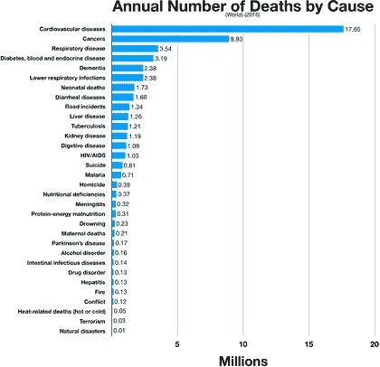
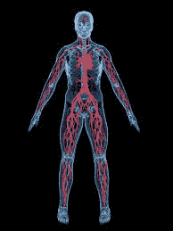
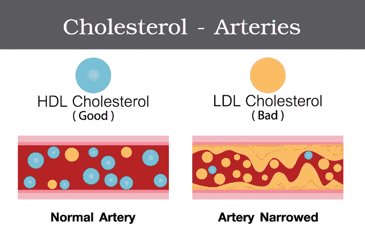
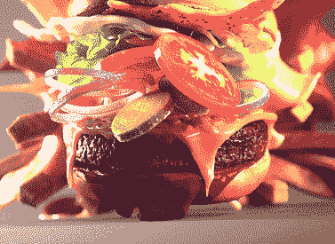
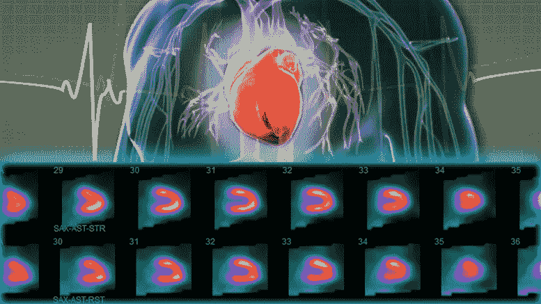
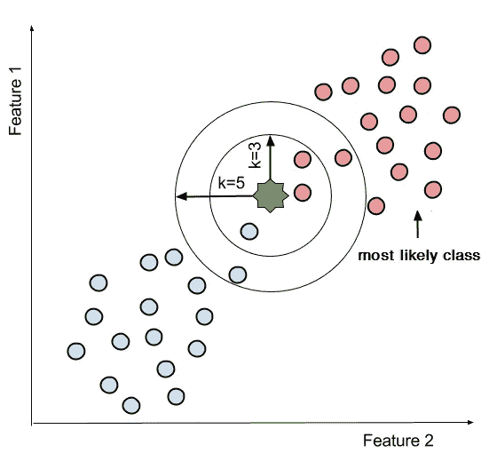
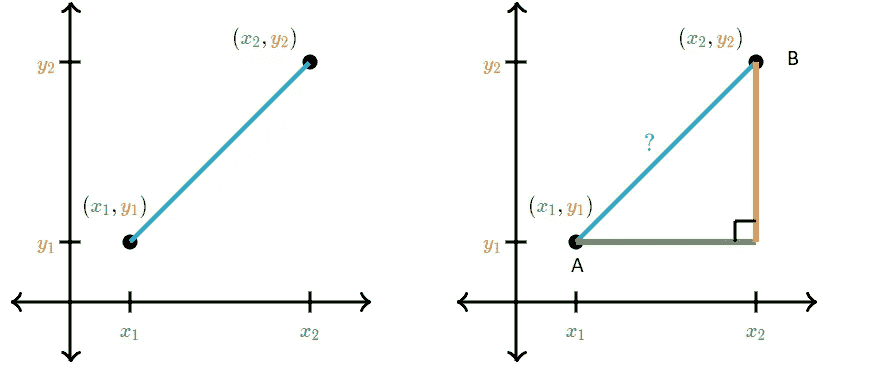
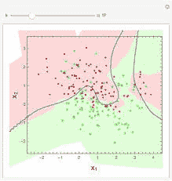

# 构建人工智能算法来捕捉心脏病

> 原文：<https://medium.com/analytics-vidhya/building-an-ai-algorithm-to-catch-heart-disease-f458c1cca1f8?source=collection_archive---------17----------------------->

它是美国的头号杀手。不仅如此，它还是世界上的头号杀手。你可能认识每天都在与它斗争的人。或者你可能还记得某个人，尽管尽了最大努力，还是输掉了这场战斗。

如果你看了标题，我相信你已经猜到我在说什么了:心脏病。

到目前为止，这是压倒性的胜利。

这是一种痛苦的状况，但不一定是致命的。事实上， [**及早染上心脏病可以意味着生死之别。**](https://www.ncbi.nlm.nih.gov/pmc/articles/PMC5233460/)

疾病越早被发现，病人和医生就有越大的回旋余地来采取措施。现在，患者可以自由地通过一些简单的生活方式改变来对抗心脏病，而不是一次又一次地接受手术。

如果医生发现这种疾病太晚，并且对患者的身体造成不可逆转的损害，所有这些手术可能都是徒劳的。

为了确保我们拯救尽可能多的生命，医生应该尽早获得他们需要的额外支持。我认为，我们能够提供这种支持的最佳方式之一是为医生配备强大的人工智能工具，以确保他们能够尽快做出诊断。

谁不想要一些额外的机器人帮助呢？

# 问题是:心脏病是如何工作的

冠心病是一种当向心脏输送血液和氧气的动脉堵塞时发生的疾病。就我们的目的而言，我认为更深入了解这种疾病如何工作的最好方法是了解它在现实生活中是如何工作的。因此，下面是我用来训练我的算法的一些现实生活特征的解释:

## ***cp。*** *胸痛型。*

如果你的细胞得不到足够的氧气，它们就会死亡。

谢天谢地，我们的身体有一条漂亮的小高速公路，可以确保你身体里的每一个细胞都得到它需要的氧气。

看起来是这样的！(但是在现实生活中就有点不那么通透了。)

你的血液携带氧气。一旦血液将氧气输送给需要的细胞，它就会迅速回到你的心脏进行循环。从那里，心脏将把它泵到肺部，这是氧气再利用的完美场所。然后你的心脏将更新的血液泵入你的身体，这个循环可以重新开始。

但如果你的心脏得不到足够的富氧血液，就会伤害你的全身。这种疼痛被称为心绞痛。

让你的思想走出阴沟。

发生这种情况有很多不同的原因，但这通常是更大问题的征兆。比如冠心病。

## ***chol。*** *血清胆固醇以毫克/分升计。*

胆固醇是一种脂肪样物质，少量摄入是不可或缺的。它制造激素，保持你的细胞完整，并帮助产生一系列其他生物小玩意儿，帮助你消化食物。

胆固醇利用称为脂蛋白的分子来移动。它们穿过你的血液到达你身体需要它们的地方。但不是所有的脂蛋白都做同样的事情。自己看:

*   [高密度脂蛋白(HDL)](https://www.health.harvard.edu/newsletter_article/hdl-the-good-but-complex-cholesterol) 是一个复杂的颗粒家族，与保持胆固醇在健康水平有关。众所周知，它们会将胆固醇带回肝脏清除，但它们不是只会一招的小马。在大多数情况下，有很多这样的人是个好主意。
*   [低密度脂蛋白](https://www.health.harvard.edu/blog/understanding-cholesterol-hdl-vs-ldl-2018041213608)将胆固醇从肝脏转运到体内不同组织。在运输过程中，它会聚集在你的动脉壁上形成斑块。
*   甘油三酯是你身体中最常见的脂肪，来自热量过剩，储存在脂肪细胞中。它是由非常低密度的脂蛋白( [VLDL 胆固醇](https://medlineplus.gov/vldlcholesterol.html))从肝脏中携带出来的，就像低密度脂蛋白一样，它们会卡在你的动脉中，造成同样严重的堵塞。

这些家伙是全🥺最好的动脉堵塞器

医生可以通过血清胆固醇测试同时测量所有这些元素。他们将高密度脂蛋白、低密度脂蛋白和 20%的甘油三酯水平相加得到最终数字。

## ***fbs。*** *空腹血糖是否大于 120 mg/dl？1 =真，0 =假*

葡萄糖是为细胞提供能量的燃料。就像氧气一样，它通过你的血液到达那些细胞。你吃的食物会对这个数字产生很大的影响，因为我们吃的几乎所有东西中都含有葡萄糖。

如果你想很好地了解你的身体自己产生了多少糖，你需要在一段时间不吃东西后做一次血液测试——也称为禁食。这被称为空腹血糖测试。

你被绞死了。

我们过去认为，只有当你的血糖高于 120 毫克/分升时，事情才开始变得危险。那是二型糖尿病的截止日期。如今，克利夫兰诊所基金会[实际上使用> 90 毫克/分升](http://www.diabetesincontrol.com/fasting-blood-sugar-above-90-puts-you-at-risk-of-heart-disease/)作为冠心病风险的临界值，因为有一些糖尿病前期的中间值可能更准确。事实上，超过 100 毫克/升的空腹血糖会增加你患心脏病的风险三倍*！*

## ****浪迹天涯。*** *入院时静息血压以毫米/汞柱为单位。**

*血压是一个非常重要的数字，因为它测量了血液对动脉的压力。如果你的血压过高，你的心脏就必须更加努力地工作，以使血液在全身循环。如果你的血液产生了过多的压力，它会在你的动脉内部产生微小的裂缝，给低密度脂蛋白空间以斑块堵塞动脉。*

## ****thal。*** *铊压力测试的结果。**

*铊压力测试显示了当你休息和运动时血液是如何流向心脏的不同区域的。*

*它包括将铊，一种无害的放射性物质作为生物示踪剂，引入你的一条血管，并被跟踪，直到它到达你的心脏。专门的照相机可以在图表上显示结果。*

**

*结果就是这个样子！*

*没有铊存在的“冷”点表明给定区域没有得到任何血液。那些被认为是“热的”但在休息时和运动时保持冷的部位可能表明永久性损伤。又名:固定伤害。如果在运动过程中颜色又回来了，那么它可能只是表明一些动脉阻塞，并且可以逆转。*

**

*既然我们已经对心脏病的工作原理有了更多的了解，我们如何才能防止它变得致命呢？*

# *解决方案:我们的 K-最近邻算法！*

*k-最近邻(KNN)算法可以通过将未知数据点与附近已知数据点进行比较，对从未见过的数据进行预测。k 是一个变量，代表我们的算法将使用的邻居数量。*

*为了更好地理解这一点，我们来看一个例子:*

**

*我们已经将我们的数据简化为一个二维的[图](http://https)(长&宽)，因为如果我们试图在现实生活中绘制实际的算法，这个图将需要十四个维度*。*🤯*

*每个数据点代表我们的一个病人。假设蓝色的点代表没有心脏病的人，红色的点代表有心脏病的人。我们有一个刚来的病人，他表现出的症状把他放在了中间。*

*我们可靠的算法如何判断他们是否患有心脏病？很简单！它将测量新病人的位置和所有最近的病人之间的距离。*

*最小的圆使用三个最近的邻居，最大的圆使用五个邻居。在这两种情况下，大多数邻居都有心脏病。谢谢*

*但是电脑不是统治者。计算机是超大的数学机器。那么计算机是怎么算出来的呢？*

*我们可以使用多种不同的距离算法，具体取决于数据集有多少要素以及其中有多少数据点。在这种情况下，我们要使用的是我们的简单简欧几里德距离公式，我们认为我们在八年级后永远不会使用它。*

****

*看到这让我回想起。*

*我们都记得毕达哥拉斯定理，对吧？a + b = c **？让我们找到 a.** 斜边的公式这里有一个复习，以防我们找不到:*

*嗯，一个叫欧几里德的希腊怪人发现，你可以用同样的原理，通过在任意两点之间画一个假想的三角形来求出它们之间的距离。他的公式基本上和毕达哥拉斯的公式一样。*

*绿色和橙色的两个术语帮助我们找到我们的长度，a 和 b。我们已经知道 x2 和 x1 点之间是一条直线，因为它们只有一维:长度。我们的点 y2 和 y1 也是如此！所以，我们要找到它们的距离，就要找到我们终点和起点的区别。这给了我们原始方程中的 a 和 b。*

*接下来，把它们加在一起并平方，就像毕达哥拉斯的定理一样:*

**

*我们要做的就是找出欧几里德距离*

*我们的算法计算我们的点和最近的邻居的数量之间的距离*

*从那里，计算机就可以计算出有多少邻居患有心脏病，有多少邻居没有。它根据接受训练的数据绘制边界，然后使用这些边界对所有未来的数据点进行排序。*

**

*看起来是这样的！*

*([还有这里有个链接](https://colab.research.google.com/drive/18e-KfJM0mpcxTyEBt3M9A_q3UrO-Fyhr)看代码！)*

# *外卖食品*

*   *防止疾病夺去病人生命的最有效方法是早期诊断。机器学习算法可以帮助医生在需要的时候抓住它们，任何人(尤其是你！)今天可以学造一个**。***
*   ***KNN 算法可以通过向邻居学习来对未知数据点进行分类。他们将使用最接近未知数据点的已知数据点的身份来确定未知数据点所属的组。***
*   ***任何人，尤其是你，今天都可以造一个这样的坏男孩！***

***非常感谢[Nagesh Singh Chauhan 的这篇文章](https://www.kdnuggets.com/2019/07/classifying-heart-disease-using-k-nearest-neighbors.html/2)，它在我的旅程中帮了我很多。怎么推荐都不为过。***

***嗨！我是尼娜·玛丽亚·特伦布莱。我十七岁，我写关于气候变化的文章。现在，我也在从事一些人工智能研究，并组织一场运动，将我的城市切换到 100%的可再生能源！如果你想听到更多我的消息，请在 [Twitter](https://twitter.com/ninamariasophia) 上关注我，在 [LinkedIn](https://www.linkedin.com/in/nina-maria-tremblay-36a40769/) 上与我联系，阅读更多我的[文章](/@ninaornina)，或者订阅我的时事通讯。***

***祝你今天开心！玩的开心！(如果你做不到，祝你过得更好！)***