# 构建一个(业余)机器学习网络应用&我学到了什么

> 原文：<https://medium.com/analytics-vidhya/building-an-amateur-machine-learning-web-app-what-i-learnt-d6a89bddb025?source=collection_archive---------16----------------------->

[http://zhijingeu.pythonanywhere.com](http://zhijingeu.pythonanywhere.com/)

# 目录

[简介](#2905)

[1。动机&目标](#7ff5)

[2。开发&部署工作流程](#8698)
[2.1 收集训练数据](#dede)
[2.2 开发&训练神经网络模型](#ad52)
[2.2.1 文本模型](#9faf)
[2.2.2 图像模型](#dcc1)
[2.2.3 训练云上的 GAN 模型](#43d4)
[2.3 构建 Web App](#18d3)

[3。那么我学到了什么…？](#e82f)
[3.1 充分理解您的数据是关键！](#2988)
[3.2 深度学习可以是计算/硬件密集型的](#e2cf)
[3.3(适当的)深度学习需要很多专家知道如何](#f833)
[3.4 知道“构建自己的”与打包的解决方案之间的权衡](#0e41)
[3.5 端到端机器学习开发/部署/运营需要非常不同的技能集](#4025)

[4。结论](#8080)

[Github 回购链接](https://github.com/ZhijingEu/Fake_Anime_Generator)

# 介绍

我先提出一个警告，如果你正在寻找一个详细的“如何指导”以及附带的代码遍历，这篇文章可能不适合你。

虽然我仍然会在我的 Github 代码中发布一个 l [ink，并快速浏览一下部署设置，但是在其他地方可能会有更好的关于如何开发和部署 ML 应用程序的教程](https://github.com/ZhijingEu/Fake_Anime_Generator)

相反，我的重点将更多地放在我作为一名 **noob** 程序员的个人见解上，同时致力于这个‘玩具项目’(希望)对像我一样开始并仍在尝试的其他人有用。

# 1.动机和目标

在过去的一年里，我一直在尝试学习一些不同的东西——主要是一般的 Python 编程，但也有一些用于游戏开发的 Unity (C++)、用于移动应用的 Android Studio (Java)、基本的 HTML/Javascript、谷歌云平台以及大量借用和调整他人的 Github 代码。

那些在 Medium 或我的 Linkedin 个人资料上关注我的人会看到我的一些迷你项目。然而，其中大多数都是独立的项目，只在我的本地笔记本电脑或我自己的手机上运行。

这一次，我想在 web 上构建和部署一个机器学习应用程序的粗略演示，目的是:-

1.在旅途中的所有不同步骤中边做边学

2.深入学习神经网络解决方案的工作原理

3.祝你一路实验愉快

4 .并且(希望……)用最终的网站给其他人提供几秒钟的娱乐

就网站的构思而言，这篇文章给了我很大的启发:

 [## Urza 的梦想引擎 RoboRosewater RoboDraft:创建一个机器学习算法来…

### Urza 的梦想引擎是一个我已经研究了几个月的神经网络项目。这是一个机器人，在…

andymakesgames.tumblr.com](https://andymakesgames.tumblr.com/post/167733819029/urzas-dream-engine-the-roborosewater-robodraft) 

作者利用一种称为 GAN 的特殊类型的神经网络(稍后将详细介绍)，他使用一大套神奇的收集卡(一种非常流行的收集卡游戏)来训练它，以生成全新的*制作的*卡。

我想做一些类似的事情，但日本动漫。有一些网站制作随机的标题，但没有额外制作描述/概要或海报图片。

 [## 随机动画生成器 Mix

### 只需选择你想要的动漫数量，点击绿色按钮就可以生成一个随机动漫列表。使用此工具，您可以…

www.generatormix.com](https://www.generatormix.com/random-anime)  [## 第七圣地:生成器之页-艺术、游戏、写作和想象的随机工具。

### 关于动漫标题有一种特定的东西。这试图将一些东西煮沸成随机创建的标题…

www.seventhsanctum.com](https://www.seventhsanctum.com/generate.php?Genname=animetitle) 

所以我想，为什么不自己造一个呢？！

# 2.开发和部署工作流程

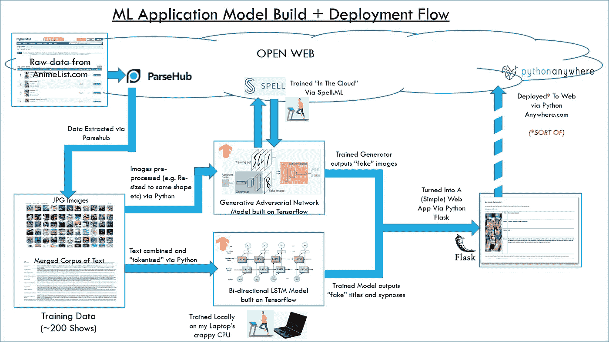

## 2.1 收集培训数据

我将 [MyAnimeList](https://myanimelist.net/topanime.php) 作为我的数据来源，因为它有一个顶级列表，每个标题都有一个概要和海报图像。

我最初的解决方案是通过 Beautiful Soup 和 Requests 等库使用 Python 进行 web 抓取，但很快我就遇到了麻烦，甚至是像分页这样简单的事情(如何点击列表中的每个条目，以到达包含我想要的信息的个人节目的子页面)。

因此，我找到了一个名为 [Parsehub](https://www.parsehub.com) 的托管解决方案

Parsehub 是一个基本上没有代码的解决方案，在你确定了你想要抓取的目标网站后，你只需点击你想要获取的所有字段，就可以构建一个“模板”(如下所示)。该工具负责识别该页面中的相似字段，然后您可以提取这些字段。

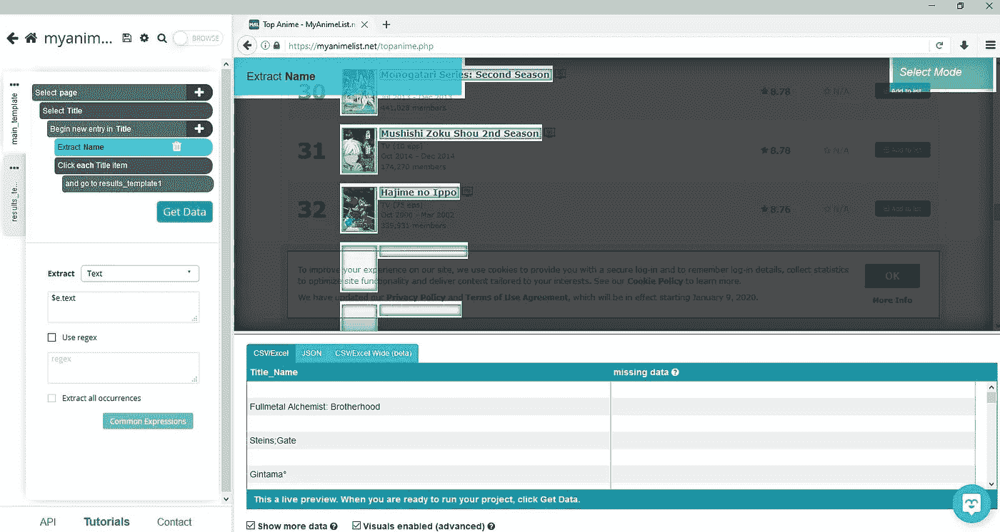

您甚至可以进入列表中的子页面，如下图所示，对于代表一个单独节目的每个子页面，我定义了一个单独的模板来提取节目描述和海报图像。

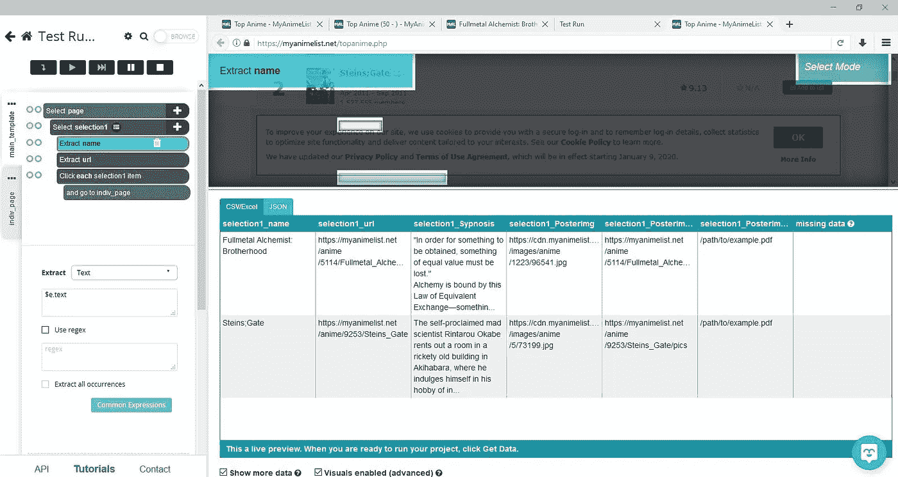

完成后，您可以将结果下载为简单的 CSV 或 excel 文件。

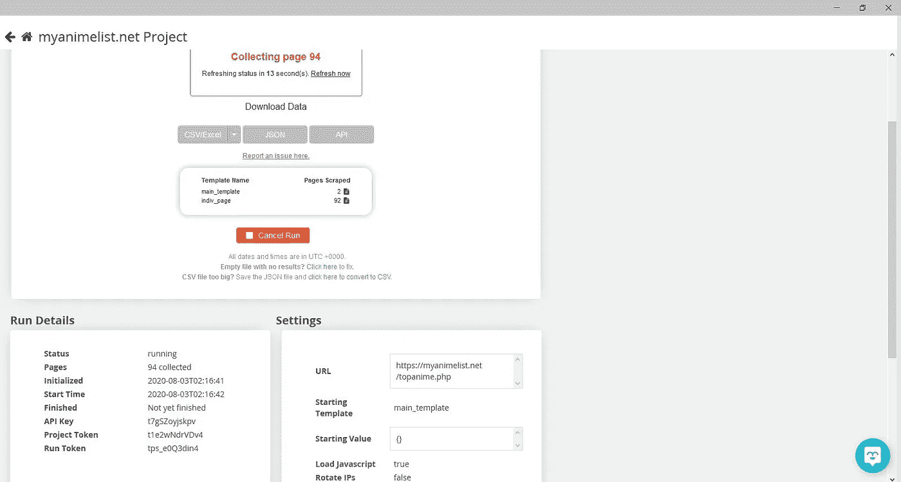

使用这个工具，网页抓取变得容易多了。唯一的障碍是，Parsehub 要求你*支付一个高级账户才能下载图片*(它直接下载到你的 DropBox 账户中)所以，作为一个小气鬼，我最终采用了一个折中的解决方案，从 Parsehub 获得图片的 URL 链接，但使用 Python 下载。

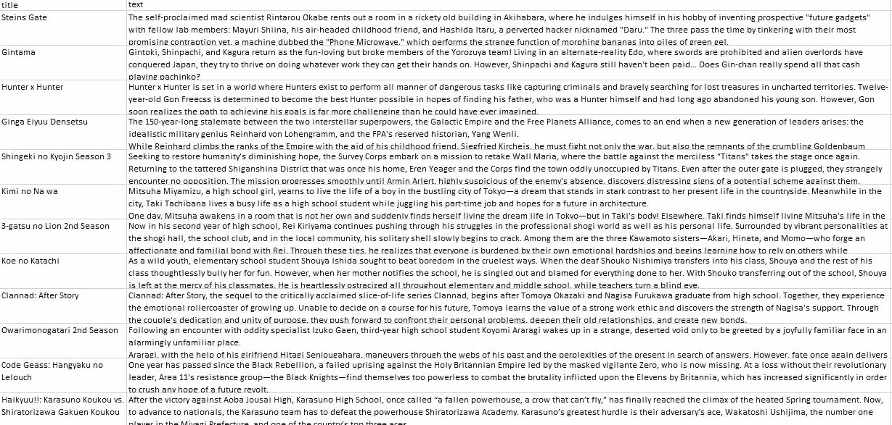

原始文本数据

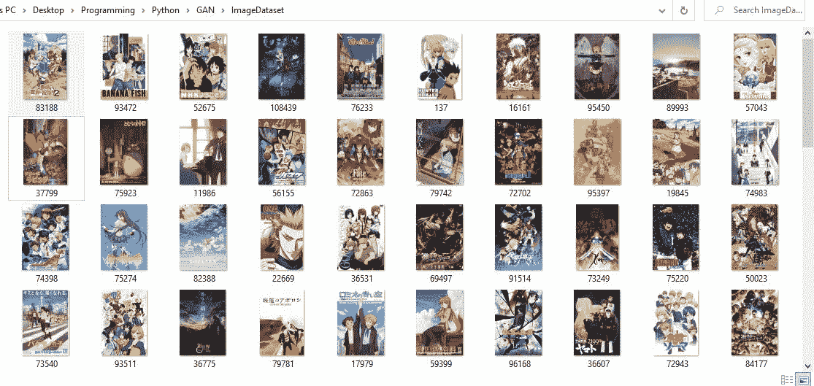

## 2.2 开发和训练神经网络模型

**2.2.1 文本模式**

对于文本生成模型，我使用教程中的现有代码修改了解决方案[，该教程是 Udacity 上深度学习 Tensorflow 简介](https://colab.research.google.com/github/tensorflow/examples/blob/master/courses/udacity_intro_to_tensorflow_for_deep_learning/l10c04_nlp_optimizing_the_text_generation_model.ipynb)课程的一部分(如果您想查看代码，请单击链接，我有意避免在此不必要地复制它，因为我的代码很大程度上是根据它修改的)

第一步包括处理原始数据，清除标点符号、大写字母和空格，然后“[标记](https://www.geeksforgeeks.org/nlp-how-tokenizing-text-sentence-words-works/#:~:text=Tokenization%20is%20the%20process%20of,a%20token%20in%20a%20paragraph)”文本(将长句子变成单个单词)，以便它可以输入神经网络。

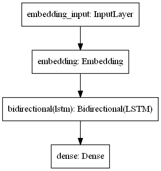

我使用的例子是一个相当简单的神经网络，使用 [Keras](https://keras.io/) (一个抽象层，简化了 [Tensorflow](https://www.tensorflow.org/) 中的模型构建)，其中使用了两个关键组件。

一个[嵌入层](https://machinelearningmastery.com/use-word-embedding-layers-deep-learning-keras/#:~:text=The%20Embedding%20layer%20is%20defined,vocabulary%20would%20be%2011%20words)将文本中的单词映射到一个更高维的空间中

这然后被输入到[长短期记忆层](https://colah.github.io/posts/2015-08-Understanding-LSTMs)中，该层通常在时间序列分析中“记住序列”,从而学习各种单词之间的模式和关系。

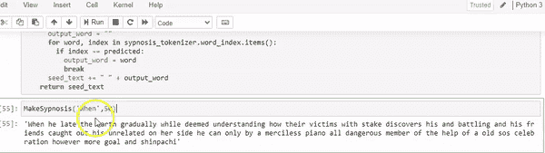

单词沙拉——好吃…

训练后(神经网络遍历所有示例，通过调整节点之间的权重来学习模式的过程)，神经网络可以根据之前出现的单词来“预测”下一个单词，然后在此基础上逐步构建整个段落。

**2.2.2 图像模型**

对于图像模型，我使用了一个更复杂的模型设置，称为[生成对抗网络](https://pathmind.com/wiki/generative-adversarial-network-gan)，在这里我通过改编这篇中型文章< [中的示例获得了大部分代码](https://towardsdatascience.com/generating-modern-arts-using-generative-adversarial-network-gan-on-spell-39f67f83c7b4)

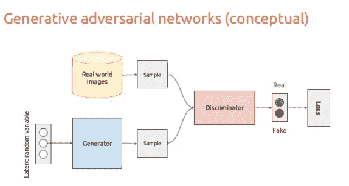

([源链接](https://www.slideshare.net/xavigiro/deep-learning-for-computer-vision-generative-models-and-adversarial-training-upc-2016))

GAN 模型在架构方面更复杂一些，但基本思想是建立两个模型——一个“鉴别器”和一个“发生器”。生成器模型使用随机噪声创建人工图像，并且鉴别器被训练来区分由生成器模型创建的“真实样本”和“赝品”

GANs 的聪明之处在于，你建立了一个系统，让两个模型玩一个试图胜过对方的游戏——即生成器学习如何制作更好的假货来欺骗鉴别器，而鉴别器试图“捕捉”生成器的假货图像。

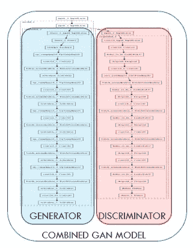

从图中可以看出，鉴别器和生成器架构比早期的文本模型更加复杂，包含了更多的层。然而，关键的想法是，他们利用了常用于计算机视觉应用的[卷积神经网络层](https://towardsdatascience.com/a-comprehensive-guide-to-convolutional-neural-networks-the-eli5-way-3bd2b1164a53)。这些细胞神经网络获取特征，如果你积累了足够多的细胞神经网络，它们就开始学习越来越多的细节特征(例如简单的边缘、曲线、形状、纹理，最后是眼睛的样子，等等)

然而，为了正确地训练 GAN，您必须合并这两个模型，这增加了复杂性。

与前面的例子类似，我必须运行一些预处理来将图像从矩形转换成正方形(即使是有形状的图像也更容易处理)。

然而，当在我的本地 CPU 上运行模型训练时，我立即遇到了一个问题。即使是 1000 个纪元的试运行，也需要超过 6-8 个小时。我知道我需要找到另一种方法。

## 2.2.3 在云上训练 GAN 模型

[拼 ML](http://www.spell.ml) 是一个*机器学习 Ops 平台，用于机器学习和深度学习。*基本上，这是一种允许你租用他们服务器的计算能力来使用 GPU 运行和训练你的模型的服务。

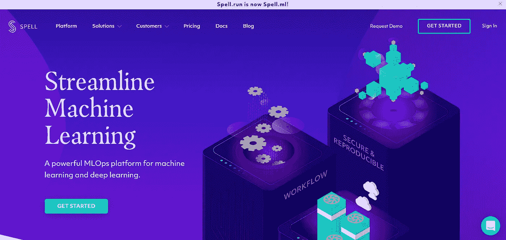

[www.spell.ml](http://www.spell.ml)

从技术上来说，像谷歌云平台或亚马逊网络服务这样的主要云平台也可以做到这一点，但我喜欢 Spell ML 的简单性，它让你可以从自己的本地机器上运行代码。

我用它来设置一个虚拟机，该虚拟机使用 NVIDIA Tesla K80 GPU 在 5000 个时期重新运行该模型，然后在 10，000 个时期再次运行。这仍然花了几个小时，但绝对比在我自己的本地 CPU 上做这个要好得多。

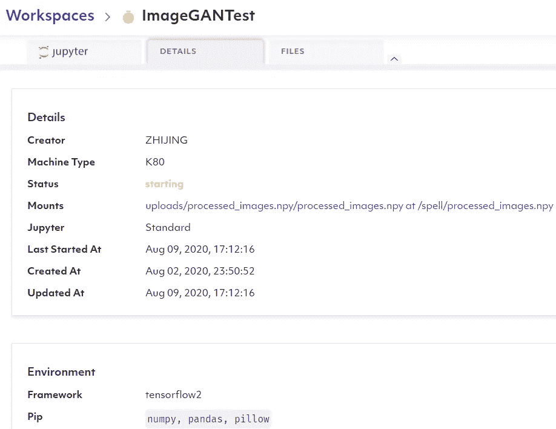

Spell ML 的工作方式是从本地机器(或者 github 页面)上的任何 git 存储库中克隆文件到它的服务器上，然后在它们的服务器环境上运行所选择的命令/文件作为“Run”

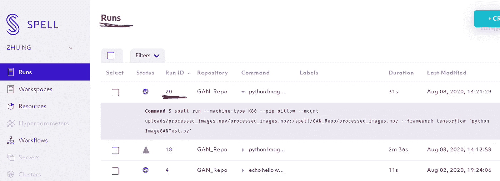

运行完成后，输出(如保存的 tensorflow 模型文件或任何其他输出，如图像、csv-s 等)将存储在运行文件夹中，然后您可以将其保存到本地计算机上以加载到您的模型中。

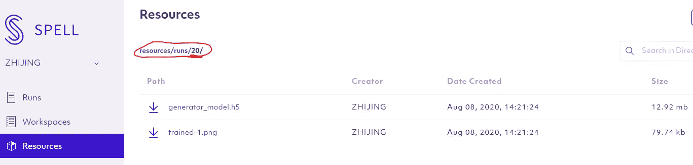

## **2.3 构建 Web 应用**

准备好所有的移动部件后，我使用 Python 的 WGSI (web 服务器网关接口)库 [Flask](https://flask.palletsprojects.com/en/1.1.x) 构建了一个简单的 Web 应用程序。

我编写了几个函数，调用 Tensorflow 模型来产生文本和图像的输出，然后将这些输出传递给变量，这些变量又被输入到一个非常简单的 HTML 页面模板中。

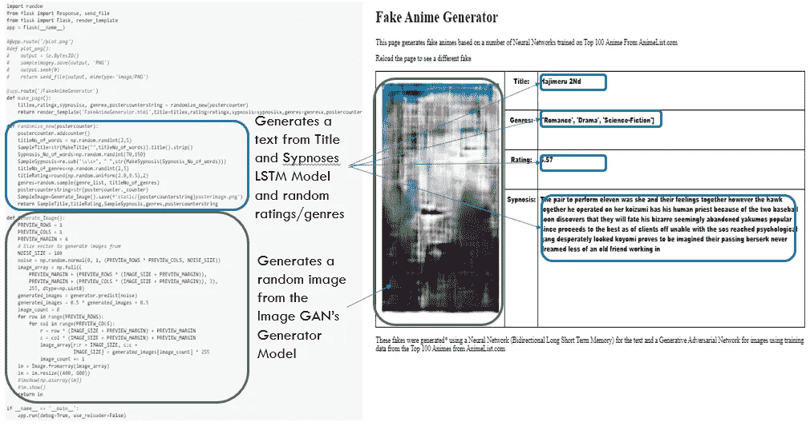

## 2.4 在线部署 Web 应用程序

从技术上讲，我可以在 Spell 上从网络服务器运行 flask 应用程序。但是那就像用一辆漂亮的法拉利开到隔壁的杂货店，在那里自行车就可以了。

因此，取而代之的是，我使用了一个免费的帐户来托管我的 Flask web 应用程序。(PythonAnywhere 的免费订阅只允许一个 web 应用程序)

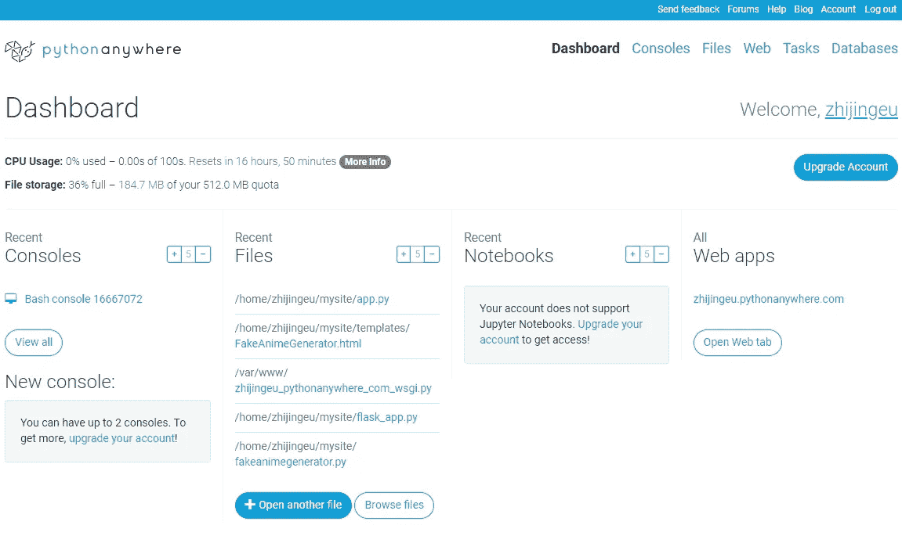

<[https://www.pythonanywhere.com](https://www.pythonanywhere.com/)

我原以为上传 Python 脚本文件是一件简单的事情，但是我遇到了一个相当大的障碍:PythonAnywhere 不支持为 web 应用程序运行 Tensorflow！

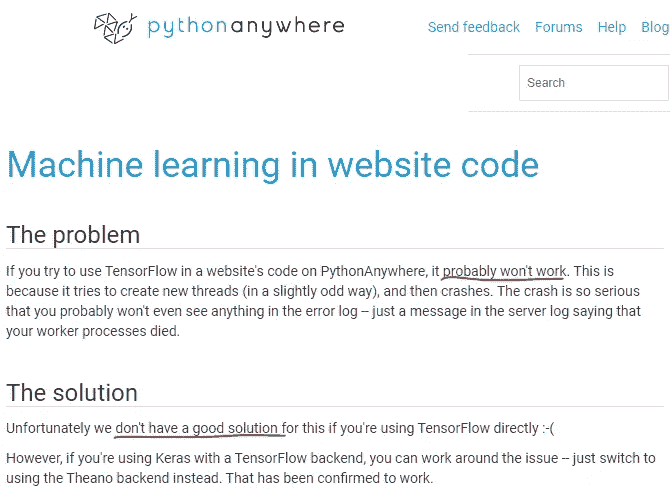

[https://help . python anywhere . com/pages/machineellinginwebsitecode](https://help.pythonanywhere.com/pages/MachineLearningInWebsiteCode)

当然，这无论如何都是一个糟糕的想法，因为最佳实践是将 TensorFlow 模型划分到一个 API 中，或者将它作为一个脚本单独托管，异步调用，但为了简单起见，我希望只按原样部署应用程序。

这让我想到了我最后的半成品解决方案。在一次 ***meta*** 的事件转折中，我“伪造”了那个山寨动漫生成器。我没有每次都“实时”运行 Tensorflow 模型，而是上传了 100 个图像和文本样本输出的缓存，并在 Flask 应用程序中编写了一个脚本，以便在每次重新加载页面时进行随机选择。

你可能会说这是一种逃避，你可能是对的，但是，嘿，我最终还是在公开的网络上获得了网络应用程序

## 3.那么我学到了什么…？

## 3.1 充分理解您的数据是关键！

图片来源:[https://machinelearnings.co](https://machinelearnings.co/)

这是一个有点显而易见的说法，但人们常说，在数据科学中，大量时间都花在争论你的数据和建立一个聪明的机器学习模型上。

你有足够的数量和合适的质量吗？，所有样本的特征在本质上是异质/同质的吗？，在输入模型之前，如何最好地预处理数据以使其成形？等等

对于文本生成模型输出， 标题生成器工作正常，但概要的句子并不总是非常连贯——我怀疑这部分是因为模型本身只是一个浅层神经网络，但也可能是因为我将标记器设置为 2500 个单词的计数限制(即意味着模型只从总文本中选取最常见的 2500 个单词进行映射)——我没有尝试使用更大的单词计数，因为它开始变慢 当我增加到 5000 个单词时，我并不热衷于在拼写 ML 上花费更多的学分。

对于图像生成，我发现用更大的历元重新运行训练对结果没有什么影响

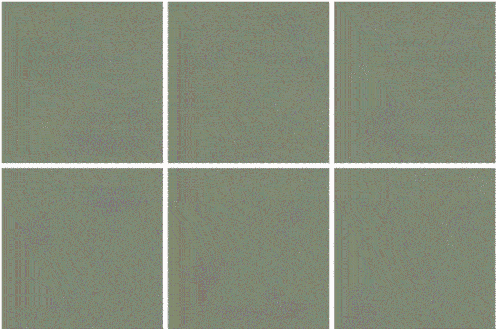

训练 1000 个纪元

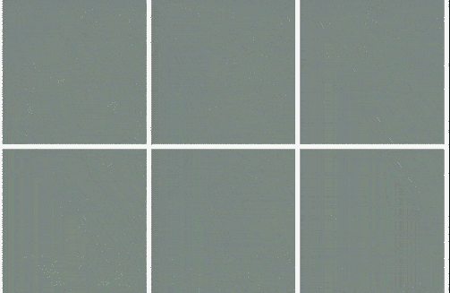

…与训练 10，000 个纪元的 GAN 相比

可能是 200 个图像的图像数据集太小，或者我可以应用更多的预处理技术(例如，没有特征的裁剪区域？颜色调整？).然而，更根本的是，我有一种感觉，也许整个数据集中没有可供神经网络学习的“定义特征”(就像网络如何学习面孔一样，因为大多数面孔无论如何不同，仍然有眼睛、鼻子、耳朵等，但动漫海报有太多的多样性，没有共性)。

我还没有测试过，但也许我可以把海报分成几个子类别，比如根据前景/背景的人脸大小等等，然后按类别训练独立模特？

## 3.2 深度学习可能是计算/硬件密集型的

[https://www.istockphoto.com](https://www.istockphoto.com/vector/tired-computer-gm132076151-18473325)

我在上面的 2.2.3 中提到了这一点，但是当我开始在我过时的笔记本电脑上多次运行时，我才开始欣赏这一点。

特别是机器学习和神经网络面临的挑战是，它们在训练期间有太多的权重(即变量)要在内存中处理，你真的需要正确的硬件支持才能让它工作。

不像简单的程序，你可以通过调整这里的一行或那里的一个变量来快速迭代学习，大多数机器学习代码需要时间来运行(也就是说，如果你只让它运行 1 或 2 个时期，你真的看不到输出会发生什么)

还有一些关于优化你的代码计算速度的问题。特别是对于我用于图像生成的 GAN 模型，这本来就很棘手，因为本质上需要用许多超参数串联训练两个不同的网络来优化。我确信我可以优化批处理大小或选择一个更有效的优化器来减少计算量，但我没有详细探讨这一点。所有这些很方便地将我引向下一个观点…

## 3.3.(适当的)深度学习需要很多专业知识

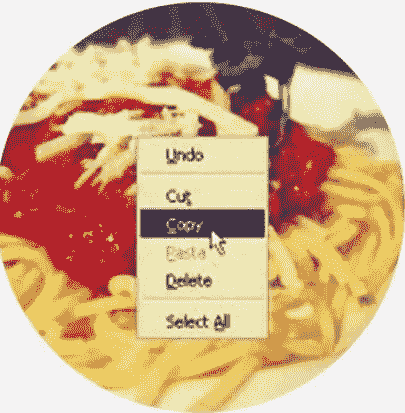

[妈妈的意大利面](https://www.dictionary.com/e/slang/copypasta)

我使用的大部分代码都是通过“复制意大利面”制作的——复制大量的示例代码，用胶带将所有的东西粘在一起，并希望它们最终仍然可以工作。

我必须承认，有很多超参数需要优化或调整，我仍在试图理解。

一个不全面的列表应该是这样的:-

­

**批量大小、学习率和优化器的选择** —我坚持使用 [Adam 优化器](https://towardsdatascience.com/adam-latest-trends-in-deep-learning-optimization-6be9a291375c)并用[学习率](https://towardsdatascience.com/understanding-learning-rates-and-how-it-improves-performance-in-deep-learning-d0d4059c1c10)进行实验——显然 0.1 的 LR 训练得更快，但结果看起来比我使用的最终 LR 0.0001 更差，但用不同的变量进行实验是一个昂贵而痛苦的缓慢过程(参考上一节)。我确实尝试过使用 sklearn 库的 RandomSearchCross 验证来运行一些排列，但即使只运行 10 个时期也要花费很长时间，最后我只是试错了。

**损失函数的选择**，例如文本生成——我坚持使用样本代码中使用的分类交叉熵损失函数(即下一个单词预测，但最终我不确定较低的分类交叉熵是否真的“捕捉”了像概要这样的长文本的连贯性。

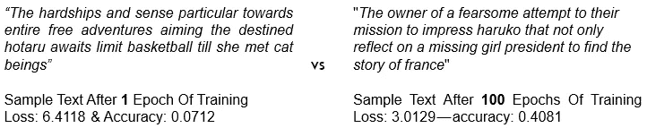

1 对 100 个时代的训练

与 GAN 的图像不同，在 GAN 的图像中，您可以看到运行更长时期的输出在“质量”上的差异，对于文本生成模型，我真的无法分辨，因为两者对我来说似乎都不连贯

­

**单词嵌入层的维度&LSTM 的节点数量—** 我任意使用 64 个维度来嵌入标题和摘要生成。

回想起来，为了更好的性能，我应该为概要增加这个值，因为知道对于概要训练数据有 24，900 个样本(即反映特定序列中 2500 个单词标记的不同排列),而对于 500 个标题单词标记有 593 个序列。

**GAN 模型架构&训练方法**——一般来说，GAN 模型，比如我用来生成图像的那个模型，[真的很难训练](https://towardsdatascience.com/10-lessons-i-learned-training-generative-adversarial-networks-gans-for-a-year-c9071159628)。有很多文章采用了不同的方法，我还没有尝试过:

-改变生成器和鉴别器之间的学习速率(在我使用的例子中，我保持它们相同)

-使用不同的损失函数(称为[瓦瑟斯坦距离](/@jonathan_hui/gan-wasserstein-gan-wgan-gp-6a1a2aa1b490#:~:text=So%20to%20calculate%20the%20Wasserstein,find%20a%201%2DLipschitz%20function.&text=Indeed%2C%20this%20network%20is%20very,real%20the%20input%20images%20are))与我使用的二元交叉熵

-在生成器和鉴别器之间平衡权重更新(我复制的例子使用了基本的迷你批量训练策略，但是显然一些机器学习专家对鉴别器的每次更新进行两次或三次生成器更新。)

-我似乎也经历了 GAN 训练的所有常见问题，例如[未能收敛](https://machinelearningmastery.com/practical-guide-to-gan-failure-modes)，与鉴别器模型精度相比，发电机模型精度似乎过大且波动

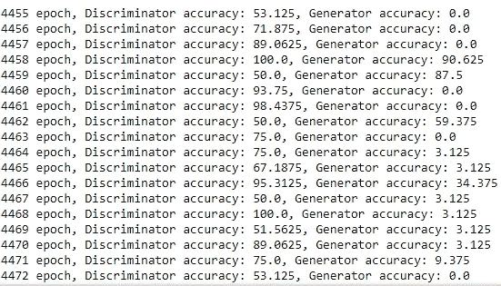

我想我也有“[模式崩溃”](https://developers.google.com/machine-learning/gan/problems)的 5000 Epoch 运行，所有的样本图像是由发电机输出看起来太相似。

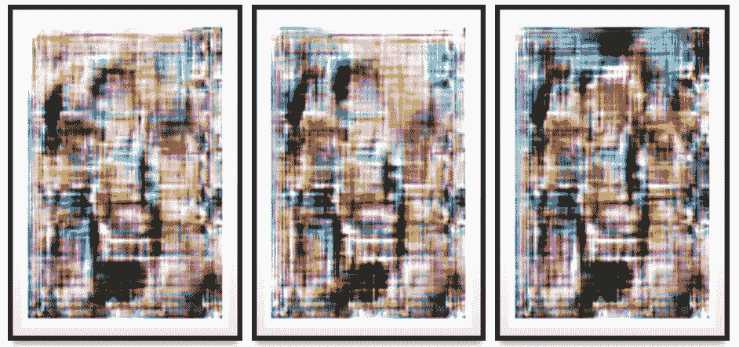

模式崩溃的迹象？对你来说，这三张照片看起来都像一个留着长长飘逸头发的令人毛骨悚然的大胡子男人吗？

然而，当我最终决定为最终版本运行 10，000 个纪元的训练时，这个问题就不那么明显了。

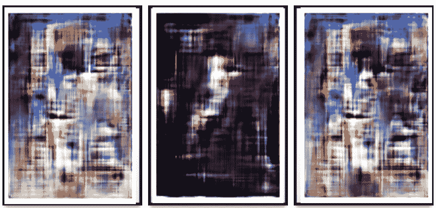

多一点变化——左边和右边看起来像愤怒的骆驼脸，而中间看起来像树枝上的鸟…

## **3.4 了解“自行构建”与打包解决方案之间的权衡**

来源:[123rf.com](https://www.123rf.com/stock-photo/tradeoff.html)

打包解决方案很棒，但通常有用的功能是在付费墙后面。

例如，在上一节中，我提到了 ParseHub 是如何使网页抓取过程变得更加容易的，但是最终下载的图片是一个只有在付费墙后才可用的特性。

事后看来，2020 年，我可能会更好地使用一家主要云公司的端到端完全托管解决方案。例如，通过 GCP 或 AWS，您可以在他们的 ML Ops 平台上训练 Tensorflow 模型，并让它与谷歌的应用引擎和 AWS 的 Lambda 中的部署脚本相连接

然而，中间解决方案(使用混合的打包服务和构建自己的“清理”后处理)确实提供了一些灵活性和潜在的成本节约，只要知道权衡是什么。

## 3.5 端到端机器学习开发/部署/运营需要非常不同的技能组合

来源: [PublicDomainPictures](https://www.publicdomainpictures.net/en/view-image.php?image=2681&picture=swiss-army-knife)

我在智力上已经知道了这一点，但直到尝试了所有不同的步骤，甚至是这个简单的“玩具”应用程序，我才真正开始欣赏。

仅仅是阅读专业人士如何部署机器学习模型就让我意识到有太多东西需要学习。我选择了一个非常简单的方法——转储整个脚本(包括 TF 模型)并运行它，但正确的方法可能是通过两个文本和图像模型的[容器化](https://www.docker.com/resources/what-container)(即 [Kubernetes](https://kubernetes.io) )来建立微服务，然后从前端网站调用它们进行输出。(或者，如果定制不是问题，使用托管服务，如谷歌的应用引擎或 AWS 的 Lambda 也可以)

另一个例子是关于数据收集步骤——如果我真的想大规模地进行网络搜集(即不仅仅是 100 个，而是 1000 个样本) ,我肯定需要更好地理解如何设置请求头和使用代理 IP 地址，以避免被网站当作机器人“赶走”。

## 4.结论

那么(对我来说)值得吗？简而言之，是的。

1.通过尝试所有不同的步骤，我无疑获得了“更丰富”的学习体验。我认为至少从头到尾熟悉解决方案选项和决策过程是有好处的，因为这可能有助于在大型团队中工作时理解如何更好地优化您的“链中的一环”。

2.我还从调整超参数的角度获得了一些关于使用神经网络的细微差别，这些是我仅仅通过运行整洁的教程/示例代码无法获得的。

3.显然，山寨动画生成器有点像是一个没有人真正依赖的一次性应用程序。这就是为什么我可以用“质量差”的图像和使用“缓存”的样本(而不是实时模型推断)来逃避责任。也就是说，任何最终的解决方案都确实取决于对您预期的用户需求和行为的了解，例如，预测流量水平、人们将如何使用结果等，并决定您可以接受什么(可靠性、延迟、安全/隐私问题等)。

4.不幸的是，至于[网站](http://zhijingeu.pythonanywhere.com)是否会给公众带来任何娱乐，这还有待观察…让我知道你在评论中的想法吧！

如果您正在寻找代码，这里有 github repo:

https://github.com/ZhijingEu/Fake_Anime_Generator