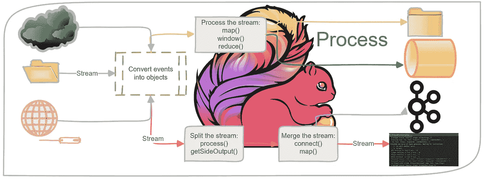
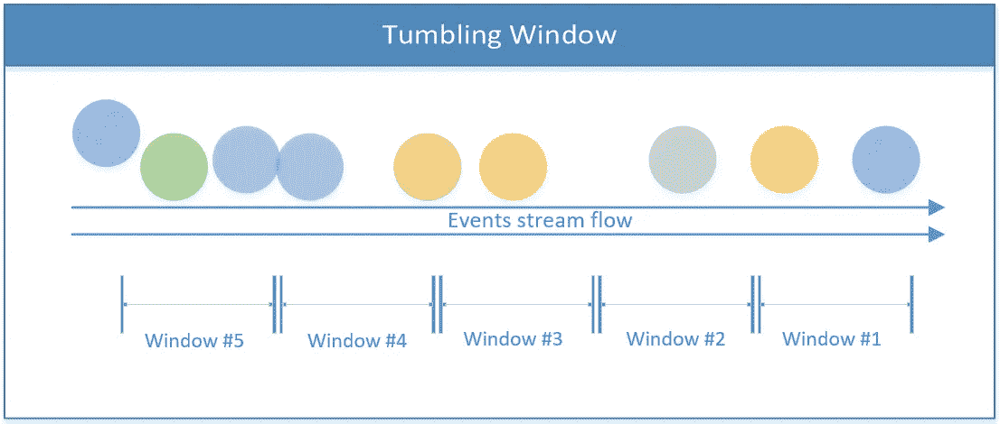
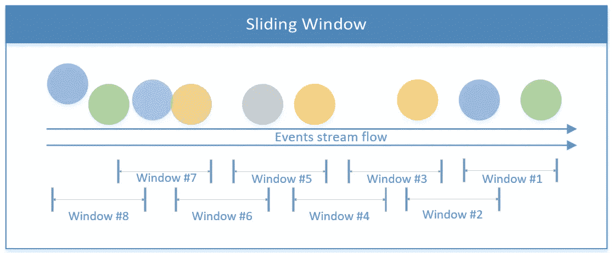
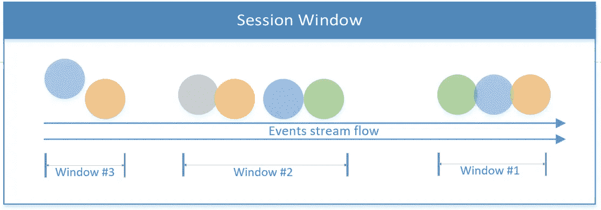
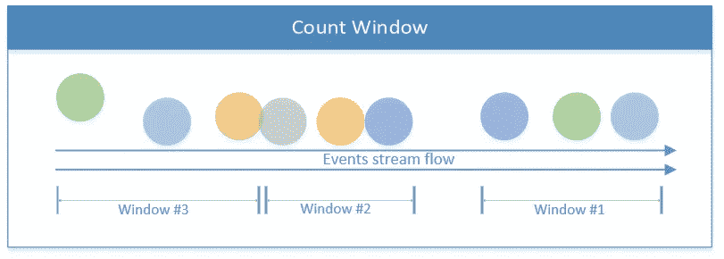
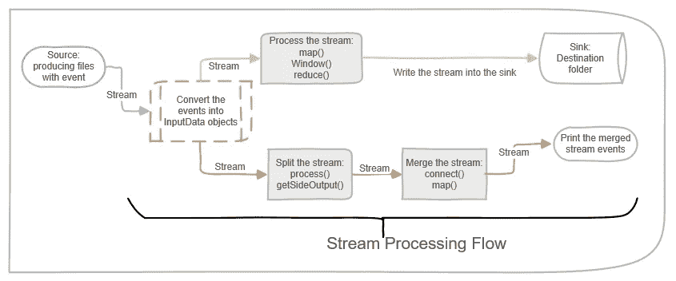

# 构建 Apache Flink 应用程序的基础

> 原文：<https://medium.com/analytics-vidhya/building-an-apache-flink-application-from-scratch-7d12ce00de8d?source=collection_archive---------2----------------------->

## 使用 Flink 自底向上理解流处理；云服务和其他平台提供了流处理解决方案(对一些人来说，Flink 是在引擎盖下集成的)。如果你错过了基本的，这个指南是给你的。



我们的 monolith 解决方案无法应对不断增加的传入数据负载，因此必须不断发展。这是我们下一代产品的时候了。与我们到目前为止实现的批处理相比，流处理是新的数据摄取范例。

因此，我的团队开始使用 Flink 处理信息。关于 Flink 的特性和优势有大量的文章，Cloudera 分享了一张关于 Flink 的[精彩幻灯片；本文是关于如何从基础开始构建一个简单的流处理应用程序的实践指南。](https://www.slideshare.net/secret/lEfaV6zHhdHY91)

# 阿帕奇 Flink 两句话

Apache Flink 是一个可伸缩的分布式流处理框架，意味着能够处理连续的数据流。这个框架提供了各种功能:源、流转换、并行处理、调度、资源分配和各种目的地。它的一些连接器是 HDFS，卡夫卡，亚马逊 Kinesis，RabbitMQ 和 Cassandra。

Flink 以其高吞吐量和低延迟而闻名，支持恰好一个一致性(所有数据处理一次，没有重复)，并且它还支持高可用性。像任何其他成功的开源产品一样，它有一个广泛的社区来培养和扩展它的特性。

Flink 可以处理不确定的数据流或确定的数据集。本博客将重点讨论前者(使用数据流对象)。

# 流处理—挑战

如今，当物联网设备和其他传感器无处不在时，数据从许多来源源源不断地流出。这种源源不断的数据迫使传统的批处理计算进行调整。

*   这个数据是无界的；没有开始和结束。
*   新数据的不可预测和不一致的间隔。
*   数据可能是无序的，有不同的时间戳。

由于这些独特的特征，处理和查询数据是复杂的任务。结果变化很快，几乎不可能得到确定的结论；有时，在试图产生有效结果时，计算可能会受到阻碍。此外，由于数据不断变化，结果不可重复。最后，延迟是一个影响结果准确性的因素。

Apache Flink 通过基于传入数据源中的时间戳进行处理来解决这些问题。它有一种机制，在应用处理执行之前，根据事件的时间戳来累积事件。它消除了微量批次的使用，从而提高了结果的准确性。

Flink 实现了恰好一次一致性，这确保了计算的正确性，而无需开发人员为其编程。

# 基础——Flink 软件包构建模块

弗林克主要吸收各种来源的水流。基本对象是`DataStream<T>`，表示同类型元素的流；其元素的类型在编译时通过设置泛型类型 T 来定义(在这里阅读关于[数据流对象](https://ci.apache.org/projects/flink/flink-docs-release-1.2/api/java/org/apache/flink/streaming/api/datastream/DataStream.html))。

数据流对象包含许多有用的方法来转换、分割和过滤它的数据[1]。熟悉的方法*地图，减少，*和*过滤器*是一个好的开始；这些是主要的转换方法:

*   **Map:** 接收 T 对象，返回 R 类型对象的结果；映射函数在数据流对象的每个元素上只应用一次**。**

```
[SingleOutputStreamOperator](https://ci.apache.org/projects/flink/flink-docs-release-1.2/api/java/org/apache/flink/streaming/api/datastream/SingleOutputStreamOperator.html)<R> [map](https://ci.apache.org/projects/flink/flink-docs-release-1.3/api/java/org/apache/flink/api/common/functions/MapFunction.html)([MapFunction](https://ci.apache.org/projects/flink/flink-docs-release-1.2/api/java/org/apache/flink/api/common/functions/MapFunction.html)<[T](https://ci.apache.org/projects/flink/flink-docs-release-1.2/api/java/org/apache/flink/streaming/api/datastream/DataStream.html),R> mapper)
```

*   **Reduce:** 接收两个连续的值，**将它们组合成同一个对象类型后返回一个对象**；该方法对组中的所有值运行，直到只剩下一个值。

```
[T reduce(T value1, T value2)](https://ci.apache.org/projects/flink/flink-docs-release-1.2/api/java/org/apache/flink/api/common/functions/ReduceFunction.html#reduce-T-T-)
```

*   **Filter:** 接收 T 对象，返回 T 对象流；此方法对数据流中的每个元素运行，但只返回函数返回 true 的元素。

```
[SingleOutputStreamOperator](https://ci.apache.org/projects/flink/flink-docs-release-1.2/api/java/org/apache/flink/streaming/api/datastream/SingleOutputStreamOperator.html)<[T](https://ci.apache.org/projects/flink/flink-docs-release-1.2/api/java/org/apache/flink/streaming/api/datastream/DataStream.html)> filter([FilterFunction](https://ci.apache.org/projects/flink/flink-docs-release-1.2/api/java/org/apache/flink/api/common/functions/FilterFunction.html)<[T](https://ci.apache.org/projects/flink/flink-docs-release-1.2/api/java/org/apache/flink/streaming/api/datastream/DataStream.html)> filter)
```

## 数据接收装置

除了转换数据，Flink 的主要目的是在将数据流处理成不同的目的地后，对其进行控制。这些目的地被称为“汇点”。Flink 具有内置的接收器(text、CSV、socket)，以及到其他系统的开箱即用的连接器(如 Apache Kafka)[2]。

## Flink 事件时间戳

时间的概念对于处理数据流是至关重要的。定义时间戳有三个选项:

*   **处理时间**(默认选项) **:** 是执行流处理操作的机器的系统时间，因此是最简单的时间概念；它不需要流和机器之间的任何协调。因为它基于机器的时间，所以它提供了最佳的性能和最低的延迟。
    使用*处理时间*的缺点在分布式和异步环境中很明显，因为它不是一种确定性的方法。如果机器时钟之间有间隙，流事件的时间戳可能会不同步；网络延迟还会在事件离开一台机器和到达另一台机器的时间之间产生差距。

```
// Setting the *Processing Time* attribute of StreamExecutionEnvironment objectstreamEnv**.**setStreamTimeCharacteristic**(TimeCharacteristic.**ProcessingTime**);**
```

*   **事件时间:**是指在进入 Flink 之前，每个单个事件在其产生源上接收的时间。事件时间嵌入在事件本身中，可以提取出来，以便 Flink 可以正确地处理它。
    因为时间戳不是由 Flink 设置的，所以应该有一种机制来通知事件是否应该被处理；这种机制被称为*水印。这个话题超出了这篇博文的范围(因为我想保持简洁)；你可以在 [Flink 文档](https://ci.apache.org/projects/flink/flink-docs-release-1.10/dev/event_time.html#event-time-and-watermarks)中找到更多信息。*

```
// Defining the *Event Time* as the timestamp method
streamEnv.setStreamTimeCharacteristic(TimeCharacteristic.EventTime);DataStream<String> dataStream
   = streamEnv.readFile(auditFormat,
          dataDir,    // the progon of the events
          FileProcessingMode.PROCESS_CONTINUOUSLY,
          1000).
          **assignTimestampsAndWatermarks**(
                  new TimestampExtractor());// ... more code ...// Defining a class to extract the timestamp from the stream events
public class TimestampExtractor implements 
                AssignerWithPeriodicWatermarks<String>{@Override
public Watermark getCurrentWatermark() {
      return new Watermark(System.*currentTimeMillis*()-maxTimeFrame);
   }@Override
public long extractTimestamp(String str, long l) {
     return InputData.*getDataObject*(str).timestamp;
   }
}
```

*   **摄取时间:**指事件进入 Flink 的时间；它在源处被分配一次，因此被认为比在开始处理时分配的*处理时间*更稳定。
    *摄取时间*无法处理无序事件或延迟数据，因为一旦摄取开始，就会设置时间戳，而*事件时间*具有识别延迟事件并基于水印机制处理它们的功能。

```
// Setting the *Ingestion Time* attribute of StreamExecutionEnvironment objectstreamEnv**.**setStreamTimeCharacteristic**(TimeCharacteristic.**IngestionTime**);**
```

你可以在下面的链接中阅读更多关于时间戳以及它如何影响流处理的信息。

## 开窗术

顾名思义，一条小溪是没有尽头的；因此，处理的机制是通过定义帧(例如，基于时间的窗口)。这样，流就被划分到桶中进行聚合和分析。窗口定义是对一个`DataStream` 对象或其一个继承者的操作。

有几个基于时间的窗口:

*   **翻滚窗口(默认配置):** 将流分成大小相等的窗口，没有任何重叠。只要流在流动，Flink 就根据这个固定的时间框架连续计算数据。



翻滚窗口插图

代码实现:

```
// To be used for a non-keyed stream
public [AllWindowedStream](https://ci.apache.org/projects/flink/flink-docs-release-1.2/api/java/org/apache/flink/streaming/api/datastream/AllWindowedStream.html)<[T](https://ci.apache.org/projects/flink/flink-docs-release-1.2/api/java/org/apache/flink/streaming/api/datastream/DataStream.html),[TimeWindow](https://ci.apache.org/projects/flink/flink-docs-release-1.2/api/java/org/apache/flink/streaming/api/windowing/windows/TimeWindow.html)> timeWindowAll([Time](https://ci.apache.org/projects/flink/flink-docs-release-1.2/api/java/org/apache/flink/streaming/api/windowing/time/Time.html) size)// Tumbling window for a key-based stream
public [WindowedStream](https://ci.apache.org/projects/flink/flink-docs-release-1.6/api/java/org/apache/flink/streaming/api/datastream/WindowedStream.html)<[T](https://ci.apache.org/projects/flink/flink-docs-release-1.6/api/java/org/apache/flink/streaming/api/datastream/KeyedStream.html),[KEY](https://ci.apache.org/projects/flink/flink-docs-release-1.6/api/java/org/apache/flink/streaming/api/datastream/KeyedStream.html),[TimeWindow](https://ci.apache.org/projects/flink/flink-docs-release-1.6/api/java/org/apache/flink/streaming/api/windowing/windows/TimeWindow.html)> timeWindow([Time](https://ci.apache.org/projects/flink/flink-docs-release-1.6/api/java/org/apache/flink/streaming/api/windowing/time/Time.html) size)
```

*   **滑动窗口** 由窗口大小和偏移量(何时开始下一个窗口)组成的重叠窗口。这样，在给定时间内，可以在多个窗口中处理事件。



滑动窗口插图

这是它在代码中的样子:

```
*// sliding time window of 1 minute length and 30 secs trigger interval* dataStreamObject**.**timeWindow**(Time.**minutes**(**1**),** **Time.**seconds**(**30**))**
```

*   **会话窗口** 包括会话边界下的所有事件。当在定义的时间范围内没有活动或事件时，会话结束。基于所处理的事件，该时间范围可以是固定的或动态的。从理论上讲，如果会话的事件间隔小于窗口大小，会话就永远不会结束。



会话窗口图示

下面的第一个代码片段举例说明了一个基于固定时间的会话(2 秒)。第二个会话窗口基于流的事件实现了一个动态窗口。

```
// Defining a fixed session window of 2 seconds
dataStreamObject**.**window**(ProcessingTimeSessionWindows.**withGap**(**Time**.**seconds**(**2**)))**// Defining a dynamic window session, which can be set by the stream elements
dataStreamObject**.**window**(EventTimeSessionWindows.**withDynamicGap**((**elem**)** **->** **{**
        *// return the session gap, which can be based on the stream's events*
    **}))**
```

*   **全局窗口** 将整个流视为一个单独的窗口。


全局窗口插图

Flink 还支持使用用户定义的逻辑实现自定义窗口，这将是另一篇博文的主题😎。

除了基于时间的窗口之外，还有其他窗口，例如*计数窗口、*，其通过输入事件的数量接近极限；一旦达到 X 阈值，Flink 就会处理 X 个事件。



三个事件的计数窗口

在理论介绍之后，让我们进入一个实际的数据流。你可以在[官网](https://flink.apache.org/)找到更多关于 Apache Flink 和 stream 进程的信息。

## 蒸汽流描述

为了重述理论部分，下图描绘了这篇博文中代码样本的主要数据流。下面的流程从一个源(文件被写入一个文件夹)开始，并继续将事件处理成对象。

下面描述的实现由两个处理轨道组成。最上面的那个把一条小溪分成两条支流，然后把它们合并成第三种类型的小溪。底部的场景处理一个流，然后将结果传输到一个接收器中。



下一部分旨在将理论的流处理转化为实际的实践；你可以在 GitHub 上找到完整的源代码[。](https://github.com/liorksh/FlinkBasicDemo)

# 基本流处理(示例#1)

从一个基本的应用程序开始更容易掌握 Flink 的概念。在这个应用程序中，制作者将文件写入一个文件夹，这模拟了一个流动的流。Flink 从这个文件夹中读取文件，对它们进行处理，并将摘要写入目标文件夹；这是水槽。

现在让我们关注流程部分:

1.  将原始数据转换为对象:

2.下面的代码示例将流对象(InputData)转换为字符串和整数的元组。它只从对象流中提取某些字段，在两秒钟内按一个字段对它们进行分组。

3.为流创建目的地(实现数据接收器):

构建数据接收器的代码示例

# 分流(示例 2)

在这个例子中，我们演示了如何在使用侧输出流的同时分割主流。Flink 能够从主`DataStream`生产多个支流。驻留在每个侧流中的数据类型可以不同于主流，也可以不同于每个侧流。

因此，使用一个侧面输出流可以一举两得:拆分流并将 may 流类型转换成多种数据类型(对于每个侧面输出流可以是唯一的)。

下面的代码示例调用了`ProcessFunction`，它根据输入的属性将一个流分成两个支流。为了获得相同的结果，我们应该不止一次地使用函数`filter`。

`ProcessFunction`将某些对象(基于标准)收集到主输出收集器(在`SingleOutputStreamOperator`中捕获)，同时将其他事件添加到副输出。`DataStream`是垂直拆分的，为每个侧流发布不同的格式。

注意，侧面输出流定义是基于一个惟一的输出标签(`OutputTag`对象)。

如何分割流的代码示例

# 合并流(示例#3)

这篇博文的最后一个操作演示了合并流的操作。这个想法是将两个不同的流(它们的数据格式可能不同)组合起来，产生一个具有统一数据结构的流。与水平合并数据的 SQL 合并操作相反，合并流的操作是垂直的，因为事件继续流动，没有任何限定的时间范围。

通过调用方法`connect`合并流，然后在每个单独的流中的每个元素上定义 map 操作。结果是一个合并的流。

如何合并流的代码示例

# 构建可行的项目

将所有这些放在一起:我上传了一个[演示项目到 GitHub](https://github.com/liorksh/FlinkBasicDemo) 。您可以按照说明来构建和编译它。这是和 Flink 玩的一个好的开始。

希望你觉得这个回购有用。如果你有任何问题，不要犹豫与我联系。

# 外卖

本文重点介绍了基于 Flink 构建工作流处理应用程序的必要基础。其目的是提供对流处理挑战的基本理解，并为构建独立的 Flink 应用程序奠定基础。

因为流处理有许多方面和复杂性，所以没有涵盖许多主题。例如，Flink 执行和任务管理，使用水印将*事件时间*设置到流事件中，在流的事件中植入状态，运行流迭代，在流上执行类似 SQL 的查询，等等。我希望在后续的文章中涵盖其中的一些主题。

我希望这篇博客为你提供了开始使用 Flink 的基本信息。

继续编码😎。

— Lior

资源:

[1]数据流操作:[https://ci . Apache . org/projects/flink/flink-docs-release-1.10/dev/stream/operators/index . html](https://ci.apache.org/projects/flink/flink-docs-release-1.10/dev/stream/operators/index.html)

[2]数据接收器:[https://ci . Apache . org/projects/flink/flink-docs-release-1.10/dev/datastream _ API . html #数据接收器](https://ci.apache.org/projects/flink/flink-docs-release-1.10/dev/datastream_api.html#data-sinks)