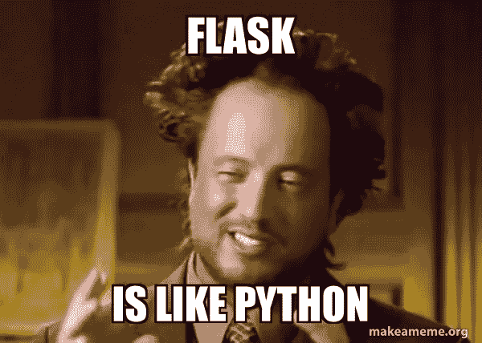
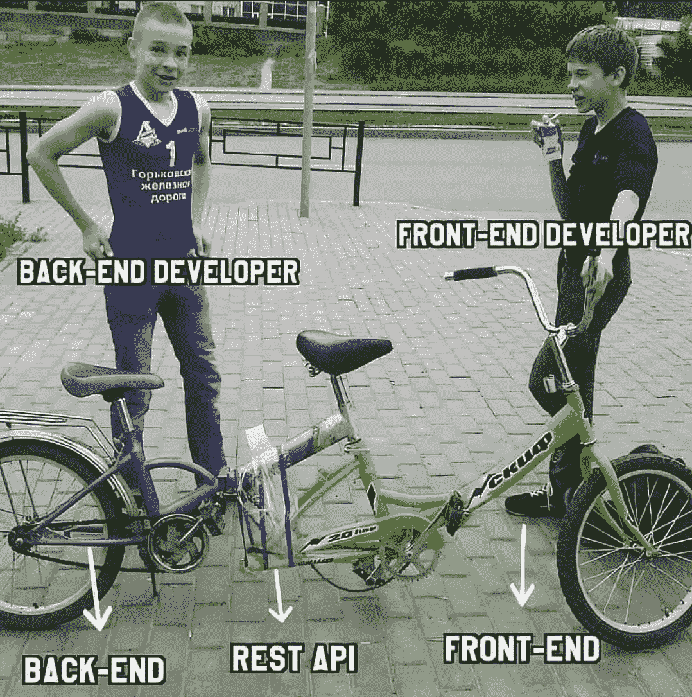
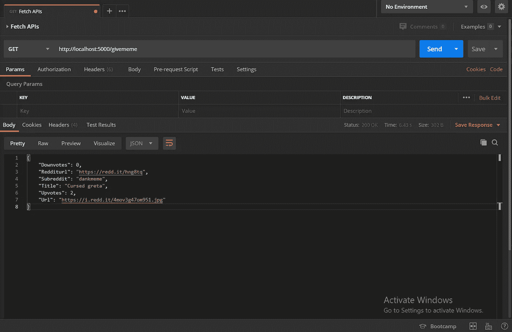
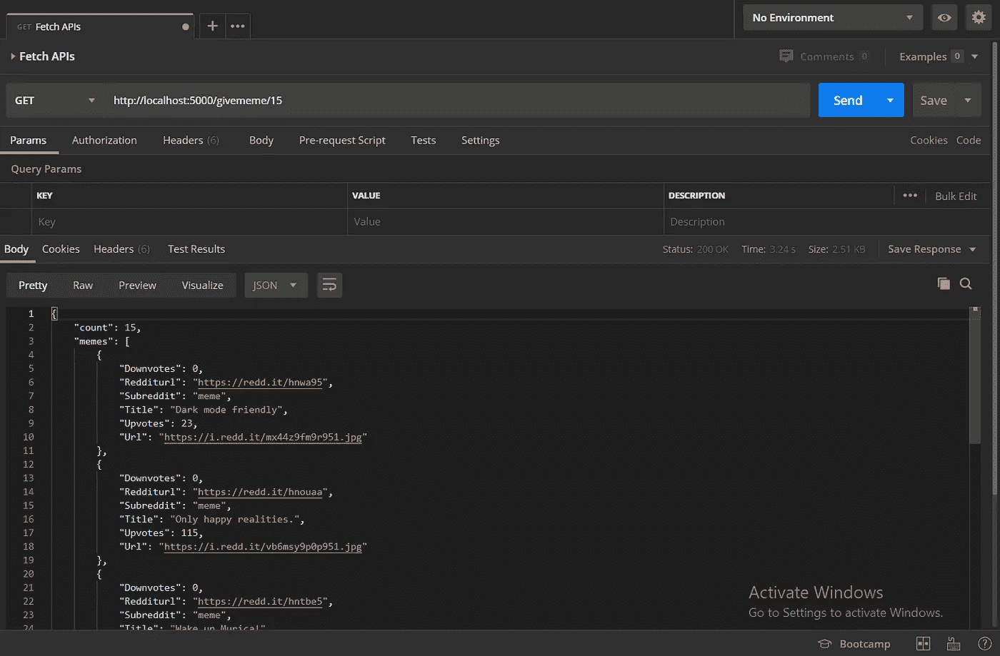

# 使用 Python 和 Flask 构建获取迷因的 API

> 原文：<https://medium.com/analytics-vidhya/building-an-api-to-fetch-memes-using-python-and-flask-f0991a949be0?source=collection_archive---------9----------------------->

了解如何构建一个 Flask REST API，从 Reddit 获取迷因和引语


在 [Unsplash](https://unsplash.com?utm_source=medium&utm_medium=referral) 上由[路易斯·里德](https://unsplash.com/@_louisreed?utm_source=medium&utm_medium=referral)拍摄的照片

作为一名前端开发人员，如果您正在进入复杂的后端开发，并且您对现有的选项感到困惑，那么从 Python 开始将是您的最佳选择。Python 是一种解释语言，已经被 Web 开发人员、数据科学家、应用程序开发人员等广泛使用。有了相当温和的学习曲线和易于理解的语法，它将是您以相当快的方式开始后端开发之旅的最佳选择。

与任何其他语言类似，Python 有大量的框架来开发后端接口。一些最受欢迎的是 Django，Flask，Web2Py 等等。它们用于非常快速地进行设置，并帮助您开始应用程序的业务逻辑以及与数据库层的交互。在本文中，我们将主要介绍 Flask，以及如何使用 Flask 快速开发应用编程接口(API ),从而获取迷因和引用。


嗯，就是这么简单！

# 什么是烧瓶

Flask 是一个微型网络框架，用于为你的应用程序开发后端接口。这是一个轻量级的框架，占用空间小，可以很快地设置好，有一个简单但可扩展的核心。当我们谈论后端时，我们必须理解它是从服务器向用户发送数据的服务，用户位于客户端。



随着依赖架构模式进行扩展的复杂应用程序的出现，服务现在被分解成由代表性 API 处理的组件。通过 API，每个服务都可以独立部署，并提供改进的故障隔离。这些 API 可以耦合到离散的任务，也可以用于相互通信以传递数据。

这些 API 可以用来包装操作，因此它们被广泛用于开发后端接口，并使它们与客户端接口通信。目前使用的最常见的 API 模式之一是 REST API，其中 REST 代表表述性状态转移。它们利用超文本传输协议(HTTP ),并可以通过 HTTP 请求进行通信，该请求指定了需要完成的操作。



REST API 允许您的客户端与服务器端通信

Flask 可用于开发这些 REST APIs，其中简单的 HTTP 方法可用于客户端和服务器端接口之间的通信。每个 API 请求由四部分组成:**端点、方法、头**和**主体。**

端点定义用户请求的 URL 路由，而方法定义请求的类型。它可以是 GET、POST、DELETE 或 PUT/PATCH 请求。头部是一段信息，通常在客户端和服务器之间传递以进行身份验证，而主体决定我们需要传递给服务器的信息。


这是总结服务器端一切的一种非常快速的方法。让我们看看如何使用 Flask 快速构建一个 API，以 JSON 格式返回当前请求的日期时间:

我们设法在 15 行代码内为 Flask API 构建了两个端点。 **@app.route** 装饰器将 HTTP 请求映射到函数，并以 JSON 的形式返回 HTTP 响应。 **jsonify** 将日期时间包装在消息中，并作为 HTTP 响应传递。

# 让我们构建应用程序

现在，我们将构建一个可以为我们获取迷因的 API，我们将为我们的应用程序定义多个端点，以便为用户提供可扩展性和定制选项。我们将使用 Praw，它是一个 Python Reddit API 包装器，帮助我们直接从 Reddit 获取迷因。让我们开始为我们的目的创建一个虚拟环境。

为您的所有代码创建一个文件夹，打开适用于您的操作系统的命令行工具，然后输入以下命令:

```
$ pip install virtualenv
```

安装好`virtualenv`后，您可以通过简单的命令激活虚拟环境:

```
$ virtualenv env
```

这将在当前目录下创建一个新的 Python 可执行文件。设置完成后，您可以继续激活虚拟环境:

```
$ activate
```

如果需要，您也可以使用简单的命令`deactivate`虚拟环境。让我们继续创建一个简单的 Flask API。输入以下命令并键入:

```
$ pip install flask
```

打开 VS Code/PyCharm，做一个文件`app.py`，推入下面的代码:

通过打开命令行并按下按钮来启动你的代码:`python app.py.`这将启动你的代码，你将有一个运行在端口 5000 上的 Web 服务器，并显示消息`'Hello World from Python Flask!'.`很简单，不是吗？

让我们在一个单独的文件中定义 API 的逻辑层。我们需要`praw`，所以我们将通过 Python 包管理器安装它:

```
$ pip install praw
```

转到 [Praw 的文档页面](https://praw.readthedocs.io/en/latest/getting_started/quick_start.html)，看看如何在 API 中使用包装器之前进行 OAuth 认证。您可以注册您的应用程序以构建 Web 应用程序，您将获得以下内容:

1.  由 14 个字符组成的客户端 ID。
2.  27 个字符的客户端密码。
3.  您正在使用的 Reddit 帐户的密码。
4.  您的 Reddit 帐户的用户名。

让我们创建一个名为`Main.py`的文件来定义我们的逻辑函数。让我们通过运行应用程序的用户运行来验证这一点:

现在让我们定义一个函数，它可以用来检查我们的图像是否是一个 **JPEG/PNG** 。这将用于检查我们正在获取的图像是否是有效图像:

现在就来个迷因吧。我们将定义一个传递两个参数的函数:`sub`表示我们想要从中获取迷因的子编辑，`count`表示我们想要获取的迷因的数量。现在让我们来定义这个函数:

我们将获取 **Title、URL、Upvotes、Downvotes、Reddit-URL** 和 **Subreddit** 并将其附加到结果中，然后从函数中返回。我们将定义一个类似的函数来从子编辑和指定的计数中获取引号:

**提交**定义特定子编辑中最热门的提交，而**自文本**定义特定提交的降价内容。代码的其余部分是不言自明的，在进一步定义 API 端点之前，您可以进一步使用它。

# 让我们来构建 API

回到`app.py`文件，让我们开始为我们的应用程序定义 REST API 端点。删除我们之前在文件中写的所有代码，因为我们将重新开始。让我们首先通过导入必要的库并创建一个运行的应用程序，来定义我们想要从中获取迷因并初始化 Flask 应用程序的子编辑:

现在让我们在单个函数上添加装饰器，将它们转换成一个为我们的后端服务定义新 URL 的“Route”。让我们创建一个端点，在用户启动 API 后，在屏幕上显示我们的“欢迎”消息:

让我们定义一个端点，它将作为一个迷因从一个随机的子编辑中返回。我们将利用之前在我们的`Main.py`文件中定义的`get_meme()`和`check_image()`函数来获取随机的迷因。我们将获取标题、帖子的 URL、投票数、图片的 URL，最后是获取迷因的子编辑。

现在让我们定义一条路径，从我们选择的子编辑中返回一个迷因。我们将把我们的代码放在一个 Try-Catch 块中，以确保在 Subreddit 不存在的情况下返回 404 消息。我们将以 JSON 的形式返回所有数据，并从我们正在获取的特定子编辑中随机选择一个 Meme。

这方面的代码非常简单明了，所以让我们继续构建更多的端点，并使用我们之前定义的所有函数向我们的 API 添加更多的功能。

我们现在将创建一个端点，根据给定的计数获取迷因。现在让我们为此编写代码:

我们在这里增加了一个 50 的计数，这样如果用户要求超过 50 个迷因，我们将相应地发送一个错误消息。我们将实现另一种途径，从特定的子编辑中获取大量的迷因。让我们来实现它:

让我们看看到目前为止我们已经实施了哪些终端:

1.  **/givememe:** 从我们定义的任何子编辑中随机返回一个 meme。
2.  **/givememe/ < sub > :** 从用户指定的子编辑中返回一个 meme。
3.  **/give meme/<int:c>:**从我们已经定义的任何子编辑中返回一些 meme。
4.  **/give meme/sub/<int:c>:**从用户指定的子编辑中返回多个 meme。

我们现在将定义类似的路径来从子编辑中获取引用文本。代码非常简单明了，当我们在这里实现进一步的路由时，您可以浏览它们。

让我们实现一个从用户指定的子编辑中获取报价的路由:

现在让我们实现最后一个函数路由，从特定的子编辑中返回一些报价:

我们还将定义一个 404 路由，这样，如果用户指向了一个未指定的 URL，就可以返回错误消息。

现在我们已经构建了 API，让我们添加启动应用程序的最后一段代码。

# 测试 API

既然我们已经构建了所有的 API 端点并定义了其中的逻辑，我们将继续在所有合适的端点测试我们的 API。在这里，我将利用 Postman 来测试我们的 API 端点。如果你没有安装 Postman，你可以利用你的浏览器来测试我们所有的 API 端点。

打开命令行工具，输入命令:

```
$ python app.py
```

这将在端口 5000 启动服务器。打开 Postman 并创建一个新请求。让我们推入 API 端点:`http://localhost:5000/givememe`来创建一个请求:



200 OK 状态响应和我们的 JSON 响应

我们可以在其他端点上进一步试验，以进一步探索我们的 API 是如何工作和发挥作用的。让我们看看另一个 API 端点，通过传入来获取 15 个随机迷因:`http://localhost:5000/givememe/15`来创建一个请求:



一条 200 OK 状态消息和一条 JSON 响应消息

您也可以在浏览器上测试这些端点，它们会向您发送正确的 JSON 响应。您现在可以自由地试验这些端点，并根据您的需要和目的对它们进行定制。

# 结论

在本文中，我们讨论了 API 开发的复杂性，以及如何使用 Flask 和 Python 快速构建微服务 API，以便从特定的子编辑中获取迷因和引用。我们还学习了如何定义端点，并使用 Postman 测试它们。我们已经准备好了一个全功能的 API，现在我们可以为应用程序集成一个前端，这也可以为我们带来一个现成的模因共享网络。

那么，接下来呢？使用 Flask，您可以进一步探索开发 RESTful APIs 并将其部署在基于云的服务上，如 Azure 或 Heroku。您可以开始探索如何使用 Flask 开发可伸缩的特性，Flask 可以处理大量的请求等等。与 Django 或 Ruby on Rails 不同，它们在完成设置后会自动生成多个文件，Flask 为您提供了更多的功能，并帮助您准确定义这里需要的内容。


留下掌声