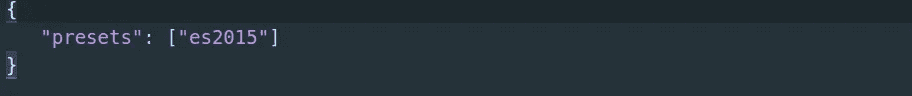

# 用 Node.js 构建 API

> 原文：<https://medium.com/analytics-vidhya/building-an-api-with-node-j-part-1-4fa35071312b?source=collection_archive---------16----------------------->

随着 Node.js 环境的安装和运行，我们将探索 REST API 应用程序的
创建。这种类型的应用程序目前正由许多项目和公司开发，因为它提供了创建只关注任何客户端应用程序的数据馈送上的
的应用程序的好处。

如今，创建 web 应用程序和/或移动应用程序来使用来自一个或多个 API 的数据是很常见的。

这使得几种类型的客户端应用程序都要咨询同一台服务器，专注于数据处理。此外，它还允许不同的团队开发每个应用程序，无论是客户端还是服务器。我们将首先构建一个 API，但是在最后几章中，我们将构建一个简单的客户端 web 应用程序来使用 API 中的数据。

为了开始开发 API，我们
将使用一个非常流行的叫做 [***Express 的 web 框架。***](https://expressjs.com/)

# Express 简介

Express 是一个极简主义的 web 框架，它从 Ruby 语言的 Sinatra 框架中受到了很大的启发。使用这个模块，您可以创建从小到大的复杂应用程序。这个框架允许你构建 API 和创建简单的网站。

它专注于与**视图**、**路径**和**控制器**一起工作，只有**模型**不由该框架处理，让您可以自由使用任何持久性框架，而不会在应用程序中产生任何不兼容或冲突。

这是一个很大的优势，因为有很多 ODM
*(对象数据映射器)*和 ORM *(对象关系映射)*可用。你可以使用任何人的 Express 没有问题，你只需要加载这种模块，写一些模型和
在**控制器**、**路线**或**视图**中使用它们。

综上所述，下面可以看到一个 Express 主要特性列表:
·健壮路由；
·易于与大量模板引擎集成；
·极简代码；
·使用中间件概念；
·要集成的第三方中间件的庞大列表；
·内容协商；
·采用 REST APIs 的标准和最佳实践；

# **试点项目的启动**

在实践中创建一个项目怎么样？从第一部分开始，我们将探索如何使用一些 Node.js 框架创建 REST API。我们的应用程序将是一个简单的任务管理器，它将分为两个项目:API 和 Web 应用程序。我们的 API 将被称为 Build_Api_Node_part1，并具有以下特征:

*   任务列表；
*   创建、删除和更新任务。
*   创建、删除和更新用户数据；
*   用户认证；
*   API 文档页面；

# **试点项目源代码**

如果你很想看看本书中将要探索的所有项目的源代码，就访问这个链接:【https://github.com/Savalone47/Build_Api_Node_part1

首先，我们将使用以下命令创建第一个名为 Api_Node 的项目:

> mkdir Api _ Node
> CD Api _ Node
> NPM init-y

当前的 Node.js 版本不完全支持 ES6，但是我们可以使用一个模块来模拟 ES6/ES7 的一些资源，使我们的代码更酷。为此，我们将安装巴别塔。只有当 JavaScript 运行时不能识别某些 ES6/ES7 特性时，JavaScript transpiler 才负责将 ES6/ES7 代码转换成 ES5 代码。

要使用 ES6/ES7 的所有功能，我们将在项目中安装 babel-cli 和 babel-preset-es2015 模块，运行以下命令:

> npm 安装 babel-CLI @ 6 . 5 . 1 babel-preset-es 2015 @ 6 . 5 . 0—保存
> npm 快速安装@4.17.1 —保存
> npm 安装交付@0.1.6 —保存

现在，您需要链接预设的 babel-preset-es2015 以被 babel-cli 识别，为此，只需创建文件。babelrc 代码很简单:

安装 Express，我们将创建我们的第一个代码。这段代码将加载 express 模块，使用 GET / via 函数 app.get("/")创建一个简单的端点，并使用函数 app.listen()启动端口 3000
中的服务器。为此，使用以下代码创建 app.js 文件:

然后，打开浏览器，进入:localhost:3000
如果没有出错，将会显示一个 JSON 内容，类似下图:

# **应用简单的静态资源**

REST APIs 使用创建和操作资源的概念。这些资源是用于查询、条目、更新和删除数据的实体，顺便说一下，一切都是基于对资源中的数据进行操作。

API 旨在处理和统一数据，最终构建和显示资源。最初，我们将使用静态数据，但在整本书中，我们将进行一些重构来集成数据库。

在此期间，静态数据将仅用于构建终点。为了塑造我们的 API，我们将通过 app.get("/node ")函数包含一个路由，该函数将通过 res.json()函数仅返回一个静态 json，该函数负责将 JSON 内容呈现为输出。这里我们预计 app.js 文件的执行，结果如下:

# 模块装载装置

事实上，将所有端点写入 index.js 并不是明智之举，尤其是如果您的应用程序有很多端点的话。所以，让我们根据他们的职责来安排目录和所有代码的加载。

我们将应用 *MVR(模型-视图-路由器)*模式来安排这个事情。为此，我们将使用委托模块，它允许轻松地加载和注入依赖项。所以，我们来安装吧！

安装了这个新模块后，让我们将 index.js 文件中的端点迁移到名为 routes 的新目录中，创建一个新文件。为此，创建文件 routes/task.js:

将端点函数 app.get("/node ")从 app.js 移动到他的新文件 routes/task.js:

要完成这一步，请编辑 app.js，以便能够通过委托模块加载这些路线并启动服务器:

就这样，我们刚刚安排好所有**航线**的装货。请注意，在这一点上，我们只关注 MVR 模式中的 VR *(视图和路由器)*。在我们的例子中， **JSON** 输出被
认为是由路由提供的视图。下一步将是安排**型号**。让我们创建模型目录，并返回 app.js，在*commission()*中再添加一个 *include()* 函数，以允许在路由之前加载模型。为了使这个修改更加清晰，
编辑 app.js:

在这种情况下，commission()函数不会加载任何模型，因为 models 目录不存在。为了填补这个空白，我们暂时用静态数据创建一个模型，就为了完成这一步。为此，创建文件 models/task.js 并填入以下代码:

要在 routes/task.js 文件中调用它，您将通过 app 变量加载该模块。毕竟，commission()函数添加的模块是注入到一个主变量中的，在我们的例子中，是通过 commission()注入到 app 中的。进(app)；。为了了解如何使用加载的模块，在本例中，我们将使用
app.models.task 模块，按照以下代码编辑 routes/task.js:

为了完成这些重构，让我们创建一个文件，它将加载 Express 的所有中间件和特定设置。目前，我们只有一个关于 JSON 格式的简单配置，它是通过函数 app . set(“JSON spaces”，4)实现的。但是，我们将包括另一个设置，在
这种情况下，它将是调用 app.set("port "，3000)函数的服务器端口。