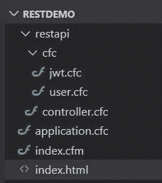
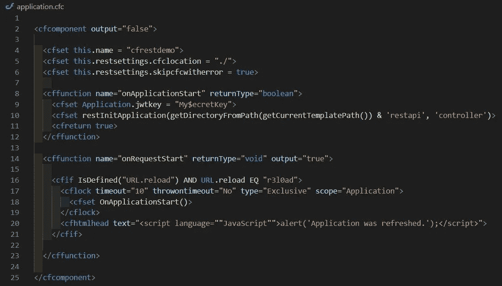
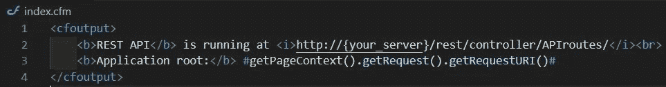
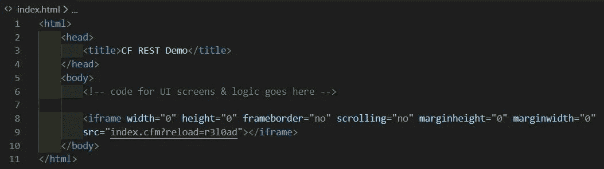
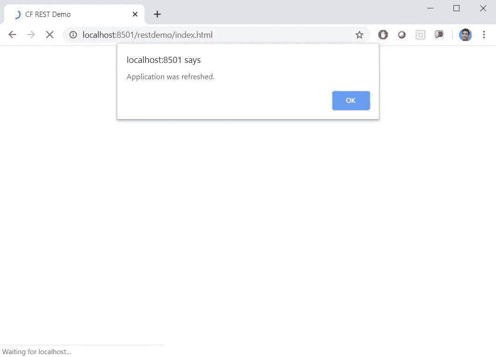
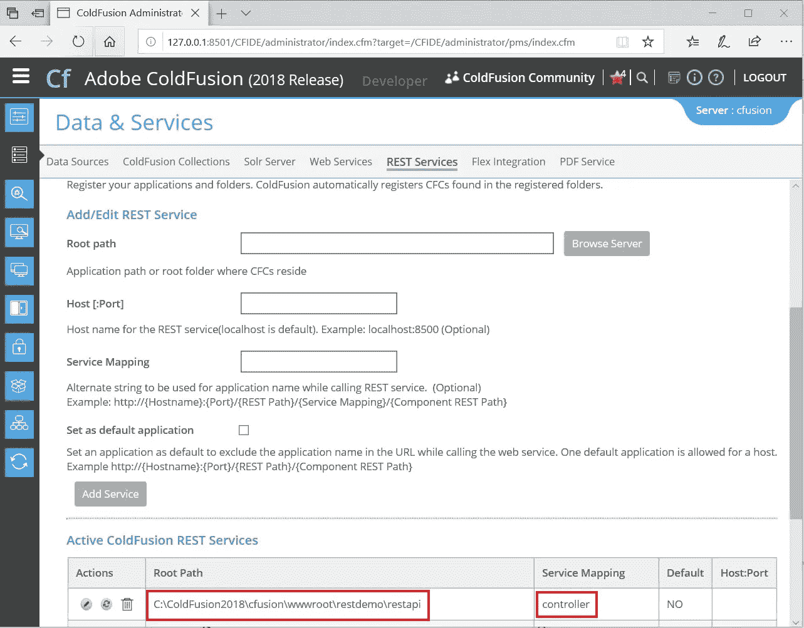
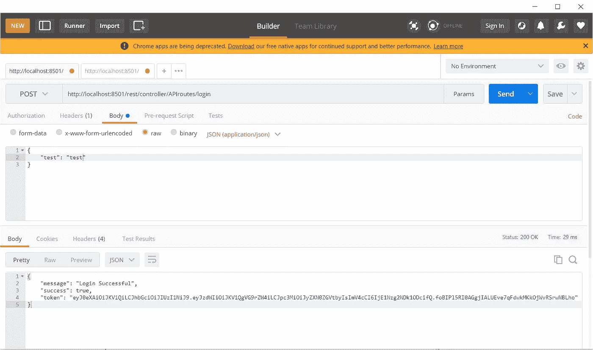
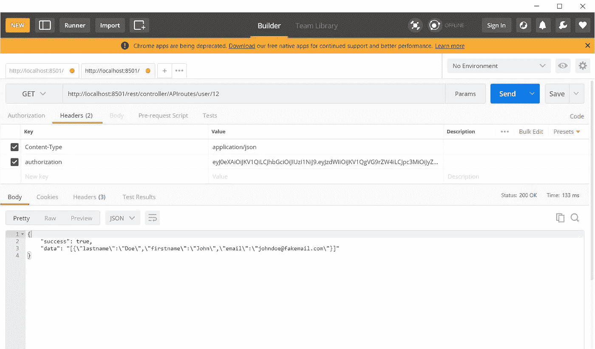

# 使用 Coldfusion 构建出色的 RESTful APIs

> 原文：<https://medium.com/analytics-vidhya/building-an-awesome-restful-apis-with-coldfusion-86422f6b2b6f?source=collection_archive---------1----------------------->

## 一个超级简单有趣的构建微服务的方法！

马丁·施瑞德在 [Unsplash](https://unsplash.com/?utm_source=unsplash&utm_medium=referral&utm_content=creditCopyText) 上的照片

ColdFusion 是制作 web 应用程序和 REST APIs 的优秀编程语言。ColdFusion 应用程序服务器为我们提供了易于使用的 web 界面，可以手动或编程方式注册 REST 服务。

在本文中，我将使用 Jason Steinshouer 编写的 [CF-JWT-Simple](https://github.com/jsteinshouer/cf-jwt-simple) 构建一个简单的 ColdFusion REST API 和 JWT 认证。

## **工具&所需应用**

*   ColdFusion 2018 应用服务器
*   邮递员
*   你最喜欢的 IDE

## ***让我们开始吧……***

我们将首先在您的 coldfusion wwwroot 文件夹中创建一个新的项目文件夹。我将这个项目命名为 ***restdemo*** 。让我们在根文件夹中创建另一个文件夹，并将其命名为 ***restapi*** ，所有 restapi 都将驻留在这里。请参见下面的项目结构。

**项目结构**

项目结构

现在让我们浏览每个文件和文件夹，并详细讨论其内容。

**application.cfc**

应用程序. cfc

上面第 4 行的代码片段声明项目名称为 ***cfrestdemo*** ，后面是第 5 行& 6 行 ***restsettings*** 配置。

***on application start***方法在第 9 行声明了一个应用程序变量 ***jwtkey*** ，在第 10 行声明了***restInitApplication***方法，这有助于我们注册/重新注册 REST 服务。我们还可以指定一个替代字符串，它可以在调用 REST 服务时用作应用程序名称。所以，这里我给它起了个名字叫 ***控制器*** 。

这种方法在开发环境和生产环境中都很方便，在生产环境中，我们无法访问 ColdFusion Administrator。

***onRequestStart*** 方法什么都不做，除非它遇到 URL 变量 ***reload*** 的值为 *"r3l0ad"* 。这将触发 ApplicationStart 方法上的**，该方法注册/重新注册我们的 REST 服务并显示一个 *alertbox* 和一条消息*“应用程序已刷新”*。**

> **注意:**为了简洁起见，我排除了其他 application.cfc 方法。

**index.cfm**

index.cfm

上面的文件没做什么，只是显示了 REST API 路径和应用程序根路径。这个文件的唯一目的是调用 *application.cfc* ，当我们在浏览器中运行 *index.cfm* 时会自动调用。

**index.html**

index.html

在 spa 时代，没有必要创造任何*。cfm* 文件。所有的 UI 屏幕和逻辑都可以使用任何这样的前端框架来构建，所以我们仍然可以通过使用上面的技巧来调用我们的 *index.cfm* 文件。

**controller.cfc**

***controller . CFC***是 REST API，因为它被标记为 *rest="true"* ，它的别名是 *APIroutes* 。所以 REST API 路径会是[*http://{服务器名}/REST/controller/API routes/*](http://{server_name}/rest/controller/APIroutes/)

该组件还导入了 ***user.cfc*** ，其中包含了访问用户相关数据的方法。

***验证*** 方法用于验证 JWT 令牌，它在所有安全 API 中调用，用户必须登录才能访问任何服务器资源。该方法在 http headers 参数中查找授权密钥，以验证其有效性。

***登录*** 方法是一个不安全的 API，它方便用户使用 POST 动词使用他们的登录凭据登录到他们的帐户。

***getuser*** 方法是一个安全的 API，它获取用户的详细信息，其 id 使用 GET 动词在 API 路径中传递。

**user.cfc**

***user.cfc*** 是一个简单的 coldfusion 组件，可以访问数据库等服务器资源。

***loginUser*** 方法根据数据库验证用户凭证，并生成 *JWT 令牌*，返回给客户端。客户端在本地存储这个 JWT 令牌(在一个 cookie 或本地存储中)，并通过任何安全 API 调用将其作为一个*授权*头参数发送。

***userDetails*** 方法返回其 id 作为参数传递的任何用户的用户详细信息。

**jwt.cfc**

***jwt.cfc*** 是 CFML 组件的[库](https://github.com/jsteinshouer/cf-jwt-simple/blob/master/jwt.cfc)，用于编码和解码 [JSON Web Tokens (JWT)](http://self-issued.info/docs/draft-ietf-oauth-json-web-token.html) 。

# 是时候看看我们的代码了

我们将从在 web 浏览器中执行[*http://localhost:*](http://localhost:{your)*8501/rest demo/index . html*开始。这将在内部触发 *index.cfm* ，它将自动调用 *application.cfc* 。因此，这将在 ColdFusion Administrator 中注册我们的 REST 服务。

在浏览器中运行 index.html 会注册 REST APIs

REST API 在 ColdFusion 管理器中注册成功

## 用 Postman 测试 REST API

[*http://localhost:8501/rest/controller/API routes/log in*](http://localhost:8501/rest/controller/APIroutes/login)可以在没有 *authorization* 头的情况下调用，因为它是一个非安全 API，调用它是为了让用户使用其登录凭证登录。

这个 API 使用 POST 方法，由于我们并不真正根据任何数据库来验证用户凭证，所以我们在请求体中发送一个虚拟的原始 JSON 对象。

如果用户登录成功，该 API 将返回一条*“登录成功”*消息和一个 JWT 令牌，或者如果登录不成功，它将返回一条*“不正确的登录凭证”*消息。

用邮递员发送邮寄请求

[*http://localhost:8501/rest/controller/API routes/user/1*](http://localhost:8501/rest/controller/APIroutes/user/1)*2*必须用授权头调用，因为是安全 API。这里*userid*‘12’只是一个伪 id，但它是一个强制参数。

*授权*头参数值必须是 JWT 令牌，在成功登录后，由[*http://localhost:8501/rest/controller/API routes/log in*](http://localhost:8501/rest/controller/APIroutes/login)*API 返回。*

**

# *结论*

*正如你所看到的，就像 NodeJS 一样，ColdFusion 是另一个非常容易创建微服务的好选择。在上面的文章中，为了使这篇文章简洁明了，我只演示了两个 API。*

*你可以看我的 [YouTube 教程](https://www.youtube.com/watch?v=4GkXanOqH88)，我在里面详细解释了所有的 CRUD 操作。*

*我希望你会喜欢读我的文章，请告诉我你的想法。*