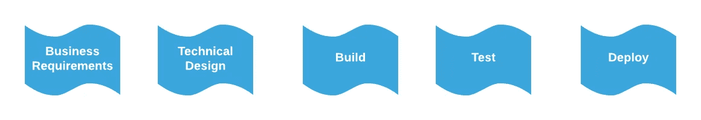
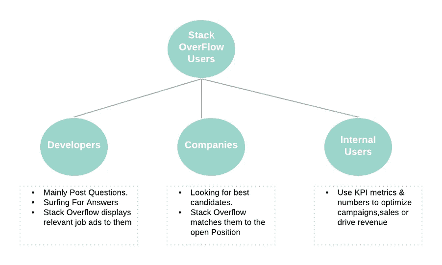
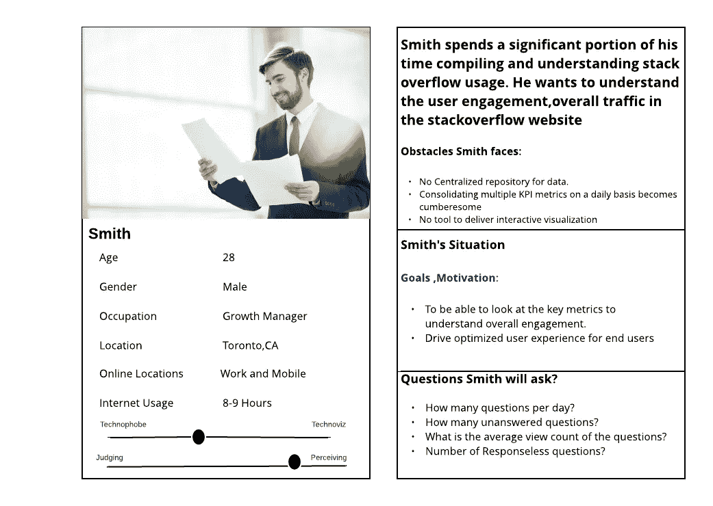
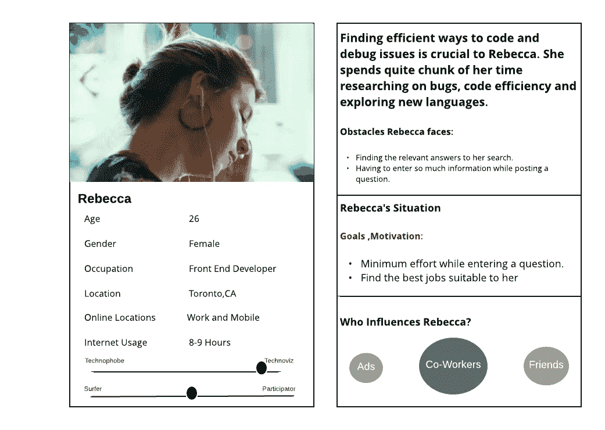
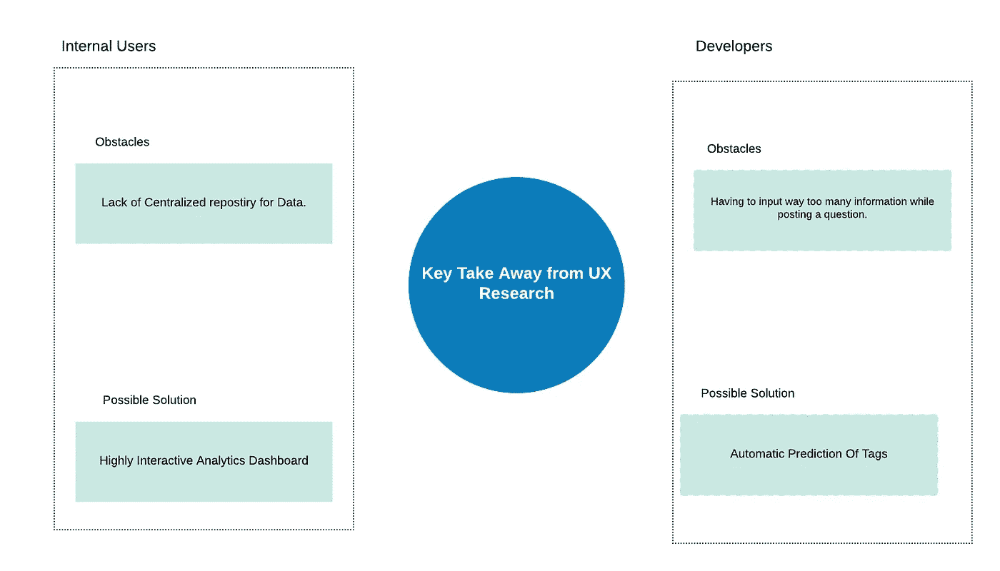

# 使用 Einstein Analytics、Kinesis、Spark 和 Redshift 构建端到端分析管道。

> 原文：<https://medium.com/analytics-vidhya/building-an-end-to-end-analytics-pipeline-using-einstein-analytics-kinesis-spark-and-redshift-6d9fe1feb3c3?source=collection_archive---------15----------------------->

[https://bq-magazine . com/the-7-habits-of-good-data-scientists/](https://bq-magazine.com/the-7-habits-of-good-data-scientists/)

如果你是一名计算机程序员或在任何技术相关行业工作，那么很有可能每天至少一次在**堆栈溢出**中搜索答案。

**Stack Overflow** 是一个面向专业和爱好者程序员的问答网站。该网站为用户提供了一个提问和回答问题的平台，并通过积极参与对问题和答案进行投票表决。

本系列旨在提供关于使用 **AWS 堆栈**构建、**设计**和**开发**用于堆栈溢出的**分析\AI 数据管道**的综合视图，并最终在**爱因斯坦分析**中构建仪表板。

管道是分析和 ML 的核心，通常这是分析或 ML 问题中最困难的部分。如果你有一个**设计良好的管道，**那么你就成功了一半。

因为这将是一篇长文，我想用 6 篇不同的文章来讨论这个问题。随意跳到任何引起你兴趣的文章。

1.  ***栈溢出及业务需求介绍。***
2.  [***分析管道的技术设计架构***](/p/fe14643c67fd) ***。***
3.  [***使用 Kinesis Firehose 和 boto3 摄取数据。***](/p/5fec529f2a51)
4.  [***在 AWS EMR 上使用 Apache Spark 进行 ETL 和数据处理。***](/p/3e889784ba70)
5.  [***数据存储在红移中。*T54**](/p/6fd649f25854)
6.  [***爱因斯坦分析数据准备&仪表盘***](/p/18b4a5aa135b) ***。***

所以让我们直奔主题吧！！

## 任何项目流程中的关键步骤

项目管道

## 了解业务需求

设计任何分析或数据科学项目的第一步是了解它如何**为最终用户带来价值**。

**我们可以通过两种方式来理解这一点:**

1.  了解**应用**的**主要用户群**或最终用户。
2.  **公司**如何通过**迎合那些用户群**来赚钱。

## 那么谁可能是栈 over flow 用户呢？

堆栈溢出用户

## 让我们更详细地了解一下我们的用户！！

**了解我们的用户**对于收集业务需求至关重要，而 **UX** 在这里扮演着关键角色。任何设计良好的管道都是无用的，如果它不能满足用户的需求。

> *创建* ***用户角色的*** *是帮助指导构思过程和理解不同用户的需求、期望和行为的一种方式。*

就个人而言，我发现**用户研究**和**人物角色的**在设计仪表盘和节省大量时间和效率方面非常有效。

所以，让我们看看在做了一些模拟用户研究后开发的人物角色。

> 这里我想把重点放在内部用户上，因为他们最有可能利用仪表板。

然而，如果你的管道设计得很好，那么它可以被**缩放**并在任何用例中重用，比如 ML 问题。

**1。内部用户的 UX 角色**

供图:ThriveGlobal.com，[https://www.interaction-design.org/](https://www.interaction-design.org/)

**2。一个开发商的 UX 角色**

UX——一个开发者的角色

## UX 研究的关键

> 一个**设计良好的管道**也可以将所有需要的数据带入一个**集中的储存库**，该储存库可以用于一个**高度互动的可视化**。
> 
> **标签的自动预测**可以是**最小化用户输入**的一个很好的方式。这是一个 **ML 用例**，如果我们的管道设计良好，那么它肯定可以用于这个目的。

## 我们的业务需求摘要

既然我们已经解决了两个角色及其棘手问题，让我们以用户故事的形式来捕捉这一点。

1.  “作为一名**成长经理，**我希望有一种方式**以**交互方式**可视化我所有的关键指标**，这样我就可以了解**用户对 **stack overflow 网站**的总体参与度**”
2.  “作为一名开发人员，我想要一个自动显示标签的**，这样我就不必自己手动输入标签”**

现在，让我们了解如何为这个业务需求构思一个技术架构。

这个在这个[篇](/@snehamehrin22/how-to-build-a-technical-design-architecture-for-an-analytics-data-pipeline-fe14643c67fd)里有解释！