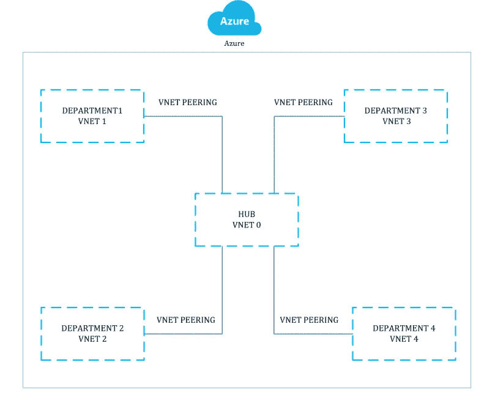
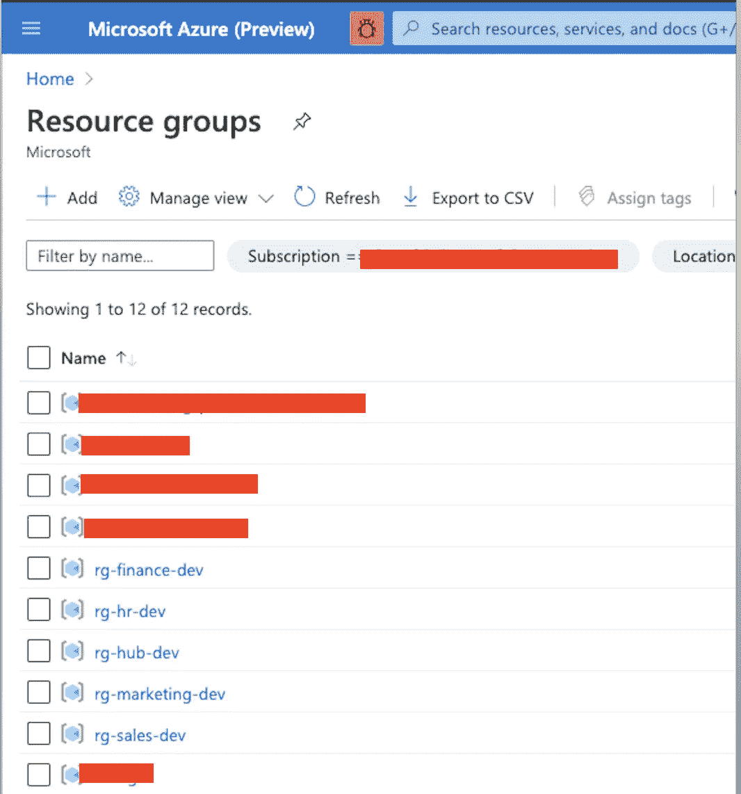
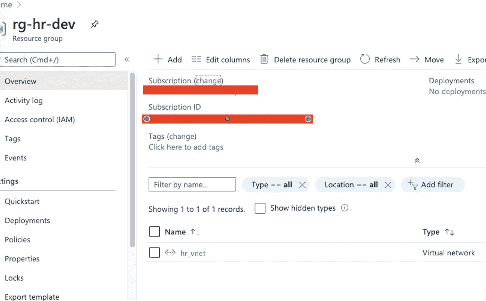
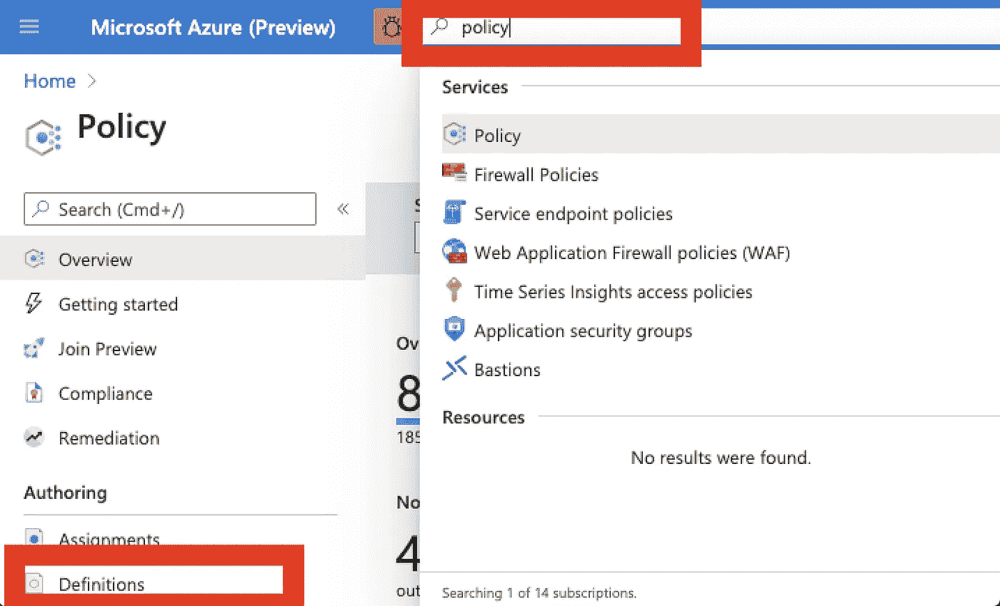
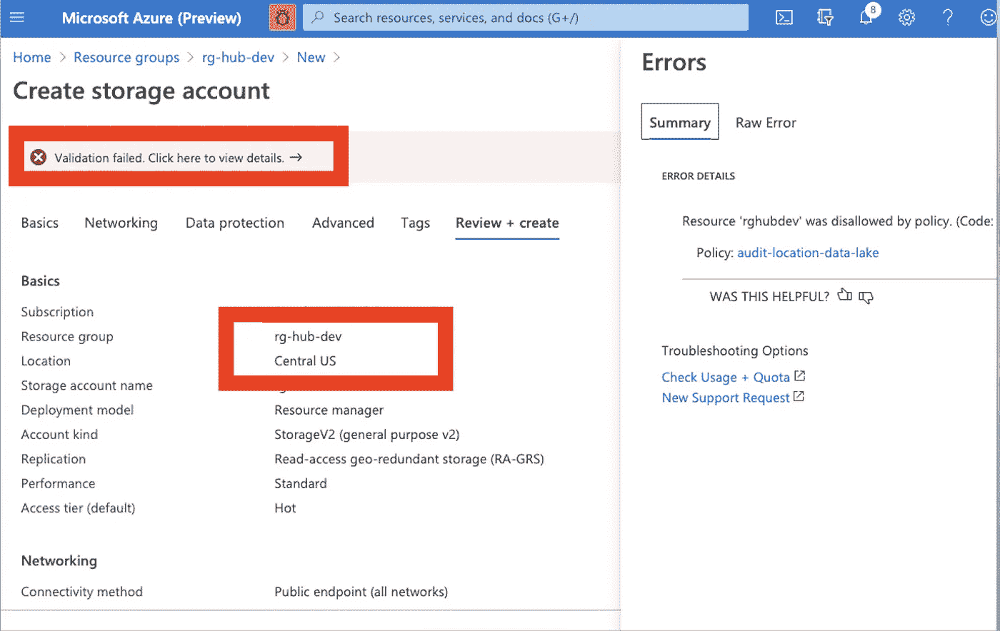
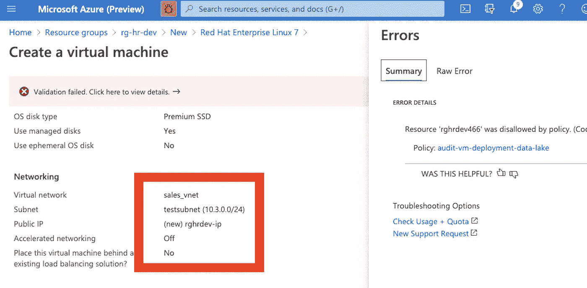

# 构建基于云安全的企业数据湖

> 原文：<https://medium.com/analytics-vidhya/building-an-enterprise-data-lake-on-cloud-security-9817e526bfd0?source=collection_archive---------26----------------------->

设计数据湖时的云安全。

在我之前的[博客](/@sarathsasi87/build-an-enterprise-data-lake-on-cloud-introduction-d906eb429cc)中，我提到了您在开始云之旅之前需要测试的基础。如前所述，本节涵盖了企业数据湖的安全性部分，本博客是增量式的，因此在后续博客中您可以看到对本博客的引用，随着我们的进展，我们将在安全性(IAM)中添加更多内容。

在设计数据湖时，安全性是必须遵守的一个不容置疑的要求。当我们开始保护您的数据湖时，在云上需要考虑多个安全层。

1.  外围安全(网络级)
2.  IAM(身份和访问管理)用于控制平面，RBAC(基于角色的访问控制)用于数据平面

外围安全可以通过一个中央团队集中管理。该团队可以定义网络拓扑并实施规则和路由，从而为团队提供安全网，同时不会被限制使用服务。这些规则可以使用[策略](https://docs.microsoft.com/en-us/azure/governance/policy/overview)来执行。

在这篇博客中，我们关注数据湖网络的整体网络拓扑结构安全，请参考[这篇](https://docs.microsoft.com/en-us/azure/cloud-adoption-framework/)。它提供了各种场景供您选择，以决定您希望如何设计从内部到 azure 的最小延迟连接。

第一件事是设计外围安全，这将定义允许各部门在哪些虚拟网络上部署，以及它们如何被中央团队的安全网覆盖。下面是一个例子:



我们的数据湖的基本网络设置

我们的想法是采用推荐的中心辐射式网络模型，其中您有一个中心，即塔/主团队，该团队监控并为团队/部门提供保护，以继续在其环境中进行积极的开发。

对于此设置，我们还为每个部门分配了一个资源组。这里有多种最佳实践，通常建议采用民主订阅模式，这意味着每个部门都有自己的订阅。由于在我的当前帐户上创建多个订阅的一些限制，我们将使用资源组作为边界。

要设置它，你需要一个 IDE，或者你也可以使用 azure 门户。在本教程中，我们将使用 IAC(基础设施即代码)原则。

接下来配置您的 VNet 范围，确保它们不重叠。想法是隔离每个部门，并使用 [VNet 对等](https://docs.microsoft.com/en-us/azure/virtual-network/virtual-network-peering-overview)将其连接到中央管理团队，该团队拥有集中的监控和警报工具。有一个了望塔的方法总是好的，以确保事情得到集中监控。

假设一个公司有 4 个部门和 1 个中心团队。通常对于企业来说，您需要更多的 IP，但是对于演示设置，我们假设使用此设置。

要设置虚拟网络的 IP 范围:

1.  对于中央集线器:10.1.0.0/24 (256 个 IP)
2.  对于部门 1: 10.2.0.0/24 ( 256 个 IP)
3.  对于部门 2 : 10.3.0.0/24(256 个 IP)
4.  对于部门 3: 10.4.0.0/24 (256 个 IP)
5.  对于部门 4: 10.5.0.0/24(256 个 IP)

你可以使用 powershell，azure cli，或者调用 REST APIs，并使用选择的语言，对于这个博客，它的 [azure cli](https://docs.microsoft.com/en-us/cli/azure/install-azure-cli?view=azure-cli-latest) 。

在这个项目下，参考 infra/create_infra.sh，随着时间的推移，这个脚本将被完善，所以使用它作为开始。

[](https://github.com/sarathsasidharan/edl-blueprint) [## sarathsasidharan/EDL-蓝图

### 企业数据湖模板。通过在…上创建帐户，为 sarathsasidharan/edl-blueprint 开发做出贡献

github.com](https://github.com/sarathsasidharan/edl-blueprint) 

```
# This creates a new resource group 
create_resource_group $RG_NAME $RG_LOCATION# This part creates all VNETs for each department
create_virtual_network $RG_NAME $DEPARTMENT_0 $VNET_DEP0# Set up VNet Peering
create_virtual_network_peering $RG_NAME_DEP0 $RG_NAME_DEP1 $DEPARTMENT_0 $DEPARTMENT_1
```

该脚本执行以下内容:

1.  创建一个[资源组](https://github.com/sarathsasidharan/edl-blueprint/blob/master/infra/resource-group/create_rg.sh)，需要在其中部署资源
2.  在之前创建的资源组中创建一个 [VNET](https://github.com/sarathsasidharan/edl-blueprint/blob/master/infra/network/create_network.sh) ，并分配 IP 范围
3.  [VNET](https://github.com/sarathsasidharan/edl-blueprint/blob/master/infra/network/create-peering.sh) 从各部门到中央枢纽的对等关系。

参考[配置](https://github.com/sarathsasidharan/edl-blueprint/blob/master/infra/config/azure.config)文件，查找每个虚拟网络使用的部门名称和 IP 范围。

在脚本的这一部分运行之后，您可以参考门户来检查资源组是否已配置，VNet 是否已配置，以及 VNet 对等是否已从 hub 应用到部门。



每个部门创建的资源组

单击这些资源组链接以检查其中的资源，应创建一个虚拟网络，单击此虚拟网络资源链接，如果您从左侧刀片选择对等，对等信息也应可见。



下一步是检查我们希望团队遵守的某些防护栏/规则。这是使用 [azure 策略完成的。](https://docs.microsoft.com/en-us/azure/governance/policy/overview)

为此，让我们考虑以下护栏:

1.  团队需要部署的任何虚拟机都应该连接到为该团队分配的虚拟网络。
2.  仅在西欧/北欧部署资源的地点。

您可以设置多种规则，但是让我们从这些规则开始，随着时间的推移，我们将丰富这些策略。

在这里，我们特意选择了两种类型的策略，一种是 azure 自带的内置策略，您只需将其分配给作用域实体(管理组/订阅/资源组/资源),第二种是创建新的自定义策略定义，然后分配给作用域。

在这一点上，第 1 点是自定义策略，第 2 点是内置策略。

在文件 infra/create_infra.sh 中。让我们看一下自定义策略的创建。该策略限制在分配给团队的虚拟网络之外部署任何虚拟机。该方法创建一个策略，接受策略名称、显示名称和描述作为参数来创建新的策略定义。

```
# This is to create a new policy definition
create_policy $POLICY_VNET $POLICY_VNET_DISPLAY_NAME $POLICY_VNET_DESC
```

您可以通过在“搜索”选项卡中搜索“策略”来检查此策略是否已应用，在此选项卡下，选择“定义”以检查定义的策略是否已列出。



为了定义策略，你需要提供两个文件，一个参数文件和策略定义，点击[这里](https://github.com/sarathsasidharan/edl-blueprint/tree/master/infra/policy/audit-vm-deployment-data-lake/definition)。

在参数文件中，我们提供将要使用的参数，在这种情况下，范围是我们将 vnet 作为参数传递到的资源组，这将确保例如:在资源组 rg-hub-dev 中，虚拟机只能部署到 hub-vnet 中，而不能部署到任何其他 vnet 中。

为了测试这一点，首先是限制在西欧和北欧之外创建的任何资源组中创建任何资源的策略。

尝试在西欧地区的任何资源组中创建新的存储帐户。



区域政策在起作用

由于我们为资源组分配的策略，此部署被阻止部署。

对于第二个测试，尝试在 hr 的资源组 rg-hr-dev 中创建一个虚拟机，并尝试将其部署到销售的 VNet 中。这个应该是屏蔽的。



人力资源部门的虚拟机试图部署到销售虚拟网络中

该策略禁止在销售虚拟网络上部署虚拟机。这样，我们就有了基本的网络不可协商的要求。下一篇博客将关注数据湖中第三个不可协商的需求监控和审计设置。对于 IAM 级别的控件，我们将在以后的博客中讨论。

一个 zure 蓝图是我的建议，使用公司特定的防护栏来实现 azure 环境的可扩展部署，我们将在后面详细介绍。这是大规模部署企业平台(IAM/RBAC、企业就绪资源和公司政策)的首选方式。我们还将在以后的博客中介绍如何使用 [Azure Devops](https://azure.microsoft.com/en-us/services/devops/) 来实现这些自动化。