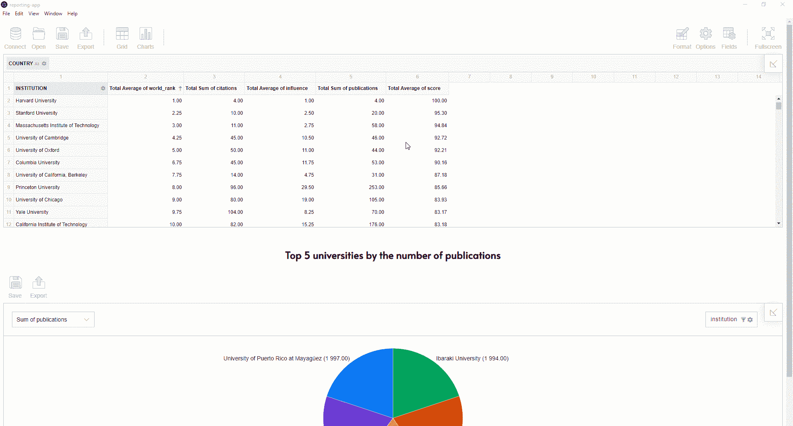

# 为桌面构建企业报表应用程序

> 原文：<https://medium.com/analytics-vidhya/building-an-enterprise-reporting-app-for-desktop-b5ea2168ea9d?source=collection_archive---------12----------------------->

# 为什么企业报告很重要？

商业智能上下文中的企业报告是将数据安排成目标受众易于理解的格式的过程。通常，报表由表格、数据透视表、图表和文本组成。

使用报告软件可以生成不同类型的报告，但最常见的是**分析报告**。

分析报告有助于从业务数据中获得洞察力，并将洞察力转化为行动和战略。

企业报告的一般目标是帮助部门或企业做出数据驱动的决策。例如，回顾公司目前的运营情况，比较不同时期的业绩，并提出适当的业务改进措施。

# 谁需要数据分析？

根据公司的角色，每个员工偶尔或每天都要做报告。

手边有一个报告工具对于那些大部分职责意味着做**数据分析和报告**的员工来说尤其重要:金融分析师、商业分析师、会计师、数据记者等等。他们每天收集、研究和分析不同的数据，以帮助部门做出明智的决策。另一个同样重要的职责是根据分析结果生成报告。

# 什么是好的报告工具？

要了解数据背后的故事，没有合适的工具是不行的。

首先，一个工具应该通过**一个直观的界面**提供所有**的基本特性**用于深入的数据分析。例如**数据** **分组**，**汇总**，**过滤**，以及**排序**特征。当这些功能开箱即用时，它尤其有益。

接下来，分析数据和创建报告应该像点击几下鼠标一样简单。没有什么能让数据分析师偏离他们的目标。

由于分享工作成果对保持公司团队合作至关重要，报告应该易于**保存为不同的格式或打印**。

报告软件的另一个重要方面是其与实时计算相关的数据处理的**响应**和**速度** **。**

最后，报告工具应该对不断变化的业务需求做出反应，这意味着它们应该足够灵活，可以根据需求进行定制。

报告工具可以是基于网络的或桌面的。

在这篇博文中，我们将主要关注用于报告的桌面应用及其优势。

# 用于数据分析的桌面软件

桌面报告应用程序是基于网络的解决方案的舒适替代方案，因为一般来说，最终用户可以在没有互联网连接的情况下运行它。

通常，人们会选择 Excel 作为企业报表的主要应用程序。这是完全合理的:它提供了丰富的数据操作和统计功能工具包，可以用包进一步扩展。尤其是**数据透视表功能**需求很大，因为它是从特定角度汇总和显示原始数据的最便捷方式。

但是说实话:使用 Excel 数据透视表并不总是容易实现您所需要的。一些棘手问题是:

*   使数据透视表显示来自数据源的最新数据。
*   数据透视表刷新后，数字格式可能会丢失。
*   每当您想要查看小计或任何其他聚合值背后的数据时，都会生成一个新的数据表。

诸如此类。

要处理类似的场景，你需要想出变通的解决方案，并且大量谷歌。

但是其他的选择可能**让报道更加顺畅和舒适。**

先说其中一个。

# 用于报告的交互式数据透视表

我建议您尝试的一个工具是 [**Flexmonster 数据透视表&图表**](https://www.flexmonster.com/?r=enterprise_reporting) —一个用于**数据可视化和报告**的 JavaScript 库。有两种使用方法:通过与 web 应用程序或桌面应用程序集成。

由于它集成了前端技术，如 **React** 、 **Angular** 和 **Vue** ，您可以使用 ElectronJS 创建一个运行在任何操作系统上的报告应用程序。

幸运的是，有一些可爱的示例项目，它们运行起来简单快捷，可以让你感觉到你可以实现什么样的结果。

如果您需要将一个工具集成到一个现有的项目中，您可以遵循[集成电子数据透视表指南](https://www.flexmonster.com/doc/integration-with-electron-js/?r=enterprise_reporting)中的几个步骤。

O 一旦你创建了一个应用程序，你的终端用户就可以:

*   连接来自 **JSON** 、 **CSV** 、 **SSAS** 、 **Elasticsearch** 数据源的数据。
*   使用**拖放**功能构建一个数据透视表。
*   **用条件格式突出显示**重要值。
*   在不同的数据可视化模式之间切换:**从数据透视表到数据透视图**，反之亦然。
*   **保存**报告并在以后快速恢复。
*   **导出结果**到 **PDF** 、 **HTML** 、 **Excel** 等。

除了交互性之外，这种应用程序的另一个优势是运行和处理数据只需要很少的内存。

# 把一切都包起来

我希望我已经启发你打开你的编辑器，尝试编码一个应用程序，这将有利于你的公司的企业报告。

让我与你分享更多**有用的指南**来帮助你开始:

*   [构建您的第一个 Electron.js 应用程序](https://www.electronjs.org/docs/tutorial/quick-start)
*   [用电子数据透视表创建跨平台 app](https://www.flexmonster.com/doc/integration-with-electron-js/?r=enterprise_reporting)

**现场演示**:

*   [带有数据透视表和数据透视图的分析仪表板](https://www.flexmonster.com/demos/dashboard/?r=enterprise_reporting)
*   [带有数据透视表和高图表的交互式仪表盘](https://www.flexmonster.com/demos/integration-highcharts/?r=enterprise_reporting)

玩得开心！