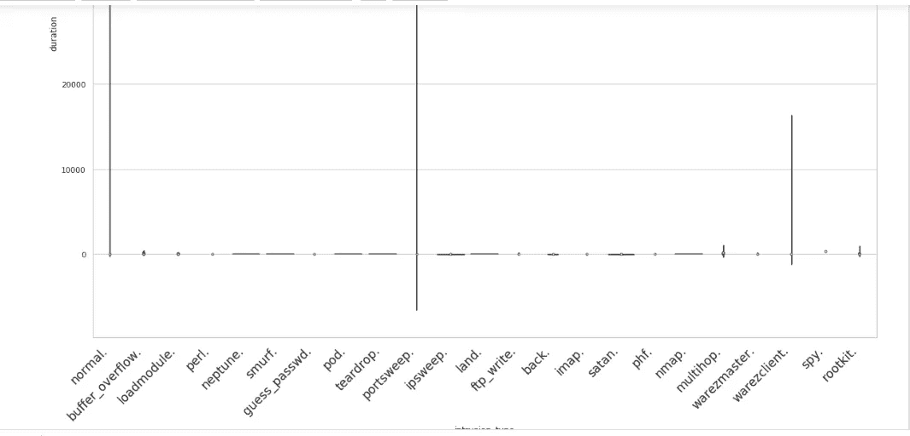

# 利用 KDD 杯 99 数据集构建入侵检测系统

> 原文：<https://medium.com/analytics-vidhya/building-an-intrusion-detection-model-using-kdd-cup99-dataset-fb4cba4189ed?source=collection_archive---------2----------------------->


图片来源:谷歌

网络入侵是计算机网络上任何未经授权的活动。检测网络入侵的软件旨在保护计算机网络免受未经授权的用户，可能包括内部人员。

# 问题陈述:-

在这个项目中，我们将构建一个网络入侵检测器，一个能够区分“坏”连接(称为入侵或攻击)和“好”或正常连接的预测模型。该数据集包括在军事网络环境中模拟的各种入侵。用于构建入侵探测器的数据由麻省理工学院林肯实验室准备和管理。目的是调查和评估入侵检测的研究。有关如何收集数据的更多详细信息，以及数据中涉及的各种功能的描述，您可以访问以下链接:

 [## KDD 杯-99 任务描述

### 本文档改编自论文《基于成本的数据挖掘建模与评估及其在欺诈中的应用》

kdd.ics.uci.edu](http://kdd.ics.uci.edu/databases/kddcup99/task.html) 

# 构建入侵检测系统:

# ㈠导入数据:

```
data = pd.read_csv('kddcup.data_10_percent_corrected', names = features, header=None)print('The no of data points are:',data.shape[0])
print('='*40)
print('The no of features are:',data.shape[1])
print('='*40)
print('Some of the features are:',features[:10])The no of data points are: 494021
========================================
The no of features are: 42
========================================
Some of the features are: ['duration', 'protocol_type', 'service', 'flag', 'src_bytes', 'dst_bytes', 'land', 'wrong_fragment', 'urgent', 'hot']
```

数据集由 4，94，021 个数据点和 42 个要素组成。功能列表及其详细信息可从以下链接获得:

http://kdd.ics.uci.edu/databases/kddcup99/kddcup.names

不同类别的输出标签如下所示:

```
output = data['intrusion_type'].values
labels = set(output)print('The different type of output labels are:',labels)
print('='*125)
print('No. of different output labels are:', len(labels))The different type of output labels are: {'neptune.', 'multihop.', 'warezmaster.', 'portsweep.', 'smurf.', 'land.', 'teardrop.', 'nmap.', 'guess_passwd.', 'normal.', 'perl.', 'spy.', 'satan.', 'ftp_write.', 'loadmodule.', 'pod.', 'back.', 'buffer_overflow.', 'phf.', 'rootkit.', 'warezclient.', 'imap.', 'ipsweep.'}
====================================================================
No. of different output labels are: 23
```

正如我们所看到的，该数据总共有 23 个不同的输出类，其中“正常”类代表良好的连接，而其余 22 个类代表不同类型的不良连接。

# (二)数据清理

处理数据集时涉及的一个重要步骤是在使用数据进行数据分析和构建模型之前清理可用数据。数据清理过程中涉及的一些重要步骤是 ***移除/输入空值*** 和 ***从数据集中移除重复项*** 。

**检查空值:-**

```
**print('Null values in dataset are',len(data[data.isnull().any(1)]))**Null values in the dataset are:  0
```

**检查重复值:-**

```
**data.drop_duplicates(subset=features, keep='first', inplace = True)****data.shape**
(145586, 42)**data.to_pickle('data.pkl')**
```

在最后一部分中，我们将数据存储到一个 pickle 文件中。这样做是为了在我们再次需要原始数据的情况下，我们可以直接从 pickle 文件加载它，而不需要经历导入原始数据并再次清理它的过程。

# ㈢探索性数据分析

E **探索性数据分析** ( **EDA** )是一种分析数据集以总结其主要特征的方法，通常采用可视化方法。一个[统计模型](https://en.wikipedia.org/wiki/Statistical_model)可能被使用，也可能不被使用，但是 EDA 主要是为了看看数据能告诉我们什么，而不仅仅是正式的建模。

下面，我们使用了一些 python 库，如 matplotlib、pandas 和 seaborn 来执行 EDA。我们还构建了一些用于创建双变量分析图的效用函数。

```
**plt.figure(figsize=(20,15))
class_distribution = data['intrusion_type'].value_counts()
class_distribution.plot(kind='bar')
plt.xlabel('Class')
plt.ylabel('Data points per Class')
plt.title('Distribution of yi in train data')
plt.grid()
plt.show()***# ref: arg sort* [*https://docs.scipy.org/doc/numpy/reference/generated/numpy.argsort.html*](https://docs.scipy.org/doc/numpy/reference/generated/numpy.argsort.html)*# -(train_class_distribution.values): the minus sign will give us in decreasing order***sorted_yi = np.argsort(-class_distribution.values)
for i in sorted_yi:
    print('Number of data points in class', i+1,':', class_distribution.values[i], '(', np.round((class_distribution.values[i]/data.shape[0]*100), 3), '%)')**
```


```
Number of data points in class normal : 87832 ( 60.33 %)
Number of data points in class neptune : 51820 ( 35.594 %)
Number of data points in class back : 968 ( 0.665 %)
Number of data points in class teardrop : 918 ( 0.631 %)
Number of data points in class satan : 906 ( 0.622 %)
Number of data points in class warezclient : 893 ( 0.613 %)
Number of data points in class ipsweep : 651 ( 0.447 %)
Number of data points in class smurf : 641 ( 0.44 %)
Number of data points in class portsweep : 416 ( 0.286 %)
Number of data points in class pod : 206 ( 0.141 %)
Number of data points in class nmap : 158 ( 0.109 %)
Number of data points in class guess_passwd : 53 ( 0.036 %)
Number of data points in class buffer_overflow : 30 ( 0.021 %)
Number of data points in class warezmaster : 20 ( 0.014 %)
Number of data points in class land : 19 ( 0.013 %)
Number of data points in class imap : 12 ( 0.008 %)
Number of data points in class rootkit : 10 ( 0.007 %)
Number of data points in class loadmodule : 9 ( 0.006 %)
Number of data points in class ftp_write : 8 ( 0.005 %)
Number of data points in class multihop : 7 ( 0.005 %)
Number of data points in class phf : 4 ( 0.003 %)
Number of data points in class perl: 3 ( 0.002 %)
Number of data points in class spy : 2 ( 0.001 %)
```

**观察:-**

*   大多数数据点来自“正常”(良好连接)类别，约占 60.33 %。
*   在属于坏连接的类别中，分类为“海王星”(35.594 %)和“背。”(0.665 %)的数据点数最多。
*   类“rootkit”，“load_module。”，“ftp_write。”，“多跳。”，“phf。”，“perl。”还有"间谍"数据点数量最少，每类少于 10 个数据点。
*   这个数据集是高度不平衡的，因此我们将需要建立一个模型，该模型应该能够准确地对属于这些不同类的点进行分类。

# 问题的性能指标:-

*   我们将使用 ***混淆矩阵*** ，因为它将帮助我们确定一个模型对属于 23 个类别中每一个类别的数据点进行分类的能力。
*   连同混淆矩阵，我们还将计算 ***精度，回忆*** 和**加权*****f1-分数*** 来确定最佳模型。

**另一个重要指标:**

对于这个问题，我们希望我们的 FPR 尽可能低。这是因为“正常”连接因被误分类为“坏”连接而被丢弃的严重性低于被误分类为“正常”连接的“坏”连接，后者可能会导致安全威胁。

*   对于这个入侵检测问题，TPR 和 FPR 可以描述如下


*   因此，在对数据应用不同的 ML 技术的同时，除了计算混淆矩阵和 f1 分数，我们还将计算 TPR 和 FPR 分数，这将有助于我们选择最佳模型。

# 单变量分析:-

1.  ***持续时间:-***

```
**import seaborn as sns
plt.figure(figsize=(20,16))
sns.set(style="whitegrid")
ax = sns.violinplot(x="intrusion_type", y="duration", data=data, fliersize=None)
plt.xticks(
    rotation=45, 
    horizontalalignment='right',
    fontweight='light',
    fontsize='x-large'  
)**(array([ 0,  1,  2,  3,  4,  5,  6,  7,  8,  9, 10, 11, 12, 13, 14, 15, 16, 17, 18, 19, 20, 21, 22]), <a list of 23 Text xticklabel objects>)
```



*   使用箱线图和 violin 图的单变量分析没有给出任何清晰和令人满意的结果。
*   因此，我们将使用双变量分析的配对图，或者我们也可以使用主成分分析/TSNE 来减少维数并进行双变量/三变量分析。

# 使用 pairplot 的双变量分析:-

```
**def pairplot(data, label, features=[]):***'''
    This function creates pairplot taking 4 features from our dataset as default parameters along with the output variable
    '''***sns.pairplot(data, hue=label, height=4, diag_kind='hist',   vars=features, plot_kws={'alpha':0.6, 's':80, 'edgecolor':'k'})**
```

上述函数从我们的数据集中提取了 4 个要素，并绘制了 16 个二元图，在 16 个图的每个图中有 2 个要素的不同组合，如下所示。


类似地，可以绘制具有不同特征组合的许多这样的配对图。

**来自成对图的观察:-**

*   没有一个配对图能够显示不同输出类别之间的任何线性可分性/几乎线性可分性。

# 双变量分析的 TSNE:-

(**t-SNE**)t-分布式随机邻居嵌入是一种非线性降维**算法**，用于探索高维数据。它将多维数据映射到适合人类观察的两个或多个维度。

下面我们写了一个函数，通过指定我们选择的困惑值和迭代次数，可以用来绘制 TSNE 图。

```
**def tsne_func(data, label, no_components, perplexity_value, n_iter_value):***'''
    This function applies TSNE on the original dataset with  no_components, perplexity_value, n_iter_value as the TSNE parameters 
    and transforms the original dataset into TSNE transformed feature space with the tsne dataset containing number of features 
    equal to the value specified for no_components and also plots the scatter plot of the transformed data points along with 
    their class label 
    '''***print('TSNE with perplexity={} and no. of iterations={}'.format(perplexity_value, n_iter_value))****tsne = TSNE(n_components=no_components, perplexity=perplexity_value, n_iter=n_iter_value)****tsne_df1 = tsne.fit_transform(data)****print(tsne_df1.shape)****tsne_df1 = np.vstack((tsne_df1.T, Y)).T****tsne_data1 = pd.DataFrame(data=tsne_df1, columns=['feature1', 'feature2', 'Output'])****sns.FacetGrid(tsne_data1, hue='Output', size=6).map(plt.scatter, 'feature1', 'feature2').add_legend()****plt.show()**
```

1.  困惑值=100，迭代值=500 的 TSNE 图(2D ):


2.困惑值=50，迭代值=1000 的 TSNE 图(2D ):


## 观察:-

从以上两个图中，我们可以得出结论，在 TSNE 变换的二维空间中，任何两个或两个以上的类别之间不存在线性可分性。

# (V)列车测试分割:-

下面，我们执行了训练-测试分割，其中我们将整个数据集分为两部分，其中训练数据占总数据的 75%，测试数据由属于剩余 25%数据的点组成。

```
**from sklearn.model_selection import train_test_split****X_train, X_test, Y_train, Y_test = train_test_split(data.drop('intrusion_type', axis=1), data['intrusion_type'], stratify=data['intrusion_type'], test_size=0.25)****print('Train data')
print(X_train.shape)
print(Y_train.shape)
print('='*20)
print('Test data')
print(X_test.shape)
print(Y_test.shape)**Train data
(109189, 41)
(109189,)
====================
Test data
(36397, 41)
(36397,)
```

我们没有将训练数据进一步分成训练集和交叉验证集的原因是，在构建模型时，我们将使用网格搜索 CV 对训练数据进行 K-fold 交叉验证。

# (VI)预处理我们数据中的特征

1.  **使用一键编码对分类数据进行矢量化:-**

我们的数据集有 3 个分类特征，即 ***协议、服务****&****标志*** ，我们将使用 one-hot 编码对其进行矢量化，如下所示。

```
**1\. Protocol_type:-**
--------------------**protocol = list(X_train['protocol_type'].values)
protocol = list(set(protocol))
print('Protocol types are:', protocol)**Protocol types are: ['udp', 'tcp', 'icmp']**from sklearn.feature_extraction.text import CountVectorizer
one_hot = CountVectorizer(vocabulary=protocol, binary=True)
train_protocol = one_hot.fit_transform(X_train['protocol_type'].values)
test_protocol = one_hot.transform(X_test['protocol_type'].values)****print(train_protocol[1].toarray())
print(train_protocol.shape)**[[0 1 0]]
(109189, 3)
```

同样，我们也对 ***服务*** 和 ***标志*** 特征应用一键编码。

**2。标准化功能:-**

数据标准化是重新调整一个或多个属性的过程，使它们的平均值为 0，标准差为 1。

下面是一个函数，它将其中一个特征作为参数，并对其应用标准化。

```
**def feature_scaling(X_train, X_test, feature_name):**

 *'''
 This function performs standardisation on the features
 '''***scaler = StandardScaler()
 scaler1 =      scaler.fit_transform(X_train[feature_name].values.reshape(-1,1))
 scaler2 = scaler.transform(X_test[feature_name].values.reshape(-1,1))

 return scaler1, scaler2****1\. Duration :-
---------------****duration1, duration2 = feature_scaling(X_train, X_test, 'duration')****print(duration1[1])**[-0.10631]**2\. src_bytes :-
------------------****src_bytes1, src_bytes2 = feature_scaling(X_train, X_test, 'src_bytes')****print(src_bytes1[1])**[-0.02721124]**2\. dst_bytes :-
------------------****dst_bytes1, dst_bytes2 = feature_scaling(X_train, X_test, 'dst_bytes')****print(dst_bytes1[1])**[-0.03568432]
```

同样，我们将对数据集中的其他连续要素应用标准化。

# (VII)合并特征以准备最终数据

在对特征进行矢量化和标准化之后，我们将合并这些特征以获得我们的最终训练和测试数据集，这些数据集将被馈送到我们的 ML 模型以用于训练和评估目的。

```
**from scipy.sparse import hstack****X_train_1 = hstack((duration1, train_protocol, train_service, train_flag, src_bytes1, dst_bytes1, land1.T, wrong_fragment1, urgent1, hot1, num_failed_logins1, logged_in1.T, num_compromised1, root_shell1, su_attempted1, num_root1, num_file_creations1, num_shells1, num_access_files1, is_host_login1.T, is_guest_login1.T, count1, srv_count1, serror_rate1, srv_serror_rate1, rerror_rate1, srv_rerror_rate1, same_srv_rate1, diff_srv_rate1, srv_diff_host_rate1, dst_host_count1, dst_host_srv_count1, dst_host_same_srv_rate1, dst_host_diff_srv_rate1, dst_host_same_src_port_rate1, dst_host_srv_diff_host_rate1, dst_host_serror_rate1, dst_host_srv_serror_rate1, dst_host_rerror_rate1, dst_host_srv_rerror_rate1))**X_train_1.shape(109189, 116)--------------------------------------------------------------------**X_test_1 = hstack((duration2, test_protocol, test_service, test_flag, src_bytes2, dst_bytes2, land2.T, wrong_fragment2, urgent2, hot2, num_failed_logins2, logged_in2.T, num_compromised2, root_shell2, su_attempted2, num_root2, num_file_creations2, num_shells2, num_access_files2, is_host_login2.T, is_guest_login2.T, count2, srv_count2, serror_rate2, srv_serror_rate2, rerror_rate2, srv_rerror_rate2, same_srv_rate2, diff_srv_rate2, srv_diff_host_rate2, dst_host_count2, dst_host_srv_count2, dst_host_same_srv_rate2, dst_host_diff_srv_rate2, dst_host_same_src_port_rate2, dst_host_srv_diff_host_rate2, dst_host_serror_rate2, dst_host_srv_serror_rate2, dst_host_rerror_rate2, dst_host_srv_rerror_rate2))**X_test_1.shape(36,397, 116)
```

# 进一步探讨我们的问题:-

(I)我们将在我们的数据集上应用以下分类器，并评估它们的性能:-

1。朴素贝叶斯
2。逻辑回归
3。SVM
4。决策树
5。随机森林
6。GBDT / XGBoost

(ii)基于我们将从上述分类器获得的性能度量分数，我们将对我们的数据集应用以下特征工程技术，以获得一些附加特征:

*   **1。聚类特性:-** 我们将在数据集上应用聚类，并将聚类值作为附加特性添加到数据集。
*   **2。PCA 变换的特征:-** 我们将在数据集上应用 PCA，并将前 5 个 PCA 特征作为附加特征添加到我们的数据集。
*   **3。使用现有特征的特征工程:-** 我们将从数据中创建新特征，如下所示:
    (i)添加 2 个特征:(例如，new _ feature _ 1 = src _ bytes+dst _ bytes)
    (ii)减去 2 个特征，(例如，new _ feature _ 2 = ABS(src _ bytes-dst _ bytes)。

(iii)然后，我们将在数据集 2 上应用来自数据集 1 的最佳性能分类器，并评估它们的性能。

# (八)应用机器学习模型

下面是一些在模型构建阶段用于不同目的的函数。

**功能 _1 :** -

下面的函数打印了一个混淆矩阵热图，它将帮助我们确定模型对属于不同类别的数据点进行分类的能力。

```
**import datetime as dt
from sklearn.metrics import accuracy_score, confusion_matrix, roc_auc_score, precision_score, recall_score, f1_score
from sklearn.model_selection import GridSearchCV
from sklearn.externals import joblib****def confusion_matrix_func(Y_test, y_test_pred):**

    *'''
    This function computes the confusion matrix using Predicted and Actual values and plots a confusion matrix heatmap
    '''***C = confusion_matrix(Y_test, y_test_pred)
    cm_df = pd.DataFrame(C)****labels = ['back', 'butter_overflow', 'loadmodule', 'guess_passwd', 'imap', 'ipsweep', 'warezmaster', 'rootkit', 
'multihop', 'neptune', 'nmap', 'normal', 'phf', 'perl', 'pod', 'portsweep', 'ftp_write', 'satan', 'smurf', 'teardrop', 'warezclient', 'land']****plt.figure(figsize=(20,15))
    sns.set(font_scale=1.4)
    sns.heatmap(cm_df, annot=True, annot_kws={"size":12}, fmt='g',       xticklabels=labels, yticklabels=labels)
    plt.ylabel('Actual Class')
    plt.xlabel('Predicted Class')

    plt.show()**
```

功能 _2 :-

该函数拟合从训练数据的网格搜索 CV 获得的最佳估计值，并预测训练数据以及测试数据的性能，还计算拟合模型和预测输出所需的总时间。

```
**def model(model_name, X_train, Y_train, X_test, Y_test):***'''
 Fits the model on train data and predict the performance on train and test data.
 '''***print('Fitting the model and prediction on train data:')
    start = dt.datetime.now()
    model_name.fit(X_train, Y_train)
    y_tr_pred = model_name.predict(X_train)
    print('Completed')
    print('Time taken:',dt.datetime.now()-start)
    print('='*50)

    results_tr = dict()****y_tr_pred = model_name.predict(X_train)    
    results_tr['precision'] = precision_score(Y_train, y_tr_pred,         average='weighted')
    results_tr['recall'] = recall_score(Y_train, y_tr_pred, average='weighted')
    results_tr['f1_score'] = f1_score(Y_train, y_tr_pred, average='weighted')

    results_test = dict()****print('Prediction on test data:')
    start = dt.datetime.now()
    y_test_pred = model_name.predict(X_test)
    print('Completed')
    print('Time taken:',dt.datetime.now()-start)
    print('='*50)

    print('Performance metrics:')
    print('='*50)
    print('Confusion Matrix is:')
    confusion_matrix_func(Y_test, y_test_pred)
    print('='*50)
    results_test['precision'] = precision_score(Y_test, y_test_pred, average='weighted')
    print('Precision score is:')
    print(precision_score(Y_test, y_test_pred, average='weighted'))
    print('='*50)
    results_test['recall'] = recall_score(Y_test, y_test_pred, average='weighted')
    print('Recall score is:')
    print(recall_score(Y_test, y_test_pred, average='weighted'))
    print('='*50)
    results_test['f1_score'] = f1_score(Y_test, y_test_pred, average='weighted')
    print('F1-score is:')
    print(f1_score(Y_test, y_test_pred, average='weighted'))
    *# add the trained  model to the results*
    results_test['model'] = model

    return results_tr, results_test**
```

**功能 _3 :-**

```
**def print_grid_search_attributes(model):**

    *'''
    This function prints all the grid search attributes
    '''*

    **print('---------------------------')
    print('|      Best Estimator     |')
    print('---------------------------')
    print('\n\t{}\n'.format(model.best_estimator_))***# parameters that gave best results while performing grid search***print('---------------------------')
    print('|     Best parameters     |')
    print('---------------------------')
    print('\tParameters of best estimator : \n\n\t{}\n'.format(model.best_params_))***#  number of cross validation splits***print('----------------------------------')
    print('|   No of CrossValidation sets   |')
    print('----------------------------------')
    print('\n\tTotal number of cross validation sets: {}\n'.format(model.n_splits_))***# Average cross validated score of the best estimator, from the Grid Search***print('---------------------------')
    print('|        Best Score       |')
    print('---------------------------')
    print('\n\tAverage Cross Validate scores of best estimator : \n\n\t{}\n'.format(model.best_score_))**
```

上面的函数打印与网格搜索相关的属性，如 no_of_splits、best_estimator、best_parameters 和 best_score。

```
**def tpr_fpr_func(Y_tr, Y_pred):***'''*
 *This function computes the TPR and FPR scores using the actual and predicetd values.*
 *'''***results = dict()****Y_tr = Y_tr.to_list()
    tp = 0; fp = 0; positives = 0; negatives = 0; length = len(Y_tr)
    for i in range(len(Y_tr)):
        if Y_tr[i]=='normal.':
            positives += 1
        else:
            negatives += 1

    for i in range(len(Y_pred)):
        if Y_tr[i]=='normal.' and Y_pred[i]=='normal.':
            tp += 1
        elif Y_tr[i]!='normal.' and Y_pred[i]=='normal.':
            fp += 1

    tpr = tp/positives
    fpr = fp/negatives

    results['tp'] = tp; results['tpr'] = tpr; results['fp'] = fp; results['fpr'] = fpr

    return results**
```

上述函数使用实际值和预测值计算 TP、FP、TPR 和 FPR。

# 模型 1:-高斯朴素贝叶斯

我们将应用于数据集的第一个模型是高斯朴素贝叶斯模型。模型中涉及的超参数是“var_smoothing ”,也称为“Laplace Smoothing ”,用于避免由于非常小的特征值导致的数值不稳定性。

```
**hyperparameter = {'var_smoothing':[10**x for x in range(-9,3)]}****from sklearn.naive_bayes import GaussianNB****nb = GaussianNB()
nb_grid = GridSearchCV(nb, param_grid=hyperparameter, cv=5, verbose=1, n_jobs=-1)****nb_grid_results = model(nb_grid, X_train_1.toarray(), Y_train, X_test_1.toarray(), Y_test)****--------------------------------------------------------------------**Fitting the model and prediction on train data:
Fitting 5 folds for each of 12 candidates, totalling 60 fits[Parallel(n_jobs=-1)]: Using backend LokyBackend with 8 concurrent workers.
[Parallel(n_jobs=-1)]: Done  34 tasks      | elapsed:    8.5s
[Parallel(n_jobs=-1)]: Done  60 out of  60 | elapsed:   12.1s finishedCompleted
Time taken: 0:00:17.167590
==================================================
Prediction on test data:
Completed
Time taken: 0:00:00.712164
==================================================
Performance metrics:
==================================================
Precision score is:
0.9637974665033534
==================================================
Recall score is:
0.974201170426134
==================================================
F1-score is:
0.9679678294214985
```


NB 混淆矩阵

```
**print_grid_search_attributes(nb_grid)**--------------------------------------------------------------------*---------------------------
|      Best Estimator     |
---------------------------* *GaussianNB(priors=None, var_smoothing=10)**---------------------------
|     Best parameters     |
---------------------------
	Parameters of best estimator :*  *{'var_smoothing': 10}**----------------------------------
|   No of CrossValidation sets   |
----------------------------------* *Total number of cross validation sets: 5**---------------------------
|        Best Score       |
---------------------------* *Average Cross Validate scores of best estimator :*  *0.9729551511599154*
```

从 NB 分类器获得的最终结果如下:

***训练结果:-***

```
**tpr_fpr_train**{'fp': 2225,
 'fpr': 0.051367886413482625,
 'tp': 65483,
 'tpr': 0.9940644260254425}**nb_grid_results_tr**{'f1_score': 0.9671813437943309,
 'precision': 0.9632732426450655,
 'recall': 0.9738984696260612}
```

***测试结果:-***

```
**tpr_fpr_test**{'fp': 710, 'fpr': 0.04917238035875061, 'tp': 21814, 'tpr': 0.9934420256853994}**nb_grid_results_test**{'f1_score': 0.9679678294214985,
 'model': <function __main__.model(model_name, X_train, Y_train, X_test, Y_test)>,
 'precision': 0.9637974665033534,
 'recall': 0.974201170426134}
```

***观察来自 NB 的量词:-***

*   测试数据总共有 36397 个点。其中，21958 个点属于正常连接，其余 14439 个点属于不良连接。
*   在 21958 个正常连接点中，21814 个(99.34%)被朴素贝叶斯分类器正确分类。
*   在属于不良连接的 14439 个点中，海王星类具有最高数量的数据点 12955，其中 12954(99.99%)被正确分类。
*   在具有非常少数量的数据点的类中，guess_passwd 类被分类为具有(12/13) 92.30%的准确度，butter_overflow 类具有(6/7) 85.71%的准确度，warezmaster 类具有(4/5) 80%的准确度，land 类具有(4/5) 80%的准确度，imap 类具有(0/3) 0%的准确度，loadmodule 类具有(1/2) 50%的准确度，rootkit 类具有(0/2) 0%的准确度，多跳类
*   虽然朴素贝叶斯分类器能够对具有 0.9670 的高 f1 分数的点进行分类，但是我们可以提前使用更高级的非线性和线性分类器，并且我们将尝试对具有更高 f1 分数的正常和不良连接进行分类。
*   误报:710
*   假阳性率:0.049
*   真阳性:21814
*   真阳性率:0.9934
*   由于训练和测试分数几乎相似且很高，我们可以说模型是*“既不过拟合也不欠拟合”。*

# 模型 2:-决策树分类器

决策树分类器是一种非线性 ML 分类器，它使用多个线/平面/超平面来做出决策，并对属于不同类别的点进行分类，类似于 if-else 语句。

```
**hyperparameter = {'max_depth':[5, 10, 20, 50, 100, 500], 'min_samples_split':[5, 10, 100, 500]}****from sklearn.tree import DecisionTreeClassifier****decision_tree = DecisionTreeClassifier(criterion='gini', splitter='best',class_weight='balanced')
decision_tree_grid = GridSearchCV(decision_tree, param_grid=hyperparameter, cv=3, verbose=1, n_jobs=-1)****decision_tree_grid_results = model(decision_tree_grid, X_train_1.toarray(), Y_train, X_test_1.toarray(), Y_test)****--------------------------------------------------------------------**Fitting the model and prediction on train data:
Fitting 3 folds for each of 24 candidates, totalling 72 fits[Parallel(n_jobs=-1)]: Using backend LokyBackend with 8 concurrent workers.
[Parallel(n_jobs=-1)]: Done  34 tasks      | elapsed:   17.8s
[Parallel(n_jobs=-1)]: Done  72 out of  72 | elapsed:   36.3s finishedCompleted
Time taken: 0:00:36.574308
==================================================
Prediction on test data:
Completed
Time taken: 0:00:00.018077
==================================================
Performance metrics:
==================================================
Precision score is:
0.9986638296866037
==================================================
Recall score is:
0.9985713108223205
==================================================
F1-score is:
0.9986068375429693
```


DT_1 混淆矩阵

```
**print_grid_search_attributes(decision_tree_grid)****--------------------------------------------------------------------**---------------------------
|      Best Estimator     |
--------------------------- DecisionTreeClassifier(class_weight='balanced', criterion='gini', max_depth=50,
                       max_features=None, max_leaf_nodes=None,
                       min_impurity_decrease=0.0, min_impurity_split=None,
                       min_samples_leaf=1, min_samples_split=5,
                       min_weight_fraction_leaf=0.0, presort=False,
                       random_state=None, splitter='best')---------------------------
|     Best parameters     |
---------------------------
	Parameters of best estimator : 	{'max_depth': 50, 'min_samples_split': 5}----------------------------------
|   No of CrossValidation sets   |
---------------------------------- Total number of cross validation sets: 3---------------------------
|        Best Score       |
--------------------------- Average Cross Validate scores of best estimator : 	0.9983056901336215
```

从 DT 分类器获得的最终结果如下:

***训练结果:-***

```
**decision_tree_grid_results_tr**{'f1_score': 0.9997583211262271,
 'precision': 0.9997729384543836,
 'recall': 0.9997527223438258}**dt_tpr_fpr_train**{'fp': 0, 'fpr': 0.0, 'tp': 65853, 'tpr': 0.9996812095819292}
```

***测试结果:-***

```
**decision_tree_grid_results_test**{'f1_score': 0.99860727686375,
 'model': <function __main__.model(model_name, X_train, Y_train, X_test, Y_test)>,
 'precision': 0.9986657857309603,
 'recall': 0.9985713108223205}**dt_tpr_fpr_test**{'fp': 19, 'fpr': 0.001315880601149664, 'tp': 21937, 'tpr': 0.9990436287457874}
```

***来自 DT 分类器的观察:-***

*   在 21958 个正常连接点中，21937 个(99.90%)被决策树分类器正确分类。
*   在属于不良连接的 14439 个点中，海王星类具有最高数量的数据点 12955，其中 12953(99.98%)被正确分类。
*   在具有非常少数量的数据点的类中，guess_passwd 类以(13/13) 100%的准确度分类，butter_overflow 类以(6/7) 85.71%的准确度分类，warezmaster 类以(5/5) 100%的准确度分类，land 类以(4/5) 80%的准确度分类，imap 类以(3/3) 100%的准确度分类，load module 类以(0/2) 0%的准确度分类，rootkit 类以(1/2) 50%的准确度分类，多点分类
*   与所有先前的分类器相比，决策树分类器能够对具有 0.9986 的较高 f1 分数的点进行分类。
*   真阳性= 21937
*   TPR = 0.9990
*   假阳性= 19
*   FPR = 0.0013
*   与上述所有模型相比，DT 分类器具有最低的 FPR 和最高的 TPR。
*   因此，我们可以说，与像逻辑回归这样的线性分类器相比，像 DT 这样的非线性 ML 模型能够以更好的方式从数据集中学习模式。

# 模型 _3 :- XGBoost 分类器

XGBoost 分类器使用增强的概念，该概念使用多个弱学习器(即深度为 1 或 2 的决策树)，其中每个新的树从先前弱学习器所犯的错误中学习，并且类似地多个这样的弱学习器(100 的倍数)组合在一起以形成强的最终模型。

```
**hyperparameter = {'max_depth':[2, 3, 5, 7, 10], 'n_estimators': [10, 50, 100, 200, 500]}****from xgboost import XGBClassifier****xgb = XGBClassifier(objective='multi:softprob')
xgb_grid = GridSearchCV(xgb, param_grid=hyperparameter, cv=3, verbose=1, n_jobs=-1)****xgb_grid_results = model(xgb_grid, X_train_1.toarray(), Y_train, X_test_1.toarray(), Y_test)****--------------------------------------------------------------------**Fitting the model and prediction on train data:
Fitting 3 folds for each of 25 candidates, totalling 75 fits[Parallel(n_jobs=-1)]: Using backend LokyBackend with 8 concurrent workers.
[Parallel(n_jobs=-1)]: Done  34 tasks      | elapsed: 51.3min
[Parallel(n_jobs=-1)]: Done  75 out of  75 | elapsed: 143.6min finishedCompleted
Time taken: 0:19:06.398788
==================================================
Prediction on test data:
Completed
Time taken: 0:00:10.396326
==================================================
Performance metrics:
==================================================
Precision score is:
0.9993660928288938
==================================================
Recall score is:
0.9995054537461878
==================================================
F1-score is:
0.9994282483855045
```


XGB_1 混淆矩阵

```
**print_grid_search_attributes(xgb_grid)****--------------------------------------------------------------------**---------------------------
|      Best Estimator     |
--------------------------- XGBClassifier(base_score=0.5, booster='gbtree', colsample_bylevel=1, colsample_bynode=1, colsample_bytree=1, gamma=0, learning_rate=0.1, max_delta_step=0, max_depth=5,
min_child_weight=1, missing=None, n_estimators=500, n_jobs=1,
nthread=None, objective='multi:softprob', random_state=0,
reg_alpha=0, reg_lambda=1, scale_pos_weight=1, seed=None,
silent=None, subsample=1, verbosity=1)---------------------------
|     Best parameters     |
---------------------------
	Parameters of best estimator : 	{'max_depth': 5, 'n_estimators': 500}----------------------------------
|   No of CrossValidation sets   |
---------------------------------- Total number of cross validation sets: 3---------------------------
|        Best Score       |
--------------------------- Average Cross Validate scores of best estimator : 	0.9992123748729268
```

从 XGBoost 分类器获得的最终结果如下:

***训练结果:-***

```
**xgb_grid_results_tr**{'f1_score': 0.9999816952580419,
 'precision': 0.9999817609521351,
 'recall': 0.9999816831365796}**xgb_tpr_fpr_train**{'fp': 0, 'fpr': 0.0, 'tp': 65873, 'tpr': 0.9999848195039014}
```

***测试结果:-***

```
**xgb_grid_results_test**{'f1_score': 0.9994282483855045,
 'model': <function __main__.model(model_name, X_train, Y_train, X_test, Y_test)>,
 'precision': 0.9993660928288938,
 'recall': 0.9995054537461878}**xgb_tpr_fpr_test**{'fp': 12,
 'fpr': 0.0008310824849366299,
 'tp': 21955,
 'tpr': 0.9998633755351125}
```

***来自 XGBoost 分类器的观察值:-***

*   在 21958 个正常连接点中，21955 个(99.98%)被 XGBoost 分类器正确分类。
*   在属于不良连接的 17409 个点中，海王星类具有最高数量的数据点 12955，其中 12955(100.0%)被正确分类。
*   在具有非常少数量的数据点的类中，guess_passwd 类被分类为具有(12/13) 92.30%的准确度，butter_overflow 类具有(7/7) 100.0%的准确度，warezmaster 类具有(4/5) 80%的准确度，land 类具有(5/5) 100%的准确度，imap 类具有(3/3) 100%的准确度，loadmodule 类具有(0/2) 0%的准确度，rootkit 类具有(0/2) 0%的准确度，class
*   与上述所有模型相比，XGBoost 分类器能够以最高的 f1 分数(0.9994)对不同的类进行分类。
*   真阳性= 21955
*   TPR = 0.9998
*   假阳性= 12
*   FPR = 0.00083
*   与所有以前的模型相比，XGBoost 分类器具有最高的 TPR 和最低的 FPR。
*   由于 f1-score、tpr 和 for 等训练和测试指标几乎相似，因此该模型不会过度拟合。

***同样，我们应用了剩余的型号&下面是它们性能的总结:***


结果

# 上述所有分类者的观察结果:-

*   如果我们将正常连接点视为 1 类，将属于所有其他 22 个不良连接类的点视为第 2 类，那么 XGBoost 分类器是最好的分类器，因为它具有 0.9998 和 0.00083 的 TPR 和 FPR。
*   虽然 XGBoost 分类器比 r f 分类器具有更好的 f1_score，但是如果我们深入研究混淆矩阵分数的细节，我们可以观察到两个分类器在我们的数据集上对不同类别的攻击表现相似。
*   RF 分类器的 TPR 和 FPR 分别为 0.9998 和 0.0013。
*   与 XGBoost 分类器相比，RF 和 DT 分类器用于训练+评估的总时间更少。
*   所有分类器显示的一个共同模式是，类 rootkit、ftp_write 和 load module 被大多数分类器误分类为类 Normal。
*   我们将向数据集添加更多的特征，并尝试提高分类器的性能。
*   由于 DT、RF 和 XGBoost 具有最佳性能，我们将在现有的+特征工程数据上提前使用这 3 个分类器。

***由于 f1-score、tpr 和 fpr 等训练和测试指标对于训练和测试数据集具有几乎相似的分数，因此模型不会过度拟合。***

# (IX)增加新功能

1.  **聚类特征(使用迷你批处理方式):**

聚类是一种无监督的 ML 技术，它将相似(较近)的点分组到同一个聚类中，将不相似(较远)的点分组到不同的聚类中。我们在这个问题中使用聚类的原因是，如果 KMeans 算法最终将属于同一类别的点分组到同一个聚类中，那么它将允许我们的模型学习一个对分类测试数据点非常重要的新特征。

```
**from sklearn.cluster import MiniBatchKMeans
import numpy as np****kmeans = MiniBatchKMeans(n_clusters=23, random_state=0, batch_size=128, max_iter=100)
kmeans.fit(X_train_1)**MiniBatchKMeans(batch_size=128, compute_labels=True, init='k-means++', init_size=None, max_iter=100, max_no_improvement=10,
n_clusters=23, n_init=3, random_state=0,reassignment_ratio=0.01, tol=0.0, verbose=0)**train_cluster = kmeans.predict(X_train_1)
test_cluster = kmeans.predict(X_test_1)****--------------------------------------------------------------------**print('Length of train cluster',len(train_cluster))
print(train_cluster)Length of train cluster 109189
array([8, 0, 1, ..., 4, 4, 1], dtype=int32)**--------------------------------------------------------------------**print('Length of test cluster',len(train_cluster))
print(test_cluster)Length of test cluster 109189
array([ 1, 22,  8, ...,  0, 17,  8], dtype=int32)
```

**2。PCA 特性:-**

PCA 是一种降维 ML 技术，它将给定的 d 维数据集转换成 d’维，其中每个新特征(主成分)是基于它们携带的方差或信息的量获得的。我们将把前 5 个 PCA 特征添加到我们的数据集中。(我们可以增加或减少，并测试它们是否能提高性能)

```
**from sklearn.decomposition import PCA****pca = PCA(n_components=5)
pca.fit(X_train_1.toarray())
pca_train = pca.transform(X_train_1.toarray())
pca_test = pca.transform(X_test_1.toarray())****--------------------------------------------------------------------**print(pca_train.shape)
print(pca_test.shape)(109189, 5)
(36397, 5)
```

**3。附加功能工程:-**

*   我们将从数据中创建新特征，如:
    (i)添加 2 个现有特征，(例如，new _ feature _ 1 = src _ bytes+dst _ bytes)
    (ii)减去 2 个现有特征，(例如，new _ feature _ 2 = ABS(src _ bytes-dst _ bytes)。

**(a)*src _ bytes+dst _ bytes***

```
feature_src_dst_1 = src_bytes1 + dst_bytes1
feature_src_dst_2 = src_bytes2 + dst_bytes2feature_src_dst_1.shape
(109189, 1)
```

**(b)*****src _ bytes—dst _ bytes***

```
feature_src_dst_3 = src_bytes1 - dst_bytes1
feature_src_dst_4 = src_bytes2 - dst_bytes2feature_src_dst_3.shape
(109189, 1)
```

***(c)same _ SRV _ rate+diff _ SRV _ rate:-***

```
feature_5 = same_srv_rate1 + diff_srv_rate1
feature_6 = same_srv_rate2 + diff_srv_rate2feature_5.shape
(109189, 1)
```

***(d)dst _ host _ same _ SRV _ rate+dst _ host _ diff _ SRV _ rate:-***

```
feature_7 = dst_host_same_srv_rate1 + dst_host_diff_srv_rate1
feature_8 = dst_host_same_srv_rate2 + dst_host_diff_srv_rate2feature_7.shape
(109189, 1)
```

**使用额外的 4 个特征将聚类和 PCA 特征添加到我们的数据集中:-**

```
X_train_2 = hstack((X_train_1, pca_train, train_cluster.T, feature_src_dst_1, feature_src_dst_3, feature_5, feature_7))X_test_2 = hstack((X_test_1, pca_test, test_cluster.T, feature_src_dst_2, feature_src_dst_4, feature_6, feature_8))print('Train data:')
print(X_train_2.shape)
print('='*30)
print('Test data:')
print(X_test_2.shape)Train data:
(109189, 126)
==============================
Test data:
(36397, 126)
```

# (X)应用机器学习模型

我们将在数据集 2 上应用以下 3 个模型，因为它们是数据集 1 上表现最好的模型:

1.  决策图表
2.  随机森林
3.  XGBoost

# 型号:- XGBoost 分类器

下面我们在 dataset_2 上应用了 XGBoost 分类器并评估了性能。

```
**from xgboost import XGBClassifier
from sklearn.model_selection import RandomizedSearchCV****hyperparameter = {'max_depth':[2, 3, 5, 7, 10], 'n_estimators': [10, 50, 100, 200, 500]}****xgb = XGBClassifier(objective='multi:softprob', n_jobs=-1)
xgb_grid = RandomizedSearchCV(xgb, param_distributions=hyperparameter, cv=3, verbose=1, n_jobs=-1)****xgb_grid_results2 = model(xgb_grid, X_train_2.toarray(), Y_train, X_test_2.toarray(), Y_test)****--------------------------------------------------------------------**Fitting the model and prediction on train data:
Fitting 3 folds for each of 10 candidates, totalling 30 fits[Parallel(n_jobs=-1)]: Using backend LokyBackend with 8 concurrent workers.
[Parallel(n_jobs=-1)]: Done  30 out of  30 | elapsed: 57.3min finishedCompleted
Time taken: 2:00:09.666172
==================================================
Prediction on test data:
Completed
Time taken: 0:00:24.416710
==================================================
Performance metrics:
==================================================
==================================================
Precision score is:
0.9994189203758796
==================================================
Recall score is:
0.999450504162431
==================================================
F1-score is:
0.9994241935579559
```


XGB 混淆矩阵

```
**print_grid_search_attributes(xgb_grid)****--------------------------------------------------------------------**---------------------------
|      Best Estimator     |
---------------------------XGBClassifier(base_score=0.5, booster='gbtree', colsample_bylevel=1, colsample_bynode=1, colsample_bytree=1, gamma=0, learning_rate=0.1, max_delta_step=0, max_depth=3,
min_child_weight=1, missing=None, n_estimators=200, n_jobs=-1,
nthread=None, objective='multi:softprob', random_state=0,
reg_alpha=0, reg_lambda=1, scale_pos_weight=1, seed=None,
silent=None, subsample=1, verbosity=1)---------------------------
|     Best parameters     |
---------------------------
	Parameters of best estimator : 	{'n_estimators': 200, 'max_depth': 3}----------------------------------
|   No of CrossValidation sets   |
---------------------------------- Total number of cross validation sets: 3---------------------------
|        Best Score       |
--------------------------- Average Cross Validate scores of best estimator : 	0.999166582714376
```

从 XGBoost_2 分类器获得的最终结果如下:

***训练结果:-***

```
**xgb_grid_results_tr**{'f1_score': 0.9999816952580419,
 'precision': 0.9999817609521351,
 'recall': 0.9999816831365796}**xgb_tpr_fpr_train**{'fp': 0, 'fpr': 0.0, 'tp': 65873, 'tpr': 0.9999848195039014}
```

***测试结果:-***

```
**xgb_grid_results_test**{'f1_score': 0.9994241935579559,
 'model': <function __main__.model(model_name, X_train, Y_train, X_test, Y_test)>,
 'precision': 0.9994189203758796,
 'recall': 0.999450504162431}**xgb_tpr_fpr_test**{'fp': 12,
 'fpr': 0.0008310824849366299,
 'tp': 21955,
 'tpr': 0.9998633755351125}
```

***来自 XGBoost_2 分类器的观察:-***

*   这种 XG Boost 分类器能够以大约 99.94 的更好精度和大约 0.9994 的高 f1 分数对点进行分类，这与第一个 XGB 分类器的性能相似。
*   真阳性= 21955
*   TPR = 0.9998
*   假阳性= 12
*   FPR = 0.00083
*   这种 XGB 分类器的 TPR 为 99.98%，FPR 为 0.083%，与 XGB1 模型(0.083%)相同。

***同样，我们在同一数据集上应用了 DT 和 RF 模型，下面是获得的结果。***

以下是应用于数据集 2 的 3 个模型的结果。


结果

# 从上述 3 个模型中得出的重要观察结果:-

*   ***根据我们从上述 3 个模型中获得的性能分数，我们可以得出结论，添加新功能增加了 TPR 分数，因为“正常”类别分数的正确分类数增加了，但这也导致了所有 3 个模型的 FPR 分数增加，这是不可取的。***

# (XI)总结结果并做出结论:-


结果

*   所有模型在训练和测试数据上具有非常接近的性能分数，因此它们没有过度拟合。

## XGBoost _ 1 型号是我们入侵检测的最佳型号，因为它的 f1 测试得分最高，为 0.9994，TPR 为 99.98%，FPR 最低，为 0.083%。

这使我们结束了这个有趣的案例研究，我们使用 KDD 杯 99 数据集并应用不同的 ML 技术来构建一个网络入侵检测系统，该系统能够以良好的精度分类好的和坏的连接，同时减少误报的数量。

要获得完整的代码片段，您可以访问我下面的 GitHub 库，在那里，我也尝试通过将 22 个不良类别合并为一个“不良”类别，将这个入侵检测问题作为二进制分类问题来解决。

[](https://github.com/Saurabh2805/my_ml) [## Saurabh2805/my_ml

### 此时您不能执行该操作。您已使用另一个标签页或窗口登录。您已在另一个选项卡中注销，或者…

github.com](https://github.com/Saurabh2805/my_ml) 

# 参考资料:

*   要确定使用的性能指标和分类器，请下载 PDF:-[https://www . research gate . net/publication/309038723 _ A _ review _ of _ KDD 99 _ dataset _ usage _ in _ intrusion _ detection _ and _ machine _ learning _ between _ 2010 _ and _ 2015](https://www.researchgate.net/publication/309038723_A_review_of_KDD99_dataset_usage_in_intrusion_detection_and_machine_learning_between_2010_and_2015)
*   [https://arxiv.org/pdf/1811.05372](https://arxiv.org/pdf/1811.05372)

# 谢谢你。