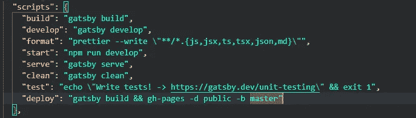
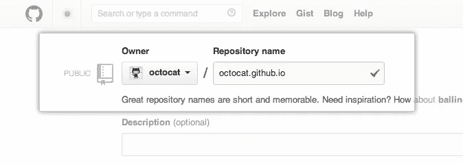
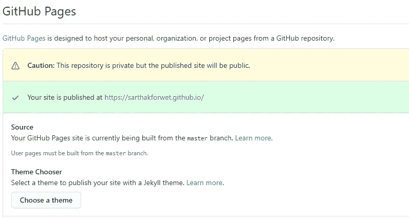

# 使用 Gatsby 和 GitHub 页面构建和托管投资组合

> 原文：<https://medium.com/analytics-vidhya/building-and-hosting-portfolio-with-gatsby-and-github-pages-bd070a3826f7?source=collection_archive---------8----------------------->


我是一名 ML 开发人员，对网络开发知之甚少，我需要向世界展示我的技能，所以我最近在两天内为自己制作了一个*作品集*。看看[吧](http://sarthakforwet.github.io)。

你喜欢吗？嗯，你也可以在很短的时间内为自己制作一个非常互动和漂亮的*作品集*。在本教程中，我们将重点学习如何从 *Gatsby* 获得一个入门模板来构建*作品集*并将其托管在 *GitHub 页面*上，这样你就可以在任何地方和任何人轻松地分享它。

一个**组合**就像是系统的一个 **GPU** 。它提高了你的演讲技巧，向每个人展示了你的作品，所以你不需要太多的描述。向*投资组合*添加部分完全由您决定。可能要添加的部分可以是——你自己的摘要、项目、写作工作、证书、工作经验、开源贡献、教育和联系信息。但是，如果他/她认为适合*投资组合*，也可以添加其他部分。我建议花一些时间来建立一个结构，包括添加哪些部分，在哪里添加等等。然后开始建造它。我还会添加一个链接，链接到我最后发现有趣的*投资组合模板*。

在本教程中，我们会有以下几个部分—

## **o**建造一个盖茨比的网站

## **o**托管站点到 GitHub 页面

## **o**参考文献

# 建立一个盖茨比网站

首先让我们了解一下什么是盖茨比。从官方文件来看—

> Gatsby 是一个基于 React 的免费开源框架，可以帮助开发者快速构建网站和应用

从定义来看，它是一个基于*反应*的静态站点生成器。任何有 *React* 经验的人都会与*盖茨比*合作无间。我们可以构建漂亮的 web 应用程序，而不必过多考虑 web 集成和构建静态网页。 *Gatsby* 帮助内部化性能模式和最佳实践，如 [PRPL](https://developers.google.com/web/fundamentals/performance/prpl-pattern/) ，基于路由的代码分割等。

如果你不是专业的 *React* 开发者(比如我)，你可以从[这里](https://www.gatsbyjs.org/starters/?v=2)选择并下载一个基础模板。它收集了大量的**免费模板**，你可以下载并编辑它们来更快地构建你的网络应用。

如果你想完全从零开始构建 web-app，或者想熟悉*盖茨比*的工作流程，你也可以在这里跟随*盖茨比* [提供的教程。然而，如果你与 web 开发领域无关，也不愿意从事这方面的工作，你就不能浪费时间从头开始构建项目，而是利用它来改进你的网站。关于构建 *Gatsby* 站点的完整代码的讨论超出了本教程的范围，但是我会尝试添加下面教程的链接以节省您的时间。](https://www.gatsbyjs.org/tutorial/)

> 我用来作为基础模板*的模板*可以在[这里](https://www.gatsbyjs.org/starters/cobidev/gatsby-simplefolio/)找到。

我喜欢盖茨比最令人兴奋的一点是，我们可以在本地托管我们的网站，进行工作，当它准备好了，我们就可以发布它。我也喜欢它的**热重新加载**功能，一旦你对它做了任何改变，它就会重新加载你的网站。

好了，现在我假设你已经下载了模板(或者从头开始建立网站)并操纵它来建立你的*作品集*。听起来不错！😃

# GitHub 页面的托管站点

所以现在怎么办！你会如何向世界展示你的作品？通过与所有人共享代码？哦，来吧！我知道你不会那么做的。据我所知，你需要一个平台来托管你的网站，对不对？

有很多平台可以帮助你托管你的站点，但是我发现最方便的平台是 GitHub Pages。我们可以轻松地托管一个 *Gatsby* 站点到 *GitHub 页面*。我使用这个平台的原因是我对 *GitHub* 的热爱，而且在使用 *git* 工作流时，我们不会做任何困难和有挑战性的事情。

在继续设置 *GitHub 页面***之前，我们会做一些配置。首先让我们安装 **gh-pages** 包，它有助于将 *Gatsby* app 推送到 *GitHub pages* :-**

```
npm install gh-pages
```

> **这将在 node_modules 目录中创建一个名为 gh-pages 的子目录。要了解更多关于 gh-pages 的信息，请访问—[https://www.npmjs.com/package/gh-pages](https://www.npmjs.com/package/gh-pages)**

**接下来打开 **package.json** 文件(可以在项目的根目录下找到)并向其中添加一个新脚本**

```
“deploy”: “gatsby build && gh-pages -d public -b master”
```

****

**添加“deploy”变量后的脚本概述。**

**现在要在 *GitHub Pages* 上托管你的站点，你必须有一个有效的 *GitHub* 账户。如果您目前还没有，请按照本教程来设置和配置您的*GitHub**帐户。***

***设置好帐号后，登录并创建一个根子域名的仓库，即 *username.github.io* (这里 username 是你的 *GitHub* 句柄)。***

******

***img source—[https://guides . github . com/features/pages/create-new-repo-screen . png](https://guides.github.com/features/pages/create-new-repo-screen.png)***

***现在下一步是从本地机器连接到这个远程存储库。只需打开 *git bash* (如果是 OS- Windows)或*终端*(如果是 OS- Linux)并编写以下命令***

```
*$ git init
$ git remote add origin {https/ssh link to the repository}*
```

***现在，在您的本地机器上运行以下命令—***

```
*$ npm run deploy*
```

> ***该命令将在 package.json/scripts 中搜索变量“deploy ”,并执行与该变量对应的命令。***

***这将创建一个名为 **public** 的文件夹，其中包含静态 **HTML** 和 **Javascript** 文件，并将其内容部署到添加的远程存储库的主分支。现在打开你的库，你会看到一些新的文件被添加到其中。***

> ***注意—如果文件不可见，请刷新浏览器选项卡 2–3 次，然后它将可见。根据互联网连接和系统配置，需要一些时间来推动更改。***

***现在导航到设置并向下滚动查看标题 **GitHub 页面**。你会看到类似这样的东西—***

******

***不要担心“小心”。这是因为我已经把我的知识库私有了。但是您可以根据自己的选择将其公开/保密。如果**源**当前未设置为主分支，将其设置为主**。**你的网站现在可以在*username . GitHub . io*(username—你的 *GitHub* 句柄)公开访问。***

***然而，你可以通过其他方式将你的*盖茨比*网站发布到 *GitHub 页面*。我还会添加一个链接到该教程。***

***所以，就这样结束了。希望你喜欢这个教程！如果你遵循了教程，请与社区分享你的*作品集*，因为这将有助于其他人从中学习。谢谢！***

# ***参考***

*   ***[https://www.gatsbyjs.org/tutorial/](https://www.gatsbyjs.org/tutorial/)***
*   ***[https://www . gatsbyjs . org/docs/how-Gatsby-works-with-github-pages/](https://www.gatsbyjs.org/docs/how-gatsby-works-with-github-pages/)***
*   ***[https://www.gatsbyjs.org/starters/?c=Portfolio&v = 2](https://www.gatsbyjs.org/starters/?c=Portfolio&v=2)***
*   ***[https://guides.github.com/features/pages/](https://guides.github.com/features/pages/)***