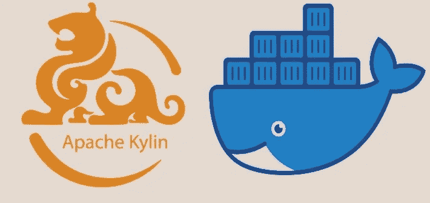
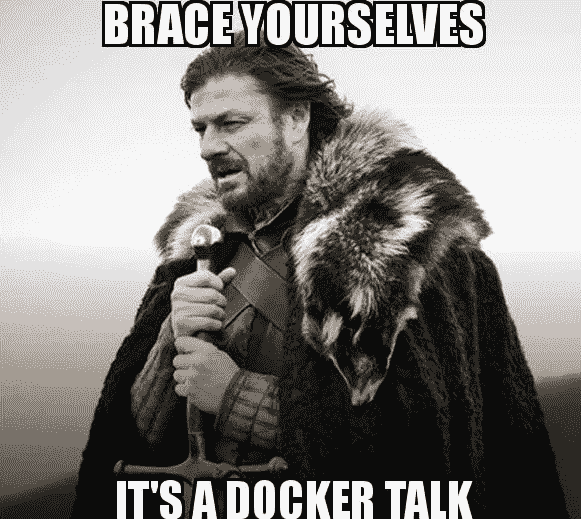

# 像专家一样在 Docker 上构建和管理 Apache Kylin 多维数据集！

> 原文：<https://medium.com/analytics-vidhya/building-and-managing-apache-kylin-cubes-on-docker-like-a-pro-22fc236c335e?source=collection_archive---------12----------------------->

再见！



演职员表:[阿帕奇麒麟](https://kylin.apache.org/)和[码头工人](https://www.docker.com/)

Apache Kylin 是一个开源的大数据分析数据仓库，由易贝公司在 2015 年捐赠给 Apache 软件基金会。

多亏了 Docker，在服务器上部署 Kylin 是小菜一碟。如果你熟悉 docker，你就会知道它是如何工作的。如果你不是，那么现在是你开始的时候了。

这个故事是关于我们如何使用 docker 在 Apache Kylin 上构建 MOLAP 多维数据集，然后管理它。

> 我们开始吧！

> 但是为什么是 docker 呢？



Docker 是一个软件平台，它简化了分布式应用程序的生命周期，包括构建、部署和管理阶段。这是通过虚拟化安装 docker 的主机/服务器的操作系统来实现的。

假设有一个 hive 服务已经在一个服务器上运行，现在我们想部署一些其他服务，比如 Kylin，它将 hive 服务作为同一服务器上的依赖项。我们尝试安装的版本可能与已经安装的配置单元版本不兼容。在其他系统/虚拟机上设置 Kylin 所需的依赖关系可能会非常昂贵，因为它需要一组新的硬件资源。

让我们来看看 docker 是如何提供一个经济高效的解决方案的。

安装 docker 的系统称为主机。主机操作系统的内核在每个应用程序之间共享。每个应用程序都有自己的逻辑/虚拟空间，这些空间继承自主机，但与其他应用程序隔离。这些逻辑空间被称为容器。现在，每个容器都可以拥有自己的一组应用程序所需的库。因此，每个应用程序都可以在同一台主机上满足自己的一组依赖关系或要求，前提是它们具有相同的底层操作系统要求。

让我们使用这个概念从 Apache Kylin 在其 GitHub 存储库上给出的模板中为 Kylin 创建容器:

[](https://github.com/apache/kylin/tree/master/docker) [## 阿帕奇/麒麟

### 为了让用户方便地试用 Kylin，并方便开发人员在修改后进行验证和调试…

github.com](https://github.com/apache/kylin/tree/master/docker) 

用户可以简单地使用被推送到[***docker hub***](https://hub.docker.com/r/apachekylin/apache-kylin-standalone)*上的预构建映像，或者通过改变所提供的 docker 文件的内容来改变配置。*

**要简单地提取预构建的映像，运行*:*

```
***docker pull apachekylin/apache-kylin-standalone***
```

****或……****

*我们可以根据需要定制 docker 文件和/或修改 *conf* 文件夹的内容，然后运行:*

```
***./build_image.sh***
```

# ***在我们产卵容器之前，一个重要的注意事项**:*

*Docker 默认不附带持久存储。这意味着当容器停止时，容器上的数据会丢失。我们可能希望在生成另一个容器后继续我们的工作。所以我们想到的下一个问题是…*

> ***我们如何在 Kylin 容器上持久存储数据？***

*让我们首先确定我们想要持久存储的数据。我们正在处理的数据将在 Hadoop 文件系统上。如果容器突然停止，我们就必须将全部数据重新加载到文件系统中。因此，将容器的 HDFS(Hadoop 文件系统)与主机绑定是一个好主意。此外，其他要备份的关键组件是 Hbase、Zookeeper 和 Hive。*

*HDFS、Hbase、Zookeeper 将位于集装箱上的**/数据**。我们需要为这个位置创建一个绑定。*

*我们将使用“***/home/$ USER/docker _ volumes/kylin _ bind/****”*作为我们的主机挂载位置。*

```
***mkdir -p /*home/$USER/docker_volumes/kylin_bind/****
```

*装订是通过使用 docker 卷完成的。我们可以按如下方式创建一个卷:*

```
***docker volume create --driver local \
--opt type=none \
--opt device=/home/$USER/docker_volumes/kylin_bind/ \
--opt o=bind \
kylin_data_volume***
```

*我们现在可以为 Kylin 生成第一个容器。*

```
***docker run -d \
-m 8G \
-v kylin_data_volume:/data \
-p 7070:7070 \
-p 8088:8088 \
-p 50070:50070 \
-p 8032:8032 \
-p 8042:8042 \
-p 16010:16010 \
apache-kylin-standalone***
```

*瞧啊。我们已经产生了我们的容器。给它一两分钟的时间来启动所有它被编程启动的服务。*

*我们已经在分离模式下启动了容器(docker 运行命令中的 **-d** )。运行以下命令，列出生成的容器，并记下容器 id。*

```
***docker ps***
```

*要将我们自己附加到容器的终端，运行:*

```
*docker exec -it ***container_id*** bash*
```

*现在我们将进入集装箱。请注意终端中的提示变化。*

*运行以下命令验证是否所有服务都已启动。*

```
***jps***
```

*从主机上，我们可以分别访问 **localhost:8088** 和 **localhost:7070、**MapRed 应用页面和 Kylin Home UI。*

*剩下的工作就是将数据加载到 HDFS 上，并将其作为源添加到 Kylin 中，创建一个模型，为该模型设计一个立方体，然后最终构建它。*

*检查站！我们故事的第一部分到此结束。下半场见！:)*

# *构建立方体！*

*既然 Kylin 已经在 docker 容器上设置好了，我们就可以开始构建立方体了。首先，我们需要有蜂箱表。一旦我们有了这些，我们就可以从“**数据源**”选项卡中选择这些表。选择的表必须与目标图表/KPI 一致。我们需要为目标结果准备一个模型。这可以是“**星形**或“**雪花形**”模型。必须仔细选择尺寸和度量。*

*我们现在将使用创建的模型来构建一个立方体。我们需要从可用列表中选择维度。选择每一个作为"**正常的**或"**派生的**尺寸。选择度量之后，我们可以选择立方体构建引擎。可以是 **Hadoop** base，也可以是 **Spark** base。给出了添加附加属性的选项。一旦我们完成了这个，我们就可以很好地构建设计好的立方体。如果事实表是基于日期字段进行分区的，那么我们需要选择构建的时间间隔。*

*我们可以在“ **Monitor** ”选项卡上检查构建进度。一旦构建完成，我们就可以使用这个立方体进行快速查询。构建的立方体存储为 **Hbase** 段。我们现在可以将这个 Kylin 实例作为数据源添加到任何 BI 工具/可视化工具中，以创建图表/KPI。*

> *到目前为止，我们已经能够生成一个 Kylin 容器，并且希望您已经对您构建的立方体片段进行了一些分析。我们的下一个挑战来了，**迁移**。*
> 
> ***我们为什么以及如何迁移到其他主机？***

*我们将 Kylin 迁移到另一个主机可能有许多原因。现有服务器/虚拟机上的资源可能不足。我们不想在新机器上重复设置立方体的工作。*

*要迁移到新主机，映像模板必须相同。我们需要像前面一样在**新主机**上运行以下命令。*

```
***./build_image.sh***
```

*如果我们有一个配置单元表作为我们的多维数据集的数据源，我们希望备份它。在**旧容器**的运行主机中，运行并输入密码:*

```
***mysqldump -u *username* --password --databases hive > hive_dump.sql***
```

*我们需要将这个文件从当前运行的容器复制到新的主机上。使用 rsync 或 scp 命令。*

*在复制之前停止正在运行的服务通常是一个好主意，因为这可以确保进程/文件上没有锁。在**旧容器上运行以下命令:***

```
****stop-hbase.sh
$HADOOP_HOME/sbin/stop-hdfs.sh
$HADOOP_HOME/sbin/stop-yarn.sh
service mysqld service stop
## And any other service that you might want to stop. :)****
```

*如前所述，在新主机上创建一个卷。*

```
***docker volume create --driver local \
--opt type=none \
--opt device=/home/$USER/docker_volumes/kylin_bind/ \
--opt o=bind \
kylin_data_volume***
```

*现在卷已经准备好了，我们可以在新主机上运行新容器了。*

```
***docker run -d \
-m 8G \
-v kylin_data_volume:/data \
-p 7070:7070 \
-p 8088:8088 \
-p 50070:50070 \
-p 8032:8032 \
-p 8042:8042 \
-p 16010:16010 \
apache-kylin-standalone***
```

*我们需要恢复蜂巢的桌子。为此，请运行:*

```
***mysql -u *username* -p***
```

*在 mysql shell 中，为配置单元创建一个数据库。*

```
***create database if not exists hive;***
```

*我们现在从 mysql shell 中出来，我们将把***hive _ dump . SQL***加载到这个数据库中。*

```
***mysql -u root -p hive < hive_dump.sql***
```

*访问本地主机:8088 和本地主机:7070 进行验证。*

*就是这样！我们已经将我们的容器迁移到新机器上。*

**

*我们现在已经到了故事的结尾。我们现在能够像专业人士一样在 docker 上构建和管理立方体。*

*感谢您的阅读！随意评论。:)*

*再见！*