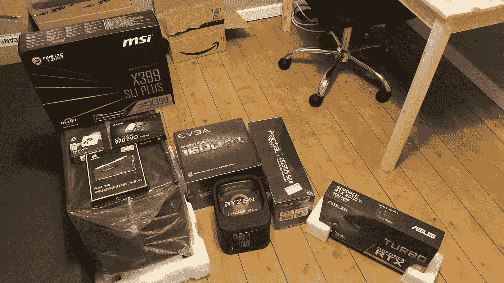
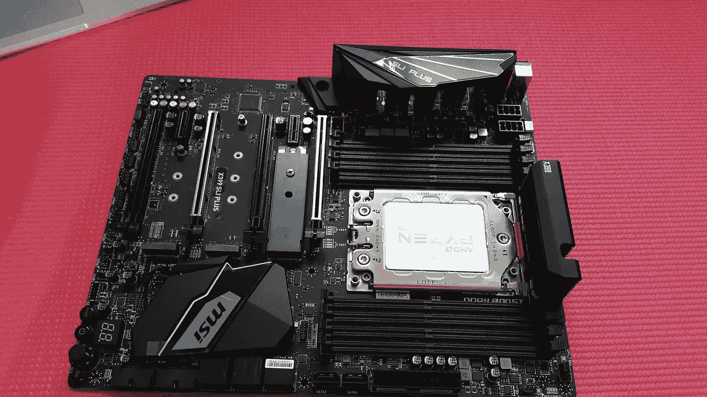
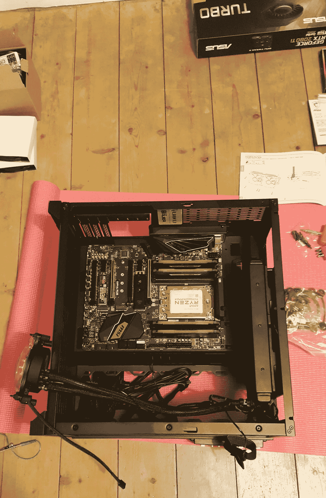
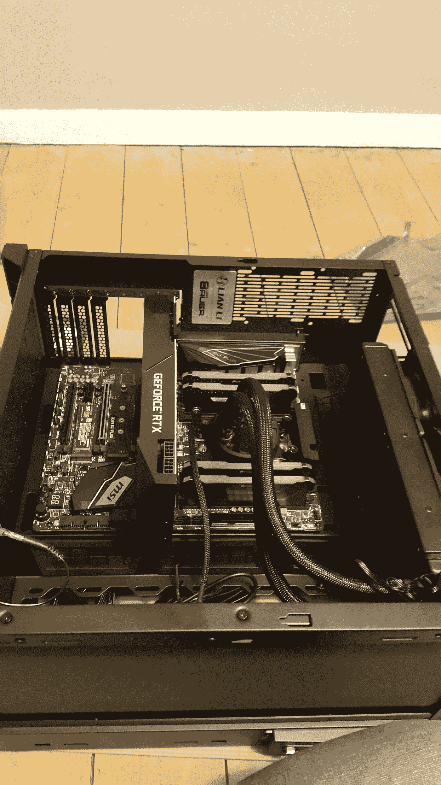
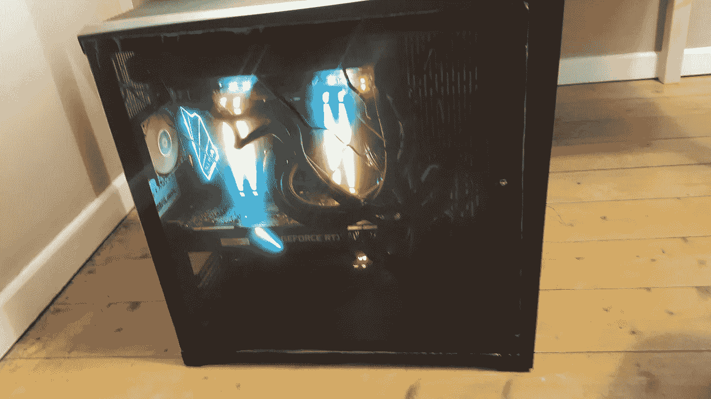

# 构建和设置深度学习电脑

> 原文：<https://medium.com/analytics-vidhya/building-and-setting-up-a-deep-learning-pc-4eb7c37f30?source=collection_archive---------9----------------------->

因此，大约一个月前，我决定为我的项目构建自己的深度学习 PC，而不是使用 AWS 和 Google Colab 等云服务。原因是 AWS 似乎太贵，而 Colab 限制了项目可以连续运行的小时数。在这篇博客中，我将概述我为了建立和设置我自己的钻机所做的一些事情。

首先，已经有一些优秀的博客涵盖了为什么以及如何构建深度学习 PC 的基础知识。因此，我不会详细讨论这些问题。我要做的是提及一些额外的信息，我觉得这些信息可能对像我这样的新手有所帮助。

# 订购和组装零件

我从陈明杰的三部分博客系列开始。这是一组很棒的博客，涵盖了几乎所有你需要知道的东西。[第 1 部分](/the-mission/why-building-your-own-deep-learning-computer-is-10x-cheaper-than-aws-b1c91b55ce8c)思考为什么要打造自己的 pc？P [艺术 2](/the-mission/how-to-build-the-perfect-deep-learning-computer-and-save-thousands-of-dollars-9ec3b2eb4ce2) 讲述了如何构建自己的个人电脑。并且，[第 3 部分](/the-mission/why-your-personal-deep-learning-computer-can-be-faster-than-aws-2f85a1739cf4)回顾了性能基准测试，声称一台好的 PC 可以超越 AWS。

由于这是我第一次做这些，我决定慢一点，用单个 GPU 建立一个装备。我不认为这将胜过 AWS，但它仍然是一个开始。我制作的电脑的规格是:

*   CPU:AMD thread ripper 1920 x 3.5 GHz 12 核处理器
*   CPU 冷却器:[分形设计摄氏 S24 87.6 CFM 液体 CPU 冷却器](https://uk.pcpartpicker.com/product/nfzZxr/fractal-design-celsius-s24-876-cfm-liquid-cpu-cooler-fd-wcu-celsius-s24-bk)
*   主板:[微星 X399 SLI 加 ATX sTR4 主板](https://uk.pcpartpicker.com/product/Qskj4D/msi-x399-sli-plus-atx-tr4-motherboard-x399-sli-plus)
*   RAM: [海盗船复仇 RGB Pro 64 GB(4x 16 GB)DDR 4–3000 内存](https://uk.pcpartpicker.com/product/Gj7v6h/corsair-vengeance-rgb-pro-64gb-4-x-16gb-ddr4-3000-memory-cmw64gx4m4c3000c15)
*   固态硬盘:[三星 970 Evo 1tb m . 2–2280 NVME 固态硬盘](https://uk.pcpartpicker.com/product/JLdxFT/samsung-970-evo-10tb-m2-2280-solid-state-drive-mz-v7e1t0baw)
*   GPU: [华硕 GeForce RTX 2080 Ti 11 GB Turbo 显卡](https://uk.pcpartpicker.com/product/vtqhP6/asus-geforce-rtx-2080-ti-11gb-turbo-video-card-turbo-rtx2080ti-11g)
*   案例:联立 PC-O11 ATX 航空全塔案例
*   电源: [EVGA SuperNOVA P2 1600 W 80+铂金认证全模块化 ATX 电源](https://uk.pcpartpicker.com/product/LbtWGX/evga-power-supply-220p21600x1)
*   案例风扇:[北极 F8 PWM 31 CFM 80 mm 风扇](https://uk.pcpartpicker.com/product/W9rcCJ/arctic-case-fan-afaco080p2gba01)
*   机箱风扇 2: [北极 F12 PWM PST —价值包 53 CFM 120 mm 风扇](https://uk.pcpartpicker.com/product/2NcMnQ/arctic-case-fan-acfan00062a)

这基本上是陈明杰[零件清单](https://pcpartpicker.com/list/yWGyWb)在 [PCPartPicker](https://pcpartpicker.com/) 上的副本。我所要做的就是把地点改到英国，以便从英国找到卖家。所有的零件都很容易买到，除了大部分地方都缺货的那个箱子，所以我不得不多逛逛。总之，这笔交易花了我 2604.19 英镑，约合 3412.06 美元。我相信这比在美国同样的建筑要贵 400 美元。但我想我们不得不接受这个事实。

我还买了[防静电腕带](https://www.amazon.co.uk/gp/product/B07BXS5TFT/ref=ppx_yo_dt_b_asin_title_o00_s01?ie=UTF8&psc=1)来防止静电放电，如果发生静电放电，很容易杀死各种电气元件，[外用酒精](https://www.amazon.co.uk/gp/product/B07FYFXCDP/ref=ppx_yo_dt_b_asin_title_o00_s00?ie=UTF8&psc=1)来清洁液体冷却器上预先涂抹的导热膏，还有 Noctua 的 [NT-H1](https://www.amazon.co.uk/gp/product/B07MZ4JJWX/ref=ppx_yo_dt_b_asin_title_o00_s02?ie=UTF8&psc=1) 导热膏。如果你还没有以太网电缆，我也建议你买一根合适长度的。这是因为主板似乎没有 wifi 卡，因此需要有线连接到路由器。

这是一张我所有零件的照片。



这个箱子的说明书上有如何打开它的说明。具有讽刺意味的是，手册是装在箱子里的。哈哈！不管怎样，打开箱子并不难。背面有两个螺钉将顶部固定到外壳的其余部分。一旦顶部被拆除，侧面板可以很容易地通过滑动他们。

接下来，我检查了电源单元。它配有一个测试工具，使用该工具可以在 PSU 上施加人工负载，并检查风扇是否工作。如果风扇开始旋转，那么 PSU 很可能是好的。如果没有，则检查节能模式是否已关闭，然后重试。我看了这个视频的前几分钟，以确保我做得对。

## 主板

这是一张特写照片。



为了避免对主板底部的焊接造成任何损坏，我把它放在瑜伽垫上，这对我来说很好。我通过 PCPartPicker 观看了[这个视频](https://www.youtube.com/watch?v=83mA2TGNRCU&t=2182s)，帮助我完成在主板上安装各种组件的步骤。

不幸的是，我从外壳中取出微处理器时遇到了一些问题。从上面的 PCPartPicker 视频中可以看出，(在 3.36 分钟时)，人们必须扭动外壳上的黑色旋钮才能接触到微处理器。这是不知何故卡住了我，没有从它的位置移动。我必须得到一些额外的手套来帮助我更紧地抓住把手。

请注意，PCPartPicker 人员在安装 CPU 冷却器之前将内存安装到主板上。事后看来，我会在安装内存之前安装 CPU 冷却器。这仅仅是因为 ram 具有相当高的高度，并且在安装冷却器时首先安装它们限制了 CPU 周围的空间量，从而增加了对 ram 以及主板造成物理损坏的风险。

为了在箱子上安装各种部件，我跟随陈明杰的[视频](https://www.youtube.com/watch?v=orzOOPD-E9Y&t=235s)，因为 PCPartPicker 视频中的人正在处理一个不同的箱子。CPU 冷却器的散热器将安装在机箱的顶部，如下图所示。



散热器需要安装两个 120mm 的风扇。对我来说，顺便说一句，箱子顶部已经预装了两个风扇。然而，安装这些风扇是为了将热空气排出机箱。另一方面，出于我们的目的，我们希望风扇将冷空气吹到散热器上，即它们从外部吸入冷空气。因此，我不得不改变风扇的方向。

其余的或多或少很简单。我将冷却器上的默认安装支架切换到主板附带的安装支架，清洁预先应用的导热膏，在处理器上应用一点 Noctua NT-H1，然后将冷却器安装在处理器上，就像 PCPartPicker 的家伙在他们的视频中的 37.18 分钟一样。

接下来，我安装了显卡。这里有一张图片。



我在机箱顶部安装了一个 120 毫米的风扇，在前面安装了三个风扇，用来从外面吸入冷空气。最后，我在机箱后面安装了一个 80 毫米的风扇，将热空气吹出。

主板的右上角有一个为泵风扇供电的端口，在主板手册中标记为 PUMP_FAN1。我在这里连接了 CPU 冷却器的电缆。散热器的风扇可以连接到冷却器本身的端口。这样就剩下 5 个风扇直接连接到主板，主板上有 4 个端口用于系统风扇(SYS_FAN1 至 SYS_FAN4 ),一个端口用于 CPU 风扇 CPU_FAN1。这给了我正确的端口数量来连接所有的风扇。

## 电源连接

PSU 配备了足够多的电缆来进行所有的连接。特别是，它包含一根 ATX 24 针电缆、两根 8 针(4+4) CPU 电缆和几根 VGA(用于 PCI-E)和 SATA 电缆。我们现在不需要 SATA 电缆，因为我们已经将固态硬盘直接安装到主板上。

PSU 和主板上只有一个 ATX-24 端口。这些需要通过 ATX 电缆连接。PSU 上的 CPU 1 端口通过一根 CPU 电缆连接到主板上的 CPU 1 端口。这同样适用于 PSU 和主板上的 CPU2 端口。

GPU 有两个 8 针端口，每个端口都必须通过独立的 8 针 VGA 电缆连接。

就是这样！我们完了！这是一张组装好的个人电脑的图片。



我没有费心移动外壳周围的电源线，让它看起来更漂亮。老实说，这部分是因为我担心，如果我强迫电缆停留在外壳中的特定位置，我可能最终会拉出一些东西。

# **安装软件**

我按照陈明杰的建议安装了 Ubuntu 16.04。他似乎选择了 16.04 而不是 18.04，因为根据他的说法，许多机器学习工具目前只与 16.04 兼容。电脑连接到互联网后，所有必要的 Ubuntu 更新都会自动下载，只需 15-20 分钟就能让电脑启动并运行。

## 安装 Anaconda

然后我按照他们的[网页](https://docs.anaconda.com/anaconda/install/linux/)上的说明安装了 [Anaconda](https://www.anaconda.com/) 。这是轻而易举的事。

此外，我想为 Tensorflow 和 Pytorch 创建单独的虚拟环境。虽然创建虚拟环境很简单(例如使用[这个](https://docs.conda.io/projects/conda/en/4.6.0/_downloads/52a95608c49671267e40c689e0bc00ca/conda-cheatsheet.pdf) conda 备忘单)，但是我的 jupyter 笔记本没有自动检测这些环境。这可能是因为我希望在基本环境中启动 jupyter 笔记本，然后在我希望的时候将其内核更改为必要的环境。我通过在基本环境中安装 nb_conda_kernels 解决了这个问题。

```
$ conda install nb_conda_kernels
```

## 安装 CUDA、TensorFlow 和 PyTorch

现在到了我花了一段时间才弄好的部分。

**安装 CUDA 工具包**:为了能够使用 GPU 进行机器学习，我们需要安装 NVIDIA 的 CUDA 工具包。最新版本是 CUDA 10.2，这是默认安装的。然而，如果你去 Tensorflow 的 [GPU 支持](https://www.tensorflow.org/install/gpu)页面的[软件需求](https://www.tensorflow.org/install/gpu#software_requirements)部分，那么你可以看到 Tensorflow 2.1 只与 CUDA toolkit10.1 兼容。这是我费了很大的劲才学会的。

因此，我们必须安装 CUDA toolkit 10.1，并确保它不会自动升级到 10.2。为此，我遵循了 CUDA 10.1 的[安装指南](https://docs.nvidia.com/cuda/archive/10.1/cuda-installation-guide-linux/index.html)中的说明。

我完成了安装指南第 2 节中提到的安装前操作，然后下载了。从[到这里](https://developer.nvidia.com/cuda-10.1-download-archive-update2)的 deb 文件包管理器。在这一点上，要小心，你确实是在下载 CUDA 工具包 10.1，因为大多数链接将被重定向到 CUDA 10.2 安装，除非你直接进入 CUDA 档案。

我们现在可以开始安装 CUDA 工具包了。遵循 NVIDIA 安装指南第 3 节 Ubuntu- [小节](https://docs.nvidia.com/cuda/archive/10.1/cuda-installation-guide-linux/index.html#ubuntu-installation)中的前 4 条说明。注意，这里的第 5 条指令告诉您通过执行$sudo apt-get install cuda 来安装 CUDA。请不要这样做！

这是因为默认情况下“cuda 包指向 CUDA 工具包的最新稳定版本”。因此，执行$sudo apt-get install cuda 将自动升级到 cuda 10.2。相反，我们将执行

```
$ sudo apt-get install cuda-10-1
```

这将安装 cuda 10.1，并保持锁定在 10.1，直到安装了附加版本的 cuda。

我们现在执行[安装后说明](https://docs.nvidia.com/cuda/archive/10.1/cuda-installation-guide-linux/index.html#post-installation-actions)。基本上打开。bashrc 文件:

```
nano ~/.bashrc
```

并将下面一行粘贴到。bashrc

```
export PATH=/usr/local/cuda-10.1/bin:/usr/local/cuda-10.1/NsightCompute-2019.1${PATH:+:${PATH}}
```

这会将适当的路径添加到 path 变量中。^O 将更改保存到。巴沙尔和^X 退出。

我无意中也添加了下面一行。bashrc

```
export LD_LIBRARY_PATH=/usr/local/cuda-10.1/lib64\
                         ${LD_LIBRARY_PATH:+:${LD_LIBRARY_PATH}}
```

除非您使用 runfile 安装而不是 Deb 包，否则这不是必需的。我后来把它注释掉了，没有任何明显的问题。

现在执行

```
$ source ~/.bashrc
```

我们完了！

您可以通过执行以下命令来检查驱动程序版本

```
$ cat /proc/driver/nvidia/version
```

和

```
$ nvcc -V
```

可以通过构建和运行 cuda 示例来进一步验证安装。只需按照 7.2.3.2(编译示例)和 7.2.3.3 的[小节中概述的步骤运行 deviceQuery 和 bandwidthTest。您可以通过以下方式找到这些文件](https://docs.nvidia.com/cuda/archive/10.1/cuda-installation-guide-linux/index.html#compiling-examples)

```
$ locate deviceQuery
```

和

```
$ locate bandwidthTest
```

运行这些

```
$ ./deviceQuery
```

和

```
$ ./bandwidthTest
```

如果 cuda 安装正确，这两个函数都应该返回 Result = PASS。如果不是这样，请尝试重新启动计算机并再次运行测试。如果这也不起作用，那么 cuda 可能必须重新安装。您可以通过执行以下命令彻底卸载 cuda

```
$ sudo apt-get --purge remove "*cublas*" "cuda*"
```

并删除 NVIDIA 驱动程序

```
$ sudo apt-get --purge remove "*nvidia*"
```

**安装 cuDNN** :我在这里[下载了 CUDA 10.1 的 cuDNN v7.6.5。请注意，CUDA 10.2 和 CUDA 10.1 的软件包是不同的。所以一定要下载 CUDA 10.1 的。然后只需遵循本](https://developer.nvidia.com/rdp/cudnn-download)[安装指南](https://developer.nvidia.com/rdp/cudnn-download)中的说明。

**安装 TensorFlow** :我们终于准备好安装有 GPU 支持的 Tensorflow 2.1 了。我创建了一个名为“tensorflow”的新虚拟环境，激活它，然后简单地执行

```
$ pip install tensorflow  # stable
```

就是这样！过了一会儿，我让 TensorFlow 开始运行了。为了检查 TensorFlow 是否确实检测到了 GPU，我打开了一个 jupyter 笔记本，导入了 TensorFlow

```
import tensorflow as tfprint(tf.__version__)
```

然后检查 TensorFlow 是用 cuda 构建的(这应该是在安装过程中自动完成的)

```
tf.test.is_built_with_cuda()
```

并检查 TensorFlow 是否看到 gpu

```
tf.test.is_gpu_available()
```

请注意，上面是一个不推荐使用的命令。更好的做法是请求 TensorFlow 查看所有 GPU 的列表

```
tf.config.list_physical_devices('GPU')
```

这将返回一个 GPU 列表。在我的例子中，只有一个，所以输出是:

[physical device(name = '/physical _ device:GPU:0 '，device_type='GPU')]

如果你看到一个空列表作为输出，那么 TensorFlow 肯定没有看到 GPU。

作为最后的测试，我在 GPU 上做了一个小计算:

```
with tf.device('/gpu:0'):
    a = tf.constant([1.0, 2.0, 3.0, 4.0, 5.0, 6.0], shape=[2, 3], name='a')
    b = tf.constant([1.0, 2.0, 3.0, 4.0, 5.0, 6.0], shape=[3, 2], name='b')
    c = tf.matmul(a, b)print(c)
```

我得到了上述计算的合理结果，表明一切进展顺利。万岁！TensorFlow 正在工作！

安装 PyTorch :我为 PyTorch 创建了一个新的虚拟环境，并按照 PyTorch 下载[页面](https://pytorch.org/get-started/locally/)上的说明进行操作。基本上，我被告知运行以下命令:

```
conda install pytorch torchvision cudatoolkit=10.1 -c pytorch
```

你瞧，PyTorch 安装好了。

## 安装 GIT

简单地跑

```
# apt-get install git
```

我还复制了这里[提供的目录 uda city-terminal-config](https://classroom.udacity.com/courses/ud123/lessons/1b369991-f1ca-4d6a-ba8f-e8318d76322f/concepts/63a6f935-dea7-43c2-aaa3-61deea5070c8)，并遵循了网页上提到的步骤。这是因为他们声称这将重新配置终端，使其更容易使用。然而，这似乎并没有改变什么，直到我试图通过我的 windows 笔记本电脑远程登录到我的电脑。windows 中的终端似乎有更好的色彩表现。

然而，这是有代价的。远程终端似乎不再检测到康达。尽管它仍然在个人电脑的终端上被检测到。事实证明问题在于。如果. bash_profile 文件存在，主目录中的 profile 文件将停止被检测(例如，参见 Lester Peabody 在[这篇](https://stackoverflow.com/questions/820517/bashrc-at-ssh-login/820533#820533) stackoverflow 帖子中的评论)。同时，Udacity 在重新配置终端的过程中引入了一个. bash_profile 文件。为了解决这个问题，我复制了。配置文件添加到。bash_profile 文件。

最后，我安装了 VSCode 作为我的编辑器。只需下载。deb 文件，转到下载它的文件夹并运行*sudo dpkg–I code*(并点击 tab 完成名称)。

要在第一次使用 git 时配置它，只需遵循 Udacity 的免费[课程](https://www.udacity.com/course/version-control-with-git--ud123)中关于 Git 版本控制的 1.4 课的说明。

## 设置 SSH 服务器

我只是按照[这篇](https://dev.to/zduey/how-to-set-up-an-ssh-server-on-a-home-computer)帖子来设置我的电脑 ssh 远程登录。此外，为了能够编写提交消息，我必须启用 X11 转发。我只是跟着[这个](http://laptops.eng.uci.edu/software-installation/using-linux/configure-ubuntu-for-x11-forwarding)帖子来启用 X11 转发。

虽然您可以通过远程登录在 jupyter 笔记本上工作，但一旦 X11 转发被启用，我发现如果我将 Jupyter 笔记本在我 pc 上的端口转发到我笔记本电脑上的端口并收听它，屏幕分辨率会好得多。做这件事的步骤在[这篇](https://ljvmiranda921.github.io/notebook/2018/01/31/running-a-jupyter-notebook/)文章中有很好的解释。在创建一个将我的远程服务器上的端口隧道连接到我的 windows 笔记本电脑的函数时，我必须遵循的唯一额外步骤是在我的笔记本电脑上创建一个. bashrc 文件，并向其中添加该函数。

厉害！我们的 pc 现在可以进行深度学习了！