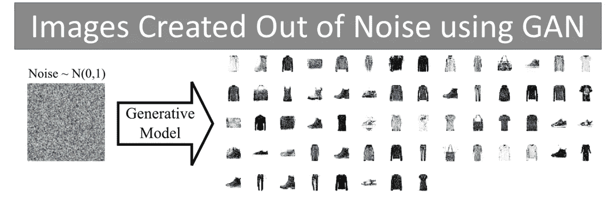

# 用 Keras 构造和训练卷积 GAN

> 原文：<https://medium.com/analytics-vidhya/building-and-training-a-convolution-gan-with-keras-9e88cd348243?source=collection_archive---------22----------------------->

在本文中，我们将学习如何使用卷积层从头开始构建 GAN。为了演示和快速解决问题，我们将使用**时尚 MNIST** 数据集。在你学会之后，同样的，你也可以对人脸做同样的事情。在进入细节之前，我想让你想一想，**我们能否利用深度学习从无到有创造出****？*为了回答这个问题，我们将实现一个 GAN 并亲眼看看结果。*

**