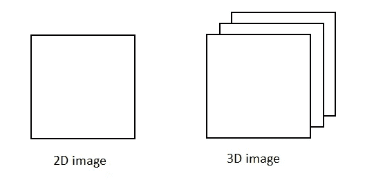
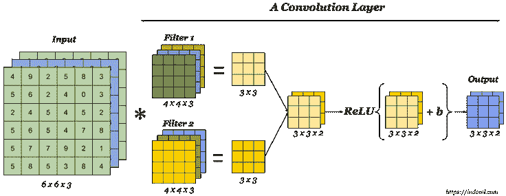
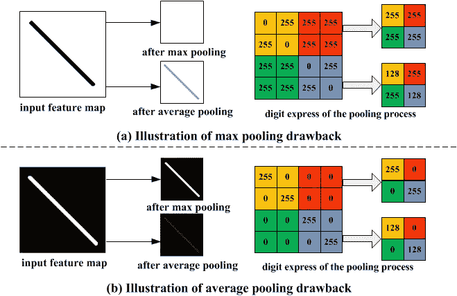
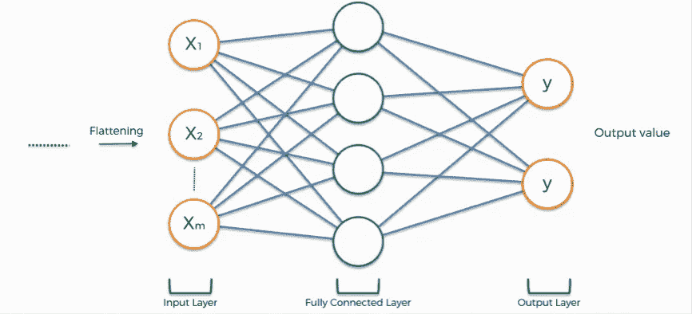

# 卷积神经网络的构建模块

> 原文：<https://medium.com/analytics-vidhya/building-blocks-of-convolutional-neural-network-e641b6772008?source=collection_archive---------24----------------------->

如果你还不知道，CNN(卷积神经网络)是一种深度神经网络，通常用于图像分类。它获取一个输入图像，应用过滤器，展平图像，然后“投票”对图像进行分类。但是 CNN 的组成部分是什么呢？

卷积神经网络(来源:走向数据科学)

**输入图像**

灰度与 RGB 图像(来源:datahacker.rs)

首先，输入图像将被分解成像素。如果是黑白图像，它将只有一层，像素将被解释为值从 0 到 255 的 2D 数组。如果它是彩色图像，它将有 3 层(红色，绿色，蓝色)，并将被解释为三维阵列。

**卷积层**

卷积层(来源:indoml.com)

这是过滤输入图像的第一层。其目的是从图像中提取特征。它捕捉颜色、边缘、渐变方向和其他特征，以便进行区分。

神经网络内的卷积层应该具有以下属性:
由宽度和高度(超参数)定义的卷积核。
输入通道和输出通道的数量(超参数)。
卷积滤波器的深度(输入通道)必须等于输入特征图的通道数(深度)。

来自该层的结果有两种类型:
相同填充——当输出特征图的大小与输入特征图的大小时
有效填充——当输出特征图的大小与内核的大小相同时

**汇集层**

汇集层图解和比较(来源:Researchgate)

这一层通常加在卷积层之后。汇集层减少了卷积层输出的空间大小，并提取主要特征。池层可以分为两种类型，分别是:
Max Pooling
它返回图像被内核覆盖部分的最大值。这一层通过提供表示的抽象形式来丢弃嘈杂的激活并帮助过拟合。
平均池
这种池返回内核覆盖的图像部分的平均值。
我们无法说最高限额比平均限额更好，反之亦然。我们使用的池的类型取决于我们“供给”模型的输入图像。从上图中，我们可以看到，在情况(a)中，使用平均池更好，但在情况(b)中，最大池更好。

**完全连接的输入层(展平)**

扁平化层(来源:superdatascience.com)

全连接层是来自一层的所有输入都连接到下一层的每个激活单元的层。该层接受池的输出，并将其展平为单个矢量。

**全连接层**

全连接层(来源:Superdatascience)

展平的矩阵通过完全连接的层来对图像进行分类。该层的目的是将图像分类到标签中。它采用前一层的输出，并通过应用权重和“投票”来预测最佳标签。最终输出将是每个标签的概率。