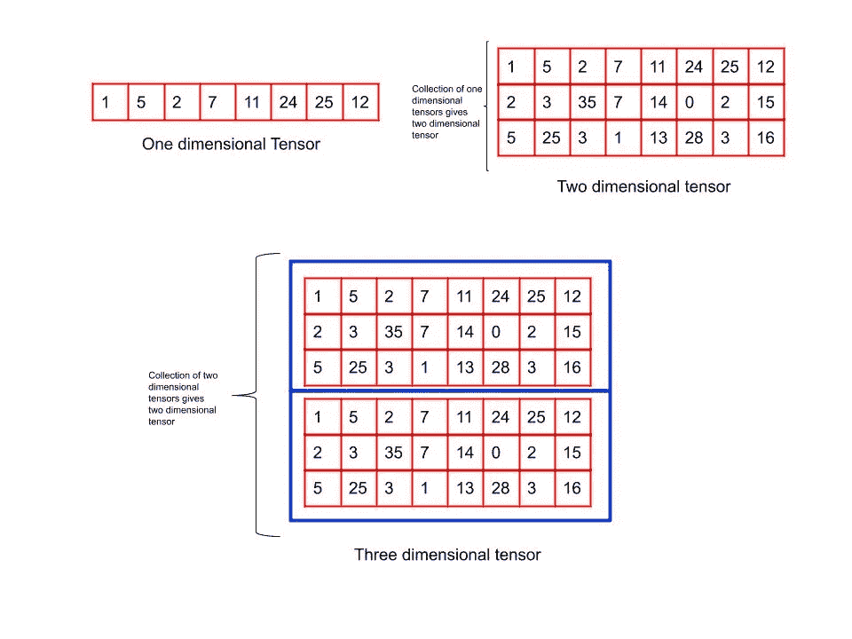
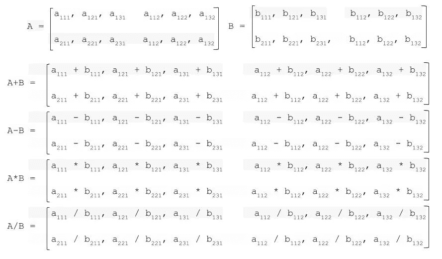
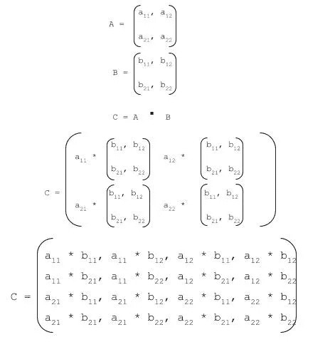

# 神经网络的构建模块

> 原文：<https://medium.com/analytics-vidhya/building-blocks-of-neural-networks-6713fa51375f?source=collection_archive---------22----------------------->

## 深度学习的祈祷:第三部分

## 张量及其运算的介绍

在上一篇文章中，我们已经讨论了机器学习/深度学习项目的基本架构。现在，我们将更加专注于深度学习概念。因此，如果你错过了我以前的文章，这里有我的个人资料的链接来阅读那些内容——IJAS·阿·H


深度学习封面的祈祷

我们知道数据是建立任何学习模型的基本要求。但是单纯的原始数据并不能满足我们的要求。我们需要以某种特定的格式表示数据，作为神经网络的输入。因此，让我们讨论神经网络的数据表示。

## 数据表示

在深度学习中，无论我们处理什么数据(文本、音频、视频等。)我们先把数据转换成 ***张量*** *。*这个将数据转换成张量的过程叫做 ***数据矢量化*** *。那么什么是张量呢？* **张量是存储在多维数组中的数据。**

> **注意:这里存储在多维数组中的数据将是实际数据的数字表示。**

基于数据，张量可以有不同的维度。所以我们来探讨一些不同维度的张量。这里我们使用 python 中的 [Numpy](https://numpy.org/) 库来创建张量。

**0 维张量:** 0 维张量也叫*标量*。在 Numpy 中，float32 或 float64 数是一个标量张量。

这里 *ndim* 用来显示轴的数量。

```
import numpy as np
x = np.array(100)
print("Array",x)
print("dimension",x.ndim)**output** Array 100 
dimension 0
```

**一维张量:**一个数列可以认为是一维张量(1D 张量，也叫*向量*)。

```
import numpy as np
x = np.array([1,5,2,7,11,24,25,12])
print(“Array:”, x)
print(“Dimension:”, x.ndim)**Output** Array: [ 1  5  2  7 11 24 25 12] 
Dimension 1
```

**二维张量:**二维张量是一维张量的集合。

```
import numpy as np
x = np.array(
[
[1,5,2,7,11,24,25,12],
[1,2,3,4,5,6,7,8]
]
)
print(“Array:”, x)
print(“Dimension”, x.ndim)**Output** Array: [[ 1  5  2  7 11 24 25 12]  [ 1  2  3  4  5  6  7  8]] Dimension 2
```

**多维张量:**二维张量的集合产生三维张量，三维张量的集合又产生四维张量，如此继续。



图 1:不同维度张量的图示

## 真实世界的张量

我们已经将数据表示为张量，现在让我们探索一些真实世界的张量表示来进一步理解这个概念。

**图像数据** —图像是 4D 张量。因此，在图像相关的深度学习问题中，图像数据将被表示为具有形状*(样本、高度、宽度、通道)*的 4D 张量

**视频数据** —视频用形状*(样本、帧、高度、宽度、通道)*的 5D 张量表示

## 张量运算



图 2:元素张量运算

如上图所示，我们可以用元素的方式对张量进行加减乘除。

*两个维数相同的张量的元素运算产生一个维数相同的新张量，其中每个标量值是父张量中标量的元素运算(加、减、乘、除)。*

现在，让我们看看如何使用 numpy 实现这些张量运算。

```
import numpy as npA = np.array([
[[1,2,3], [4,5,6], [7,8,9]],
[[11,12,13], [14,15,16], [17,18,19]],
[[21,22,23], [24,25,26], [27,28,29]],
])B = np.array([
[[1,2,3], [4,5,6], [7,8,9]],
[[11,12,13], [14,15,16], [17,18,19]],
[[21,22,23], [24,25,26], [27,28,29]],
])print(“Array A”,A)
print()
print(“Array B”,B)
print()
print("Array A+B:",A+B)
print()
print("Array A-B:", A-B)
print()
print("Array A*B:", A*B)
print()
print("Array A/B:", A/B)**Output**Array A [[[ 1  2  3]   [ 4  5  6]   [ 7  8  9]]   [[11 12 13]   [14 15 16]   [17 18 19]]   [[21 22 23]   [24 25 26]   [27 28 29]]]Array B [[[ 1  2  3]   [ 4  5  6]   [ 7  8  9]]   [[11 12 13]   [14 15 16]   [17 18 19]]   [[21 22 23]   [24 25 26]   [27 28 29]]]Array A+B: [[[ 2  4  6]   [ 8 10 12]   [14 16 18]]   [[22 24 26]   [28 30 32]   [34 36 38]]   [[42 44 46]   [48 50 52]   [54 56 58]]]Array A-B: [[[0 0 0]   [0 0 0]   [0 0 0]]   [[0 0 0]   [0 0 0]   [0 0 0]]   [[0 0 0]   [0 0 0]   [0 0 0]]]Array A*B: [[[  1   4   9]   [ 16  25  36]   [ 49  64  81]]   [[121 144 169]   [196 225 256]   [289 324 361]]   [[441 484 529]   [576 625 676]   [729 784 841]]]Array A/B: [[[1\. 1\. 1.]   [1\. 1\. 1.]   [1\. 1\. 1.]]   [[1\. 1\. 1.]   [1\. 1\. 1.]   [1\. 1\. 1.]]   [[1\. 1\. 1.]   [1\. 1\. 1.]   [1\. 1\. 1.]]]
```

## 广播

我们已经讨论了形状相同的张量的 numpy 运算。现在我们来讨论不同形状张量上的运算。*受某些约束，较小的数组被“* ***”广播*** *”穿过较大的数组以便它们具有兼容的形状。广播提供了一种向量化数组操作的方法，因此循环在 C 而不是 Python 中发生。这样做不会产生不必要的数据副本，并且通常会导致高效的算法实现。*

Numpy 操作通常以元素对元素的方式成对进行。换句话说，两个张量必须有相同的形状。

```
import numpy as np
a = np.array([1.0, 2.0, 3.0])
b = np.array([2.0, 2.0, 2.0])
print(a * b)**Output** array([2., 4., 6.])
```

当数组的形状满足一定的约束时，Numpy 广播规则放宽了这一点。一个简单的例子是标量值与向量相乘。

```
import numpy as np
a = np.array([1.0, 2.0, 3.0])
b = 2
print(a * b)
**Output** array([2., 4., 6.])
```

这里，上面的两个代码片段产生相同的输出，第一个是通过使用简单的张量乘法，第二个是通过使用张量广播。

有关广播的更多信息，请访问:[广播](https://docs.scipy.org/doc/numpy-1.13.0/user/basics.broadcasting.html#broadcasting)

**张量积**

张量*乘积*运算与逐元素张量乘法不同。给定一个维度为 *q* 的张量和另一个维度为 *r* 的张量，两个张量的乘积将产生一个维度为*q+r*的新张量



图 3:张量点运算

为了计算 A 和 B 的张量积，张量 A 中的每个元素都要乘以张量 B。

现在，让我们看看如何使用 numpy 实现张量点运算

为此，我们使用 numpy 中的 *tensordot(张量 A，张量 B，轴= '值')*函数

> 轴值的三个常见用例是:
> 
> `axes = 0`:张量积
> 
> `axes = 1`:张量点积
> 
> `axes = 2`:(默认)张量双收缩

因为我们试图找到张量积*我们指定轴值为‘0’*

```
import numpy as np
A = np.array([2,24])
B = np.array([5,8])
C = np.tensordot(A,B,axes = 0)
print(C)**Output** [[ 10  16]  [120 192]]
```

## 参考

1.  [维基百科上的张量](https://en.wikipedia.org/wiki/Tensor)
2.  [维基百科上的张量积](https://en.wikipedia.org/wiki/Tensor_product)
3.  [维基百科上的张量代数](https://en.wikipedia.org/wiki/Tensor_algebra)
4.  [用 NumPy 对张量进行机器学习的温和介绍](https://machinelearningmastery.com/introduction-to-tensors-for-machine-learning/)
5.  [numpy.tensordot](https://docs.scipy.org/doc/numpy/reference/generated/numpy.tensordot.html#:~:targetText=Compute%20tensor%20dot%20product%20along,specified%20by%20a_axes%20and%20b_axes%20.)