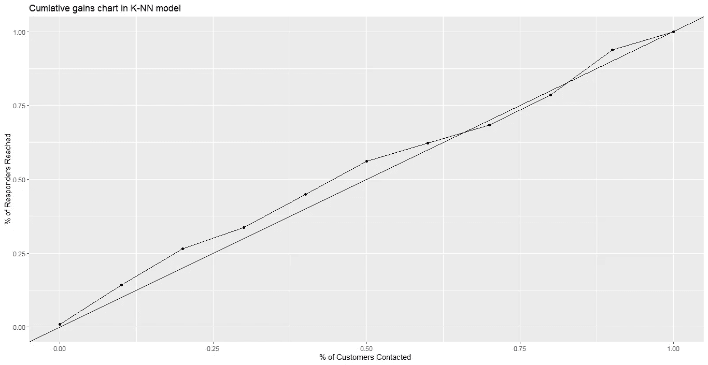

# 用 R 语言构建图书推荐系统

> 原文：<https://medium.com/analytics-vidhya/building-book-recommendation-system-in-r-1581d6b18fb6?source=collection_archive---------14----------------------->

*广开阮雄*

**一)简介**


推荐系统是数据挖掘最有用的应用之一。它在市场营销、银行业务中有着广泛的应用。

通过推荐系统，企业可以锁定正确的客户，降低邮寄或向客户发送广告的成本。因此，它有助于企业更有效地运作，产生更多的利润

如你所知，网飞电影推荐系统就是一个典型的例子。每次你选择要看的电影，系统都会自动找到与你选择的电影有相似类别的电影。下一次，网飞将为你提供适合你兴趣的电影。电影推荐系统帮助用户发现新的和相关的项目，创造愉快的用户体验，同时增加网飞的收入。

在本文中，我将执行各种数据挖掘技术，如细分、逻辑回归、k-NN，以帮助锁定“正确的客户”

**II)数据**

我们的项目发生在查尔斯读书俱乐部(CBC)。这是一个读书俱乐部，经常为会员提供书籍。该俱乐部通过向会员出售书籍来获取利润。

一个新的标题，*佛罗伦萨的历史艺术，*即将发行。由于是新书，俱乐部没有数据来了解他们的顾客对这本书的偏好。因此，为了获得客户对这本书的见解，俱乐部决定从其客户群中随机抽取 4000 名客户进行邮寄，并将客户的反应记录在名为 *CharlesBookClub.csv* 的数据集中(您可以在这里下载数据

每一列都是一个变量，标题行给出了变量的名称。下表给出了变量名和描述


来源于 474 页-商业分析的数据挖掘

我们的目标是使用各种数据挖掘技术来帮助 CBC 向合适的客户提供《佛罗伦萨的历史艺术》这本书

**三)计划**

我们的计划遵循以下步骤:

***第一步:使用分割技术***

您可能知道，细分过程旨在将客户划分为同类群体。我们进行细分所需的同质标准是购买产品的可能性。在这个项目中，我使用三个变量 R，F，M 作为这种倾向的指标

我们将找到具有高响应率的 RFM(近期、频率、货币)组合组，并使用提升曲线来评估其在测试集中捕捉响应者的能力

***第二步:使用逻辑回归***

我们将用两种方法对训练集进行逻辑回归拟合

方法 1:用所有变量拟合逻辑回归

方法 2:仅用 R、F、M 变量拟合逻辑回归

然后，我们创建累积收益图来评估两种方法中的模型，并选择最佳方法

***第三步:使用 K-NN 算法***

为了执行 k-nn 算法，我们仅使用 5 个变量，它们是:

*R，F，M，FirstPurch，RelatedPurch*

我们将所有这些变量标准化，并将数据集分为训练集和测试集

之后，我们将选择在测试集中产生最高准确度的“最佳 k”

最后，我们将使用“最佳 k”来再次拟合 k-nn 算法，并绘制累积增益图来评估其性能

***第四步:对比模型，给出一些结论***

请注意:我之所以使用提升图和累积收益图来评估模型的表现，是因为它们是帮助我们回答以下问题的重要工具:

根据给定的数据集，我们应该以多少客户为目标来产生最高的效率？

你可以在这本[书](https://www.amazon.com/Data-Mining-Business-Analytics-Applications-ebook/dp/B075MSG9F6)里找到这个项目。

**IV)实现算法**

*a)分割技术*

在执行分割之前，我们需要将 R、F、M 归入不同的类别。变量 Rcode、Fcode、Mcode 被产生以如下结合 R、F、M 变量:

最近:

0–2 个月(Rcode=1)

3-6 个月(Rcode=2)

7-12 个月(Rcode=3)

13 个月及以上(Rcode=4)

频率:

1 本书(Fcode=1)

2 本书(Fcode=2)

3 本书及以上(Fcode=3)

货币:

$0-$25(Mcode=1)

$26-$50 ( Mcode=2)

51 美元到 100 美元(Mcode =3)

101 美元到 200 美元(Mcode=4)

201 美元及以上(Mcode=5)

注意，在这篇文章中我经常使用术语 RFM，它表示 RFM 组合。

例如，如果 RFM=114，这意味着 Rcode=1，Fcode=1，Mcode=4(变量 Rcode，Fcode，Mcode 已经存在于数据集中)

显然，RFM 类别有 4x5x6=60 种组合，我们在这一部分的目标是找出哪些 RFM 组合具有最高的响应率

为此，我们首先需要在训练集中找到 3 个不同的部分，它们是:

第 1 部分:RFM 组合的响应率超过总体响应率的两倍

第 2 部分:有响应率的 RFM 组合超过总体响应率，但未超过总体响应率

第 3 部分:剩余的 RFM 组合

为了找出上面提到的 3 个部分，我们首先读取数据集并加载这个项目中需要的所有库

```
library(dplyr)
library(caret)
library(ggplot2)
library(randomForest)
library(FNN)
*#Load libraries*
setwd("C:\\Users\\INSPIRON\\Downloads\\Data Analytica\\Project\\Charles Book Club")
char_book<-read.csv("CharlesBookClub.csv",header=T)
```

现在，让我们以 60:40 的比例将数据集分为训练集和测试集

```
*## Split the train/test*
smp_size <- floor(0.6 * nrow(char_book))
set.seed(1)
train_ind <- sample(seq_len(nrow(char_book)), size = smp_size)
cb.train <- char_book[train_ind,]
cb.test <- char_book[-train_ind,]
```

接下来，我们计算训练集中的响应率

```
m=sum(as.integer(cb.train$Florence))/nrow(cb.train)
> m
[1] 0.08708333
```

训练集中的响应率约为 0.08，我们的下一步是创建基于 Rcode、Fcode、Mcode 的不同值计算响应率的函数。下面，我展示了创建 ***respondrate 函数*** 的代码，以及使用该函数计算集合 have Rcode=1，Fcode=1，Mcode=4 中的响应率的示例

```
*#Create function to calculate response rate base on r,f,m*
respondrate<-function(r,f,m,data,x=0,y=0)
{ for(i in 1:nrow(data)){
  if((data[i,]$Rcode==r)&&(data[i,]$Fcode==f)&&(data[i,]$Mcode==m))
  {x=x+1}
  if((data[i,]$Rcode==r)&&(data[i,]$Fcode==f)&&(data[i,]$Mcode==m)&&(data[i,]$Florence==1))
  {y=y+1} 
}
y/x  
}
*#Example when Rcode=1,Fcode=2,Mcode=3* respondrate(r=1,f=1,m=4,data=cb.train)
[1] 0.25
```

所以集合中的响应率 Rcode=1，Fcode=1，Mcode=4 是 0.25。我们的下一步是使用 ***响应率函数*** 来找出 RFM 的哪个组合属于段 1、2 或 3

```
*#Code to find RFM combination in segment 1* l<-cb.train%>%group_by(Rcode,Fcode,Mcode)%>%summarize(respondrate(Rcode,Fcode,Mcode,cb.train))
*#Filter RFM combinations in segment 1* l1<-l%>%filter(l$`respondrate(Rcode, Fcode, Mcode, cb.train)`> 2*m)*#Print out the RFM combinations in segment 1* for(i in 1:nrow(l1))
{print(l1[i,]$Rcode*100+l1[i,]$Fcode*10+l1[i,]$Mcode)}
[1] 114
[1] 122
[1] 132
[1] 211
[1] 212
[1] 215
[1] 233
```

因此，段 1 中的 RFM 组合是 114、122、132、211、212、215、233

我们将所有这些组合放在一个向量中

```
segment1<-c(114,122,132,211,212,215,233)
```

只要和上一步一样做，我们很容易发现第二段中的 RFM 组合是:115，125，135，213，223，224，225，234，235，323，335，433

```
segment2<-c(115,125,135,213,223,224,225,234,235,323,335,433)
```

段 3 中的 RFM 组合是其余的

在找出所有 3 个部分的组合后，我们将使用它来评估在测试集中捕捉响应的能力

```
*#Caculate the response rate in the test set*
m2=sum(as.integer(cb.test$Florence))/nrow(cb.test)
> m2
[1] 0.080625
```

测试集中的响应率在 0.08 左右。现在我们将计算响应率和测试集上每个片段的行数

```
*#Create one column called combination*
cb.test<-cb.test%>%mutate(combination=Rcode*100+Fcode*10+Mcode)
cb.test$combination<-as.factor(cb.test$combination)
*#Calculate the response rate and size of segment 1 on the test set* v<-cb.test%>%filter((combination %in% segment1))%>%select(Florence)
rate1<-length(which(v==1))/nrow(v)#Group 1
size1<-nrow(v)
> rate1
[1] 0.0952381
size1<-nrow(v)
> size1
[1] 42*#Calculate the response rate and size of segment 2 on the test set* v<-cb.test%>%filter((combination %in% segment2))%>%select(Florence)
rate2<-length(which(v==1))/nrow(v)#Group 2
size2<-nrow(v)
> rate2
[1] 0.1039604
> size2
[1] 404*#Calculate the response rate and size of segment 3 on the test set* '%notin%' <- Negate('%in%')
v<-cb.test%>%filter((combination %notin% segment1)&(combination %notin% segment2))%>%select(Florence)
rate3<-length(which(v==1))/nrow(v)#Group 3
size3<-nrow(v)
> rate3
[1] 0.07192374
> size3
[1] 1154
```

正如我们在上面看到的，在测试集中，片段 1、2、3 的响应率分别约为 0.09、0.1 和 0.07

最后，我们创建升力图，为此，我们必须计算每个部分的升力比，并绘制它

```
*#Calculate lift ratio*
lift1<-rate1/(size1/nrow(cb.test))
lift2<-rate2/(size2/nrow(cb.test))
lift3<-rate3/(size3/nrow(cb.test))
*#Plot the lift ratio* plot(c(lift1,lift2,lift3) ~ c(size1/nrow(cb.test),size2/nrow(cb.test),size3/nrow(cb.test)), type = "b",xlab="% of Customers Contacted",ylab = "Lift ratio",main="Lift Chart of Segmentation Model")+
abline(h=1,col="red")
```


我们可以看到，目标细分市场 1 的效率最高，其升力高于基准模型。细分市场 2 和 3 的目标生产效率低于基准模型

*b)逻辑回归*

在这一部分，我们将尝试用以下 3 种不同的逻辑回归模型来拟合数据集:

模型 1:具有所有预测因子的逻辑模型

模型 2:只有 R，F，M 的 Logistic 模型

之后，我们将绘制每个模型的累积收益图，并评估其性能

**型号 1:**

```
*#Split train/test*
smp_size <- floor(0.7 * nrow(char_book))
set.seed(1)
train_ind <- sample(seq_len(nrow(char_book)), size = smp_size)
cb.train <- char_book[train_ind, ]
cb.test <- char_book[-train_ind, ]
*#Choose all the predictors*
log_all<-glm(Florence~Gender+M+F+R+FirstPurch+ChildBks+YouthBks+CookBks+DoItYBks+RefBks+ArtBks+GeogBks+ItalCook+ItalAtlas+ItalArt+Related.Purchase,data=cb.train,family="binomial")
cb_prob<-predict(log_all,cb.test,type="response")
cb_pred<-rep(0,nrow(cb.test))
cb_pred[cb_prob>0.5]=1
cb_mat<-confusionMatrix(as.factor(cb_pred),cb.test$Florence)#Create confusion matrix
> cb_mat
Confusion Matrix and Statistics Reference
Prediction    0      1
           0 1102   95
           1    0    3Accuracy : 0.9208          
95% CI : (0.9041, 0.9355)
No Information Rate : 0.9183          
P-Value [Acc > NIR] : 0.4014Kappa : 0.0548Mcnemar's Test P-Value : <2e-16          

            Sensitivity : 1.00000         
            Specificity : 0.03061         
         Pos Pred Value : 0.92063         
         Neg Pred Value : 1.00000         
             Prevalence : 0.91833         
         Detection Rate : 0.91833         
   Detection Prevalence : 0.99750         
      Balanced Accuracy : 0.51531         

       'Positive' Class : 0
```

该模型具有很高的准确性和敏感性，但特异性较低，这意味着它比响应客户更好地捕捉无响应客户

现在我们将绘制这个模型的累积增益图。创建此图表的想法是，我们按照客户的预测概率以降序对客户进行排序。将客户划分为同等大小的部分，我们创建包含相同数量客户的组，例如，10 个十分位数的组，每个组包含 10%的客户群。因此，我们预测最有可能做出响应的客户位于十分之一组 1，其次是十分之一组 2，依此类推。之后，我们将计算每个十分位数的累积响应率。因此，累积提升图的 x 轴显示了联系客户的百分比，y 轴显示了回应客户的百分比。有关此图表的更多信息，您可以点击[此处](https://select-statistics.co.uk/blog/cumulative-gains-and-lift-curves-measuring-the-performance-of-a-marketing-campaign/)

```
*#Sort predicted probability in decreasing order*
cb.test_new<-cb.test%>%mutate(cb_prob)
cb.test_new<-cb.test%>%arrange(desc(cb_prob))
*#Create function to calculate the cumulative response rate in each decile* cum_respond<-function(data,k)
{length(which(data[1:k,]$Florence==1))/length(which(data$Florence==1))}
*#Calculate the cumulative response rate in each decile* cumrate<-rep(0,11)
for ( i in 1:11)
{
  cumrate[i]=cum_respond(cb.test_new,0.1*(i-1)*nrow(cb.test_new))
}
*#Create decile*percent_data<-c(0,0.1,0.2,0.3,0.4,0.5,0.6,0.7,0.8,0.9,1)
dat<-data.frame(cumrate,percent_data)*#Plot the chart*ggplot(dat,aes(x=percent_data,y=cumrate))+geom_point()+geom_line()+xlim(0,1)+ylim(0,1)+geom_abline(intercept = 0, slope = 1)+xlab("% of Customers Contacted ") + ylab("% of Responders Reached")+ggtitle("Cumlative gains chart in model 1")
```


模型 1 中的累积收益图

**模式二:**

与模型 1 中的步骤相同，我们也用 3 个变量 R、F、M 拟合数据，并绘制模型 1 中的累积收益图

```
*#Fit the model with logistic regression* log_all<-glm(Florence~M+F+R,data=cb.train,family="binomial")
cb_prob<-predict(log_all,cb.test,type="response")
cb_pred<-rep(0,nrow(cb.test))
cb_pred[cb_prob>0.5]=1
cb_mat<-confusionMatrix(as.factor(cb_pred),cb.test$Florence)
cb_mat
> Confusion Matrix and Statistics Reference
Prediction    0    1
          0 1102   98
          1    0    0Accuracy : 0.9183          
95% CI : (0.9014, 0.9332)
No Information Rate : 0.9183          
P-Value [Acc > NIR] : 0.5269Kappa : 0Mcnemar's Test P-Value : <2e-16Sensitivity : 1.0000          
Specificity : 0.0000          
Pos Pred Value : 0.9183          
Neg Pred Value :    NaN          
Prevalence : 0.9183          
Detection Rate : 0.9183          
Detection Prevalence : 1.0000          
Balanced Accuracy : 0.5000'Positive' Class : 0
```

该模型将所有客户分类为无响应

```
*#Sort predicted probability in decreasing order*
cb.test_new<-cb.test%>%mutate(cb_prob)
cb.test_new<-cb.test%>%arrange(desc(cb_prob))
*#Create function to calculate the cumulative response rate in each decile* cum_respond<-function(data,k)
{length(which(data[1:k,]$Florence==1))/length(which(data$Florence==1))}
*#Calculate the cumulative response rate in each decile* cumrate<-rep(0,11)
for ( i in 1:11)
{
  cumrate[i]=cum_respond(cb.test_new,0.1*(i-1)*nrow(cb.test_new))
}
*#Create decile*percent_data<-c(0,0.1,0.2,0.3,0.4,0.5,0.6,0.7,0.8,0.9,1)
dat<-data.frame(cumrate,percent_data)*#Plot the chart*ggplot(dat,aes(x=percent_data,y=cumrate))+geom_point()+geom_line()+xlim(0,1)+ylim(0,1)+geom_abline(intercept = 0, slope = 1)+xlab("% of Customers Contacted ") + ylab("% of Responders Reached")+ggtitle("Cumlative gains chart in model 2")
```


模型 2 中的累积收益图

比较两个模型中的累积收益图，我们清楚地看到，模型 1 在准确性、敏感性和捕捉响应者的能力方面都优于模型 1。

最后，我们将绘制模型 1 的提升图，为了计算提升，我们简单地将模型 1 的累积率除以每个百分点

```
*#Calculate the lift ratio*
lift1<-dat$cumrate/dat$percent_data
#Plot the lift ratio
plot(lift1[-1]~dat[-1,]$percent_data, type = "b",xlab="% of Customers Contacted",ylab = "Lift ratio",main="Lift Chart of Logistic Model")+abline(h=1,col="red")
```


*c) K-NN*

在用 K-NN 拟合模型之前，我们需要标准化训练和测试集中的所有数值变量

```
cb.train$R<-scale(cb.train$R)
cb.train$F<-scale(cb.train$F)
cb.train$M<-scale(cb.train$M)
cb.train$FirstPurch<-scale(cb.train$FirstPurch)
cb.train$Related.Purchase<-scale(cb.train$Related.Purchase)
cb.train$Florence<-as.factor(cb.train$Florence)
cb.test$R<-scale(cb.test$R)
cb.test$F<-scale(cb.test$F)
cb.test$M<-scale(cb.test$M)
cb.test$FirstPurch<-scale(cb.test$FirstPurch)
cb.test$Related.Purchase<-scale(cb.test$Related.Purchase)
cb.test$Florence<-as.factor(cb.test$Florence)
```

K-NN 的一个问题是，我们必须找到“最佳 K ”,它能产生最高的精度。在本文中，我们将创建一个 for 循环。在每个循环中，我们将计算模型在每个不同 k 值下的精度

```
*#Create the function to calculate the accuracy* accu<-function(x){(x[1,1]+x[2,2])/(sum(x))}
*#Create a vector to contain accuracy value in each loop* acc<-rep(0,14)
*#Create a for loop* for(i in 1:14)
{*#Fit the k-nn model*
knn.pred <- knn(train = cb.train[,c(4,5,6,7,19)], test = cb.test[,c(4,5,6,7,19)],
          cl = cb.train$Florence, k = i)
*#Create confusion matrix* mat<- table(knn.pred,cb.test$Florence)
acc[i]=accu(mat)
}
k<-seq(1,14,1)
dat<-data.frame(k,acc)
> dat
    k       acc
1   1 0.8483333
2   2 0.9133333
3   3 0.9041667
4   4 0.9191667
5   5 0.9125000
6   6 0.9191667
7   7 0.9141667
8   8 0.9183333
9   9 0.9183333
10 10 0.9183333
11 11 0.9191667
12 12 0.9191667
13 13 0.9183333
14 14 0.9191667
```

我们可以看到，当 k=4 时，11、12、14 的精度最高。在这种情况下，我会选择 k=14

现在，我们只是在训练集中再次拟合 k=14 的 K-NN，并绘制累积收益图，就像我们在逻辑回归中所做的一样

```
*#Fit the knn with k=14* nn <- knn(train = cb.train[,c(4,5,6,7,19)], test = cb.test[,c(4,5,6,7,19)],
          cl = cb.train$Florence, k = 14,prob=T)*#Calculate the predicted probability for each customer* proba<-data.frame(nn,attr(nn, "prob"))
for(i in 1:nrow(proba))
{if(proba[i,]$nn==0)
{proba[i,]$attr.nn...prob..=1-proba[i,]$attr.nn...prob..}
}*#Plot the cumulative gains chart* cb.test_new<-cb.test%>%mutate(proba$attr.nn...prob..)
cb.test_new<-cb.test_new%>%arrange(desc(proba$attr.nn...prob..))
cumrate<-rep(0,11)
for ( i in 1:11)
{
  cumrate[i]=cum_respond(cb.test_new,0.1*(i-1)*nrow(cb.test_new))
}  
percent_data<-c(0,0.1,0.2,0.3,0.4,0.5,0.6,0.7,0.8,0.9,1)
dat<-data.frame(cumrate,percent_data)
ggplot(dat,aes(x=percent_data,y=cumrate))+geom_point()+geom_line()+xlim(0,1)+ylim(0,1)+geom_abline(intercept = 0, slope = 1)+xlab("% of Customers Contacted ") + ylab("% of Responders Reached")+ggtitle("Cumlative gains chart in K-NN model")
```



**V)结论**

比较三种不同模型的累积增益图和提升图，我们可以看到 K-NN 在捕捉响应者方面表现不佳

逻辑回归模型和细分模型哪个更好取决于营销预算。例如，如果营销预算只允许 CBC 从数据集中锁定 2.5%的客户，我会选择细分模型，因为它的提升比逻辑模型好 3 倍。然而，如果营销预算允许 CBC 针对数据集中超过 5%的客户，我更倾向于逻辑模型

此外，通过找出分段 1 和分段 2，我们获得了以下有趣的见解:

最近一次购买越近，过去从该公司购买的产品越多，过去购买该公司产品花费的钱越多，客户购买所提供的
产品的可能性越大。

感谢你花时间阅读我的文章，我希望我的文章对你有用，如果你喜欢，别忘了拍手。我也期待看到你的评论

**VI)参考文献**

> *【1】*[*商业分析的数据挖掘*](https://www.amazon.com/Data-Mining-Business-Analytics-Applications-ebook/dp/B075MSG9F6) *:概念、技术和应用。*
> 
> [https://select-statistics . co . uk/blog/cumulative-gains-and-lift-curves-measuring-the-performance-of-a-marketing-campaign/](https://select-statistics.co.uk/blog/cumulative-gains-and-lift-curves-measuring-the-performance-of-a-marketing-campaign/)