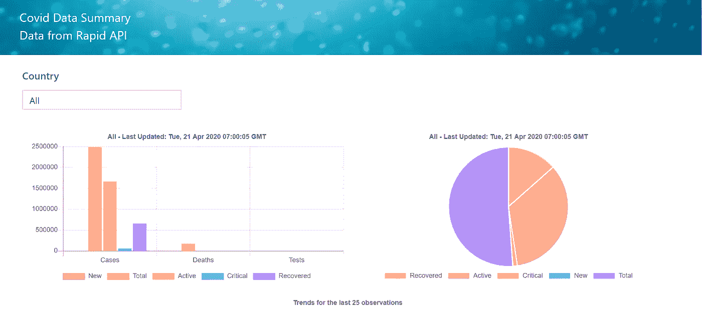
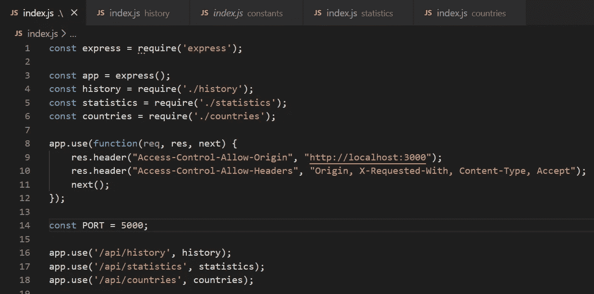
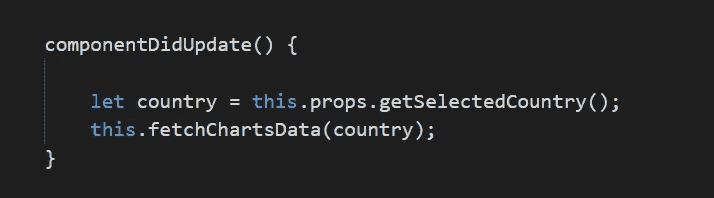
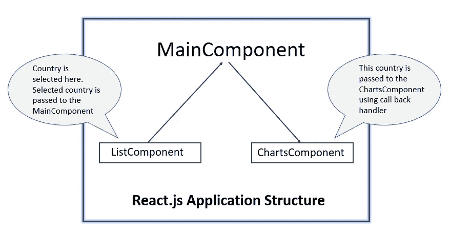
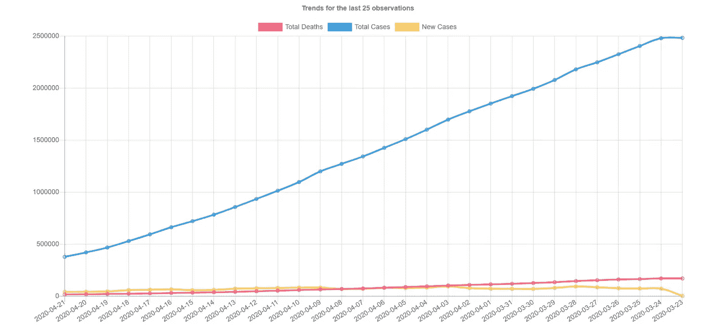
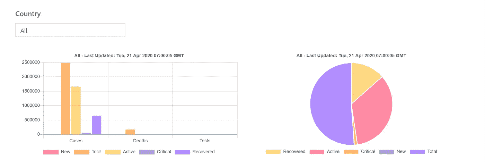
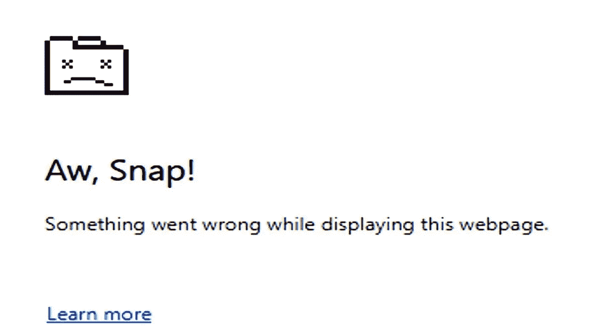

# 用 React.js 和 Node.js 构建新冠肺炎仪表板

> 原文：<https://medium.com/analytics-vidhya/building-covid-19-dashboard-with-react-js-and-node-js-bf3bddd7954b?source=collection_archive---------7----------------------->

巴基斯坦戈拉克山的日出

好的这么锁着不好！你不能做任何事情，不能长途驾驶，不能见朋友等等。尽管我是高度内向的人，但实际上我厌倦了盯着墙看。所以为了结束这一切，我决定为我们造成的所有疾病建造一些东西。这个帖子其实就是关于这个的。我们开始吧

出于对数据的热爱，我考虑过制作新冠肺炎仪表板。与数据打交道是最让我兴奋的事情。现在，在商业智能工具上制作一个仪表板比自己编写所有酷的东西更容易。所以我选择了全栈开发，而不是 Tableau 或 Power BI 等。下面是我们得出的最终仪表板的屏幕截图:

最终仪表板。这里，我遗漏了我们也创建的折线图

> 重要的事情先来。我们需要数据。从哪里来的？我给了谷歌一个尝试，想出了一些 API。由于这只是我的业余项目，我选择了一个免费的 API。你可以在这里找到[。这是一个免费的 API，会给我们所有我们需要的东西。我们得到统计数据，历史和所有它支持的国家。由于我们有两个 API，我将这个获取数据的 API 称为**外部 API** 。现在所需要的就是把这些东西连接起来！](https://rapidapi.com/api-sports/api/covid-193)

接下来我们要做的是什么？我决定去 ERN，而不是 MERN，因为我跳过了 M ie MongoDB 或 MySQL。目前不需要存储数据。于是我们有了**E**(Express framework)**R**(react . js)和 **N** (Node.js)。*作为一名专业开发人员，我通常会使用 Angular 和 ASP.NET/Spring Boot 内核，所以在这里我决定使用不同的堆栈。*

接下来让我们首先从 Node.js API 开始。不需要一个 API 调用另一个 API 来获取数据。我介绍的原因可以在改进部分找到。代码非常简单。我们有一些简单的路线，接受来自前端应用程序的数据，查询上述 API 并返回结果。唯一的问题是当两个应用程序在不同的主机上时，我们可能会遇到 Cors。下面提到的一个简单的调整就可以解决这个问题。API 的构建并没有花费很长时间。准确地说，所有人都接到了电话。

在 Node.js 应用程序中处理 Cors

接下来是前端应用。这就是奇迹发生的地方。因为我正在使用 React JS，所以我需要从组件的角度来考虑。假设:我有一个列表组件，可以显示所有不同的国家，也可以是仪表板图表的组件。有许多方法来组织应用程序组件。我的组件很简单:一个**主组件、一个列表组件**和一个**图表组件。**main Component 充当父组件，托管列表和图表组件。

在 React.js 中回调

> 一旦选择了一个国家，它就被发送到 MainComponent，main component 将它委托给 ChartsComponent 以获取相关数据并呈现图表。我决定使用“axios”库来发出 HTTP 请求。让这些组件连接起来并一起工作而不产生错误，牢记 React JS 组件的生命周期方法是需要大量编码技能的地方。

处理反应堆中的不同组件

现在让我们装饰应用程序。我们需要应用样式。Bootstrap 和棱角分明的素材我看多了。所以为了改变，我决定坚持使用 Metro UI。你可以在这里找到它的文档。自从我在微软创新中心接受培训以来，我一直很喜欢 Metro UI。它可能在手机上看起来不是最好的，但是对于设计网站来说，它是非常不同和独特的。

所以我把它作为 CDN 导入了。对于所有的网格、下拉组件和字体样式，我都使用了它的 CSS。在这之后，我们在我们的仪表板的最后阶段。我们如何渲染图表？

> 我首先考虑 D3.js，但后来坚持使用 [Chart.js](https://www.chartjs.org/) 。这是 sleak，一个轻量级的库，可以使用定制选项呈现漂亮的动画图表。我为我的仪表板选择了折线图、条形图和饼图。棘手的部分是:在呈现任何新的图表之前，需要销毁所有的图表。

显示过去 30 天观察结果趋势的折线图

将信息分成三个不同类别的条形图—显示比例对比的饼图

现在我们终于完成了 Node.js API，在 React.js 上制作了前端应用程序，并完成了样式和图表。总结时，我意识到这个小仪表板还可以做一些改进。

1.  介绍 API 和外部 API 之间的数据存储。结果是，我们可以用我们需要的格式存储数据，因此我们不需要每次都调用 API。此外，一旦我们存储了数据，我们可以进一步对其进行分析。
2.  如果 Node.js API 不存在，我们的前端应用程序只会显示错误消息。但是这可以通过引入图片变得更加互动，比如

[https://i.ytimg.com/vi/ZxeNo_PTslo/maxresdefault.jpg](https://i.ytimg.com/vi/ZxeNo_PTslo/maxresdefault.jpg)

3.当我们调用历史端点时，会收到大量数据。我只选取了 25 个最近的条目来呈现折线图。剩余的数据可以显示在一个表格上，但不知何故，我懒得去处理它！

4.我们还可以将日期传递给历史 API，它可以只返回该日期的数据。我还没有实现这一点，但这应该是一个很好的补充。

5.加载图表时，不显示进度条。Metro UI 带有漂亮的 UI 组件，有助于进步。你可以在这里找到[。它们可以根据活动的进度进行切换。](https://metroui.org.ua/progress.html)

6.我们还可以制定一个计划作业来每天检索数据。当我们实施了 M 个 MERN 堆栈，即数据存储时，这是可能的。

暂时就这么多。构建这个仪表板实际上不仅帮助我愉快地度过了隔离时间，还提高了我在 React.js 和 Node.js 上的技能。我也喜欢设计自己的东西。请随意使用代码并放弃任何回应。你可以在这里找到 [API](https://github.com/umairk83/covid-19-API) 的代码，在这里找到门户[的代码。](https://github.com/umairk83/covid-19-dashboard)