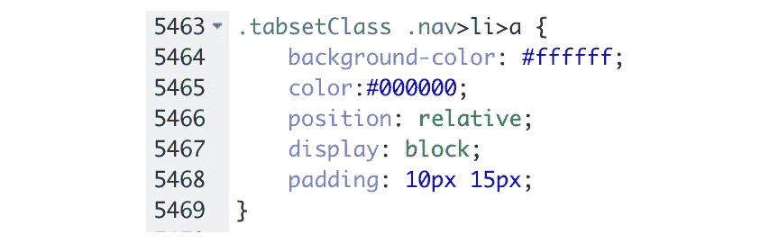

# 构建自定义的闪亮用户界面

> 原文：<https://medium.com/analytics-vidhya/building-custom-r-shiny-ui-66d446ef4dad?source=collection_archive---------3----------------------->

作为正在进行的为宾夕法尼亚州的 ACLU([https://www.aclupa.org)](https://www.aclupa.org/)构建定制仪表板项目的一部分，我们尝试了很多定制 RShiny UI 来满足我们的设计目标。在本帖中，我们将讨论一些用于定制仪表板设计的技术。

我们大致涵盖两个主题:

*   **添加自定义 UI 元素**
*   **定制闪亮主题**

# **添加自定义 UI 元素**

Shiny 附带了很多默认的布局元素，比如`navbarPage`、`fluidPage`、`tabsetPanel`等等。但是，有时这些选项可能不足以重新创建您想要的设计。在这种情况下，我们可以求助于使用定制的 HTML 代码来构建我们的 UI。

我们对仪表板的目标是包括一个配置文件页面，在仪表板顶部有 3 个框，展示 3 个关键的统计数据。


个人资料页面的设计

最初尝试使用`fluidRow`和 3 `column`元素的组合并没有给我们提供我们需要的结果。此外，让这些盒子以正确的间距正确对齐是一项艰巨的任务。因此，我们最终使用自定义 HTML 来构建 UI。

```
boxStyle ='color:black; background-color:#DE4F53; margin: 0 3em 0 3em; border-radius: .5em; height :10vh; color:white; align:center; text-align:center; display: table-cell;
    vertical-align: middle'fluidRow(style = "background-color: #ffffff; height :15vh;",
       column(3,div(htmlOutput("box1")), style=boxStyle),
       column(3,div(htmlOutput("box2")), style=boxStyle),
       column(3,div(htmlOutput("box3")), style=boxStyle))
)
```

我们首先定义一个`fluidRow`作为所有 3 个盒子的容器。在`fluidRow`元素中，我们输入 3 个列元素，每个都有一个定义的宽度。

在这一点上，重要的是要提到在你的 R shiny 应用中包含 HTML 代码有 2 种不同的方式。

*   使用 RShiny 中预定义的 HTML 块元素，如`div`、`p`、`img`等。
*   使用以正确的 HTML 语法编写的 HTML 代码，然后作为字符串传递给`htmlOutput`方法。

对于我们的实现，我们使用这两种方法。我们首先使用预定义的方法创建一个 div 块。这个 div 块将作为我们放置文本的主框。然后，我们通过在字符串中定义 CSS 样式参数并将其传递给 div 方法的样式参数来自定义 div 对象。在我们的例子中，所有 CSS 属性都在 boxStyle 变量中定义。这些属性确保盒子有特定的颜色、弯曲的角和响应的高度。

之后，我们定义每个框中的文本。这是通过使用第二种方法完成的。

```
output$box1 = renderUI({ % Reactive function that retrieves the current data 
    df <- data() style='margin:0;position: absolute;left: 50%;top: 50%;transform:
           translate(-50%, -50%);' a = nrow(df)
    b = "Total Cases"

    htmlCode= sprintf("<p style= %s \> <span style='font-size :23px;
        font-weight:bold;'> %s </span></br> %s </p>", style, a, b) HTML(htmlCode)

  })
```

在服务器函数中，我们使用`renderUI`方法定义了 box1 输出元素。我们使用当前数据构造了一个 HTML `p`元素，以使其具有响应性。我们还可以在字符串本身中输入 CSS 样式属性。然后，我们在通过 HTML 方法传递字符串之后返回它。需要注意的是，`htmlOutput`不接受字符串输入，因此字符串在传递给`htmlOutput`之前必须通过 HTML 方法。

> 在上面提到的两个选项中，第二个选项更灵活，基本上可以完成第一个选项可以完成的所有工作。


使用定制 HTML 的另一个例子是我们添加到这个页面的信息面板。这个特定的面板由使用第二种方法添加的`p`、`img`和`table` HTML 元素组成。构建这样一个面板，尤其是带有自定义字体和文本对齐方式的表格元素，单独使用默认的 RShiny 布局选项几乎是不可能的。

# **定制闪亮主题**

Shiny 附带了很多主题选项([https://rstudio . github . io/shiny themes)/](https://rstudio.github.io/shinythemes/)，可以通过使用`shinythemes`包轻松实现。虽然有很多选项，但有时我们可能需要改变这些主题来反映我们应用程序的整体设计。在我们的例子中，由于我们正在为 ACLU 构建一个应用程序，我们希望在整个应用程序中坚持 ACLU 的颜色。


我们开始使用 Flatly 主题构建我们的应用程序。这个主题有自己的默认配色方案，在整个应用程序中使用。


要开始修改主题，我们需要首先获得这个主题的 CSS 文件。我们可以通过下载 bootstrap.min.css 文件在 bootstratch([https://bootswatch.com/flatly](https://bootswatch.com/flatly/))获得所有闪亮主题的主题。


CSS 文件应该看起来像这样。我们在这里看到的是在我们的应用中为所有不同类型的元素设置的属性，以及它们不同状态的*。*


要使用这个 CSS 文件，在您的 shiny 项目中创建一个名为`www`的文件夹，并将文件放在那里。


之后，在您的 UI 函数中，将主题参数设置为指向该文件。在这个阶段，我们已经在我们的应用程序和 CSS 文件之间建立了一个链接，我们对 CSS 文件所做的任何更改都会反映在应用程序的设计上。

> 更改 UI 的关键步骤是确定哪个 CSS 属性定义了您感兴趣的 UI 元素的设计。为此，最好的方法是在浏览器中打开应用程序并检查 CSS 代码。在 Chrome 中，这可以通过使用`Developer Tools`选项来完成。


我们选择想要修改的 UI 元素，并可以在`Styles`选项卡下看到设计 CSS 属性。在这种情况下，我们感兴趣的是导航栏标题。我们可以看到导航栏标题的背景色属性设置在`.nav>li>a`下，其值为#0055A8。它还告诉我们这段代码位于 bootstrap.css 文件的第 2922 行。


因此，要修改背景色属性，我们回到 CSS 文件，将背景色改为红色，然后重新加载应用程序。


我们现在可以看到导航栏元素的背景色设置为红色。您还可以注意到，在 Styles 选项卡下，`.nav>li>a`选择器现在显示了更新的背景色属性。

最后，通过对一些属性进行修改，我们可以修改默认的 flatly 主题来匹配我们想要的颜色主题。


CSS 文件修改前后

**注释**

*   Chrome 并不总是加载最新的 CSS 文件，因此当你在浏览器中打开它时，最近的更改可能不会反映在应用程序中。要确认浏览器是否使用最新版本，请在开发者工具的`Sources`标签下找到 CSS 文件，并检查最近的更改是否反映在显示的文件中。


*   虽然我们主要修改了应用程序的颜色属性，但是使用这种方法，所有的 CSS 属性，比如文本颜色，字体等等都可以被修改。
*   要查看 UI 元素在不同状态下的行为，可以使用`Toggle Element state`选项将元素的状态强制设置为`hover`、`active`、`focus`等。


为 UI 元素设置不同的状态

*   在某些情况下，需要为特定的元素单独设置 CSS 属性，而不是同一类型的所有实例。在这种情况下，我们可以将这些 UI 元素分配给特定的类，然后定义特定于该类的属性。在给定的例子中，我们定义了一个名为`tabsetClass`的定制类，并专门为它定义了属性。



为自定义类设置 CSS 属性