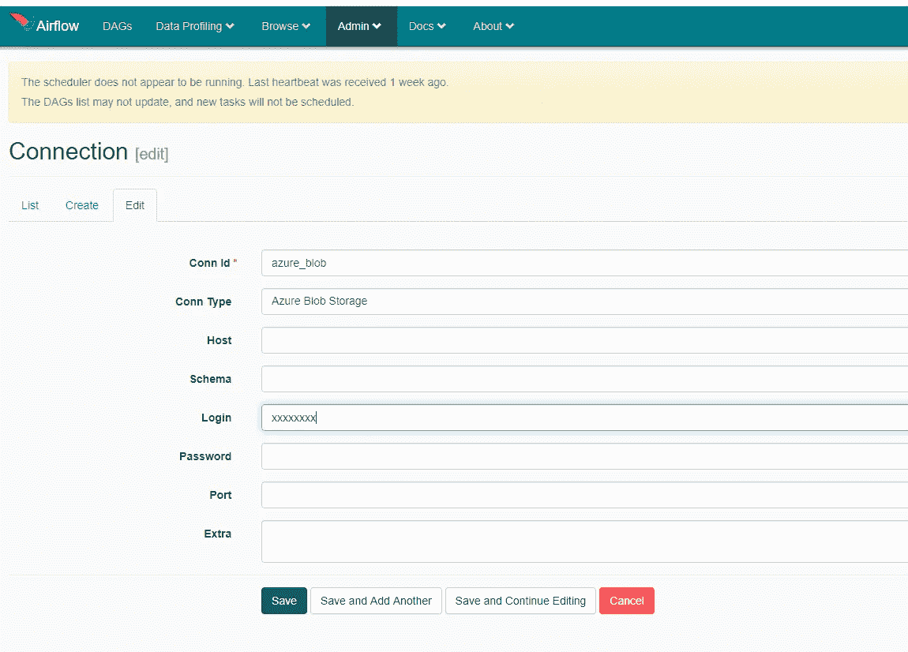

# 用气流构建数据管道

> 原文：<https://medium.com/analytics-vidhya/building-data-pipelines-with-airflow-15537730063c?source=collection_archive---------7----------------------->


嘿大家，这是一个相当长的时间张贴。这是一个由 airbnb 开发并由 apache org 授权的美妙的工作流程编排工具。Airflow 主要用于创建、调度和监控数据工作流。

## 它是如何工作的？

如前所述，它让您创作代码，从而支持版本控制和可维护性。工作流的基本构件被称为任务，任务的集合被称为 DAG(有向无环图)。

DAG 只不过是一个 python 脚本，由多个具有依赖性的任务组成。任务只不过是一个可执行的操作符。这已经根据任务的性质进行了分类。下面是一些常见的运营商目前在气流做我们的任务。您可以在他们的文档中找到更多关于他们的信息。

**核心组件:**

1.  Bash 操作符(执行 bash 操作符)
2.  Python 运算符(调用 python 函数)
3.  电子邮件操作员(发送电子邮件通知)
4.  http 操作员(发送 http 请求)
5.  mysql 运算符、postgres 运算符、mssql 运算符等。，(执行 sql 命令)
6.  除了这些我们还有 docker 操作符，hive 操作符等等。

气流的核心构件:

1.  达格的
2.  DAG 运行
3.  操作员
4.  工作
5.  任务实例
6.  执行日期。

因为我们对气流这个术语有点熟悉。让我们从一些实用的编码开始。理解上述术语所需要的一切。由于我最近在 azure 平台上工作，我想用它来帮助我们完成这个例子。我将建立一个简单的数据管道，将数据从您的服务器移动到 azure blob 存储。如果你使用的是 linux 系统，这很好，但是在这篇文章中，我将在 windows 上构建它。

**安装前应遵循的步骤:**

我们需要从 windows 应用商店安装 ubuntu 应用程序，因此在此之前，请转到控制面板|程序和功能|打开或关闭 Windows 功能为 Linux 启用 Windows 子系统。现在从 windows 商店安装 ubuntu。

**安装步骤:**

**步骤 1:** 安装并更新 PIP

sudo apt-get 安装软件-属性-通用

sudo apt-add-repository 宇宙

sudo apt-get 更新

apt-get 安装 python-pip

**步骤 2:** pip 安装 apache-airflow

**第三步:**导出 AIRFLOW_HOME=~/airflow

**步骤 4:** 初始化数据库

气流 initdb

**步骤 5:** 启动 airflow web 服务器

气流网络服务器-p 8080

您的本地主机 URL 已准备好查看 airflow 主页，在那里您可以找到所有示例 DAG。


气流-主页

现在，您的气流已经启动并运行。让我们创建一个 DAG。已经用配置文件创建了一个 airflow 文件夹，导航到该文件夹，并在运行上述命令的位置创建一个名为 dags 的文件夹，这是我们保存所有脚本的位置。

**例如:**

Azure blob 集成在 wasb 连接的帮助下发生。有关 wasb 的详细说明可在气流文件中找到。这是开始前的关键一步。

**需要的详细信息:**创建 wasb 连接的 blob 名称和密钥。

导航到管理→连接，创建一个类型为 wasb 的新连接。

登录:blob 名称

密码:密钥



连接页面

一旦完成，让我们编码。

```
from airflow import DAG
from airflow.operators.bash_operator import BashOperator
from airflow.operators.python_operator import PythonOperator
from airflow.contrib.hooks.wasb_hook import WasbHookwb = WasbHook(wasb_conn_id=’azure_blob’)
container_name = “inputdata”
blob_name = “xxxxx.csv”
file_path =”/home/xxx/xxxx.csv”def check_connection():
 return(wb.check_for_blob(container_name,blob_name))def file_upload():
 wb.load_file(file_path,container_name,blob_name)
 return(“Blob uploaded sucessfully”)def respond():
 return ‘Task ended’default_args = {
 ‘owner’: ‘airflow’,
 ‘start_date’: dt.datetime(2018, 9, 24, 10, 00, 00),
 ‘concurrency’: 1,
 ‘retries’: 0
}with DAG(‘airflow_file_uploader’,
 catchup=False,
 default_args=default_args,
 schedule_interval=’*/10 * * * *’,
 # schedule_interval=None,
 ) as dag:
 opr_hello = BashOperator(task_id=’Start_operation’,
 bash_command=’echo “Staring operation”’)check_connection_opr = PythonOperator(task_id=’connection’,
 python_callable=check_connection)
 file_upload_opr = PythonOperator(task_id=’file_uploader’,
 python_callable=file_upload)opr_respond = PythonOperator(task_id=’task_end’,
 python_callable=respond)opr_hello >> check_connection_opr >> file_upload_opr >> opr_respond
```

因此，第一个操作符检查给定的 blob 是否存在，第二个操作符将文件从本地驱动器上传到 blob 存储器，第三个操作符标记任务结束。下面的部分定义了一些基本的配置，你可以根据自己的需要来做。**的拥有者**应该总是气流，**的开始日期**你可以定义。**并发**和**重试**将在高级侧。让我们暂时把它放在一边，保持原样。

在 with DAG 路径中写入 python 脚本文件的名称，您可以根据需要定义计划间隔。

```
default_args = {
 ‘owner’: ‘airflow’,
 ‘start_date’: dt.datetime(2018, 9, 24, 10, 00, 00),
 ‘concurrency’: 1,
 ‘retries’: 0
}with DAG(‘airflow_file_uploader’,
 catchup=False,
 default_args=default_args,
 schedule_interval=’*/10 * * * *’,
 # schedule_interval=None,
 ) as dag:
```

哇哦..让我们运行它看看。保存文件并转到 airflow 的主页。启动您的计划程序。

```
airflow scheduler
```

您将能够在 dag 列表中看到您的脚本。打开脚本。它将开始运行。绿色边框表示成功，这样你可以用颜色来标识你的工作状态。一旦完成，所有将变成绿色。


剩下的我就交给你们了，你们可以进一步探索，并定制任务。您可以连接到它的 aws 和服务列表。确保在开始使用管道之前创建或编辑连接。就这样，伙计们。很快就能看到大家的新帖子了。

谢了。