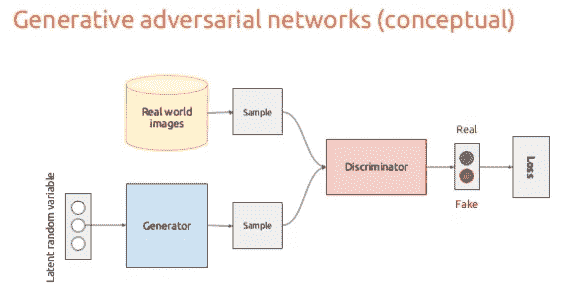
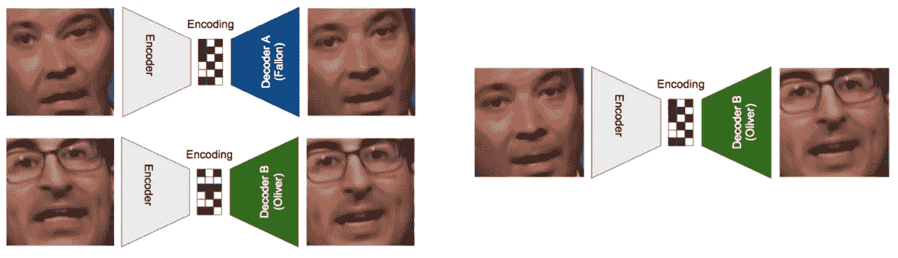
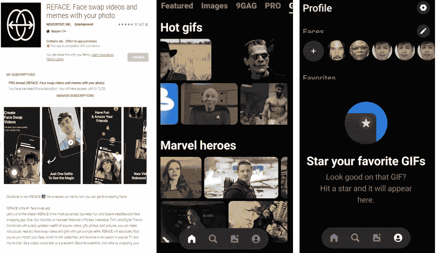
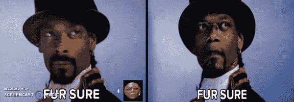
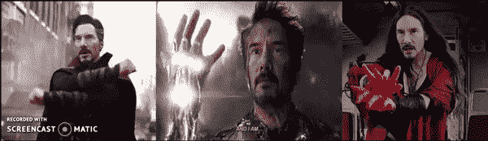
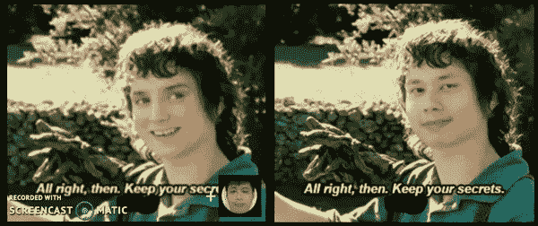
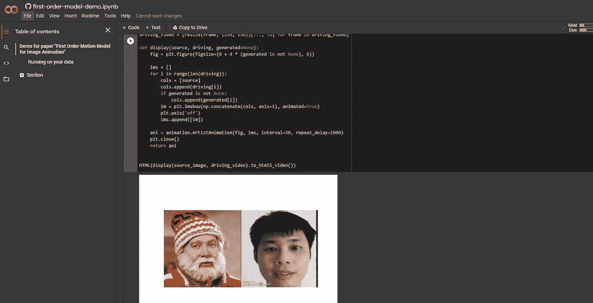
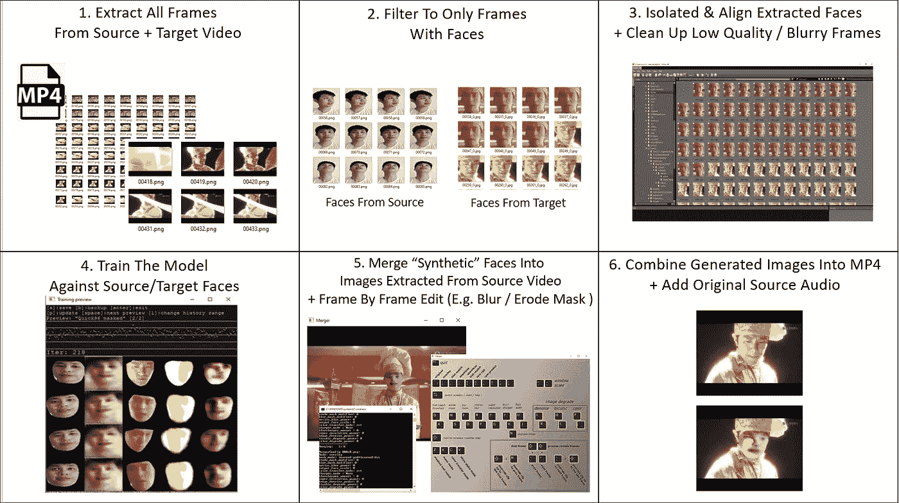
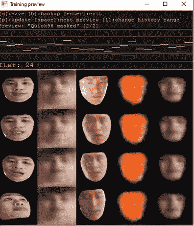
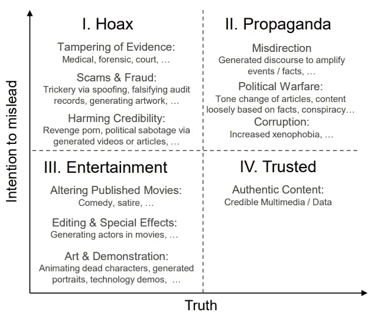

# 构建深度假视频

> 原文：<https://medium.com/analytics-vidhya/building-deep-fake-videos-cbdabc00e4c1?source=collection_archive---------2----------------------->

# *总结*

*在这篇文章中，我介绍了深度假货，并简要介绍了我是如何用三种不同的方法制作自己的“深度假货”视频的:*

*   *一款名为 Reface(前身为 Doublicat)的商业手机应用，完全无代码，易于使用，但功能有限*
*   *一个 Google Collab 页面，包含一阶运动模型，允许在视频和图像的选择/长度方面有更多的灵活性*
*   *Deep Face Lab 2.0，一个用于制作 Deep Fakes 的开源软件包，提供了创建过程中更全面的定制(但需要您拥有高质量的硬件来有效运行)*

*注意:不幸的是，这不是一个详细的逐步指南，但我已经尝试在文章中加入一些好的教程和其他资源的链接*

看哪！我们遇到了最严重的假货

# 概述

1.  [**什么是深度假货？**](#9a6e)
2.  [**深度假货背后有什么技术？**](#6faf)
3.  [**深度假货 via Reface(一款手机 App)**](#fc27)
4.  [**深度假货通过一阶运动模型**](#ba02)
5.  [**Derp 假货 via 深度脸实验室 2.0(错别字故意…)**](#1ea2)
6.  [**深度假货接下来怎么办？**](#3c79)
7.  [**结论**](#c8d3)

# 1.什么是深度假货？

虽然视频操作并不新鲜，但近年来发生了两大变化:

1.  通过使用机器学习算法，这些技术变得更加先进，而以前的方法涉及大量繁琐的手动视频编辑/拼接。
2.  几乎任何人都可以通过商业应用或开源程序制作自己的假视频，这变得非常容易。

Deep Fakes ( *即深度学习+ Fakes* )是 2017 年末一名用户首次提到的术语，他在 Reddit 上创建了一个空间，分享使用开源人脸交换技术的色情视频(与[许多其他互联网技术创新一样(例如视频流、文件压缩等)，早期的进展通常是由色情行业的应用程序驱动的](https://www.scmp.com/tech/innovation/article/2093428/how-porn-has-been-secretly-behind-rise-internet-and-other))。

今天，这个术语已经成为一个通用名词，指的是使用算法和面部映射技术来操纵视频——范围从类似

*   **面部交换**(这是我将在本文剩余部分介绍的主要类型)
*   **人脸合成**(即将不同样本的特征结合起来，创造一个新的“从未见过的”合成人脸)或者
*   **面部‘属性/表情’操作**(例如假装微笑或眨眼)

# 2.深度假货背后有什么技术？

## 生成对抗网络

制造深度赝品的方法有很多种。两种常见的方法是通过[生成对抗网络(GANs)](https://machinelearningmastery.com/what-are-generative-adversarial-networks-gans/) ，其中两个竞争的神经网络(一个“鉴别器”和一个“生成器”)被联合训练。然后，生成器模型使用随机噪声创建人工图像，并且训练鉴别器来区分由生成器模型创建的“真实样本”和“赝品”。(不要脸的插一句:我其实写过[一篇以前的文章，里面我用一根创作了“假的”日本动漫海报](/analytics-vidhya/building-an-amateur-machine-learning-web-app-what-i-learnt-d6a89bddb025#43d4))。无论如何，如果你用足够大的人脸训练数据集来排列 GAN，它最终会学习生成一些非常真实的“假货”。

来源:[https://www . slide share . net/xavigiro/deep-learning-for-computer-vision-generative-models-and-adversarial-training-UPC-2016](https://www.slideshare.net/xavigiro/deep-learning-for-computer-vision-generative-models-and-adversarial-training-upc-2016)

## 自动编码器

另一种流行的方法是使用自动编码器(公平地说，这是一种特殊类型的自动编码器，称为可变自动编码器，但这是我不打算在本文中深入探讨的主题)。

自动编码器由编码器和解码器组件组成，其中自动编码器的作用是学习将输入图像编码成低维表示，而解码器的作用是将该表示重建回原始图像。这种编码表示包含与原始图像的面部特征相关的图案细节，例如表情

使用共享编码器的自动编码器把吉米(目标)变成约翰(来源)！[图片来源:[https://www . kdnugges . com/2018/03/exploring-deep fakes . html/2](https://www.kdnuggets.com/2018/03/exploring-deepfakes.html/2)]

这可能过于简单，但基本思想是，如果你有一对单独训练的自动编码器**，但有一个公共的共享编码器**，这两个自动编码器将学习目标和源的面孔，这样目标的解码器就可以与(共享)编码器结合。如果编码器随后被馈送源视频，但被连接到目标视频的解码器，这将生成与源视频相似但具有目标视频特征的合成输出。

当然，还有我没有提到的其他方法，但这是它的要点。如果你有兴趣“深入”这个话题，我推荐下面这篇文章。

 [## Deepfakes:使用 GANs 和自动编码器的人脸合成

### 近来，假新闻已经成为人类社会的一大威胁。虚假信息可以通过社交网络快速传播…

theaisummer.com](https://theaisummer.com/deepfakes/) 

# 3.通过 Reface(一个移动应用程序)进行深度伪造

[Reface](https://play.google.com/store/apps/details?id=video.reface.app&hl=en_SG&gl=US) (原名 Doublicat)是市场上出现的许多商业移动应用程序之一，允许你轻松制作自己的面部交换视频/图像，而**完全没有编程**。

到目前为止，我唯一的抱怨是，似乎当我使用它时，我只限于策划 GIF 剪辑。我没有坚持付费订阅(大约 20 美元/年)，但我认为专业订阅允许你上传自己的 GIF-s。尽管如此，使用应用程序还是非常简洁和直接的，你只需要上传几张你自己的个人资料自拍(或任何你想交换的其他面孔)，应用程序将在 20-30 秒内“重新整理”图像/GIF。

也许你想看看如果塞缪尔·杰克逊是个说唱歌手，他会是什么样子

介绍史努比·杰克逊

或者你可能觉得基努没有出演任何一部漫威电影宇宙电影是不公平的。不要担心——Reface 已经覆盖了您。

基努文格斯集合！

Reface 的[网站](https://reface.ai/)上说他们使用了*‘突破性的’人工智能/人工智能技术，使用了生成对抗网络*，但我猜这并没有说太多…

# 4.一阶运动模型

我尝试的下一个方法是基于一篇已经被翻译成 Google Colab 工作簿的开源论文。

大多数其他 deepfake 方法倾向于在模型训练过程中“纠缠”运动和外观。这意味着机器学习模型往往是特定于对象的，不能很好地概括。相反，一阶运动模型只关注身体运动或面部表情的几个关键点，研究人员发现这些关键点足以定义动画所需的所有复杂运动。长话短说——它使用单个模型，仅基于单个目标图像生成动画。

我没有制作我自己的视频，而是分享了我使用的一个(我很想把我的脸深深地伪装到教程中，但是我认为它太 ***meta*** )

我确实有一些没有提到的额外建议:

1.  当从 Google Drive 下载模型文件 vox-adv-cpk.pth.tar 和 vox-cpk.pth.tar 文件时，您可能会得到一条**错误消息“下载配额已超出…**”。这是因为如果太多用户试图从 Google Drive 下载文件，它就会被锁定。如果是这样，尝试其他来源，如:[https://www.kaggle.com/xiaoxxiao/damedane-vox-data](https://www.kaggle.com/xiaoxxiao/damedane-vox-data)
2.  保持**您的驾驶视频简短且相对较小**。当我最初使用一个 2 分钟/ 5MB 的视频时，工作簿“挂起”了几次(我怀疑是由于 Google Colab 的 RAM/存储的限制),我最终决定使用一个较短的低分辨率视频，1MB 30 秒
3.  尝试**确保在整个驾驶视频中，目标图像和*中头部与背景的比例相似(即，如果可能，不要改变您与摄像机的距离)***。默认情况下，Colab 工作簿使用 **r** 相对关键点位移来制作对象的动画，但当我认为我在某一点上离摄像机太近时，动画视频的某些部分似乎有点失真。

我的最终产品如下(业余视频编辑我的一部分)

吼吼吼！正好赶上圣诞节！

# 5.DeepFakes via DeepFace Lab 2.0

对于最后一个例子，我试图(这是关键词—结果有些黯淡)使用一个提供更多控制的综合工具。

DeepFace Lab 是一个开源软件包，基于 Python，使用 TensorFlow 运行，并针对 NVIDIA 进行了优化

 [## iperov/DeepFaceLab

### QQ 951138799 中文 Chinese QQ group for ML/AI experts #deepfacelab #deepfakes #faceswap #face-swap #deep-learning…

github.com](https://github.com/iperov/DeepFaceLab) 

它是自包含的(不需要安装/配置设置——只需下载自解压 zip 文件就可以了),这很好，但这是一个相对较大的安装(占用大约 5g 的空间)。

[注意——如果你不想在自己的机器上运行 Deep Face Lab，因为你没有处理能力，也可以选择在 Google Colab 工作簿上运行它[https://Colab . research . Google . com/github/chervonij/DFL-Colab/blob/master/DFL _ Colab _ 1-0 . ipynb](https://colab.research.google.com/github/chervonij/DFL-Colab/blob/master/DFL_Colab_1-0.ipynb))]

因为它是 deepfakes 的两个顶级开源工具之一(另一个是 [FaceSwap](https://github.com/deepfakes/faceswap) )，所以网上有很多初学者教程。因为这篇文章不会进入逐步指南，所以，如果我必须推荐一个好的教程，它将是这个:

 [## 简单的 Deepfake 教程 DeepFaceLab 2.0 quick 96—Deepfakery.net

### 简单的 Deepfake 教程:DeepFaceLab 2.0 Quick96 想知道如何制作 deepfakes？这个简单的教程会让你…

www.deepfakery.net](https://www.deepfakery.net/easy-deepfake-tutorial-deepfacelab-2-quick96/) 

Deep Face Lab 的界面很简单，但非常简单，因为它基本上是一堆打包在批处理文件(即 bat)中的脚本，这些文件有预设的命令，你必须依次运行这些命令才能完成像从视频中提取图像这样的任务；按照下面的流程从这些图像中提取人脸集。

我使用了 Deep Face Lab 的 Quick96 模型，这是一种风格化的自动编码器(SAE)模型。有一个更强大的版本称为 SAEHD，它可以产生更好的分辨率，但不幸的是，我没有 GPU，所以我在我严重动力不足的 AMD CPU 上运行模型训练。

在 AMD12 四核芯片上没有 GPU 的情况下，对于一些非常令人失望的输出，4k 迭代花费了超过 12 个小时。(最后一列是要覆盖在中间一列上的“合成”面)

在我的目标视频中，我使用了一个上世纪 90 年代经典香港喜剧《T4 食神》的短片。我离开模型训练一夜，但要么是我的源图像质量不够好(有些脸稍微不在框架内或模糊)，要么是我的笔记本电脑的处理能力无法破解它，所以最终结果是不太深的假，但更多的 Derp 假。

非常抱歉质量太差。与作为工具的 Deep Face Lab 关系不大，可能更多的是因为我的源视频质量很差，并且我在 CPU 而不是 GPU 上运行训练…

# 6.深度假货的下一步是什么

我们提到的例子主要是视频编辑相关的，但是也有很多工作要做来生成合成语音。

例如，下面这篇文章概述了一种技术，它可以用视位(对应于音位的口型)来分离、提取和重组音位(语言中的成分音)，本质上允许您创建带有一致伴音的合成视频！

 [## 基于文本的发言者视频编辑

### ✧斯坦福大学、✻马普信息研究所、⚘普林斯顿大学、Adobe 研究摘要…

www.ohadf.com](https://www.ohadf.com/projects/text-based-editing) 

虽然我展示的例子在本质上有些“无聊”，但这项技术有一些有用的应用

*   电影/节目中演员的衰老甚至死后的衰老
*   自定义虚拟动画头像与您的肖像
*   新颖的营销理念，例如“在电影海报上展示你自己的面孔”

然而，这项技术的可怕之处在于，现在任何人的图像都可以被操控成说做任何事。

DeepFake 信息信任图表来源于最近 2020 年的一篇优秀论文[https://arxiv.org/pdf/2004.11138.pdf](https://arxiv.org/pdf/2004.11138.pdf)

就目前而言，这项技术确实有其局限性(例如，大多数算法不能很好地处理面部部分模糊的遮挡)，我个人的业余尝试-它仍然需要良好的硬件组合(例如，GPU！)和专门的学习时间来制作质量尚可的深度假货。

此外，还在努力创造“技术”解决方案来识别虚假图像/视频，如脸书自己的专有系统来过滤篡改的视频。

 [## Deepfake 检测挑战数据集

### 我们在 2019 年 9 月与其他行业领导者和学术专家合作，创建了 Deepfake 检测…

ai.facebook.com](https://ai.facebook.com/datasets/dfdc/) 

然而，尤其是在这个“后真相/假新闻”时代，已经很难决定是否相信我们收到的信息，深度假新闻使我们更难相信我们“看到的”。

# 7.结论

最终，妖怪已经从瓶子里出来了，试图把软木塞塞回去是没有用的。就像互联网如何让诈骗变得更加容易(相对于口碑传销)——解决方案不是停止使用互联网，而是确保普通用户有正确的意识水平来区分合法的投资计划和快速致富计划。

下面这篇文章总结得最好。

 [## 媒介素养，深度造假的有效对策

### 即使是媒体教育的短暂干预，也能在理解假货，了解假货和假货方面产生巨大的影响。

medium.com](/the-innovation/media-literacy-an-effective-countermeasure-for-deepfakes-c6844c290857) 

# 因此，作为媒体的消费者，我们必须有能力破译，理解，翻译和使用我们遇到的信息……(原文如此)使我们能够在欣赏讽刺和戏仿的同时质疑和挑战上下文。

总结一下——我希望这篇文章已经让你很好地了解了什么是深度假货，它们是如何工作的，也让你对如何开始制作自己的深度假货有了足够的了解(当然是为了非邪恶的目的！)

***—————***后脚本(2021 年 1 月)

*神圣的 cr@p！关于 DeepFakes 的话题，我认为值得分享这个视频，因为它将技术扩展到了不仅仅是“面部交换”,还包括语音合成+嘴唇同步叠加，甚至考虑使用 GPT-3 等语言生成模型来生成“脚本/响应”。*