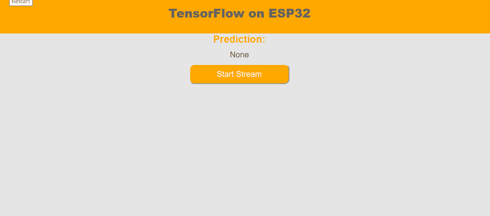
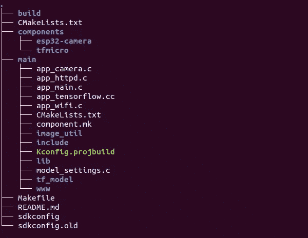
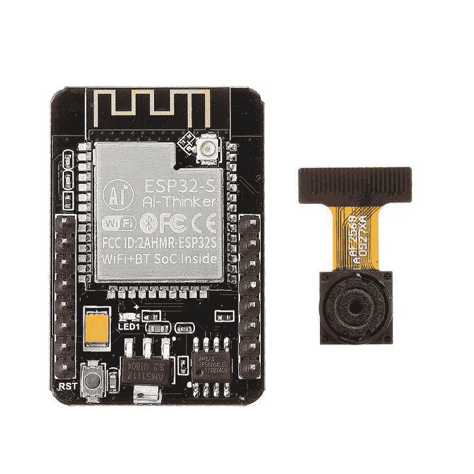
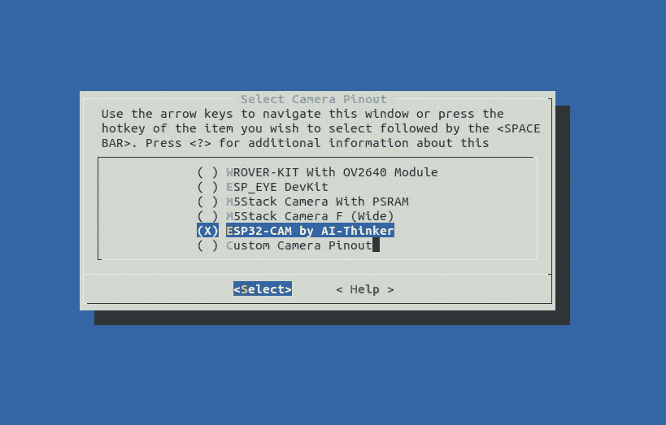

# 在 ESP32 上使用 TensorFlow Lite 构建边缘 AI 应用

> 原文：<https://medium.com/analytics-vidhya/building-edge-ai-applications-using-tensorflow-lite-on-esp32-baf8534b176e?source=collection_archive---------4----------------------->

多年来，我一直在开发嵌入式 IOT 应用程序，大多数时候，所谓的“智能”设备被编程为像由云或应用程序控制的远程控制设备一样工作，或者只是将传感器读数传输到实际处理发生的云中。给定这些资源受限设备上可用的有限 RAM 或处理能力，只能完成有限的事情。

去年，当 Tensorflow 团队宣布支持微控制器时，我真的非常激动。我们一直听说 AI on edge 是 IOT 设备发展的合理下一步，但鉴于缺乏开源框架，这一方向的创新非常少，随着谷歌的宣布，它为嵌入式程序员打开了许多尝试在 edge 上构建 AI 应用的大门。

我有几个 ESP32 Cam 模块，所以我想为什么不训练和部署一个时装模特来直接使用机载摄像头识别时装。结果出乎我的意料，应用程序能够以合理的准确度识别图像。

以下是演示视频:



ESP32 识别时尚服装图片

以下是我训练和部署该模型的步骤，我希望它能作为其他嵌入式开发人员开发一些很酷的应用程序的指南。

**建立模型:**

我使用 Google Colab 来构建和训练模型。笔记本的链接可以在[这里](https://colab.research.google.com/drive/1zvHCe9iasUnex6wgStY1tHtIbhPC1uVz?usp=sharing)找到。我构建了一个简单的 CNN，有一个输入层，一个输出层和两个隐藏层，每个隐藏层有 6 个节点。

我们首先像构建普通 Tensorflow 模型一样构建模型，然后使用 tensorflow lite 转换器以及所需的优化级别将模型转换为 tflite 文件。

将 Tensorflow 模型转换为 TFlite 模型，优化后可在电潜泵上运行

由于 ESP 没有文件系统，我们需要将 TF-Lite 文件导出到一个数据数组来访问权重。我们可以使用 linux 命令行工具“xxd”来做到这一点。

```
# xxd -i model.tflite > model_data.cc
```

这就完成了部署的第一部分，我们已经构建并训练了模型。该模型的最终大小约为 11k 字节。第二部分涉及将模型部署到 ESP32 上。

**在 ESP32 上部署模型:**

第一步是下载并设置 esp-idf，这是由 Espressif 开发的开发框架，您可以按照 Espressif 网站上的[设置指南](https://docs.espressif.com/projects/esp-idf/en/latest/esp32/get-started/)开始。确保我们使用正确版本的 ESP-IDF 也很重要，我使用的是最新发布的版本 4.0。

现在我们已经设置好了，可以开始构建了，我们可以继续在 ESP32 上构建我们的 Fashion Mnist 应用程序。你可以在这里找到完整源代码[的链接，按照步骤进行操作。](https://github.com/akshayvernekar/esp_tensorflow_fmnist)

文件夹结构如下所示



示例项目的文件夹结构。

我们使用 esp32-camera 组件与相机模块和 tfmicro 库进行交互，TF micro 库是由 TFLite 团队开发的 TensorFlow lite 解释器，它将解释我们的模型并为我们提供预测。如上图所示，我们将这两个组件添加到*【组件】*目录下。

我用于演示的硬件是 AI thinker 的 ESP CAM 模块。



ESP 摄像机开发板。

市场上有许多可用的 esp 摄像头模块，请确保在构建之前，在*“menu config”*中的*“摄像头引脚”*部分下选择正确的摄像头模块。



下一步是将我们在最后一步“**构建模型”**中构建的*“model _ data . cc”*文件放置在*“main/TF _ model/”*文件夹*中。*确保“include/model_data.h”中模型数组的变量名和数组长度与“model_data.cc”文件中的相同。接下来，我们检查*"/include/model _ settings . h "*文件，以确保输入大小和类别数量等设置与我们正在部署的模型相匹配，如果您使用任何其他模型，则需要修改设置以匹配您的模型。

tfmicro 库的设置过程很简单，

首先，我们使用 GetModel 函数映射 model_data，并将模型数据数组名称作为参数传递。

```
model = tflite::GetModel(model_data_tflite);
```

其次，我们引入操作解析器，它包含实现模型所需的操作。在这里，我使用了“AllOpsResolver ”,它包含了所有的操作，最佳实践是只包含您的模型所需的操作，从而节省一些代码空间。

```
static tflite::ops::micro::AllOpsResolver micro_op_resolver;
```

接下来，我们构建解释器，并为解释器分配内存以开始推理。

这完成了设置过程，我们现在准备开始解释输入数据以获得我们的预测。为了推断数据，我们需要首先用我们的输入数据填充解释器的输入缓冲区，然后调用解释器的“invoke”函数来运行推断，预测存储在解释器的输出缓冲区中。使用方法请参考“app_tensorflow.cc”中的“tf_start_inference()”函数。

就是这样！我们现在已经了解了如何构建 Tensorflow lite 模型并将其部署到 esp32 上。如果您正在构建示例程序，您会发现在刷新固件后，设备会启动为 SSID 为“ESP_CAM”的接入点，您可以将智能手机或笔记本电脑连接到此 SSID，并在浏览器中输入 IP 地址“192.168.4.1”以打开设备的网页。一旦网页被加载，按下“开始流”按钮，从相机获取相机流，并获得预测。

这里还有一个例子，我使用 TFlite 团队构建的人物检测模型来检测视频中是否有人。

如您所见，在 ESP32 上部署 tensorflow lite 模型非常容易。尽管我们受到可以部署的模型的复杂性的限制，但它仍然为在 edge 上构建一些创新的人工智能应用程序留下了很大的空间。