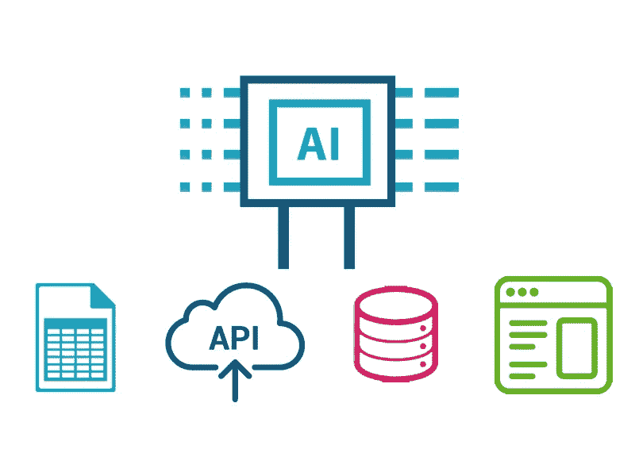
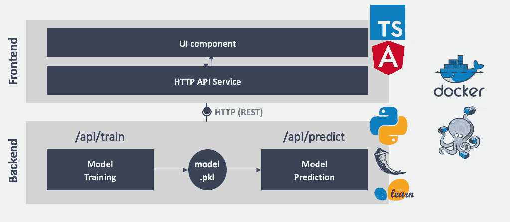
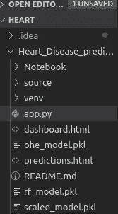
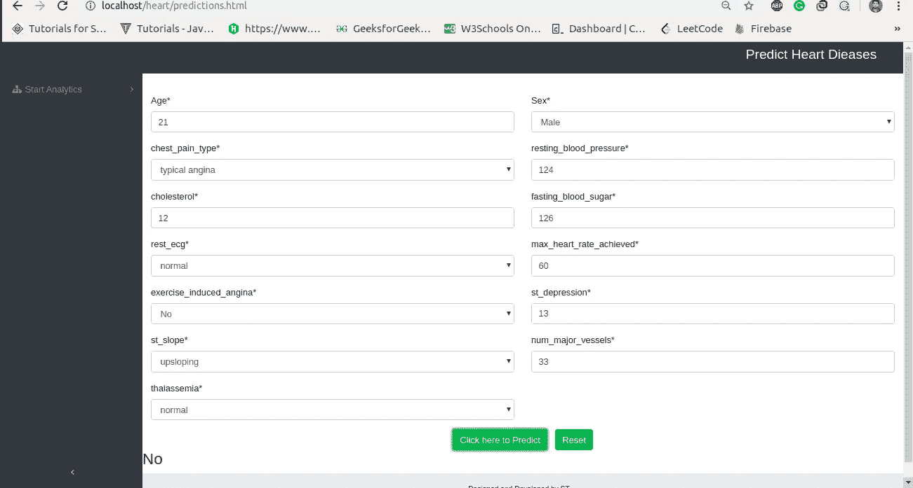

# 用 Flask-Restful 构建 Flask REST 应用程序

> 原文：<https://medium.com/analytics-vidhya/building-flask-rest-app-with-flask-restful-d22ba4c0e39f?source=collection_archive---------6----------------------->



*嗨，*

*机器学习和人工智能正在彻底改变每个行业，如医疗保健、银行、保险，如何在现实世界中部署你的机器学习模型以获得预测非常重要。我记得当我对机器学习及其广泛的应用领域着迷的时候。我在开发高效的机器学习模型上付出了很多努力。*

*我想我已经进行了大量的功能工程，并与领域专家进行了交谈，以确保他们的洞察力被捕捉到。但是，当我想在现实世界中部署一个模型时，我遇到了一个问题，接下来该怎么办呢？。*

我开始探索并完成了这个令人敬畏的教程，在这个教程中，我们将使用一个简单明了的框架 Flask 来部署机器学习模型。

*ML 型号在 jupyter 笔记本和上似乎不太好。py 脚本，除非它们被实时部署。为了用机器学习的力量来改变人类，这个模型需要以一种大众可用的方式来部署，而不仅仅是领域专家。为了实现这一点，ML 模型被封装在 REST APIs 中，其他应用程序可以使用这些 API 与模型进行通信。浏览整篇文章，查看一下吧。*

> 我们开始吧！

> **部署机器学习模型的方法**

经过大量的探索，这里有两种方法可以让我们在现实世界中部署机器学习模型。

*   **用全球开发者广泛使用的编程语言**重新构建整个代码，然而这变得非常困难，因为用 javascript 这样的语言重写代码需要大量的精力和时间，效率很低。
*   **另一种方法是 API 方法，其中 Web API**使得跨语言应用程序很容易工作。如果前端开发人员需要使用您的机器学习模型来创建一个 ML 支持的 web 应用程序，他们只需要获得 API 的端点来获得预测。'

> **API 的介绍**

基本上，API 是两个软件之间的协议，即如果用户软件以预定义的格式提供输入，后者扩展其功能并向用户软件提供结果。

如今，web 已经成为 API 的中心。如果你在网上闲逛，那么肯定会用到 API。在社交媒体上分享东西，在网上支付，通过社交手柄显示推文列表，所有这些服务都在背后使用 API。

大多数大型云提供商和专注于机器学习的小型公司都提供现成的 API。它们迎合了那些没有 ML 专业知识，但希望在他们的过程或产品套件中实现 ML 的开发人员/企业的需求。

> **与原料药相关的术语**

*   **访问**:用户或谁被允许请求数据或服务？
*   **请求**:请求的是实际的数据或服务
*   **方法**:即你可以问的问题，假设你有权限(它还定义了可用的响应类型)。
*   **参数**:您可以在问题或回答中包含的其他详细信息。
*   **响应**:作为您请求的结果的数据或服务。

> **没有更多的理论了，让我们开始研究 Flask REST 应用程序。**

> **先决条件和环境设置**

伙计们，我一直认为你们将能够创建机器学习模型，为它们提供培训，并在以后使用它们来预测 python 中的结果。这篇文章旨在提供关于将机器学习模型部署到小规模生产中的见解。

在库之后，我们需要启动我们的 flask 应用程序

*   一个基于 python 的简单易用的 web 框架。这些是[文件](http://flask.pocoo.org/docs/1.0/)。
*   [**pickle**](https://docs.python.org/2/library/pickle.html) :原生 python 库，将 python 对象作为文件保存(序列化)和加载(反序列化)到磁盘上。
*   [**flask_cors**](https://flask-cors.readthedocs.io/en/latest/api.html) :用于 cors 集管。
*   [**Flask-RESTful**](https://github.com/flask-restful/flask-restful)**:**Flask-RESTful 为创建一个伟大的 REST API 提供了构建块。
*   根据需要的其他学习图书馆，如 numpy、pandas、sklearn 等。

使用 pip 工具安装上述软件包。

> **机器学习模型流程**



来源:[https://medium . com/@ dvelsner/deploying-a-simple-machine-learning-model-in-a-modern-web-application-flask-angular-docker-a 657 db 075280](/@dvelsner/deploying-a-simple-machine-learning-model-in-a-modern-web-application-flask-angular-docker-a657db075280)

谈论 ML 模型工作流程从模型的部署和创建开始。然而，我已经创建了机器学习模型，用于解决患有心脏病的患者的问题。使用的数据集可在[这里](https://www.kaggle.com/ronitf/heart-disease-uci)获得。

*有兴趣了解这款机型的可以参考我的* [*github 库*](https://github.com/shashwatwork/Heart_Disease_prediction) *。我不太关心模型的准确性，而且我专注于 Flask APIs 的部署。*

> **保存机器学习模型序列化&反序列化**

就计算机科学而言，nerds S *序列化是将数据结构或对象状态转换成可以存储(例如，存储在文件或内存缓冲区中，或通过网络连接传输)的格式，并在同一或另一个计算机环境中重新构建的过程。*

主要是机器学习模型被串行化，然后再被去串行化，以便根据机器学习模型进行预测。一个名为 pickle 的模块帮助在 python 中执行序列化和反序列化。我们甚至提取了标准的 scaler 对象，它可用于将特征转换为平均值，并缩放为单位方差。坚持让你省时省事，即使最初的实现看起来很可笑。

及时缝针省九针！

*用于序列化的 Python 代码:*

*用于反序列化的 Python 代码:*

> **使用烧瓶构建 REST API**

*   ***文件夹结构***

在构建任何 Flask 应用程序之前，遵循正确的文件夹结构是很重要的。因此，您的 REST 应用程序将能够快速获取所需的资源。下面是我遵循的文件夹结构



这里我们有。html 文件及其各自的 CSS 和 javascript 将被复制到 xaamp 目录下的文件夹 *htdocs/中。此外，我们还保留了模型并缩放了 pickle 文件。*有一点我想说清楚，这里我们使用 xaamp(Apache webserver)来访问我们的 REST API，并从 app.py 获得预测结果。**

*   **烧瓶支架应用程序开发**

在构建 REST 应用程序时，应该记住以下术语。它在构造我们的包装器函数中起主要作用， *Predictheart(Resource)* :

*   获取`request`数据(要对其进行预测)
*   加载我们的模型持久性文件
*   `jsonify`我们使用 javascript 进行预测，并用`status code: 200`发回响应

```
from flask import Flask, request, render_template
import pickle
import numpy as np
from flask_restful import Api,Resource
from flask_cors import CORS
import seaborn as se
import pandas as pdapp = Flask(__name__)CORS(app)API_NAME = Api(app)app.config['SECRET_KEY'] = 'disable the web security'app.config['CORS_HEADERS'] = 'Content-Type'class Predictheart(Resource):def get(self, vizdata):info = vizdata.split(",")age = int(info[0])sex = int(info[1])chest_pain_type = float(info[2])resting_blood_pressure = float(info[3])cholesterol = float(info[4])fasting_blood_sugar = float(info[5])rest_ecg = float(info[6])max_heart_rate_achieved = float(info[7])exercise_induced_angina = float(info[8])st_depression = float(info[9])st_slope = float(info[10])num_major_vessels = float(info[11])thalassemia = float(info[12])model = load_model()data = ([[age, sex, chest_pain_type, resting_blood_pressure,cholesterol,fasting_blood_sugar,rest_ecg,max_heart_rate_achieved,exercise_induced_angina,st_depression,st_slope, num_major_vessels,thalassemia]])col = ['age', 'sex', 'chest_pain_type', 'resting_blood_pressure','cholesterol','fasting_blood_sugar','rest_ecg','max_heart_rate_achieved','exercise_induced_angina','st_depression','st_slope', 'num_major_vessels','thalassemia']data = pd.DataFrame(data,columns = col)data = data_scaling(data)data = model.predict(data)if data == 0:result = "No"else:result = "Yes"# return render_template('result.html', glycohemoglobin=abs(round(w_glyco)*10), glucose_serum=abs(round(w_gluco)*10), albumin_urine=abs(round(w_albumin)*10), pred=result)return {'isHeart': result}API_NAME.add_resource(Predictheart, '/heartpredict/viz/<vizdata>', methods=['POST', 'GET'])def load_model():"""This function load the pickled model as API for flask:returns: loaded_model:rtype: float64method's invoked:  None"""loaded_model = pickle.load(open('rf_model.pkl', 'rb'))return loaded_model def data_scaling(df):cont_data = df.valuesm = open('scaled_model.pkl', 'rb')model = pickle.load(m)cont_data = model.transform(cont_data)return cont_dataif __name__ == '__main__':app.run(host='localhost', port=5000, debug=True, threaded=True)
```

上面的代码片段看起来很复杂，让我来给你解释一下。

*   有两个辅助函数，即 *load_model()和 data_scaling()。*这些函数用于加载持久化 pickle 文件，以进行标准缩放，并预测命中 REST Apis 的原始输入*。*
*   正如您在导入部分看到的，我们已经从 *flask_restful* 库中获取了*资源*和 *Api* 模块。Api 主要用于创建一个对象来访问 flask restful 中可用的方法。资源构建在 [Flask pluggable views](http://flask.pocoo.org/docs/views/) 之上，只需在资源上定义方法，就可以轻松访问多个 HTTP 方法。
*   接下来，我们创建了一个 python 类 *Predictheart(Resources)* ，它封装了方法 *get(self，vizdata)。*这个方法中传递的参数基本上包含了我们从 REST APIs 中获得的数据。 *Flask-RESTful 理解视图方法的多种返回值*。与 Flask 类似，您可以返回任何 iterable，它将被转换为响应，包括原始 Flask 响应对象。
*   *Api* 对象上的*add _ resource()*方法。每个都将被路由到您的资源。您的端点将使用*/heart prediction/viz/<viz data>*创建。如果请求与应用程序的任何端点都不匹配，Flask-RESTful 将返回 404 错误消息。
*   在 add_resource()方法中，我们同时处理 GET 和 POST 请求。然而，我们使用本地主机在端口 5000 上运行这个应用程序，所以最终的端点看起来像这样。

```
127.0.0.1 “GET /heartpredict/viz/21,1,1,124,12,126,0,60,0,13,1,33,1 HTTP/1.1”
```

*   发出 GET 请求后得到的值将被推送到 *data_scaling()* 函数，随后是 *load_model()* 函数，该函数抛出将被 jsonify 以插入 HTML 页面的预测。
*   处理 CORS 请求并发送响应。

跨起点请求由 flask CORS python 包处理，默认情况下，该包在所有路线上为所有起点和方法启用 CORS 支持。它允许在每个资源级别上对所有 CORS 头进行参数化。

```
<script>function validateForm(){var alu = document.forms["predictions"]["aul"].value;var ucl = document.forms["predictions"]["ucl"].value;var acl = document.forms["predictions"]["acl"].value;var cl = document.forms["predictions"]["cl"].value;var grsl = document.forms["predictions"]["grsl"].value;var irsl = document.forms["predictions"]["irsl"].value;var ld = document.forms["predictions"]["ld"].value;var ol = document.forms["predictions"]["ol"].value;var rc = document.forms["predictions"]["rc"].value;var plc = document.forms["predictions"]["plc"].value;var glyl = document.forms["predictions"]["glyl"].value;var uc = document.forms["predictions"]["uc"].value;var uf = document.forms["predictions"]["uf"].value;var col_val = [alu,ucl,acl,cl,grsl,irsl,ld,ol,rc,plc,glyl,uc,uf];alert(col_val);console.log(col_val);var data1;function createCORSRequest(method, url){var xhr = new XMLHttpRequest();if ("withCredentials" in xhr){xhr.open(method,url,true);}else if (typeof XDomainRequest != "undefined"){xhr = new XDomainRequest();xhr.open(method, url);}else{xhr =null;}return xhr;}function makeCorsRequest(){var url = 'http://localhost:5000/heartpredict/viz/'+col_val;var xhr = createCORSRequest('GET', url);if(!xhr){return;}xhr.onload = function(){data1 = JSON.parse(xhr.responseText);alert(data1);load(data1);};xhr.onerror = function(){};xhr.send();}makeCorsRequest();function load(data1){var tr = data1;var html = "<h3> "+tr['isHeart']+"</h3>";$("#result_t2d").html("");$('#result_t2d').append(html);console.log(tr['isHeart']);console.log(tr);}}$("#contact-form").submit(function(e) {e.preventDefault();});</script>
```

*   在 javascript 上面，函数 *validateform()* 用于从。html 页面，并将其传递给 javascript 函数 *makeCorsRequest()。*
*   在 *validateform* ()和 *makeCorsRequest* ()函数之间，我们有 *createCORSRequest* ()用 help GET 方法和 rest apis 端点创建跨源请求。
*   最后，我们使用 JSON 解析来解析来自 flask python 应用程序的响应，并将其扔给前端应用程序 UI。

> **烧瓶支架应用示例**

我已经创建了一个简单的单页面模板，可以用来通过 HTML 表单接收输入特性，并向 API 发出获取结果的请求。即使你不精通 HTML-CSS-JavaScript，你也可以很容易地编辑这个模板。



*模板、Flask REST 应用程序以及用于开发预测心脏病的机器学习模型的 jupyter notebook 可在* [*Github 存储库中获得。*](https://github.com/shashwatwork/Heart_Disease_prediction)

> **最终**

这篇博客促使您创建简单的 flask rest API，这将有助于数据产品的原型化，使其成为功能完整、生产就绪的 API 还需要一些额外的东西，这不在这篇博客的范围之内。在创建 API 时，我考虑了以下几点

*   分析您的机器学习工作流程，以创建干净、可用的 API。会节省很多努力和时间。
*   利用管道和自定义估算器进行预处理或任何其他相关任务。此外，确保评估器以及训练代码应该与持久模型一起保存。
*   使用 flask 的主要缺点是它不提供版本控制。机器学习模型的持续和跟踪在 flask 中似乎很复杂。[这里的](/towards-data-science/how-to-version-control-your-machine-learning-task-cad74dce44c4)是有帮助的文章。

> **参考文献**

*   [https://flask-cors.readthedocs.io/en/latest/api.html](https://flask-cors.readthedocs.io/en/latest/api.html)
*   [https://flask-restful . readthedocs . io/en/0 . 3 . 6/quick start . html](https://flask-restful.readthedocs.io/en/0.3.6/quickstart.html)
*   [https://medium . com/analytics-vid hya/how-to-deploy-simple-machine-learning-models-for-free-56 cdccc 62 b 8d](/analytics-vidhya/how-to-deploy-simple-machine-learning-models-for-free-56cdccc62b8d)
*   [http://blog.luisrei.com/articles/flaskrest.html](http://blog.luisrei.com/articles/flaskrest.html)
*   [https://www . analyticsvidhya . com/blog/2017/09/machine-learning-models-as-APIs-using-flask/](https://www.analyticsvidhya.com/blog/2017/09/machine-learning-models-as-apis-using-flask/)
*   [https://medium . com/@ dvelsner/deploying-a-simple-machine-learning-model-in-a-modern-web-application-flask-angular-docker-a 657 db 075280](/@dvelsner/deploying-a-simple-machine-learning-model-in-a-modern-web-application-flask-angular-docker-a657db075280)
*   [https://www.w3schools.com/bootstrap/bootstrap_ver.asp](https://www.w3schools.com/bootstrap/bootstrap_ver.asp)

如果你喜欢这个帖子，请跟我来，只要你认为我值得，就按下那个按钮。如果你注意到思维方式、公式、动画或代码有任何错误，请告诉我。

*干杯！*