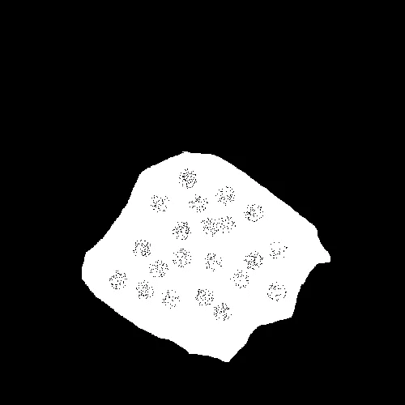
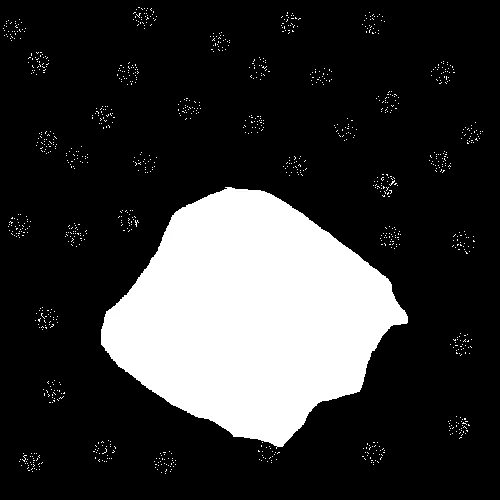
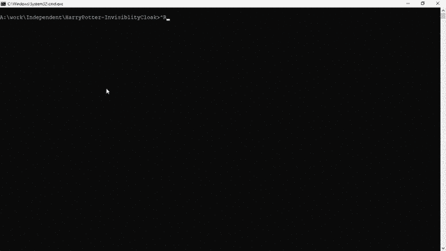

# 用 OpenCV 制作哈里·普塔尔失踪的隐身衣

> 原文：<https://medium.com/analytics-vidhya/building-hari-puttars-missing-invisibility-cloak-with-opencv-1d9ebbb73395?source=collection_archive---------19----------------------->

## 哈里，J. K .罗琳的哈利波特的印度表亲，又一次让自己陷入了麻烦。“至少从赫莫尼那里学点东西吧！”这是他妈妈告诉他这个消息的时候说的。

*推荐此内容的音乐:*

你能相信吗？！我的意思是:为了在你表弟的大日子前几天丢掉你唯一的[隐身衣](https://vignette.wikia.nocookie.net/harrypotter/images/9/98/Invisibility_Cloak_GIF.gif/revision/latest?cb=20140406043752)，你要有多不负责任？！[哈里](https://en.wikipedia.org/wiki/Hari_Puttar:_A_Comedy_of_Terrors)说他一定是在下周吉吉婚礼上排练他的表演时把斗篷放错了地方。

由于[疫情](https://www.mygov.in/covid-19)，对角巷[的商店提前放假。根据禁止从中国进口非必需品的禁令，我们也不能从阿里巴巴订购新的。我查了 WizKart，但他们不可能在活动开始前及时送来斗篷。](https://harrypotter.fandom.com/wiki/Diagon_Alley)

然而，正如每朵云都有一线光明一样，每一个障碍中都隐藏着一个机会。为了保持社会隔离，吉吉的父亲决定远程主持仪式——这正是我需要的休息时间！

我相当有信心，这样的斗篷可以使用 OpenCV 和任何纯色毯子在屏幕上创建。所以，我开始为我们粗鲁的主角做一件假的隐身衣！计划很简单:

*   第零，创建一个接口来读取，写入和显示视频流和视频文件。提供基本的用户交互，例如选择要删除的对象或调整阈值以获得最佳结果。
*   首先，让用户选择一个他们想要显示的背景图像来代替“消失”的对象。
*   第二，颜色分割。由于毯子是纯色的，我们需要进行精确的颜色分割，然后用背景图像中相应的像素替换代表斗篷的像素。
*   此外，由于颜色分割可能会产生不规则的遮罩，性能调整(主要是形态学的打开和关闭)被采用，这太主流了，不能在博客中提及。但是，感兴趣的人应该参考 GitHub 上的文档代码！(向下滚动查看链接)


那么，欢迎乘坐“霍格沃茨特快列车”。**来源**:【https://unsplash.com/photos/DmDYX_ltI48】T4

# 空管道

我从获得从源中读取帧、在屏幕上显示它们并将它们写入文件的能力开始。由于 Hari 使用的是 Windows 笔记本电脑，我必须确保代码也能在 Windows 10 上运行。事实证明这并不简单，因为 OpenCV 使用了必须单独安装的 [FourCC 的](https://www.fourcc.org/)编解码器。经过反复试验，我瞄准了“. mp4”文件格式和为每个操作系统预装的几个编解码器:

**片段 1** :在 Windows 10 和 Ubuntu 16.04 (LTS)上读取、显示和写入“. mp4”文件

# 用于分割的基于色调的颜色空间

是时候开始想办法让普通的斗篷隐形了。因为，我们只有两个结实的毯子可用(深蓝色和深粉色)，我想最好是编写可以处理任何颜色的斗篷的代码。(在与双手笨拙的巫师打交道时，再谨慎也不为过！)

由于 HSV(色调-饱和度-值)和 HSL(色调-饱和度-亮度)色彩空间更善于将具有相似“色调”的不同色调聚集在一起[【1】](https://en.wikipedia.org/wiki/HSL_and_HSV)，我决定使用它们。我计划写一个小片段，以获得图 1 的交互式版本，演示这种分色在基于色调的色彩空间中如何更好，如果你感兴趣，请关注我或继续查看本博客的编辑内容！在 openCV 中实现了与 HSV 之间的矢量化转换，所以最好使用 HSV！


**图 1**:HSV 色彩空间的色相分离(来源:[https://stackoverflow.com/a/48367205](https://stackoverflow.com/a/48367205)

我需要找到某种方法来计算一种颜色的上下限，这种颜色可以包围由阴影等产生的不同阴影。同时，我不能把参数弄得太复杂，否则 Hari 永远也不会学会如何使用这个系统！经过一些迭代，我发现代码片段 2 中描述的方案是一个很好的解决方案。

```
##Snippet 2: How to get upper and lower bounds for any color in HSV #Let us take one HSV color with hue=HUE, saturation=SAT &
#value=VAL. Also, lets have a thresh=THRESHOLDHSV_COLOR = [HUE, SAT, VAL]
thresh = THRESHOLD#We make two copies, one for each upper and lower bounds of this #colorlower = HSV_COLOR[:]
upper = HSV_COLOR[:]#As we see in Figure1, vertical rectangles with height twice as much #as width fit well for most colors, let's model that in our bounds!lower[0] = max(lower[0] — thresh//2, 0)
lower[1] = max(lower[1] — thresh, 0)
lower[2] = max(lower[2] — thresh, 0)upper[0] = min(upper[0] + thresh//2, 179)
upper[1] = min(upper[1] + thresh,255)
upper[2] = min(upper[2] + thresh,255)#Ideally, we should have separate threshold for each dimension. We #have chosen to go with only one param since it greatly enhances #user-experiences while leaving relatively less performance on the #table.##Snippet 2: How to get upper and lower bounds for any color in HSV
```

# 性能增强-形态学

无论你是想消除图像中的背景噪音，平滑不规则轮廓的边缘，消除多边形遮罩中的“洞”，还是想让你的遮罩看起来“更漂亮”，形态学是解决所有问题的唯一方法！让我们简单描述一下用来改善我们结果的形态学技术。

如图 2 所示，当我们试图处理任何类型(颜色、实例、语义)的分段掩码时，有两种主要类型的缺陷。它们被称为“孔”和“噪声”。



**图 2:** “孔洞”(左)和“噪声”(右)在一个分割蒙版中

在形态学中，开-闭变换被广泛用于去除这类缺陷。打开-关闭转换有两个阶段，打开阶段和关闭阶段。图 3 分解了转换并显示了每个阶段后的中间输出。


**图 3:** 形态学管道——输入遮罩(左)；形态打开后的遮罩(中间)；形态学闭合后的遮罩

正如我们所看到的，这两种类型的缺陷都出现在输入图像中。在形态学打开(腐蚀后是膨胀)后，我们看到“噪声”消失了，但同时孔更明显了。然而，在形态学闭合之后，我们看到没有一个“孔”存活。我们在这里不深入讨论细节，但是有一篇精彩的文章解释了形态学的技术细节[在这里](https://opencv-python-tutroals.readthedocs.io/en/latest/py_tutorials/py_imgproc/py_morphological_ops/py_morphological_ops.html)。

> 形态学上的开放可以被看作是黑色在所有的边界上推进，而白色在后退。在这个过程中，小块的白色物质没有存活下来，而大块的则被侵蚀掉了。形态关闭是相同的，除了这一次白色是在边界推动。当连续应用形态打开和关闭时，既不是白色也不是黑色的小块保留下来，但是较大的轮廓保持不受影响。

# 转眼间。



GitHub repo 的链接:[https://GitHub . com/IshanBhattOfficial/Harry Potter-invisible cycloak . git](https://github.com/IshanBhattOfficial/HarryPotter-InvisiblityCloak.git)

希望这对你有帮助:)