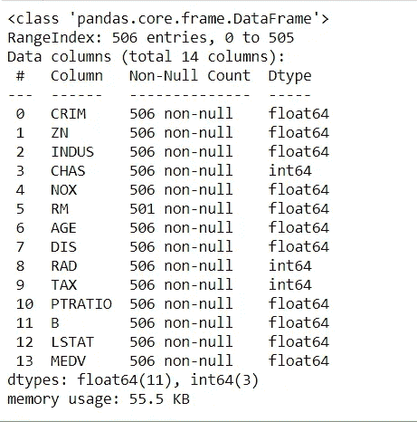

# 建立房价预测机器学习模型。

> 原文：<https://medium.com/analytics-vidhya/building-house-price-prediction-machine-learning-model-b6619f44a8ab?source=collection_archive---------21----------------------->

在这篇博客中，我将分享我建立机器学习模型预测房价的经验。


我从[T3 这里 T5 取数据集。你可以从这里下载数据集，也可以在我的](https://archive.ics.uci.edu/ml/machine-learning-databases/housing/) [Github 库](https://github.com/Shreyakkk)中找到。


现在让我们快速检查数据的类型和特性。下图是名为 *housing.data.* 的数据的 CSV 文件


现在，让我们来看看这些功能以及它们是什么。


因此在图像中，您可以观察到有 **14 个不同的特性及其各自的定义。**

所以现在让我们转向编码。

注意:-这里我用的是 Jupyter 笔记本。你甚至可以使用 Google Colab 或任何其他 ID。我试图在所有的单元格中添加注释，这样你就可以很容易地理解它们。如果你还有任何疑问，你可以通过博客末尾的链接联系我。

我把博客分成了 13 个步骤。为了让你们更清楚。

1.  导入必要的库。

```
#Import Libraries
import pandas as pd
import numpy as np
import matplotlib.pyplot as plt
%matplotlib inline
```

2.用变量名 **housing 加载 CSV 数据集。**

```
#Load Dataset in Notebook with variable name “housing”
housing = pd.read_csv(“Datasets/house.csv”)
```

3.检查加载的数据集。

```
#printing first 5 datas of dataset
housing.head()
```


4.检查关于数据集的信息

```
#Printing info of Dataset
housing.info()
```



5.检查模型的描述

```
#Describing dataset
housing.describe()
```


6.在数据上绘制直方图。

```
# For plotting histogram
housing.hist(bins=50, figsize=(20, 15))
```


7.现在，我们将数据集分为训练和测试。

```
# Spliting Dataset in Training Dataset and Testing Dataset
from sklearn.model_selection import StratifiedShuffleSplit
split = StratifiedShuffleSplit(n_splits=1, test_size=0.2, random_state=42)
for train_index, test_index in split.split(housing, housing[‘CHAS’]):
 strat_train_set = housing.loc[train_index]
 strat_test_set = housing.loc[test_index]
```

8.现在，我们来看看数据集中可用要素之间的相互关系。

```
corr_matrix = housing.corr()
corr_matrix[‘MEDV’].sort_values(ascending=False)
```


这里你可以观察到 RM 有正相关，LSTAT 有强负相关。

9.现在让我们为丢失的数据做一些事情。

```
# Using SimpleImputer to handle missing data
from sklearn.impute import SimpleImputer
imputer = SimpleImputer(strategy=”median”)
imputer.fit(housing)
```

在上面的代码中，我试图拟合缺失值的中值。为此，我使用简单估算库。

10.现在让我们创建一个管道

```
from sklearn.pipeline import Pipeline
from sklearn.preprocessing import StandardScaler
my_pipeline = Pipeline([
 (‘imputer’, SimpleImputer(strategy=”median”)),
 # ….. add as many as you want in your pipeline
 (‘std_scaler’, StandardScaler()),
])
housing_num_tr = my_pipeline.fit_transform(housing)
```

11.现在让我们导入 RandomForestRegressor 并放入我们的数据集。

```
from sklearn.ensemble import RandomForestRegressor
model = RandomForestRegressor()
model.fit(housing_num_tr, housing_labels)
```

12.正在保存模型。

```
from joblib import dump, load
dump(model, ‘Dragon.joblib’)
```

13.加载模型并预测输出。

输入— [-5.43942006，4.12628155，-1.6165014，-0.67288841，-1.42262747，
-11.44443979304，-49.31238772，7.61111401，-26.0016879，-0.5778192，
。

这基本上是具有 13 个特征的模型的输入。

*注意:-始终按照训练模型时给出的相同顺序给模型输入。*

```
from joblib import dump, load
import numpy as np
model = load(‘Dragon.joblib’) 
features = np.array([[-5.43942006, 4.12628155, -1.6165014, -0.67288841, -1.42262747,
 -11.44443979304, -49.31238772, 7.61111401, -26.0016879 , -0.5778192 ,
 -0.97491834, 0.41164221, -66.86091034]])
model.predict(features)
```

输出


这里我们的模型预测价格为 24.167 美元。我知道以这个价格买下这栋房子是不可能的。但是我们用随机数据来预测。所以，不要太在意预测的价格。而不是试图在我们的机器上运行这个模型，并给这个模型一个准确而有意义的输入。

您可以在下面的回复/评论部分分享您的成果。

现在来说说模型的精度。


该模型的得分约为 63%,但它一点也不差，因为我们使用了非常小的数据集。它只包含每个特征的 506 个数据。

我也尝试了其他机器学习算法，但 RandomForest 在准确性方面名列前茅。

你们也可以试试其他算法，然后告诉我你们的准确性。

**从** [**这里**](https://github.com/Shreyakkk/House-Price-Prediction-Model) **下载源代码和数据集。**

***希望你喜欢这个博客。欢迎在评论区分享你的想法，你也可以在我的社交网站上和我联系。***
Linkedin—[https://www.linkedin.com/in/shreyak007/](https://www.linkedin.com/in/shreyak007/)
Github—[https://github.com/Shreyakkk](https://github.com/Shreyakkk)
Twitter—[https://twitter.com/Shreyakkkk](https://twitter.com/Shreyakkkk)
insta gram—[https://www.instagram.com/shreyakkk/](https://www.instagram.com/shreyakkk/)
Snapchat—shreyak 001
脸书—[https://www.facebook.com/007shreyak](https://www.facebook.com/007shreyak)

谢谢大家！