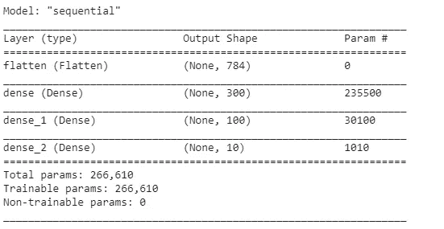
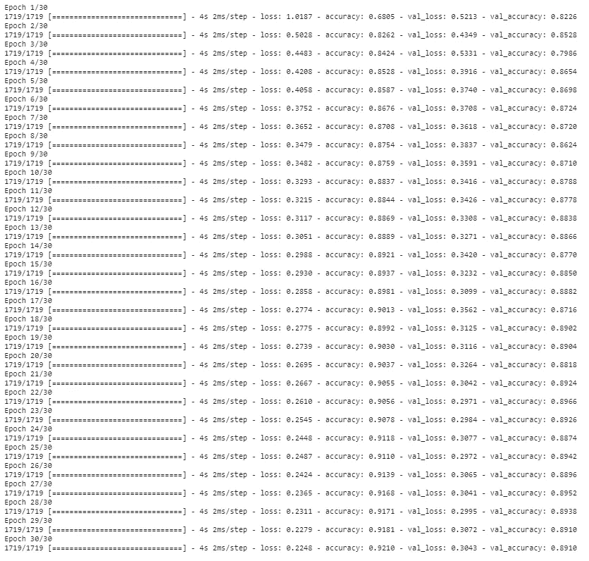

# 利用 Keras 和 TensorFlow 构建图像分类器

> 原文：<https://medium.com/analytics-vidhya/building-image-classifier-using-keras-and-tensorflow-fef21c54732a?source=collection_archive---------8----------------------->

谷歌的机器学习库 TensorFlow 最简单的入门方法之一是从头开始构建图像分类器。TensorFlow 主要用于神经网络，它是一个开源库。由于 tensorflow 是一个低级库，它为用户(尤其是开发者)开发自己的功能和服务提供了更大的灵活性。此外，它们支持很多编程语言，包括 Python。TensorFlow 最近更新到 TensorFlow 2.x，特别是在它的 integration Keras 方面，这是一个高级深度学习 API，有助于轻松构建、训练、验证和执行神经网络。介绍完毕。让我们去建立我们的图像分类器:)


照片由[丹金](https://unsplash.com/@danielcgold?utm_source=medium&utm_medium=referral)在 [Unsplash](https://unsplash.com?utm_source=medium&utm_medium=referral) 上拍摄

## 导入库

我正在使用 Google Colab，下面是导入 tensorflow 和 keras 库的代码。

```
import tensorflow as tf
from tensorflow import keras
tf.__version__
```

## 加载数据集

Keras 有一些实用函数来获取公共数据集。这包括加州 MNIST 的数据集等。出于我们的目的，我们将加载时尚 MNIST 数据。我们将把数据分成训练集和测试集。

```
fashion_mnist=keras.datasets.fashion_mnist
(train_X,train_Y),(test_X,test_Y)=fashion_mnist.load_data()
print("train_X has shape of: ",train_X.shape)
print("train_Y has shape of: ",train_Y.shape)
print("test_X has shape of: ",train_X.shape)
print("test_Y has shape of: ",train_Y.shape)
```

输出:

```
*train_X has shape of: (60000, 28, 28)
train_Y has shape of: (60000,) 
test_X has shape of: (60000, 28, 28) 
test_Y has shape of: (60000,)*
```

现在，我们必须将像素强度除以 255，缩小到 0-1 的范围。通过将我们的输入标准化到标准尺度，我们允许网络更快地学习每个输入节点的最佳参数。此外，如果您的输入和目标输出处于完全不同的范围，那么您的神经网络的默认参数(例如学习率)可能不适合您的数据。我们还将从训练数据中提取一些数据到验证集。

```
// taking first 5000 records for validation set
valid_X,train_X=train_X[:5000]/255.0,train_X[5000:]/255.0
valid_Y,train_Y=train_Y[:5000]/255.0,train_Y[5000:]/255.0
```

数据集中的图像示例:

```
class_names = ["T-shirt/top", "Trouser", "Pullover", "Dress","Coat",
               "Sandal", "Shirt", "Sneaker", "Bag", "Ankle boot"]
n_rows = 4
n_cols = 10
plt.figure(figsize=(n_cols * 1.2, n_rows * 1.2))
**for** row **in** range(n_rows):
    **for** col **in** range(n_cols):
        index = n_cols * row + col
        plt.subplot(n_rows, n_cols, index + 1)
        plt.imshow(X_train[index], cmap="binary", interpolation="nearest")
        plt.axis('off')
        plt.title(class_names[y_train[index]], fontsize=12)
plt.subplots_adjust(wspace=0.2, hspace=0.5)
plt.show()
```


## 顺序 API

我们将建立一个具有两个隐藏层的神经网络。一个隐藏层有 300 个神经元，另一个有 100 个神经元。使用顺序连接的神经元层创建神经网络。因此，顺序 API 有助于将神经元层连接在一起。

```
model=keras.models.Sequential()
```

在加载数据时，您可能已经注意到了输入数据的维度。(60000，28，28)表示有 60000 张尺寸为 28 x 28 的图片。因此，我们的下一步是拉平我们现有的数据。然后，输入数据通过展平层，然后将图像转换为 1D 阵列。

```
model.add(keras.layers.Flatten(input_shape=[28,28]))
```

现在我们将创建隐藏层并初始化它们各自的激活功能。

> **激活函数**是添加到人工神经网络中的**函数**，以便帮助网络学习数据中的复杂模式。我们在最后一层使用 softmax，因为这是一个多标签分类。

```
model.add(keras.layers.Dense(300,activation=”relu”))
model.add(keras.layers.Dense(100,activation=”relu”))
model.add(keras.layers.Dense(10,activation=”softmax”))
```

[](https://towardsdatascience.com/everything-you-need-to-know-about-activation-functions-in-deep-learning-models-84ba9f82c253) [## 关于深度学习模型中的“激活函数”，你需要知道的一切

### 这篇文章是你的废话一站式解决每个可能的问题，有关激活功能…

towardsdatascience.com](https://towardsdatascience.com/everything-you-need-to-know-about-activation-functions-in-deep-learning-models-84ba9f82c253) 

以上是一篇很好的文章，如果你想了解更多关于激活函数的知识。

```
model.summary()
```



隐藏层中的每个节点将具有与其相关联的权重和偏差。当 784 输入连接到隐藏层中的每个节点时，它为密集层创建 784 * 300+ 300 = 235500 个参数。类似地，密度较大的层将有 300*100+100=30100 个相关参数。dense_2 图层将有 100*10+10=1010 个参数。

可以通过以下方式访问模型的层列表

```
model.layers
//assigning the values of weights and bias of first hidden layers
hidden1=model.layers[1]
weights,biases=hidden1.get_weights()
```

## 编译模型

现在我们需要指定我们将使用的损失函数和优化器。以下是 TensorFlow 对相关损失的记录。

 [## 模块:TF . keras . loss | tensor flow Core v 2 . 4 . 0

### 内置损失函数。

www.tensorflow.org](https://www.tensorflow.org/api_docs/python/tf/keras/losses) 

由于输出是多类的，我们将使用稀疏分类交叉熵。

TensorFlow 中可用的熵类型在下面的文档中提供。

现在模型创建好了，让我们定义损失函数和优化器。

```
model.compile(loss=”sparse_categorical_crossentropy”,optimizer=”sgd”,metrics=[“accuracy”])
```

 [## 模块:TF . keras . optimizer | tensor flow Core v 2 . 4 . 0

### 内置优化器类。

www.tensorflow.org](https://www.tensorflow.org/api_docs/python/tf/keras/optimizers) 

## 训练和评估模型

我们将拟合模型，并根据测试数据评估结果。我们正在为训练初始化 30 个纪元。Epochs 表示机器学习算法已经完成的整个训练数据集的通过次数。

```
history=model.fit(train_X, train_Y,epochs=30,validation_data=(valid_X,valid_Y))
```



```
model.evaluate(test_X,test_Y)
X_new = X_test[:3]
y_proba = model.predict(X_new)
y_proba.round(2)
y_pred = model.predict_classes(X_new)
y_pred
np.array(class_names)[y_pred]
y_new = y_test[:3]
y_new
```

模型评估给了我们 87%的准确率，这已经足够了。现在，我们将尝试查看使用数据集中的图像生成的输出。

```
**for** index, image **in** enumerate(X_new):
    plt.subplot(1, 3, index + 1)
    plt.imshow(image, cmap="binary", interpolation="nearest")
    plt.axis('off')
    plt.title(class_names[y_test[index]], fontsize=12)
plt.subplots_adjust(wspace=0.2, hspace=0.5)
plt.show()
```


构建的图像分类器对于数据集来说看起来相当不错。这是图像分类中神经网络的一个非常简单的实现。希望你能从这篇文章中得到一些启示。更多信息请关注:)