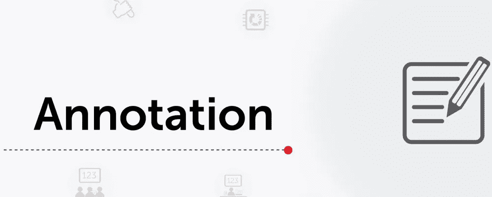

# 在 Jupyter 笔记本中构建交互式注释

> 原文：<https://medium.com/analytics-vidhya/building-interactive-annotations-in-jupyter-notebook-8f71c95b14ef?source=collection_archive---------31----------------------->

## 注释变得简单

[来源](https://encrypted-tbn0.gstatic.com/images?q=tbn%3AANd9GcRbfXoavdqVonCq48DnmiaXPyBvmkhvaLwrN2GX41DMJpevLInD&usqp=CAU)

这是一篇纯粹面向实现的博文，在这里我将讨论如何使用 [ipywidgets](https://ipywidgets.readthedocs.io/en/latest/) 模块，并在他们自己的 [Jupyter 笔记本](https://jupyter.org/)中构建一个**交互式注释工具**。所有目前正在或曾经作为数据科学家为初创公司工作的读者都知道他们需要做的工作。的…