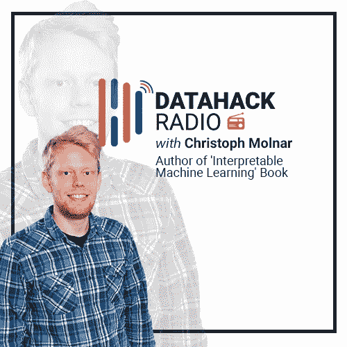

# 用 Christoph Molnar 构建可解释的机器学习模型

> 原文：<https://medium.com/analytics-vidhya/building-interpretable-machine-learning-models-with-christoph-molnar-28bcd1719e36?source=collection_archive---------2----------------------->

# 介绍

我们如何建立可解释的[机器学习](https://courses.analyticsvidhya.com/courses/introduction-to-data-science-2?utm_source=blog&utm_medium=interpretable-machine-learning-podcast)模型？或者，换句话说，我们如何建立对我们设计的模型的信任？这是每个机器学习项目中的一个关键问题。但是我们在匆忙建立更精确的模型时往往忽略了这一点。

花点时间想一想这个问题——你有多少次求助于集成学习和神经网络等复杂技术来提高模型的准确性，同时牺牲可解释性？在现实世界的行业/商业环境中，这是不可接受的。

我们需要找到一种方法来使用这些强大的 ML 算法，并使它们在商业环境中工作。因此，在我们的 DataHack 广播播客的第 20 集，我们欢迎流行书籍的作者 Christoph Molar—“[可解释机器学习](https://christophm.github.io/interpretable-ml-book/)”。谁更适合谈论这个基本而关键的话题呢？

这一集 DataHack Radio 充满了每个[数据科学家](https://courses.analyticsvidhya.com/courses/introduction-to-data-science-2?utm_source=blog&utm_medium=interpretable-machine-learning-podcast)、经理、团队领导和高管都必须了解的基本机器学习方面。Kunal Jain 和 Christoph 就几个主题进行了多层面的对话，包括:

*   Christoph 对可解释机器学习的兴趣和尝试
*   他对可解释 ML 的研究，特别是模型不可知的方法
*   “可解释的机器学习”的书，以及更多！

我们所有的 DataHack 电台播客都可以在以下平台上获得。立即订阅，了解所有最新的机器学习发展动态！

*   [**SoundCloud**](https://soundcloud.com/datahack-radio)
*   [**分析 Vidhya**](https://www.analyticsvidhya.com/blog/category/podcast/?utm_source=blog&utm_medium=interpretable-machine-learning-datahack-radio)
*   [**iTunes**](https://itunes.apple.com/in/podcast/datahack-radio/id1397786677?mt=2)
*   [**谷歌播客**](https://www.google.com/podcasts?feed=aHR0cDovL2ZlZWRzLnNvdW5kY2xvdWQuY29tL3VzZXJzL3NvdW5kY2xvdWQ6dXNlcnM6NDU5MzM1NzYwL3NvdW5kcy5yc3M%3D)

# 克里斯托弗·莫尔纳尔的背景

统计学是数据科学的核心。如果没有先在统计学上建立一个坚实的基础，你不能简单地进入机器学习的世界。

克里斯托弗的背景，尤其是他的大学教育，体现了这一思想。他有丰富的统计学背景。他的学士和硕士学位都来自德国慕尼黑路德维希-马克西米利安大学统计学专业。

在这段时间里，Christoph 遇到了机器学习，并立即对它着迷。他开始参加在线 ML 竞赛和黑客马拉松。他很快就发现，尽管线性回归在学习方面很有用，但它不会加入这些黑客马拉松。

因此，他深入研究了这个领域。决策树、随机森林、集成学习——Christoph 在寻求学习和掌握这些算法的过程中没有放弃任何努力。在完成硕士学位后，他在医学领域做了几年的统计顾问，然后在其他一些组织工作。

在此期间，克里斯托弗也在做他自己的研究。对他感兴趣的领域有什么想法吗？你猜对了——可解释的机器学习。

# 对可解释的机器学习感兴趣

当我们学习这个领域的时候(甚至是研究它的时候)，可解释的机器学习并不是我们经常遇到的话题。每个人都知道它，但只有少数人真正讨论它。那么是什么引发了 Christoph 对这一研究领域的兴趣呢？

对克里斯托弗来说，这一切都可以追溯到他大学时代。这是他统计学教育的一部分。所以当他学习某个话题时，比如线性或逻辑回归，他是从头开始学习的。这不仅包括学习如何建立一个模型，还包括如何解释产生最终输出的内部工作。

钻研可解释 ML 的一个重要原因是 Christoph 与非机器学习人员打交道的经验(我相信每个人在某个时候都会经历这种情况):

> 我过去常常问人们“你为什么不用机器学习来解决你正在研究的问题呢？答案总是“我们无法解释它是如何工作的”。管理层不会接受黑箱模式。" "

如果这听起来很熟悉，你并不孤单！这种无法理解模型如何工作的现象在行业中相当普遍。难怪许多“机器学习项目”在有机会加速之前就失败了。

所有这些学习很自然地转化为 Christoph 的机器学习尝试。他开始探索让机器学习模型可解释的方法，包括看项目、读研究论文等。他遇到的一种方法被称为 LIME，或局部可解释的模型不可知解释。我们有一篇关于这方面的优秀文章，您应该看看:

根据 Christoph 的说法，没有一个特定的博客或教程强调跨技术的可解释机器学习。这就是写一本关于这个主题的书的想法是如何诞生的。

# 机器学习可解释性研究

Christoph 对机器学习可解释性的研究侧重于模型不可知的方法(与模型特定的方法相反)。前一种方法在本质上更具普遍性，而后一种方法则深入到手边的模型中。

对于与模型无关的方法，它们通过改变输入数据的特征并观察预测如何变化来工作。例如，如果我们删除一个特性，模型的性能会下降多少？这也有助于理解特性的重要性。在学习随机森林技术时，你会碰到这个概念。

您可能会想——特定于模型的方法不是更好吗？这是一个公平的问题。模型不可知方法的优势在于它们适应机器学习模型的不断发展。这适用于像神经网络这样的复杂技术，甚至那些还没有成为主流的技术。

如果你是 R 用户，一定要看看 Christoph 的可解释的机器学习包“iml”。你可以在这里找到[。](https://cran.r-project.org/web/packages/iml/index.html)

在这里，Christoph 提到了一个关于可解释性定义的非常有效的观点。**每个人似乎对这个概念有不同的理解。一个业务用户可能对模型如何工作的概述感到满意，另一个用户可能希望完全掌握模型产生最终结果的每一步。这种模糊性对任何研究者来说都是一个挑战。**

# 结束注释

我坚信这个话题应该包含在每一门机器学习课程或培训中。我们不能简单地走进一个行业环境，开始构建一个复杂的模型网络，却不能解释它们是如何工作的。

你能想象一辆自动驾驶汽车出现故障，而开发人员努力理解他们的代码出了什么问题吗？或者一个模型检测出一种根本不存在的疾病？

我希望在接下来的几天和几周内看到更多的进展。在那之前，请务必收听这一集，并与您的网络分享。我期待在下面的评论区听到你的想法和反馈。

*原载于 2019 年 3 月 20 日*[*https://www.analyticsvidhya.com*](https://www.analyticsvidhya.com/blog/2019/03/datahack-radio-interpretable-machine-learning-christoph-molnar/)*。*