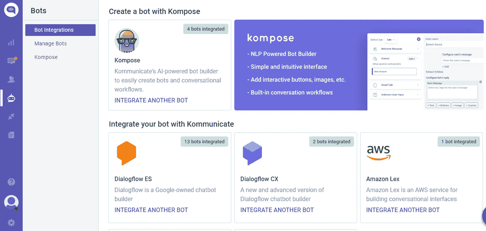
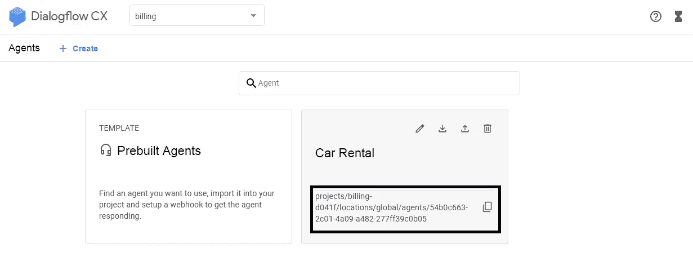
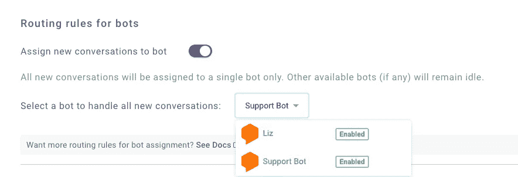
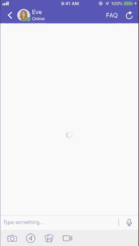

# 用 Dialogflow ES 和 CX 构建 iOS 聊天机器人

> 原文：<https://medium.com/analytics-vidhya/building-ios-chatbot-with-dialogflow-es-and-cx-51c4e99f9270?source=collection_archive---------1----------------------->

在本文中，我们将分享使用 Dialogflow 构建 iOS 聊天机器人的步骤。你需要为一个 iOS 应用程序使用 [Dialogflow](https://dialogflow.com/) 和[komunicate](https://www.kommunicate.io/)来构建一个示例聊天机器人。

下面是一个在 iOS 中使用 Dialogflow 和 komunicate 开发的 komunicate 支持 Bot 的例子。我们实际上在我们的网站上使用这个机器人。如果你想看机器人的实际操作，[点击这里](https://www.kommunicate.io/blog/building-ios-chatbot-with-dialogflow-api-ai/)。

我们在 iOS SDK 中支持 Swift 和 Objective C 两种语言，并且我们已经使用 CocoaPod 使添加变得非常容易。可操作的富消息驱动的机器人可以根据用户是否在聊天中进行一般查询、技术查询、只是结帐或安排演示来回复。

[**创建免费聊天机器人**](https://dashboard.kommunicate.io/signup)

您可以使用现有的 Dialogflow bot 或 checkout [bot samples](https://docs.kommunicate.io/docs/bot-samples) 来构建自己的合格 bot。从下载 Kommunicate 支持机器人，并将其导入您的 Dialogflow 帐户。

让我们知道跳转到这个职位的关键。

# 使用 Dialogflow 构建 iOS 聊天机器人的分步指南

# 步骤 1:在 Kommunicate 中设置一个帐户

这相当简单。你可以在 Kommunicate 获得一个免费账户。[注册](https://dashboard.kommunicate.io/signup)并导航到[机器人集成部分](https://dashboard.kommunicate.io/bots/bot-integrations)。点击 Dialogflow ES 或 CX 集成。



现在，导航到您的 Google cloud 控制台，下载服务帐户密钥文件。以下是查找文件的步骤:

1.  登录[对话流 ES 控制台](https://dialogflow.cloud.google.com/#/login)
2.  前往谷歌云控制台中的[创建服务账户密钥](https://console.cloud.google.com/apis/credentials/serviceaccountkey)。确保您选择了正确的项目，并从**服务账户列表**中选择**新服务账户**
3.  在“服务帐户名称”字段中，输入名称
4.  从**角色**列表中，选择**项目>所有者**
5.  单击创建。一个 JSON 文件，包含下载到您计算机的密钥
6.  上传**服务账户私钥(JSON)**

你也可以参考这个[文档](https://docs.kommunicate.io/docs/bot-dialogflow-integration#integration-using-dialogflow-es)来了解与 Kommunicate 的 Dialogflow 集成。

要将 **Dialogflow CX** 集成到 komunicate 中，请遵循相同的说明下载 JSON 密钥，并在 komunicate 仪表板中提及**代理 Id**

**获取代理 Id** :转到**对话流 CX 控制台** > > **在您创建的代理中选择项目** > >将代理名称复制到剪贴板将采用下面提到的格式，其中代理 Id 为`54b0c663-2c01-4a09-a482-277ff39c0b05`



设置您的机器人的名称和个人资料图片，并选择是否允许[机器人向人类移交](https://www.kommunicate.io/blog/chatbot-human-handoff/)您新创建的机器人。点击**完成机器人集成设置**，瞧，你的机器人现在集成了。

您可以在两个地方检查新创建的 bot:

**仪表盘→机器人集成→管理机器人**:你可以在这里查看你所有集成的机器人。

**仪表盘→机器人集成**:你的 Dialogflow 图标应该是绿色的，显示你已经成功集成的机器人数量。

一旦你创建了一个机器人，你就可以在点击[对话路由部分](https://dashboard.kommunicate.io/settings/conversation-rules)中将其设置为默认机器人，如下所示。**设置**->-**对话规则->-**然后点击下方的 bot like，选择你的 bot



现在，这个机器人会在所有对话中回复。

# 第二步:安装和设置 Dialogflow 集成 iOS 聊天机器人 SDK 到您的应用程序中

在这一步中，您需要将 Kommunicate iOS SDK 添加到您的应用中。安装 Kommunicate SDK 它带有预配置的 Dialogflow 集成。按照以下说明将 iOS SDK 添加到您的应用中:

[**免费试用 30 天**](https://dashboard.kommunicate.io/signup)

**初始化 CocoaPods:**

可通过椰子传播。要安装它，只需将下面一行添加到您的 Podfile 中:

```
pod 'Kommunicate'
```

这是 pod 文件最终的样子

```
target 'MyTargetName' do use_frameworks! pod 'Kommunicate' End
```

在项目终端文件夹中运行 pod install

```
pod install
```

安装完成后，您可以通过调用以下方法来初始化 SDK:

**设置应用 id:**

```
Kommunicate.setup(applicationId:<Your App ID>)
```

您可以在您需要使用下面的[安装部分](https://dashboard.kommunicate.io/settings/install)注册用户中获得您唯一的应用程序 ID。如果在任何文件中，你想使用 komunicate，不要忘记用**导入 komunicate 来导入框架。****komunicate . register 在开始聊天前使用** r 方法，传递用户的 userId 和 email。**登录用户通信:**

```
let kmUser = KMUser()
kmUser.userId = userId 
// Pass userId here NOTE : +,*,? are not allowed chars in userId.
kmUser.email = emailId // Optional

// Use this same API for login
Kommunicate.registerUser(kmUser, completion: {
    response, error in
    guard error == nil else {return}
    print(" login Success ") 
    // You can launch the chat screen on success of login
})
```

**注意:**在用户登录 Kommunicate 之前，您需要使用**komunicate . setup(**application Id**:<您的应用 ID > )** ，以便在启动阶段设置应用 ID

# 第三步:发送和接收信息

现在，您可以通过聊天屏幕将有效负载数据发送到 Dialogflow，并从 Dialogflow 代理获得文本响应。Kommunicate 提供了一个现成的聊天 UI，因此在这一步中只需要启动聊天屏幕。

```
let kmConversation =
    KMConversationBuilder()
        .useLastConversation(true)
        .build()
Kommunicate.createConversation(conversation: kmConversation) { result in
    switch result {
    case .success(let conversationId):
        print("Conversation id: ",conversationId)
        DispatchQueue.main.async {
            Kommunicate.showConversationWith(
                groupId: conversationId,
                from: self,
                completionHandler: { success in
                    print("conversation was shown")
            })
        }
    case .failure(let kmConversationError):
        print("Failed to create a conversation: ", kmConversationError)
    }
}
```

您可以在此处参考对话部分[的更多文档。](https://docs.kommunicate.io/docs/ios-conversation#new-conversation)运行 iOS 项目，用 Dialogflow bot 聊天。只需几个简单的步骤，您就可以轻松地将 Dialogflow 集成到 iOS 应用中。如果您需要更多信息，请查阅[komunicate iOS 文档。](https://docs.kommunicate.io/docs/ios-installation)这里有一些 iOS 应用程序的示例聊天屏幕，带有 Dialogflow 和 Kommunicate。



**komunicate 示例应用:**点击 从 [**下载示例应用，其中包括可以使用的 Kommunicate iOS SDK**](https://github.com/Kommunicate-io/Kommunicate-iOS-SDK)

**Dialogflow iOS SDK 客户端:**

Dialogflow 提供了 iOS 客户端 SDK，可以轻松地在苹果设备上集成语音识别和 API.ai 自然语言处理 API。

如果您希望开发自己的聊天实现，并且可以直接将 Dialogflow 集成到您的 iOS 应用程序中，而无需 Kommunicate SDK，那么可以集成 Github 的以下 SDK—[dialog flow iOS 客户端 SDK](https://github.com/dialogflow/dialogflow-apple-client) 。

相关岗位:
1。[用 Dialogflow (API.ai)](https://www.kommunicate.io/blog/build-chatbot-with-dialogflow-android-sdk/)
2 构建安卓聊天机器人。[将 Dialogflow (Api.ai) Bot 集成到网站中](https://www.kommunicate.io/blog/how-to-integrate-bot-using-dialogflow-in-kommunicate-1ac32911a7d0/)

[**免费试用**](https://dashboard.kommunicate.io/signup)

*原载于*[*https://www . komunicate . io*](https://www.kommunicate.io/blog/building-ios-chatbot-with-dialogflow-api-ai/)