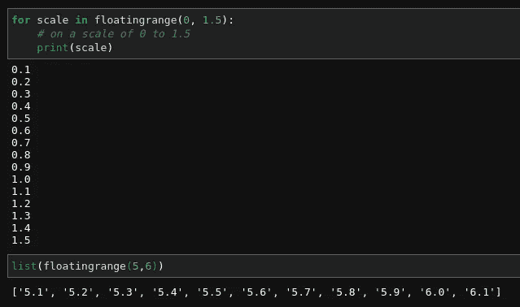

# 使用 python 构建可迭代对象

> 原文：<https://medium.com/analytics-vidhya/building-iterable-object-using-python-1545c503e06f?source=collection_archive---------18----------------------->


照片由 [Clément H](https://unsplash.com/@clemhlrdt?utm_source=medium&utm_medium=referral) 在 [Unsplash](https://unsplash.com?utm_source=medium&utm_medium=referral) 上拍摄

在 python 中从头开始构建一个 iterable 对象很容易，在本教程中，你将能够学习迭代器是如何工作的。我们将构建一个自定义的浮动范围函数类，它将返回一个浮点数序列，类似于 python 中的`range()`函数，它返回一个整数序列。

> python 中的`range()`函数返回一个数字序列，默认情况下从 0 开始，递增 1(默认情况下)，在指定的数字之前停止。

为了构建一个定制的可迭代对象，你的类应该包含两个函数`__iter__()`和`__next__()`，它们一起被称为**迭代器协议**。

python 中的大多数内置类型如`list`、`tuple`和`string`等都是可迭代的对象，这意味着它们可以循环到最后一个元素。

# 让我们编码

我们将从定义一个简单的 python **类**开始，它将包含`iter`和`next`方法。

[https://gist . github . com/novas ush/54c 5 F2 EB 8 c 3270231 e 709 B1 eaed 4035 f # file-floating range _ definition-py](https://gist.github.com/novasush/54c5f2eb8c3270231e709b1eaed4035f#file-floatingrange_defination-py)

现在我们已经准备好了基本框架，让我们为它添加功能。从实际上是构造函数的`__init__()`开始。对于任何给定的序列，我们只需要起始值和结束值。

```
**def** __init__(self, start=None, stop=None, decimal=0):
  **if** start is None:
    raise TypeError('floatingrange expected 1 argument, got 0')
  **if** stop:
    self.start = float(start)
    self.stop = float(stop)
  **else**:
    self.start = 0.0
    self.stop = float(start)

  **if** decimal < 2:
    self.decimal = 1
    self.dp = 0.1 / 1
  **else**:
    self.decimal = decimal
    self.dp = 0.1 / float('1' + ('0' * (self.decimal - 1)))
```

因为它是一个范围，如果没有起始值，那么默认值将被认为是 0.0，我们还指定了一个小数点，通过它我们可以细分我们的范围。

## 理解十进制逻辑

> 如果未指定小数点值，则默认情况下，我们会将范围分割为最多 1 个小数点，即 x.0 到 y.1，其中 x 是起始值，y 是结束值。
> 如果十进制值为 2，序列分解将从 0.01 到 0.99，同样它将随着值的增加而增加。

现在我们已经初始化了我们的范围，我们需要告诉我们的解释器将我们的对象初始化为迭代器，为此我们需要修改我们的`__iter__()`函数。

```
**def** __iter__(self):
  return self
```

现在我们已经初始化了一个迭代器对象，我们需要在下一次迭代中指定一个新值。为此，我们需要修改我们的`__next__()`函数。

```
**def** __next__(self):
  **if** self.start < self.stop:
    val = self.start + self.dp
    self.start = val
    return "{0:.{1}f}".format(val,self.decimal)
  **else**:
    raise StopIteration('Reached end of the value')
```

所以，现在每次我们用我们的对象调用 next()函数或者只是通过一个循环迭代它，它将递增并返回一个新值，直到序列的最终值。

# 组合所有功能

[https://gist . github . com/novas ush/ab 3a 83 f 627148328 af 6799824 a 91 fb1e](https://gist.github.com/novasush/ab3a83f627148328af6799824a91fb1e)

现在我们已经构建了一个 iterable 对象，让我们看看它是如何工作的。



# 这是所有的乡亲