# 在乳腺癌 Wisconsin 数据集上建立 ML 模型预测癌症是良性还是恶性！！第一部分

> 原文：<https://medium.com/analytics-vidhya/building-ml-model-to-predict-whether-the-cancer-is-benign-or-malignant-on-breast-cancer-wisconsin-a09b6c32e7b8?source=collection_archive---------3----------------------->

做机器学习模型预测癌症是良性还是恶性的步骤包括:

```
**Step 1: Define Problem Statement
Step 2: Data Source
Step 3: Cleaning the Data
Step 4: Data Analysis and Exploration**
Step 5: Feature Selection
Step 6: Data Modelling
Step 7: Model Validation
Step 8: Hyperparameter Tuning
Step 9: DeploymentIn this part 1, We will explore **step 1 to 4**We are using the Breast Cancer Wisconsin [**dataset**](https://archive.ics.uci.edu/ml/datasets/Breast+Cancer+Wisconsin+%28Diagnostic%29) available on UCI Machine Learning Repository.
```

## 步骤 1:定义问题陈述

我们的目标是确定哪些特征最有助于预测恶性或良性癌症，并对乳腺癌进行良性或恶性分类。

## 步骤 2:数据源

我们已经使用了公开可用的数据集乳腺癌威斯康星州，并已从 UCI 机器学习库下载。资源库:[https://archive . ics . UCI . edu/ml/datasets/Breast+Cancer+Wisconsin+% 28 diagnostic % 29](https://archive.ics.uci.edu/ml/datasets/Breast+Cancer+Wisconsin+%28Diagnostic%29)属性信息:

1.*身份证号*

*2。诊断(M =恶性，B =良性)*

*3–32 为每个细胞核计算十个实值特征:*

*a .半径(从中心到圆周上各点的平均距离)*

*b .纹理(灰度值的标准偏差)*

*c .周长*

*d)区域*

*e)平滑度(半径长度的局部变化)*

*f .密实度(周长/面积— 1.0)*

*g .凹度(轮廓凹陷部分的严重程度)*

*h .凹点(轮廓的凹入部分的数量)*

*一、对称性 j)分形维数(“海岸线近似”——1)*

对每幅图像计算这些特征的平均值、标准误差和“最差”或最大值(三个最大值的平均值),得到 30 个特征。例如，字段 3 是平均半径，字段 13 是半径 SE，字段 23 是最差半径。

## 步骤 3:清理数据

“数据质量是数据管理中最重要的问题之一，因为肮脏的数据通常会导致不准确的数据分析结果和错误的业务决策**伊哈布·易勒雅斯(作者)**。”

数据分析师/科学家花费大量时间清理数据集，并将它们转换成他们可以使用的形式。据我个人估计，数据探索、清理和准备可能会占用项目总时间的 70%。

数据集中存在许多类型的错误，尽管一些最简单的错误包括不包含太多信息的列和重复的行。

在这里，我将介绍以下内容:

1.  检查缺失或空数据点
2.  删除数据集中不必要的列
3.  检查并识别包含重复记录的行

```
**# importing the libraries**
import numpy as np 
**# data processing, CSV file I/O**
import pandas as pd 
**# data visualization library**
import seaborn as sns  
import matplotlib.pyplot as plt
import time
```

**导入数据集**

在这里，我从我的 Github 帐户导入数据。

```
dataset = pd.read_csv('[https://raw.githubusercontent.com/Muhd-Shahid/Breast-Cancer-Wisconsin/master/data_breast-cancer-wiscons.csv'](https://raw.githubusercontent.com/Muhd-Shahid/Breast-Cancer-Wisconsin/master/data_breast-cancer-wiscons.csv'))
```

**检查我们的数据…快**

```
dataset.head()**# Get the dimensions of the data**
print("Cancer data set dimensions : {}".format(dataset.shape))**Outcome:** 
Cancer data set dimensions : (569, 33)
```

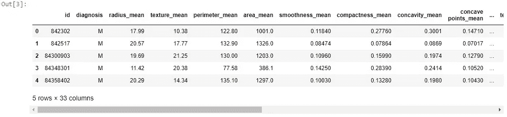

检查缺失或空数据点

```
#dataset.isnull().sum()
#dataset.isna().sum()
**# Get column data types and missing values in Columns**
dataset.info()
```

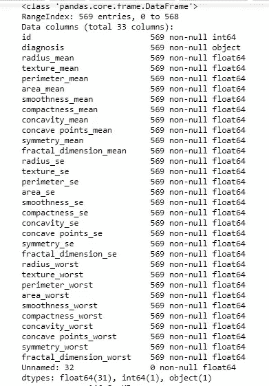

## 还让我们检查该列是否是唯一的

```
**# Get column names**
column_names = dataset.columns 
for i in column_names:
  print('{} is unique: {}'.format(i, dataset[i].is_unique))
```

我们发现只有 **ID 列**是唯一的。

## 删除数据集中不必要的列

```
**# Get column names**
col = dataset.columns # .columns gives columns names in data 
print(col)**Outcome:**
Index(['id', 'diagnosis', 'radius_mean', 'texture_mean', 'perimeter_mean',
       'area_mean', 'smoothness_mean', 'compactness_mean', 'concavity_mean',
       'concave points_mean', 'symmetry_mean', 'fractal_dimension_mean',
       'radius_se', 'texture_se', 'perimeter_se', 'area_se', 'smoothness_se',
       'compactness_se', 'concavity_se', 'concave points_se', 'symmetry_se',
       'fractal_dimension_se', 'radius_worst', 'texture_worst',
       'perimeter_worst', 'area_worst', 'smoothness_worst',
       'compactness_worst', 'concavity_worst', 'concave points_worst',
       'symmetry_worst', 'fractal_dimension_worst', 'Unnamed: 32'],
      dtype='object')
```

有 4 件事引起了我的注意

1.  有一个 **id** 不能用于分类
2.  **诊断**是我们的阶级标签
3.  **未命名:32** 特性包含 NaN，所以我们不需要它。
4.  我对其他功能名称没有任何想法，实际上我不需要，因为机器学习太棒了:)

因此，放弃这些不必要的功能。但是，不要忘记这不是一个功能选择过程，我们只是试图理解数据。

```
**# y includes our labels and x includes our features**
y = dataset.diagnosis # M or B 
list_drp = [‘Unnamed: 32’,’id’,’diagnosis’]
x = dataset.drop(list_drp,axis = 1 )
```

## 检查并识别包含重复记录的行

```
**# calculate duplicates**
dups = x.duplicated()
**# report if there are any duplicates**
print(dups.any())
**# list all duplicate rows**
print(x[dups])
```

**释义:**

数据的每一行代表对一个患者的观察，列保存变量。共有 33 列 569 名患者。有 31 个数字列、1 个 ID 列和 1 个分类类列。数据集中没有缺失和重复的值。

## 步骤 4:数据分析和探索

这是一个弄清楚数据能告诉我们什么的过程，我们使用探索性数据分析(EDA)来寻找模式、关系或异常，以通知我们的后续分析。我们将寻找解决我们感兴趣的问题的模式、差异和其他特征，也将试图揭示不同变量之间的关系。

```
ax = sns.countplot(y,label="Count")       # M = 212, B = 357
B, M = y.value_counts()
print('Number of Benign: ',B)
print('Number of Malignant : ',M)
ax.set_ylabel('Number of patients')
bars = ax.patches
half = int(len(bars)/2)
left_bars = bars[:half]
right_bars = bars[half:]
for left, right in zip(left_bars, right_bars):
    height_l = left.get_height()
    height_r = right.get_height()
    total = height_l + height_r
    ax.text(left.get_x() + left.get_width()/2., height_l + 40, '{0:.0%}'.format(height_l/total), ha="center")
    ax.text(right.get_x() + right.get_width()/2., height_r + 40, '{0:.0%}'.format(height_r/total), ha="center")
```

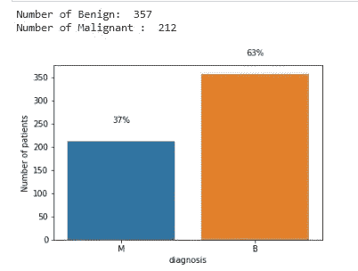

阶级分布

## 检查基本统计数据

```
x.describe()
```

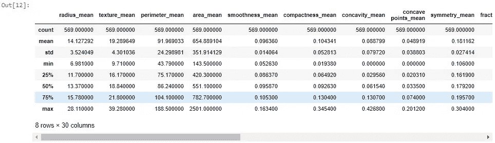

我们现在有特性了，但是它们是什么意思或者我们需要知道这些特性的什么？答案是，我们不需要知道这些特征的含义，但是为了在我们的头脑中想象，我们应该知道像方差、标准差、样本数(计数)或最大最小值这样的东西。这种类型的信息有助于理解数据发生了什么。例如，我想到的问题是，面积平均特征的最大值是 2500，平滑度平均特征的最大值是 0.16340。因此，在可视化、特征选择、特征提取或分类之前，我们是否需要标准化或规范化？答案是肯定的。无论如何，让我们一步一步来，开始可视化过程。

## 可视化数据开发

为了可视化数据，我们将使用 [**seaborn plots**](https://seaborn.pydata.org/introduction.html) 。现实生活中我用的大多是 [**violinplot**](https://seaborn.pydata.org/generated/seaborn.violinplot.html) 和 [**swarmplot**](https://seaborn.pydata.org/generated/seaborn.swarmplot.html) 。不要忘记，我们不是在选择特征，我们是在尝试了解数据。

在绘制我们的数据之前，我们需要规范化或标准化。因为在图上观察到的特征值之间的差异非常大。我将特征分成 3 组，每组包括 10 个特征，以便更好地观察。

## 使用 violinplot 探索数据

```
**# first ten features**
data_dia = y
data = x
**# standardization of the data**
data_n_2 = (data - data.mean()) / (data.std())data = pd.concat([y,data_n_2.iloc[:,0:10]],axis=1)
data = pd.melt(data,id_vars="diagnosis",
                    var_name="features",
                    value_name='value')
plt.figure(figsize=(10,10))
sns.violinplot(x="features", y="value", hue="diagnosis", data=data,split=True, inner="quart",palette ="Set2")
plt.xticks(rotation=90)
```

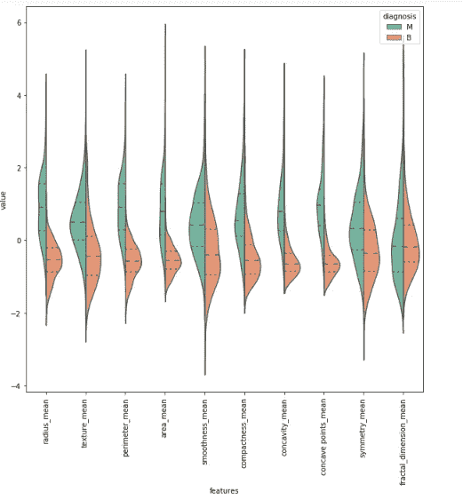

**释义:**

让我们一起来解读上面的情节。例如，在 texture_mean 特征中，恶性和良性的中值看起来像是分开的，因此它有利于分类。然而，在分形维数均值特征中，恶性肿瘤和良性肿瘤的中值看起来不像是分开的，因此不能提供很好的分类信息。

```
# Next ten features
data = pd.concat([y,data_n_2.iloc[:,10:20]],axis=1)
data = pd.melt(data,id_vars="diagnosis",
                    var_name="features",
                    value_name='value')
plt.figure(figsize=(10,10))
sns.violinplot(x="features", y="value", hue="diagnosis", data=data,split=True, inner="quart",palette ="Set2")
plt.xticks(rotation=90)
```

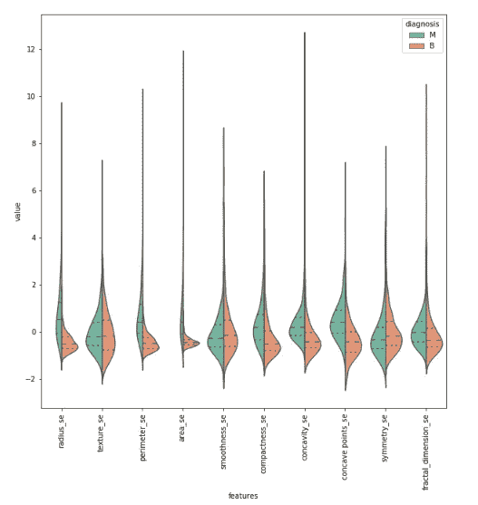

```
# Last ten features
data = pd.concat([y,data_n_2.iloc[:,20:31]],axis=1)
data = pd.melt(data,id_vars="diagnosis",
                    var_name="features",
                    value_name='value')
plt.figure(figsize=(10,10))
sns.violinplot(x="features", y="value", hue="diagnosis", data=data,split=True, inner="quart",palette ="Set2")
plt.xticks(rotation=90)
```

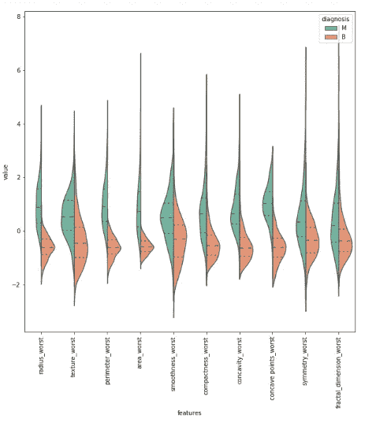

让我们再解释一下上面的图，凹度 _ 最差变量和凹点 _ 最差变量看起来很相似，但是我们如何确定它们之间是否相关。(并不总是如此，但基本上，如果这些特性相互关联，我们可以删除其中一个)

为了更深入地比较两个特性，让我们用 [**连带**](https://seaborn.pydata.org/generated/seaborn.jointplot.html) 。在下面的联合情节中看看这个，它确实是相关的。Pearsonr 值为相关值，1 为最高。因此，0.86 看起来足以说明它们是相关的。不要忘记，我们还没有选择功能，我们只是希望对它们有一个想法。

## 使用联合绘图探索数据

使用联合图检查凹点 _ 最差和凹点 _ 最差之间的相关性。

```
import scipy.stats as stats
sns.set(style="white",color_codes=True)
jp=sns.jointplot(x.loc[:,'concavity_worst'], x.loc[:,'concave points_worst'], kind="regg",color="g")
#jp=sns.jointplot(x.loc[:,'smoothness_se'], x.loc[:,'texture_se'], kind="regg",color="b")
jp.annotate(stats.pearsonr)
```

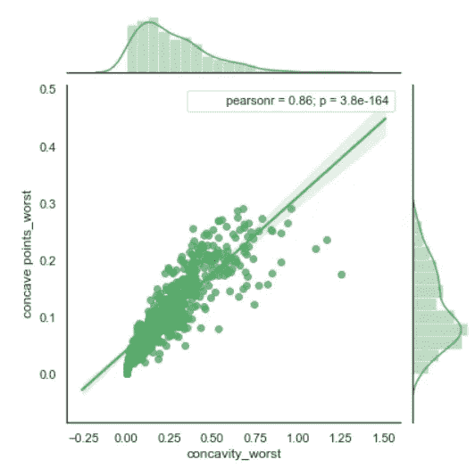

使用联合图检查凹点平均值和凹点平均值之间的相关性。

```
jp=sns.jointplot(x.loc[:,’concavity_mean’], x.loc[:,’concave points_mean’], kind=”regg”,color=”b”)
jp.annotate(stats.pearsonr)
```

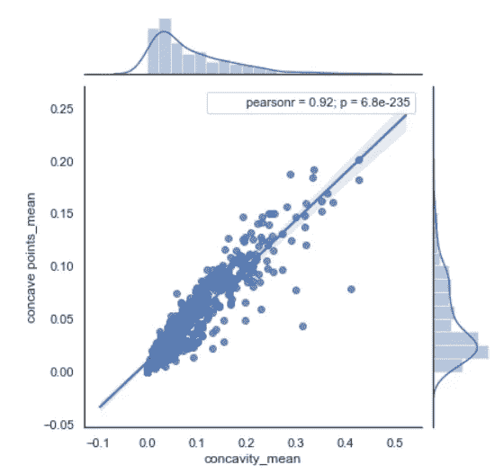

使用联合图检查凹度 se 和凹点 se 之间的相关性。

```
jp=sns.jointplot(x.loc[:,'concavity_se'], x.loc[:,'concave points_se'], kind="regg",color="r")
jp.annotate(stats.pearsonr)
```

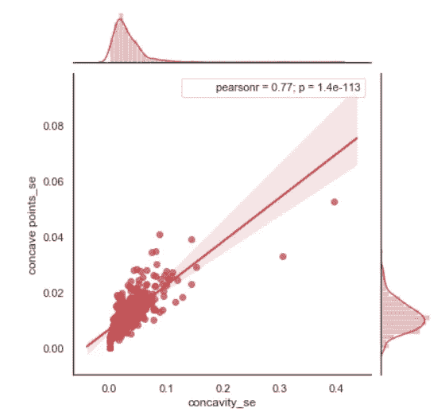

三个或更多变量比较呢？为此，我们可以使用配对图或配对网格图。而且看起来很酷:)我们还发现了一件事，半径最差，周长最差和面积最差是相关的，正如我们可以看到的对网格图。我们肯定会将这些发现用于特征选择。

## 使用 pairplot 探索数据

检查单个变量的分布和两个变量之间的关系。

```
# Function to calculate correlation coefficient between two arrays
def corr(x, y, **kwargs):

    # Calculate the value
    coef = np.corrcoef(x, y)[0][1]
    # Make the label
    label = r'$\rho$ = ' + str(round(coef, 2))

    # Add the label to the plot
    ax = plt.gca()
    ax.annotate(label, xy = (0.2, 0.95), size = 11, xycoords = ax.transAxes)
# First six features
data = pd.concat([y,data_n_2.iloc[:,0:6]],axis=1)
plt.figure(figsize=(10,10))
grid=sns.pairplot(data=data,kind ="scatter",hue="diagnosis",palette="Set1")
# Map the plots to the locations
#grid = grid.map_upper(plt.scatter, color = 'darkred')
grid = grid.map_upper(corr)# First six features
data = pd.concat([y,data_n_2.iloc[:,6:12]],axis=1)
plt.figure(figsize=(10,10))
grid=sns.pairplot(data=data,kind ="scatter",hue="diagnosis",palette="Set1")
# Map the plots to the locations
#grid = grid.map_upper(plt.scatter, color = 'darkred')
grid = grid.map_upper(corr)
#grid = grid.map_lower(sns.kdeplot, cmap = 'Reds')
#grid = grid.map_diag(plt.hist, bins = 10, edgecolor =  'k', color = 'darkred');
```

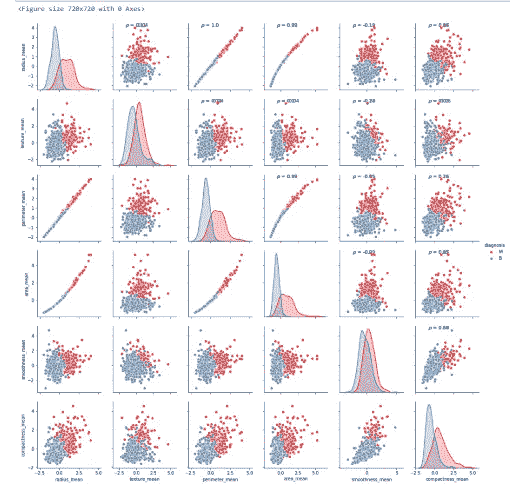

```
# Next six features
data = pd.concat([y,data_n_2.iloc[:,6:12]],axis=1)
plt.figure(figsize=(10,10))
grid=sns.pairplot(data=data,kind ="scatter",hue="diagnosis",palette="Set1")
# Map the plots to the locations
#grid = grid.map_upper(plt.scatter, color = 'darkred')
grid = grid.map_upper(corr)
#grid = grid.map_lower(sns.kdeplot, cmap = 'Reds')
#grid = grid.map_diag(plt.hist, bins = 10, edgecolor =  'k', color = 'darkred');
```

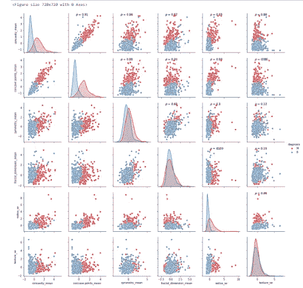

```
# Next six features
data = pd.concat([y,data_n_2.iloc[:,12:18]],axis=1)
plt.figure(figsize=(10,10))
grid=sns.pairplot(data=data,kind ="scatter",hue="diagnosis",palette="Set1")
# Map the plots to the locations
#grid = grid.map_upper(plt.scatter, color = 'darkred')
grid = grid.map_upper(corr)
#grid = grid.map_lower(sns.kdeplot, cmap = 'Reds')
#grid = grid.map_diag(plt.hist, bins = 10, edgecolor =  'k', color = 'darkred');
```

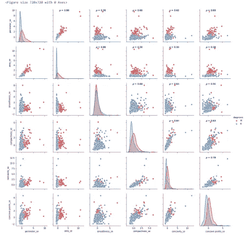

```
# Next six features
data = pd.concat([y,data_n_2.iloc[:,18:24]],axis=1)
plt.figure(figsize=(10,10))
grid=sns.pairplot(data=data,kind =”scatter”,hue=”diagnosis”,palette=”Set1")
# Map the plots to the locations
#grid = grid.map_upper(plt.scatter, color = ‘darkred’)
grid = grid.map_upper(corr)
#grid = grid.map_lower(sns.kdeplot, cmap = ‘Reds’)
#grid = grid.map_diag(plt.hist, bins = 10, edgecolor = ‘k’, color = ‘darkred’);
```

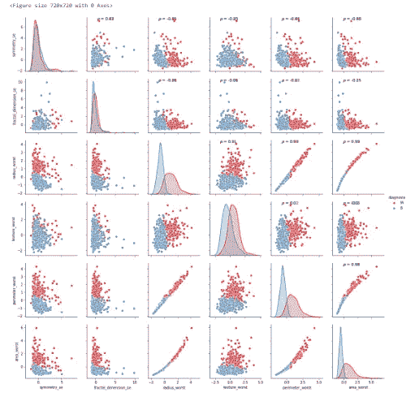

```
# Next six features
data = pd.concat([y,data_n_2.iloc[:,24:32]],axis=1)
plt.figure(figsize=(10,10))
grid=sns.pairplot(data=data,kind ="scatter",hue="diagnosis",palette="Set1")
# Map the plots to the locations
#grid = grid.map_upper(plt.scatter, color = 'darkred')
grid = grid.map_upper(corr)
#grid = grid.map_lower(sns.kdeplot, cmap = 'Reds')
#grid = grid.map_diag(plt.hist, bins = 10, edgecolor =  'k', color = 'darkred');
```

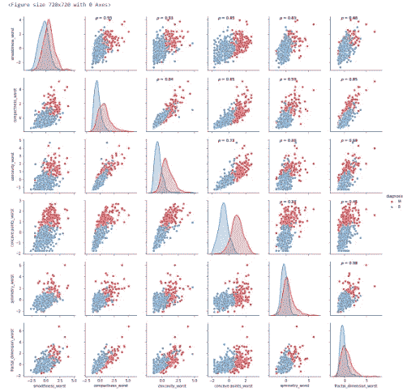

至此，我们已经对数据做出了一些评论和发现。如果你喜欢我们所做的，我确信虫群图将帮助你更好地理解数据。

在群体情节中，我会像小提琴情节那样做三个部分，以使情节看起来不那么复杂

## 使用群集图探索数据

```
# First ten features
sns.set(style="whitegrid", palette="Set1")
data_dia = y
data = x
data_n_2 = (data - data.mean()) / (data.std())              # standardization
data = pd.concat([y,data_n_2.iloc[:,0:10]],axis=1)
data = pd.melt(data,id_vars="diagnosis",
                    var_name="features",
                    value_name='value')
plt.figure(figsize=(10,10))
tic = time.time()
sns.swarmplot(x="features", y="value", hue="diagnosis", data=data)plt.xticks(rotation=90)
```

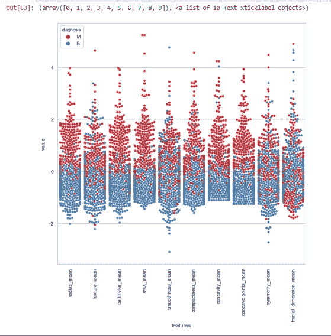

```
# Next ten features
data = pd.concat([y,data_n_2.iloc[:,10:20]],axis=1)
data = pd.melt(data,id_vars="diagnosis",
                    var_name="features",
                    value_name='value')
plt.figure(figsize=(10,10))
sns.swarmplot(x="features", y="value", hue="diagnosis", data=data)
plt.xticks(rotation=90)
```

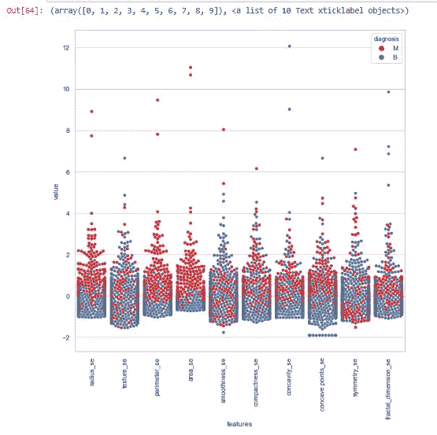

```
# Next ten features
data = pd.concat([y,data_n_2.iloc[:,20:31]],axis=1)
data = pd.melt(data,id_vars="diagnosis",
                    var_name="features",
                    value_name='value')
plt.figure(figsize=(10,10))
sns.swarmplot(x="features", y="value", hue="diagnosis", data=data)
toc = time.time()
plt.xticks(rotation=90)
print("swarm plot time: ", toc-tic ," s")
```

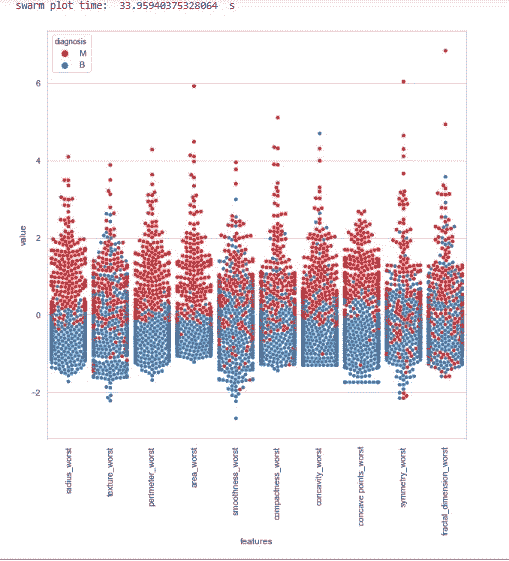

他们看起来很酷吧。你可以更清楚地看到差异。让我问你一个问题，在这三个情节中，哪一个特征在分类方面看起来更清楚。在我看来，上一个蜂群中最差的区域看起来像是恶性和良性没有完全分开，而是大部分分开了。然而，群图 2 中的 smooth _ se 看起来像是恶性和良性混合，因此在使用该特征时很难分类。

如果我们想要观察特征之间的所有相关性呢？是的，你是对的。答案是 [**热图**](https://seaborn.pydata.org/generated/seaborn.heatmap.html) 那是古老却强大的剧情方法。

## 使用热图浏览数据

```
#correlation map
f,ax = plt.subplots(figsize=(18, 18))
sns.heatmap(x.corr(), annot=True, linewidths=.5, fmt= '.1f',ax=ax)
```

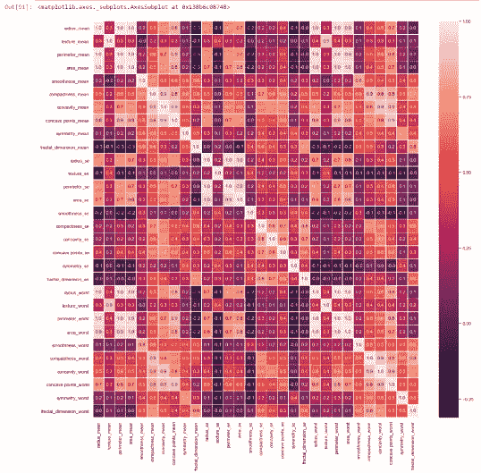

**释义:**

从地图热图中可以看出，半径平均值、周长平均值和面积平均值相互关联，因此我们将仅使用面积平均值。如果你问我如何选择 area_mean 作为要使用的特征，那么实际上没有正确的答案，我只是看着群体图，area_mean 对我来说看起来很清楚，但我们不能在不尝试的情况下在其他相关特征中进行精确的分离。因此，让我们寻找其他相关的特征，并期待与随机森林分类器的准确性。

紧密度均值、凹度均值和凹点均值是相互关联的。所以我只选择凹度 _ 均值。除此之外，半径 se、周长 se 和面积 se 是相关的，我只使用面积 se。半径 _ 最差、周长 _ 最差和面积 _ 最差是相关的，所以我使用面积 _ 最差。紧致 _ 最差，凹度 _ 最差和凹点 _ 最差所以我用凹度 _ 最差。紧致性 _se，凹度 _se 和凹点 _se 所以我用凹度 _se。texture_mean 和 texture_worst 是相关的，我使用 texture_mean。area_worst 和 area_mean 是相关的，我用 area_mean。

```
drop_list1 = ['perimeter_mean','radius_mean','compactness_mean','concave points_mean','radius_se','perimeter_se','radius_worst','perimeter_worst','compactness_worst','concave points_worst','compactness_se','concave points_se','texture_worst','area_worst']
x_1 = x.drop(drop_list1,axis = 1 ) 
```

删除相关特征后，如下面的相关矩阵所示，不再有相关特征。实际上，我知道，你也看到了，凹度均值和凹度最差之间的相关值是 0.9，但是让我们一起看看如果我们不放弃它会发生什么。

```
#correlation map
f,ax = plt.subplots(figsize=(14, 14))
sns.heatmap(x_1.corr(), annot=True, linewidths=.5, fmt= '.1f',ax=ax)
```

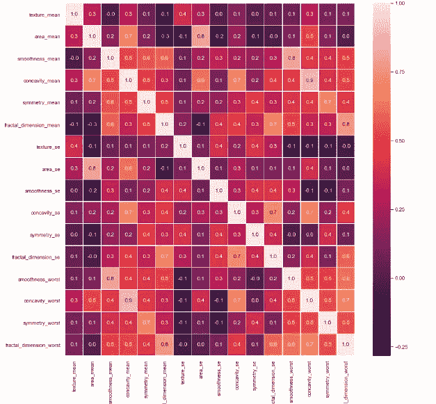

**结束注释**

如前所述，投入到数据探索中的质量和努力区分了好模型和坏模型。

这就结束了我们的**第 1 部分**关于问题陈述到数据分析和探究。本**第 1 部分**的目的是为数据科学中一个极其重要的过程提供一个深入的逐步指南。

就我个人而言，我很喜欢写这篇文章，也很想从你的反馈中学习。你觉得这个**第 1 部分**有用吗？我将感谢你的建议/反馈。请随时通过下面的评论提出你的问题。

## 我们将在第 2 部分的[中探讨第 5 步:特征选择](/@shahid_dhn/building-ml-model-to-predict-whether-the-cancer-is-benign-or-malignant-on-breast-cancer-wisconsin-b8249b55fc62)

敬请期待！

本文使用的所有代码和数据集都可以从我的 [**GitHub**](https://github.com/Muhd-Shahid/Breast-Cancer-Wisconsin) 中访问。

该代码也可作为一个 [**Jupyter 笔记本**](https://github.com/Muhd-Shahid/Breast-Cancer-Wisconsin/blob/master/BCW_Exploratory_Data_Analysis_Part%201.ipynb) 。[](https://www.kaggle.com/code/itsmohammadshahid/classification-of-breast-cancer-part-1-eda)