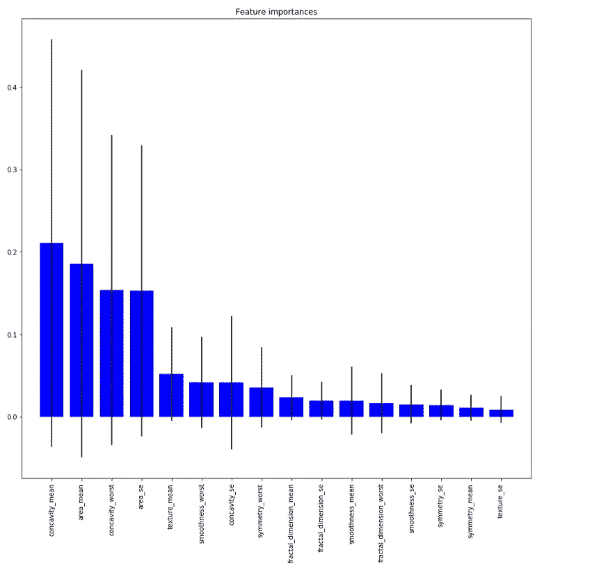
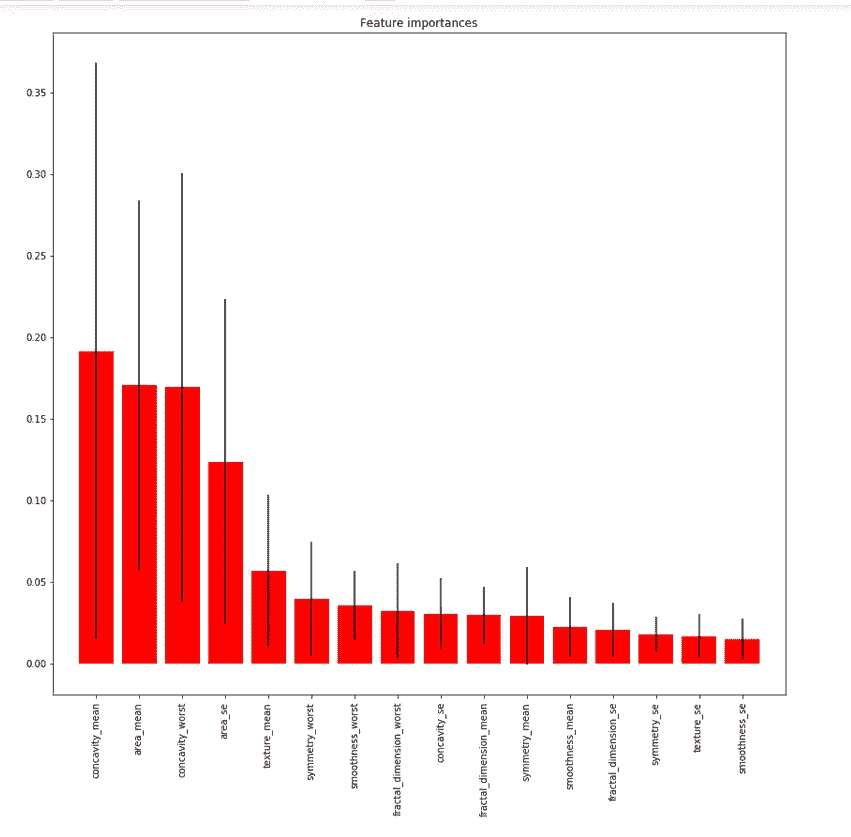
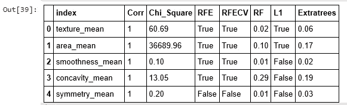
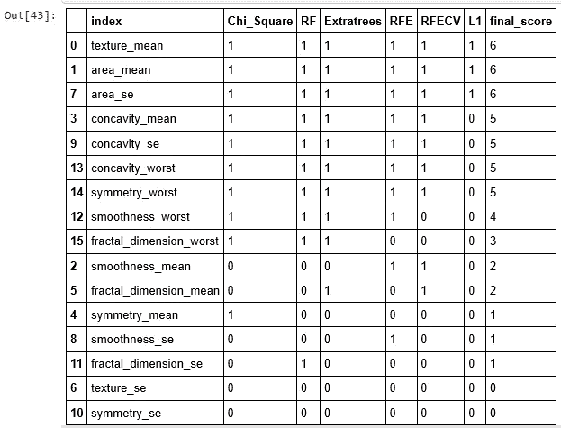

# 在乳腺癌 Wisconsin 数据集上建立 ML 模型预测癌症是良性还是恶性！！第二部分

> 原文：<https://medium.com/analytics-vidhya/building-ml-model-to-predict-whether-the-cancer-is-benign-or-malignant-on-breast-cancer-wisconsin-b8249b55fc62?source=collection_archive---------5----------------------->

如果你跳过了 [**第一部分**](/@shahid_dhn/building-ml-model-to-predict-whether-the-cancer-is-benign-or-malignant-on-breast-cancer-wisconsin-a09b6c32e7b8)**，我请求你先看完它。**

**做机器学习模型预测癌症是良性还是恶性的步骤包括:**

```
Step 1: Define Problem Statement
Step 2: Data Source
Step 3: Cleaning the Data
Step 4: Data Analysis and Exploration
**Step 5: Feature Selection**
Step 6: Data Modelling
Step 7: Model Validation
Step 8: Hyperparameter Tuning
Step 9: DeploymentIn this part 2, I will cover **step 5** We are using the Breast Cancer Wisconsin [**dataset**](https://archive.ics.uci.edu/ml/datasets/Breast+Cancer+Wisconsin+%28Diagnostic%29) available on UCI Machine Learning Repository.
```

## **定义问题陈述**

**我们的目标是确定哪些特征最有助于预测恶性或良性癌症，并对乳腺癌进行良性或恶性分类。**

## **数据源**

**我们已经使用了公开可用的数据集乳腺癌威斯康星州，并已从 UCI 机器学习库下载。资源库:[https://archive . ics . UCI . edu/ml/datasets/Breast+Cancer+Wisconsin+% 28 diagnostic % 29](https://archive.ics.uci.edu/ml/datasets/Breast+Cancer+Wisconsin+%28Diagnostic%29)。**

****步骤 5:预测建模中的特征选择技术****

****基于投票的减少数据集中特征数量的方法****

**在下面的单元格中，我们将选择一组变量，最具预测性的变量，来构建我们的机器学习模型。特征选择是自动或手动选择对您感兴趣的预测变量或输出贡献最大的那些特征的过程。数据中包含不相关的要素会降低模型的准确性，并使模型基于不相关的要素进行学习。相关特征的选择也可以受益于正确的领域知识。**

****为什么我们需要选择变量？****

1.  **对于生产:更少的变量意味着更少的客户端输入需求(例如，客户在网站或移动应用程序上填写表格)，因此用于错误处理的代码更少。这样就减少了出现 bug 的几率。**
2.  **对于模型性能:更少的变量意味着更简单、更易解释、更少过度拟合的模型**

**在本**第 2 部分中，**我们将选择具有不同方法的特性**

```
1\. Feature selection with **correlation** 2\. Univariate feature selection **(Chi-square)** 3\. Recursive feature elimination **(RFE)** with random forest
4\. Recursive feature elimination with cross validation**(RFECV)** with random forest
5\. Tree based feature selection with random forest classification
6\. **L1**-based feature selection **(LinearSVC)** 7\. Tree-based feature selection **(ExtraTrees)** 8. **Vote based** feature selection
```

****导入库****

```
**# importing the libraries**
import numpy as np 
**# data processing, CSV file I/O**
import pandas as pd 
**# data visualization library**
import seaborn as sns  
import matplotlib.pyplot as plt
import time
```

****导入数据集****

```
dataset = pd.read_csv('[https://raw.githubusercontent.com/Muhd-Shahid/Breast-Cancer-Wisconsin/master/data_breast-cancer-wiscons.csv'](https://raw.githubusercontent.com/Muhd-Shahid/Breast-Cancer-Wisconsin/master/data_breast-cancer-wiscons.csv'))
```

## **删除数据集中不必要的列**

```
**# y includes our labels and x includes our features**
y = dataset.diagnosis # M or B 
list_drp = [‘Unnamed: 32’,’id’,’diagnosis’]
x = dataset.drop(list_drp,axis = 1 )
```

1.  ****相关性特征选择****

**从 [**热图**](https://seaborn.pydata.org/generated/seaborn.heatmap.html) 图中可以看出，来自[**第 1 部分**](/@shahid_dhn/building-ml-model-to-predict-whether-the-cancer-is-benign-or-malignant-on-breast-cancer-wisconsin-a09b6c32e7b8) 的 radius_mean、perimeter_mean 和 area_mean 相互关联，因此我们将仅使用 area_mean。如果你问我如何选择 area_mean 作为要使用的特征，那么实际上没有正确的答案，我只是看着群体图，area_mean 对我来说看起来很清楚，但我们不能在不尝试的情况下在其他相关特征中进行精确的分离。因此，让我们寻找其他相关的特征，并期待与随机森林分类器的准确性。**

**紧密度均值、凹度均值和凹点均值是相互关联的。所以我只选择凹度 _ 均值。除此之外，半径 se、周长 se 和面积 se 是相关的，我只使用面积 se。半径 _ 最差、周长 _ 最差和面积 _ 最差是相关的，所以我使用面积 _ 最差。紧致 _ 最差，凹度 _ 最差和凹点 _ 最差所以我用凹度 _ 最差。紧致性 _se，凹度 _se 和凹点 _se 所以我用凹度 _se。texture_mean 和 texture_worst 是相关的，我使用 texture_mean。area_worst 和 area_mean 是相关的，我用 area_mean。**

```
drop_list_cor = ['perimeter_mean','radius_mean','compactness_mean','concave points_mean','radius_se','perimeter_se','radius_worst','perimeter_worst','compactness_worst','concave points_worst','compactness_se','concave points_se','texture_worst','area_worst']
x_1 = x.drop(drop_list_cor,axis = 1 )        # do not modify x, we will use it later 
x_1.head()
**selected_feature_corr**=x_1.columns**Outcome:
Index(['texture_mean', 'area_mean', 'smoothness_mean', 'concavity_mean','symmetry_mean','fractal_dimension_mean', 'texture_se', 'area_se','smoothness_se', 'concavity_se', 'symmetry_se', 'fractal_dimension_se','smoothness_worst', 'concavity_worst', 'symmetry_worst',        'fractal_dimension_worst'],dtype='object')**
```

****2。单变量特征选择(卡方)****

**在单变量特征选择中，我们将使用 SelectKBest 来移除除 k 个最高得分特征之外的所有特征。**

**[](http://scikit-learn.org/stable/modules/generated/sklearn.feature_selection.SelectKBest.html#sklearn.feature_selection.SelectKBest) [## sklearn.feature_selection。选择最佳-sci kit-学习 0.23.1 文档

### sci kit-learn:Python 中的机器学习

scikit-learn.org](http://scikit-learn.org/stable/modules/generated/sklearn.feature_selection.SelectKBest.html#sklearn.feature_selection.SelectKBest) 

在这种方法中，我们需要选择要使用多少功能。比如 k(特征数)会是 5 还是 10 还是 15？答案只有尝试或者直觉。我没有尝试所有的组合，但我只选择 k = 10，并找到最好的 10 个特征。

```
**# split data train 70 % and test 30 %**from sklearn.model_selection import train_test_split
x_train, x_test, y_train, y_test = train_test_split(x_1, y, test_size=0.3, random_state=42)
```

让我们对特征选择应用卡方检验

```
from sklearn.feature_selection import SelectKBest
from sklearn.feature_selection import chi2
# find best scored 10 features
select_feature = SelectKBest(chi2, k=10).fit(x_train, y_train)
# let's print the number of total and selected features# this is how we can make a list of the selected features
**selected_feature_chi2** = x_train.columns[select_feature.get_support()]# let's print some stats
print('total features: {}'.format((x_train.shape[1])))
print('selected features: {}'.format(len(selected_feature_chi2)))
print('Chosen best 10 feature by Chi2:',selected_feature_chi2)**Outcome:**
**total features: 16 
selected features: 10 
Chosen best 10 feature by Chi2: Index(['texture_mean', 'area_mean', 'concavity_mean', 'symmetry_mean','area_se', 'concavity_se', 'smoothness_worst', 'concavity_worst','symmetry_worst','fractal_dimension_worst'],       dtype='object')**
```

**3。使用随机森林的递归特征消除(RFE)**

[](http://scikit-learn.org/stable/modules/generated/sklearn.feature_selection.RFE.html) [## sklearn.feature_selection。RFE-sci kit-学习 0.23.1 文档

### 递归特征消除的特征排序。给定一个为特征分配权重的外部估计器(例如…

scikit-learn.org](http://scikit-learn.org/stable/modules/generated/sklearn.feature_selection.RFE.html) 

基本上，它使用一种分类方法(在我们的例子中是随机森林)，为每个特征分配权重。其绝对权重最小的特征从当前集合特征中被剪除。该过程在删减集上递归重复，直到期望数量的特征

像前面的方法一样，我们将使用 10 个特征。但是，我们会使用哪 10 个特性呢？我们将用 RFE 方法来选择它们。

```
from sklearn.feature_selection import RFE
# Create the RFE object and rank each pixel
clf_rf_3 = RandomForestClassifier()      
rfe = RFE(estimator=clf_rf_3, n_features_to_select=10, step=1)
rfe = rfe.fit(x_train, y_train)
# let's print the number of total and selected features# this is how we can make a list of the selected features
**selected_feature_rfe** = x_train.columns[rfe.support_]# let's print some stats
print('total features: {}'.format((x_train.shape[1])))
print('selected features: {}'.format(len(selected_feature_rfe)))
print('Chosen best 10 feature by rfe:',x_train.columns[rfe.support_])**Outcome:
total features: 16 
selected features: 10 
Chosen best 10 feature by rfe: Index(['texture_mean', 'area_mean', 'smoothness_mean', 'concavity_mean','area_se','concavity_se', 'fractal_dimension_se', 'concavity_worst','symmetry_worst', 'fractal_dimension_worst'], dtype='object')**
```

rfe 选出的 10 个最佳特征是纹理均值、面积均值、平滑度均值、凹度均值、面积 se、凹度 se、分形维数 se、凹度最差、对称性最差、分形维数最差。它们与前面的(selectkBest)方法相似。因此，我们不需要再次计算精度。简而言之，我们可以说我们用 rfe 和 selectkBest 方法做了很好的特性选择。然而，正如你所看到的，有一个问题，好吧，我除了我们用两种不同的方法找到最好的 10 个特征，这些特征几乎是相同的，但为什么是 10。也许如果我们使用最佳 2 或最佳 15 特征，我们将具有更好的准确性。因此，让我们看看 rfecv 方法需要使用多少特性。

**4。随机森林的交叉验证递归特征消除(rfe cv)**

[](http://scikit-learn.org/stable/modules/generated/sklearn.feature_selection.RFECV.html) [## sklearn.feature_selection。rfe cv-sci kit-学习 0.23.1 文档

### 具有递归特征消除和最佳特征数量交叉验证选择的特征排序。看…

scikit-learn.org](http://scikit-learn.org/stable/modules/generated/sklearn.feature_selection.RFECV.html) 

现在，我们不仅要找到最佳特征，还要找到需要多少特征才能达到最佳精度。

```
from sklearn.feature_selection import RFECV
# The "accuracy" scoring is proportional to the number of correct classifications
clf_rf_4 = RandomForestClassifier() 
rfecv = RFECV(estimator=clf_rf_4, step=1, cv=5,scoring='accuracy')   #5-fold cross-validation
rfecv = rfecv.fit(x_train, y_train)# let's print the number of total and selected features# this is how we can make a list of the selected features
**selected_feature_rfecv** = x_train.columns[rfecv.support_]# let's print some stats
print('total features: {}'.format((x_train.shape[1])))
print('selected features: {}'.format(len(selected_feature_rfecv)))
print('Optimal number of features :', rfecv.n_features_)
print('Best features by rfecv:',x_train.columns[rfecv.support_])**Outcome:
total features: 16 
selected features: 9 
Optimal number of features : 9 Best features by rfecv: Index(['texture_mean','area_mean','concavity_mean', 'fractal_dimension_mean','area_se','concavity_se', 'fractal_dimension_se','concavity_worst','symmetry_worst'],       dtype='object')**
```

**5。基于树的特征选择和随机森林分类**

[](http://scikit-learn.org/stable/modules/generated/sklearn.ensemble.RandomForestClassifier.html) [## 3.2.4.3.1.sk learn . ensemble . randomforestclassifier-sci kit-learn 0 . 23 . 1 文档

### class sk learn . ensemble . RandomForestClassifier(n _ estimators = 100，*，criterion='gini '，max_depth=None…

scikit-learn.org](http://scikit-learn.org/stable/modules/generated/sklearn.ensemble.RandomForestClassifier.html) 

在随机森林分类方法中有一个特征重要性属性，即特征重要性(越高的特征越重要)。！！！使用 feature_importance 方法，在训练数据中不应该有相关的特征。随机森林在每次迭代中随机选择，因此特征重要性列表的顺序可以改变。

```
clf_rf_5 = RandomForestClassifier()      
clr_rf_5 = clf_rf_5.fit(x_train,y_train)
importances = clr_rf_5.feature_importances_
std = np.std([tree.feature_importances_ for tree in clf_rf.estimators_],
             axis=0)
indices = np.argsort(importances)[::-1]# Print the feature ranking
print("Feature ranking:")for f in range(x_train.shape[1]):
    print("%d. feature %d (%f)" % (f + 1, indices[f], importances[indices[f]]))# Plot the feature importances of the forestplt.figure(1, figsize=(14, 13))
plt.title("Feature importances")
plt.bar(range(x_train.shape[1]), importances[indices],
       color="g", yerr=std[indices], align="center")
plt.xticks(range(x_train.shape[1]), x_train.columns[indices],rotation=90)
plt.xlim([-1, x_train.shape[1]])
plt.show()# let's print the number of total and selected features# this is how we can make a list of the selected features
**selected_feature_rf** = x_train.columns[indices]# let's print some stats
print('total features: {}'.format((x_train.shape[1])))
print('Chosen optimal features by rf:',selected_feature_rf[1:10])**Outcome:
total features: 16 
Chosen optimal features by rf: 
Index(['concavity_worst', 'area_se','concavity_mean', 'symmetry_worst', 'concavity_se','texture_mean','smoothness_mean', 'symmetry_mean','fractal_dimension_mean'],dtype='object')**
```



正如你在上面的图中看到的，在 7 个最佳特性之后，特性的重要性降低了。

## 6.基于 L1 的特征选择

[](https://scikit-learn.org/stable/modules/feature_selection.html?highlight=correlation%20matrix#feature-selection-using-selectfrommodel) [## 1.13.功能选择-sci kit-了解 0.23.1 文档

### sklearn.feature_selection 模块中的类可用于…上的特征选择/维度缩减

scikit-learn.org](https://scikit-learn.org/stable/modules/feature_selection.html?highlight=correlation%20matrix#feature-selection-using-selectfrommodel) 

[用 L1 范数惩罚的线性模型](https://scikit-learn.org/stable/modules/linear_model.html#linear-model)具有稀疏解:它们的许多估计系数为零。当目标是减少数据的维数以用于另一个分类器时，它们可以与`[**feature_selection.SelectFromModel**](https://scikit-learn.org/stable/modules/generated/sklearn.feature_selection.SelectFromModel.html#sklearn.feature_selection.SelectFromModel)`一起使用来选择非零系数。特别是，用于此目的的稀疏估计器是用于回归的`[**linear_model.Lasso**](https://scikit-learn.org/stable/modules/generated/sklearn.linear_model.Lasso.html#sklearn.linear_model.Lasso)`，以及用于分类的`[**linear_model.LogisticRegression**](https://scikit-learn.org/stable/modules/generated/sklearn.linear_model.LogisticRegression.html#sklearn.linear_model.LogisticRegression)`和`[**svm.LinearSVC**](https://scikit-learn.org/stable/modules/generated/sklearn.svm.LinearSVC.html#sklearn.svm.LinearSVC)`:

```
from sklearn.svm import LinearSVC
from sklearn.feature_selection import SelectFromModel
lsvc = LinearSVC(C=0.01, penalty="l1", dual=False,max_iter=2000).fit(x_train, y_train) 
model = SelectFromModel(lsvc, prefit=True) 
x_new = model.transform(x_train) 
print(x_train.columns[model.get_support()])# let's print the number of total and selected features# this is how we can make a list of the selected features
**selected_feature_lsvc** = x_train.columns[model.get_support()]# let's print some stats
print('total features: {}'.format((x_train.shape[1])))
print('selected features: {}'.format(len(selected_feature_lsvc)))
print('Best features by lsvc:',x_train.columns[model.get_support()])***Outcome:
total features: 16 
selected features: 3 
Best features by lsvc: Index(['texture_mean', 'area_mean', 'area_se'], dtype='object')***
```

**7。基于树的特征选择**

[](https://scikit-learn.org/stable/auto_examples/ensemble/plot_forest_importances.html#sphx-glr-auto-examples-ensemble-plot-forest-importances-py) [## 森林的重要性-sci kit-了解 0.23.1 文档

### 这个例子显示了使用森林的树木来评估特征对人工分类的重要性…

scikit-learn.org](https://scikit-learn.org/stable/auto_examples/ensemble/plot_forest_importances.html#sphx-glr-auto-examples-ensemble-plot-forest-importances-py) 

使用森林或树木来评估特征在人工分类任务中的重要性。

```
from sklearn.ensemble import ExtraTreesClassifier
from sklearn.feature_selection import SelectFromModel
# Build a forest and compute the impurity-based feature importances
clf = ExtraTreesClassifier(n_estimators=32,random_state=0)
clf.fit(x_train, y_train)
clf.feature_importances_ 
importances = clf.feature_importances_
std = np.std([tree.feature_importances_ for tree in clf.estimators_],
             axis=0)
indices = np.argsort(importances)[::-1]# Print the feature ranking
print("Feature ranking:")for f in range(x_train.shape[1]):
    print("%d. feature %d (%f)" % (f + 1, indices[f], importances[indices[f]]))# Plot the impurity-based feature importances of the forest
plt.figure(1, figsize=(14, 13))
plt.title("Feature importances")
plt.bar(range(x_train.shape[1]), importances[indices],
        color="r", yerr=std[indices], align="center")
plt.xticks(range(x_train.shape[1]), x_train.columns[indices],rotation=90)
plt.xlim([-1, x_train.shape[1]])
plt.show()# let's print the number of total and selected features# this is how we can make a list of the selected features
**selected_feature_extraTrees** = x_train.columns[model.get_support()]# let's print some stats
print('total features: {}'.format((x_train.shape[1])))
print('selected features: {}'.format(len(selected_feature_extraTrees)))
print('Best features by ExtraTrees:',x_train.columns[model.get_support()])**Outcome:
total features: 16 selected features: 3 Best features by ExtraTrees: Index(['texture_mean', 'area_mean', 'area_se'], dtype='object')**
```



**8。基于投票的功能选择**

**将所有结合在一起**

```
**from** **functools** **import** reduce
dfs = [fs_corr, fs_chi2, fs_rfe, fs_rfecv, fs_rf, fs_l1, fs_extratrees]
final_results = reduce(**lambda** left,right: pd.merge(left,right,on='index'), dfs)final_results.head()
```



**可变分数**

```
columns = ['Chi_Square', 'RF', 'Extratrees']
score_table = pd.DataFrame({},[])
score_table['index'] = final_results['index']
**for** i **in** columns:
    score_table[i] = final_results['index'].isin(list(final_results.nlargest(10,i)['index'])).astype(int)

*#score_table['Corr'] = final_results['Corr'].astype(int) # Excluding*
score_table['RFE'] = final_results['RFE'].astype(int)
score_table['RFECV'] = final_results['RFECV'].astype(int)
score_table['L1'] = final_results['L1'].astype(int)score_table['final_score'] = score_table.sum(axis=1)
score_table.sort_values('final_score',ascending=0)
```



```
***# 1\. Correlation features*
Outcome:
Index(['texture_mean', 'area_mean', 'smoothness_mean', 'concavity_mean','symmetry_mean','fractal_dimension_mean', 'texture_se', 'area_se','smoothness_se', 'concavity_se', 'symmetry_se', 'fractal_dimension_se','smoothness_worst', 'concavity_worst', 'symmetry_worst',        'fractal_dimension_worst'],dtype='object')*****# 2\. Chi-Square features***
list(score_table['index'][score_table['Chi_Square']==1])**Outcome:
['texture_mean', 'area_mean', 'concavity_mean', 'symmetry_mean',
 'area_se', 'concavity_se', 'smoothness_worst', 'concavity_worst',
 'symmetry_worst', 'fractal_dimension_worst']*****# 3\. RFE features***
list(score_table['index'][score_table['RFE']==1])**Outcome:
['texture_mean', 'area_mean', 'smoothness_mean', 'concavity_mean',
 'area_se', 'smoothness_se', 'concavity_se', 'smoothness_worst',
 'concavity_worst', 'symmetry_worst']****# 4\. RFECV Features**
list(score_table['index'][score_table['RFECV']==1])**Outcome:
['texture_mean', 'area_mean', 'smoothness_mean', 'concavity_mean',
 'fractal_dimension_mean', 'area_se', 'concavity_se', 'concavity_worst', 'symmetry_worst']*****# 5\. RF features***
list(score_table['index'][score_table['RF']==1])**Outcome:
['texture_mean', 'area_mean', 'concavity_mean', 'area_se', 'concavity_se', 'fractal_dimension_se', 'smoothness_worst',
 'concavity_worst', 'symmetry_worst', 'fractal_dimension_worst']*****# 6\. L1 features***
list(score_table['index'][score_table['L1']==1])**Outcome:
['texture_mean', 'area_mean', 'area_se']*****# 7\. ExtraTrees features***
list(score_table['index'][score_table['Extratrees']==1])**Outcome:
['texture_mean', 'area_mean', 'concavity_mean', 'fractal_dimension_mean', 'area_se', 'concavity_se',
 'smoothness_worst', 'concavity_worst', 'symmetry_worst',
 'fractal_dimension_worst']*****# 8\. Voted features***
list(score_table['index'][score_table['final_score']>=2])**Outcome:**
***['texture_mean',  'area_mean',  'smoothness_mean',  'concavity_mean',  'fractal_dimension_mean',  'area_se',  'concavity_se',  'smoothness_worst',  'concavity_worst',  'symmetry_worst',  'fractal_dimension_worst']***
```

在 [**第 3 部分**](/@shahid_dhn/building-ml-model-to-predict-whether-the-cancer-is-benign-or-malignant-on-breast-cancer-wisconsin-d6cf8b47f49a) **，**中，我们将使用这些来自特征选择技术的不同特征集，并将看到模型的性能。

**结尾注释**

我们关于特征选择的第二部分到此结束。本**第 2 部分**的目的是提供一个深入和逐步的指南来使用不同种类的特征选择方法。

就我个人而言，我很喜欢写这篇文章，也很想从你的反馈中学习。你觉得这个 **Part 2** 有用吗？我将感谢你的建议/反馈。请随时通过下面的评论提出你的问题。

## 我们将在[第 3 部分](/@shahid_dhn/building-ml-model-to-predict-whether-the-cancer-is-benign-or-malignant-on-breast-cancer-wisconsin-d6cf8b47f49a)探讨第 6 & 7 步:模型构建和验证

敬请期待！

本文使用的所有代码和数据集都可以从我的 [**GitHub**](https://github.com/Muhd-Shahid/Breast-Cancer-Wisconsin) 中访问。

该代码也可作为 [**Jupyter 笔记本**](https://github.com/Muhd-Shahid/Breast-Cancer-Wisconsin/blob/master/BCW_Feature_Selection_Part%202.ipynb) 。**