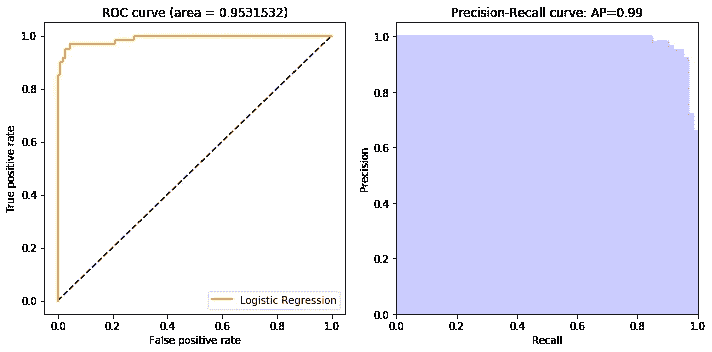
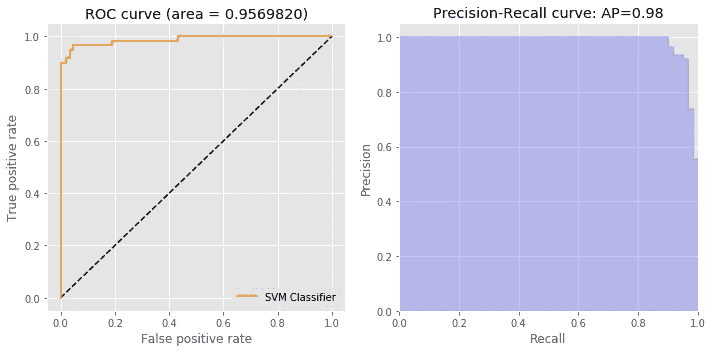

# 在乳腺癌 Wisconsin 数据集上建立 ML 模型预测癌症是良性还是恶性！！第三部分

> 原文：<https://medium.com/analytics-vidhya/building-ml-model-to-predict-whether-the-cancer-is-benign-or-malignant-on-breast-cancer-wisconsin-d6cf8b47f49a?source=collection_archive---------6----------------------->

[**在本系列**](/analytics-vidhya/building-ml-model-to-predict-whether-the-cancer-is-benign-or-malignant-on-breast-cancer-wisconsin-a09b6c32e7b8)的第 1 部分中，我们深入了解了**数据健康检查，以及使用可视化技术的探索性数据分析。** **在** [**第二部分**](/analytics-vidhya/building-ml-model-to-predict-whether-the-cancer-is-benign-or-malignant-on-breast-cancer-wisconsin-b8249b55fc62)**中，我们了解了不同种类的特征选择技术**。我们也理解了投票的方法。****

**现在，在****第 3 部分中，**我们将使用**威斯康辛癌症数据集**和我们将为每种特征选择方法构建**七种不同的模型**，并将分析&比较模型的性能。我们已经在 [**第二部分**](/analytics-vidhya/building-ml-model-to-predict-whether-the-cancer-is-benign-or-malignant-on-breast-cancer-wisconsin-b8249b55fc62) **中做过特征选择部分。******

****做**机器学习模型预测癌症是良性还是恶性的步骤**:****

```
**Step 1: Define Problem Statement
Step 2: Data Source
Step 3: Cleaning the Data
Step 4: Data Analysis and Exploration
Step 5: Feature Selection
**Step 6: Data Modeling
Step 7: Model Validation**
Step 8: Hyperparameter Tuning
Step 9: DeploymentIn this part 3, we will cover **step 6 & 7**We are using the Breast Cancer Wisconsin [**dataset**](https://archive.ics.uci.edu/ml/datasets/Breast+Cancer+Wisconsin+%28Diagnostic%29) available on UCI Machine Learning Repository.**
```

## ****问题陈述****

****我们的目标是确定哪些特征最有助于预测恶性或良性癌症，并对乳腺癌进行良性或恶性分类。****

## ****数据源****

*   ****我们已经使用了公开可用的数据集乳腺癌威斯康星州，并已从 UCI 机器学习库下载。资源库:[https://archive . ics . UCI . edu/ml/datasets/Breast+Cancer+Wisconsin+% 28 diagnostic % 29](https://archive.ics.uci.edu/ml/datasets/Breast+Cancer+Wisconsin+%28Diagnostic%29)。****
*   ****csv 格式的数据可从 链接下载[](https://archive.ics.uci.edu/ml/machine-learning-databases/breast-cancer-wisconsin/breast-cancer-wisconsin.data)****
*   ******在这个 [**Github 链接**](https://github.com/Muhd-Shahid/Breast-Cancer-Wisconsin) ，可以访问项目的所有代码和数据。******

****[](https://github.com/Muhd-Shahid/Breast-Cancer-Wisconsin) [## 穆罕默德-沙希德/乳腺癌-威斯康星

### 我们的目标是确定哪些特征对预测恶性或良性癌症最有帮助，并对其进行分类

github.com](https://github.com/Muhd-Shahid/Breast-Cancer-Wisconsin) 

我们需要做的第一件事是理解数据的结构。我们已经在之前的文章 [**第 1 部分**](/analytics-vidhya/building-ml-model-to-predict-whether-the-cancer-is-benign-or-malignant-on-breast-cancer-wisconsin-a09b6c32e7b8) 和 [**第 2 部分**](/analytics-vidhya/building-ml-model-to-predict-whether-the-cancer-is-benign-or-malignant-on-breast-cancer-wisconsin-b8249b55fc62) 中讨论了数据健康检查和探索性数据分析。在这里，我们只是给你描述一下。

*   **总共有 569 行，每行 31 列。**
*   第一列是标识每个患者的 **ID** 。
*   诊断是一个分类变量。
*   缺少属性值:无
*   第二列是肿瘤的诊断，它有两个可能的值: **B** 表示肿瘤被发现为**良性**。 **M** 表示被查出**恶性**。
*   在数据集中的 569 名患者中，类别分布为:**良性:357 名(63%)和恶性:212 名(37%)**

这是有用的信息，可以让我们得出一些结论。

*   我们的目标是训练我们的模型来**预测肿瘤是良性还是恶性，**基于在 [**第 2 部分**](/analytics-vidhya/building-ml-model-to-predict-whether-the-cancer-is-benign-or-malignant-on-breast-cancer-wisconsin-b8249b55fc62) **中选择的特征。**
*   我们将不使用保存患者的 **ID** 的第一列。
*   在二进制分类的情况下，从两个类中获得较大比例的数据是有益的。我们有一个 **63%-37%的分布，**这已经足够好了。
*   良性和恶性**类**用字符 B 和 M 识别**。我们将更改类列的值，对于良性情况，保存 0 而不是 a **B** ，对于恶性情况，保存 1 而不是 a **M** 。**

# **步骤 6–7:模型构建和验证**

**预测模型的推导**

在这项工作中，569 名患者的队列被随机分为两部分:三分之二(70%)(学习集)用于开发预测模型，剩下的三分之一(30%)用于验证开发的模型(验证集)。我们将构建七种不同的模型(1。逻辑回归，2。随机森林分类器，3。梯度推进分类器，4。额外的树分类器，5。XGB 分类器，6。KNeighbors 分类器和 7。SVM 分类器)对每八个特征进行选择的方法 **( 1 .相关性，2。卡方检验，3。递归特征消除(RFE)，4。带交叉验证的递归特征消除(RFECV)，5 .随机森林，6。额外的树，7。L1，8 岁。投票)。对于每个特征选择，将构建总共 56 个模型**并选择最好的一个。

**模型分类器和选定特征**


模型分类器


选定的功能

# 模型评估

我们使用 70%的数据进行训练，剩下的 30%用于测试。我们使用 5 重交叉验证来训练我们的模型；数据首先被分成 5 个部分，4 个部分用于训练模型，剩下的部分用于评估模型性能/可推广性。

## **绩效评估**

我们评估了一组性能指标，包括每个模型的召回率、精确度和 AUC。我们使用基于混淆表的四个值的传统性能测量进行分类:真阳性(TP)、假阳性(FP)、真阴性(TN)和假阴性(FN)。我们使用这些值来计算阳性预测值(PPV)或精确度和灵敏度或召回率，如等式(1)和等式(2)所示。


此外，绘制了受试者工作特征曲线(ROC ),并分析了 ROC 下面积(AUC)。

# **训练和测试每种特征选择方法的性能。**

1.  **特征选择:相关性**


**特征选择:相关性**


**特征选择:相关性**



**特征选择:相关性**

**2。特征选择:卡方**


**特征选择:卡方**


**特征选择:卡方**



**特征选择:卡方**

**3。特色选择:RFE**


**功能选择:RFE**


**特征选择:RFE**


**特征选择:RFE**

**4。功能选择:RFECV**


**特征选择:RFECV**


**特征选择:RFECV**


**特征选择:RFECV**

**5。特征选择:随机森林**


**特征选择:随机森林**


**功能选择:随机森林**


**特征选择:随机森林**

**6。特征选择:额外的树**


**特征选择:额外的树**


**特征选择:额外的树**


**特征选择:额外的树**

**7。特征选择:基于 L1 的**


**功能选择:基于 L1**


**功能选择:L1**


**功能选择:基于 L1**

8。特征选择:基于投票的


**特征选择:基于投票的**


**特征选择:基于投票的**


**特征选择:基于投票的**

# **我们来对比一下选出的最佳车型:**

## 最佳分类器模型的训练和测试性能。

这里，我们从每种特征选择方法中选择了最佳模型。从下表可以清楚地看出，最佳分类器是使用随机森林特征选择方法的逻辑回归。

**逻辑回归**

**训练表现:**准确率= 0.977，AUC = 0.995

**测试性能:**准确度= 0.977，AUC = 0.971


混淆矩阵


模型-逻辑回归，特征选择-随机森林

# 结论

因此，通过算法获得的预测癌症患者恶性或良性的最重要特征是**纹理 _ 平均、面积 _ 平均、** **凹度 _ 平均、** **面积 _se、凹度 _se** 、**分形 _ 维数 _se** 、**平滑度 _ 最差、** **凹度 _ 最差、对称性 _ 最差、分形 _ 维数 _ 最差**。

为了从预测模型中获得最佳结果，使用 16 组特征来训练、优化和评估许多不同的模型。在此过程中，使用特定于模型的方法挑选特征集本身。每一个模型和特征子集都通过 5 重交叉验证的准确性、AUC 和敏感性进行评估。逻辑回归可获得最佳结果，随机森林特征集被筛选为 10 个特征。上表显示了分类技术的性能指标。逻辑回归在测试数据上实现了 0.977 和 0.971 的准确度和 AUC。

**结束注释**

我们的**第 3 部分**关于模型构建和评估到此结束。本**第 3 部分**的目的是为使用不同种类的机器学习技术提供深入和逐步的指导。

就我个人而言，我很喜欢写这篇文章，也很想从你的反馈中学习。你觉得这个 **Part 3** 有用吗？我将感谢你的建议/反馈。请随时通过下面的评论提出你的问题。

## 我们将在[第 4 部分](https://shahid-dhn.medium.com/building-ml-model-to-predict-whether-the-cancer-is-benign-or-malignant-on-breast-cancer-wisconsin-8654994ca20a)中探讨步骤 8 & 9:超参数调整和部署。

敬请期待！

本文使用的所有代码和数据集都可以从我的 [**GitHub**](https://github.com/Muhd-Shahid/Breast-Cancer-Wisconsin) 中访问。

该代码也可作为 [**Jupyter 笔记本**](https://github.com/Muhd-Shahid/Breast-Cancer-Wisconsin/blob/master/BCW_Model_Building_Evaluation_Part3.ipynb) 。****