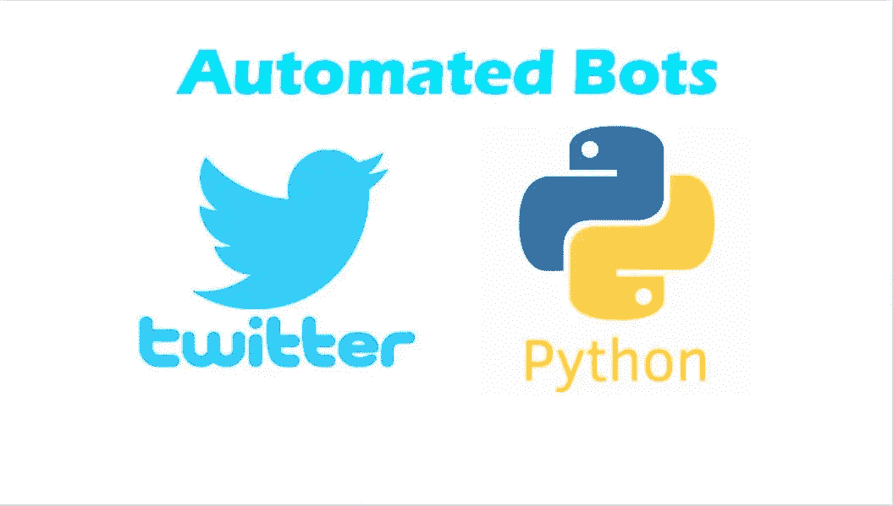
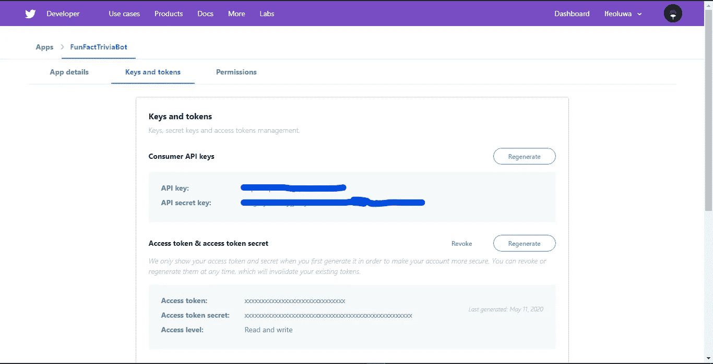
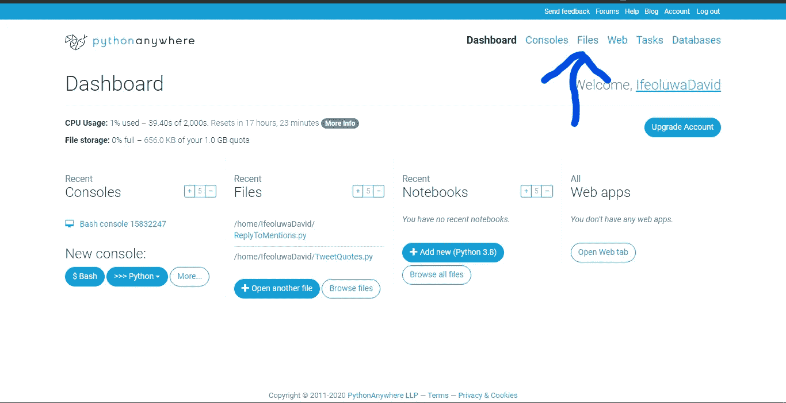
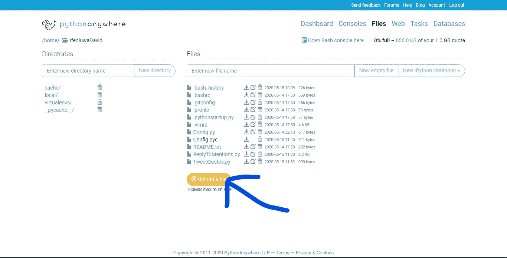
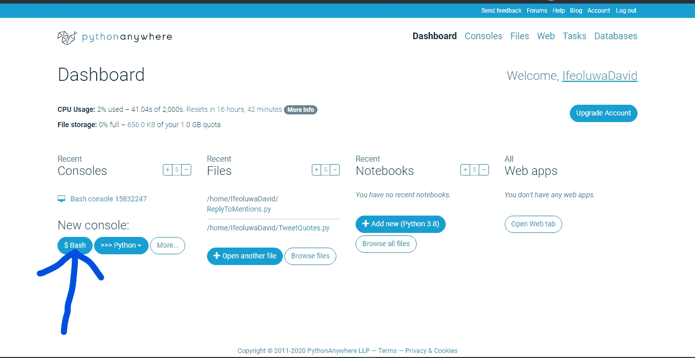
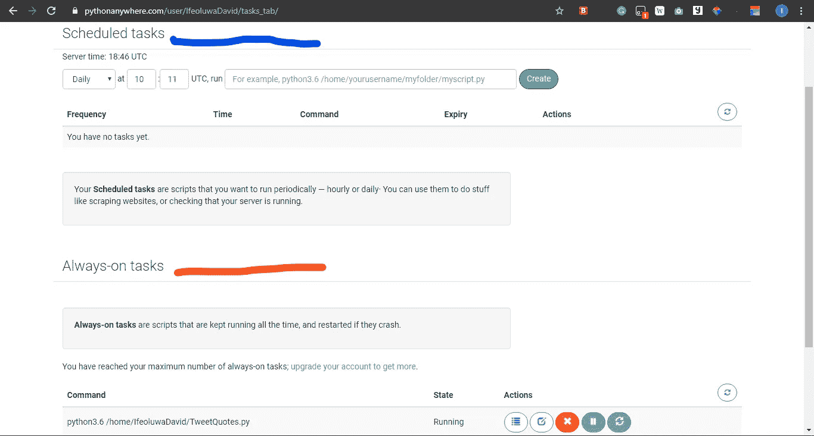

# 构建我的第一个 Python 应用程序:Sage bot——Sage Twitter bot。

> 原文：<https://medium.com/analytics-vidhya/building-my-first-python-app-sagebot-the-sage-twitter-bot-c528c492e6bf?source=collection_archive---------11----------------------->



> 我从来不喜欢 python。我总是想知道如何用简单的英语编写代码，最重要的是，如何不用分号来编写代码；但是我正在进行多语言编程的旅程，并向新事物敞开心扉，所以我决定尝试一下。

# 介绍

你好。在我过去 3 年的软件开发生涯中，我主要使用 C#和 JavaScript(这包括一些她流行的框架)，但是最近，我决定探索 python，因为市场需求和它的乐趣。

SageBot 是一个 Twitter 机器人，每隔 12 小时就会在 Twitter 上发布一些伟人的名言。在这篇文章中，我将谈谈我构建它的一般经验。

但首先，跟随 SageBot [现在](https://twitter.com/sageeBot)！

# 开始

所以你知道，这不会是一个完整的教程文章。我只想谈谈我的经历，以及我是如何经历 SageBot 建设过程中的每一个阶段的。也就是说，如果你打算用这篇文章来构建你自己的 twitter 机器人，你至少应该有一些编程经验。如果你是来看我的经历的，那就好好读吧！

这篇文章的大纲如下:

*   从 RapidAPI 获取 API。
*   申请一个 Twitter 开发者账户。
*   使用 Tweepy(一个易于使用的 Python 库，用于访问 Twitter 的 API)。
*   在 PythonAnywhere 上部署。
*   最后，我的有益经验。

如果你没有注意到，这并不是我第一次亲身体验 Python。我以前遇到过这种情况，但这是我第一次真正从头到尾用 Python 构建东西。一个人。

说够了，让我们开始吧。

# 从 RapidAPI 获取 API

当我想开始构建时，我想到的第一件事是我要从哪里获取我的报价，这是因为我希望机器人的工作方式。如果你正在构建一个不需要使用 API 的机器人，你可以跳过这一节。

原来有一个网站包含了很多 API，你可以订阅(反正大部分都是免费的)。RapidAPI 帮助您找到并连接到一千个 API。如果你正在为你的下一个应用寻找一个 API，RapidAPI.com 的[就有。搜索了一会儿之后，我偶然发现了我决定要使用的 quotes API。我会把链接贴在文章末尾。](http://Rapidapi.com)

显然，一旦您选择并订阅了您想要使用的 API，您就可以测试它的端点并获得您想要的任何语言的代码片段。所以你可以复制代码(如果你知道它是如何工作的会有所帮助，以防你想对它做一些调整)然后直接使用它。

一旦我得到了 API，我就准备好开始浏览 Twitter 了。

从 RapidAPI 获取我的报价

# 申请一个 Twitter 开发者账户

这个阶段对我来说非常有趣，因为我已经使用了其他大公司的 API，我从来没有“申请”过，但你必须有耐心，因为一旦你可以访问 API，你就可以访问任何人的推文，并做任何你想做的事情。所以我想 Twitter 只是在小心他们把 API 发给谁。

因此，前往 https://developer.twitter.com/en 申请一个开发者账户并访问 Twitters API。这有助于注意到，无论您用来访问的帐户是什么，它也是使用 API 的帐户。这意味着，如果你使用你的个人 Twitter 账户来访问 API，无论你决定使用 API 做什么，都将来自你的个人账户，无论是 tweets、likes 还是 DMs。

申请的时候，你会被问到一些问题，这些问题越详细越好。这个过程花了我大约 2-3 天的时间，这是因为我收到了其他电子邮件来明确定义我想要使用 API 的目的。所以如果需要几天也不用担心。如果你的意图是纯粹的，你应该很快就可以走了。

一旦你被批准，前往你的仪表板，创建一个新的应用程序，然后检查密钥和令牌选项卡，你应该看到你的秘密和令牌(如果没有，你可以生成它们)。您应该很好地保护这些秘密和令牌，因为任何有权访问它们的人都可以访问 API，如果他们知道如何做的话。



我的开发者应用页面的一个例子。

# 使用 Tweepy(一个易于使用的 Python 库，用于访问 Twitter 的 API)

这部分真的很简单。我不知道 Tweepy 是怎么做到的，但他们让访问和浏览 Twitter 的 API 变得如此容易，这让一切都变得更加容易。我从广泛阅读文档开始(是的，你应该阅读文档并关注它们。它们很重要)。
在这里阅读文档[http://docs.tweepy.org/en/latest/index.html](http://docs.tweepy.org/en/latest/index.html)。

文档非常详细，组织有序，易于阅读，因此您可以轻松地复制您需要的代码。

聪明地工作。Lol！

对于我的机器人，我必须经历两个过程；身份验证和更新状态(使机器人发出 Tweet)。这两种方法的代码片段都在文档中，所以我不会在这里解释它们。然而，我将展示我的代码，以及我如何能够从 API 制作我的机器人 tweet。

从 API 发布 tweet 的代码

从上面的代码中，您会看到我将我的秘密和令牌隐藏为环境变量(如果您需要学习如何在 python 中使用环境变量，您可以在这里学习)。使用它可以帮助我隐藏它们，这样只有我可以从我的电脑上访问它们。我也有 3 个方法；

*   CreateApi()-这基本上是 Tweepy 身份验证方法。我提供了必要的密钥，并将自己验证为有效用户。
*   Tweets() —这将创建 CreateApi()方法的新实例，并将其作为参数发送给 TweetQuote()方法。它每 12 个小时做一次，这是实现计时的地方。它也是脚本开始运行时运行的方法。
*   TweetQuote() —它获取创建的 API 的实例，使用之前的 RapidAPI 代码片段来获取作者的引用，并使用发送给它的 API 参数来更新用户的状态(在这个实例中是 my bot)

基本上就是这样。在一切正常的情况下，如果您在本地运行，它应该每 12 小时(43200 秒)创建一条新的 Tweet。

出于测试的目的，将时间限制在 30 秒或适合你的时间是可以的。

# 在 PythonAnywhere 上部署

下一步是前往 pythonanywhere.com 的 T2 创建一个账户。如果你有一个付费账户，特别是如果你打算使用外部 API，那么我会建议你使用最低的计划。除此之外，你可以使用免费账户。

一旦你设置好你的账户，你应该点击菜单栏中的文件。



PythonAnywhere 仪表板。

一旦你被重定向到文件页面，上传你的 python 脚本，一旦它被上传，你可以运行它，看看是否一切正常



上传文件。

如果您得到一个 Tweepy 模块错误，您应该返回到您的仪表板，打开一个新的 bash 控制台并运行

```
python3 pip --user install tweepy
```



运行新的 bash 控制台。

一旦一切正常，您就可以将脚本作为任务运行了。pythonanywhere 上有两种类型的任务:

*   计划任务—它们每天在计划的时间运行一次(每个免费帐户都可以访问一次)
*   永远在线的任务——它们永远在线，如果崩溃了还会重新启动(这种类型需要付费计划)

要作为计划任务运行，请导航到任务并添加文件的目录，其格式应为:

```
home/username/filename.py
```

而要运行始终运行的任务，请导航到任务，并在始终运行的任务中，添加文件的目录，其格式应为:

```
python3.6 home/username/filename.py
```



显示计划任务和始终在线任务的图像

如果你遇到任何问题，你可以谷歌它或检查 pythonanywhere 支持。有可能你不是唯一一个有这个问题的人，或者曾经有过这样的问题。

一旦你的任务开始运行(检查日志，看看你的任务进展如何)，你就可以开始了，你的 python 机器人将永远自动化(至少在你做一些事情之前)。

就是这样！这是构建和部署 twitter 机器人的一种方式。你绝对应该浏览 Twitter 的 API 文档，看看你能做和探索的所有东西！！

# 最后，我有益的经历

用 Python 做东西真的很酷，这种语言给了我一个放松和打字的机会，就像我写普通英语一样。我并不是一直都在寻找我的分号。但这似乎是我使用 Python 的弱点。写作既容易又舒服，这一事实让我失去了注意力，也让我感觉很舒服。也就是说，我真的很喜欢这一点，并希望用 Python 构建更多的东西。

# 参考

更多的阅读，你应该检查这些家伙。它们包含了更多关于你如何使用你的机器人而不仅仅是发微博的方法。

*   [https://www . twilio . com/blog/build-deploy-Twitter-bots-python-tweepy-python anywhere](https://www.twilio.com/blog/build-deploy-twitter-bots-python-tweepy-pythonanywhere)
*   https://realpython.com/twitter-bot-python-tweepy/
*   [https://towards data science . com/building-a-Twitter-bot-with-python-89959 ef 2607 f](https://towardsdatascience.com/building-a-twitter-bot-with-python-89959ef2607f)
*   [https://www . digital ocean . com/community/tutorials/how-to-create-a-twiter bot-with-python-3-and-the-tweepy-library](https://www.digitalocean.com/community/tutorials/how-to-create-a-twitterbot-with-python-3-and-the-tweepy-library)

你也可以在这里查看我对这个机器人的回购

有什么想法也可以留言回应。

谢谢，❤保持安全。