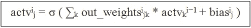
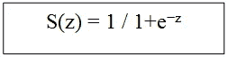
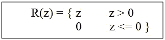
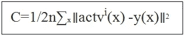
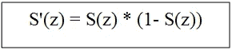
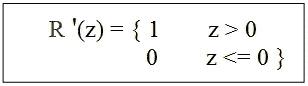
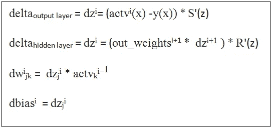
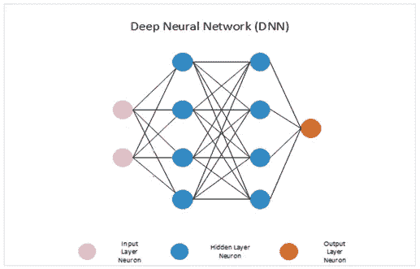
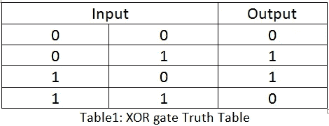

# 用反向传播法在 C 语言中构建神经网络框架

> 原文：<https://medium.com/analytics-vidhya/building-neural-network-framework-in-c-using-backpropagation-8ad589a0752d?source=collection_archive---------0----------------------->

## 神经网络框架的 C 语言基本实现

在本文中，我们将用 C 语言从头开始实现一个基本的神经网络框架。之所以用 C 来做，是因为大多数库和其他高级语言(如 Python)都抽象出了实现细节。用 C 语言实现反向传播实际上会给我们提供详细的见解，让我们了解改变权重和偏差是如何改变网络的整体行为的。

**注意:**本文假设你知道反向传播算法背后的数学原理。如果你不熟悉，那么请参考[这个](http://neuralnetworksanddeeplearning.com/chap2.html)。

我们的目标是建立一个通用框架，其中层和神经元的数量将由用户根据他的要求指定。因此，我们将从用户处获得以下输入，用于定义我们的神经网络框架:

1.层数

2.每层神经元的数量

3.学习率

4.培训示例

5.输出标签

## **定义层和神经元结构:**

一旦我们有了层数和每层神经元的数量，我们就可以创建神经网络的架构。但首先我们必须定义神经元和层的结构。

神经元结构将包含以下参数:

层结构将具有该层中的多个神经元和 neuron_t 结构的指针。

## **创建架构:**

现在，让我们使用 create_architecture()函数创建神经网络的架构。

在下面给出的代码片段中，外部 for 循环创建层，内部 For 循环向该层添加指定数量的神经元。我们还在 0 和 1 之间随机初始化神经元的权重。

## **获取培训示例:**

我们将使用 get_inputs()函数存储训练示例:

## **获取输出标签:**

我们将使用 get_desired_outputs()函数存储输出标签:

## **向前传球:**

第 I 层中第 j 个神经元的激活与第(I-1)层中的激活相关联，公式如下:

注:σ为激活函数。这里，我们将对输出层使用 sigmoid 激活函数，对隐藏层使用 Relu 激活函数。

乙状结肠:

Relu:

让我们实现 forward_prop()函数:

## **向后传球:**

反向传播的目标是反向传播误差并更新权重以最小化误差。这里，我们将使用均方误差函数来计算误差。

使用成本函数 c 相对于网络中的权重和偏差的偏导数(∂C/∂weights 和∂C/∂bias)来计算权重(dw)和偏差(d bias)的变化。

乙状结肠的导数:

Relu 的导数:

反向传播背后的四个基本方程:

让我们在 back_prop()函数中实现这些公式:

## **更新权重:**

在每个时期，我们将使用 update_weights()函数更新网络权重和偏差:

## 测试框架

现在我们已经准备好了所有的部分，我们将验证我们的框架的工作。因此，让我们创建一个 4 层神经网络，其中输入层有 2 个神经元，第一隐藏层有 4 个神经元，第二隐藏层有 4 个神经元，输出层有 1 个神经元。此外，隐藏和输出神经元会有偏差。

现在，我们可以为不同的逻辑门训练这个神经网络，例如 Xor、OR 和 etc。在下面的例子中，我们将实现异或门。

首先，提供所需的层数和每层神经元数:

将根据给定的规范创建神经网络架构:

所有权重将在 0 和 1 之间随机初始化。

接下来，提供学习率和输入训练示例。以下是 XOR 逻辑门的真值表。

我们将给出上述 4 个输入作为神经网络的训练示例。

给出输出标签:

我们的神经网络将在这 4 个训练样本上训练 20000 个时期。

现在，测试训练好的神经网络:

## 结论:

这是一个神经网络框架的基本实现，目的是理解神经网络和反向传播算法的基础。通过实现各种损失函数和提供权重的保存/加载，可以随意增强代码。

你可以在这里找到完整的代码